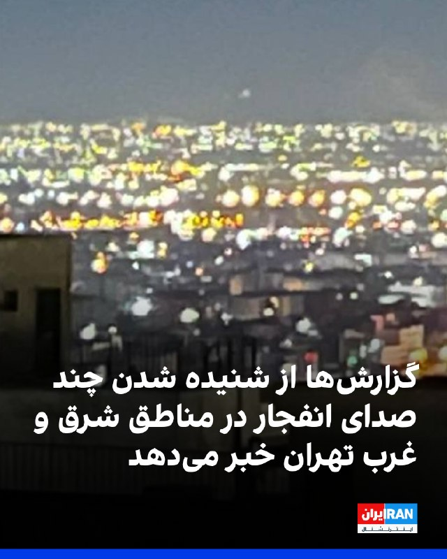

# Latest message in IranintlTV

## Message 333438

**Date:** 2026-04-23T02:19:28+00:00

طبق گزارش‌های منتشر شده و پیام‌هایی که از مخاطبان به ایران‌اینترنشنال رسیده است، بامداد پنج‌شنبه چندین صدای انفجار در مناطق شرقی و غربی تهران شنیده شد.
به گفته کاربران، این صداها شبیه صدای فعال شدن پدافند هوایی بود.
طبق پیام‌هایی که مخاطبان به ایران‌اینترنشنال ارسال کردند، بامداد پنج‌شنبه از ساعت ۲:۵۰ صداهای انفجار در محدوده پردیس در شرق تهران شنیده شد.
همچنین به گزارش وحید آنلاین، صداهای مداوم انفجار در غرب تهران، از جمله در چیتگر شنیده شد.
https://iranintl.com/202604234925

---
