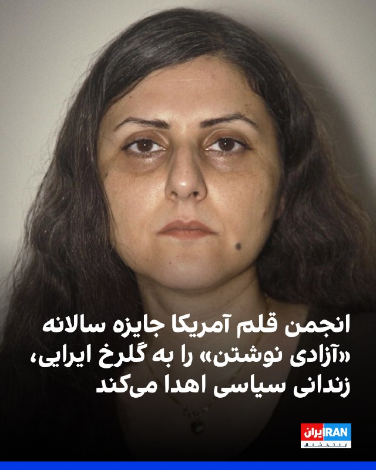
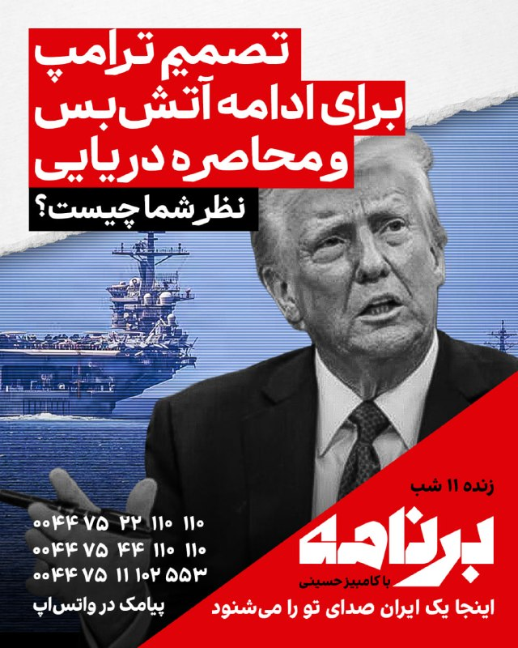
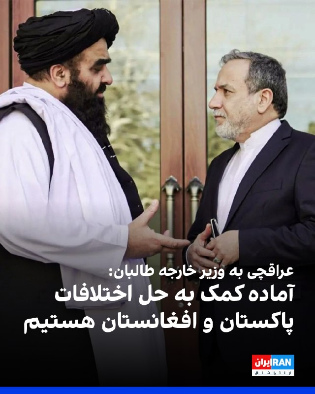

# Channel IranintlTV

## Message 333357

همزمان با تمدید آتش‌بس برای از سرگیری مذاکرات، آمریکا در حال تقویت حضور نظامی خود در منطقه است. ترامپ هشدار داده در صورت ناکامی گفت‌وگوها، آماده از سرگیری حملات خواهد بود؛ نشانه‌ای از تداوم فضای پرتنش در کنار مذاکرات.

---

## Message 333358

[Video](media/333358_0.mp4)

یک شهروند با ارسال پیام صوتی به ایران‌اینترنشنال، به فشارهای امنیتی و قطع اینترنت اشاره می‌کند و می‌گوید مغازه‌اش را به خاطر فروش وی‌پی‌ان پلمب کرده‌اند.

---

## Message 333363

[Video](media/333363_0.mp4)

بیش از ۵۰ روز از قطعی و محدودیت شدید اینترنت در ایران می‌گذرد؛ موضوعی که بازتاب گسترده‌ای در رسانه‌های سوئدی داشته است. در حالی که مقام‌های جمهوری اسلامی این محدودیت‌ها را با دلایل امنیتی توجیه می‌کنند، کارشناسان در سوئد آن را «شکنجه خاموش» و ابزاری برای کنترل جریان اطلاعات می‌دانند.
گزارش مهران عباسیان، خبرنگار ایران‌اینترنشنال
@iranintltv

---

## Message 333365

با تمدید آتش‌بس برای ازسرگیری مذاکرات، آمریکا همزمان در حال تقویت نیروها و تجهیزات نظامی خود در منطقه است. ترامپ هشدار داده در صورت شکست مذاکرات، حملات از سر گرفته خواهد شد. گفت‌وگو با فرزین ندیمی، پژوهشگر ارشد امور دفاعی و امنیتی

---

## Message 333366

موج تازه‌ای از مسدودسازی اکانت‌های وابسته به جمهوری اسلامی در شبکه ایکس آغاز شده و شماری از چهره‌های شناخته‌شده نیز در میان آن‌ها هستند. گزارش‌ها دلیل این اقدام را نقض قوانین پلتفرم، از جمله انتشار اطلاعات نادرست و فعالیت‌های سازمان‌یافته عنوان می‌کنند. گفت‌وگو با امین ثابتی، کارشناس امنیت اینترنتی

---

## Message 333368

[Video](media/333368_0.mp4)

ویدیوی رسیده از یک مخاطب نشان می‌دهد که ماموران حکومت در ورودی شهر گرگان در ادامه افزایش کنترل تردد شهروندان یک ایست بازرسی مستقر کرده‌اند.

---

## Message 333370

[Video](media/333370_0.mp4)

گزارش‌ها حاکی است دور دوم مذاکرات ممکن است جمعه برگزار شود و مهلت دونالد ترامپ به تهران بسیار محدود و بین سه تا پنج روز تعیین شده است تا به جمع‌بندی برسد.
همزمان تسنیم، رسانه وابسته به سپاه، نوشت تهران فعلا تصمیمی برای مذاکره ندارد.
گفت‌وگو با مسعود کاظمی، روزنامه‌نگار و سمیرا قرایی، خبرنگار ایران‌اینترنشنال
@iranintltv

---

## Message 333371

[Video](media/333371_0.mp4)

جاویدنام محمد جباری، جوان ۲۶ ساله اهل دیزیچه استان اصفهان را ماموران جمهوری اسلامی شامگاه ۱۸ دی به ضرب گلوله در این شهر کشتند. یک بسیجی از بلندی به مردم تیراندازی کرد و او به همراه سه جاویدنام دیگر، مهدی نوری، حجت ملکی و علیرضا خاربو در دیزیچه کشته شدند.

---

## Message 333374

[Video](media/333374_0.mp4)

۲۴ با فرداد فرحزاد
@iranintltv

---

## Message 333375

[Video](media/333375_0.mp4)

آکسیوس گزارش داد دونالد ترامپ بین سه تا پنج روز به جمهوری اسلامی فرصت داده است، اما همچنان رویکرد تهران مشخص نیست و مواضع مختلف و متضادی از سوی مقام‌ها و رسانه‌های جمهوری اسلامی مطرح می‌شود.
گفت‌وگو با مهرداد قاسمفر، روزنامه‌نگار و تحلیل‌گر مسائل ایران
@iranintltv

---

## Message 333376

[Video](media/333376_0.mp4)

مهدی مهدوی‌آزاد در برنامه «چشم‌انداز» گفت: «عدم حضور نمایندگان جمهوری اسلامی در مذاکرات امروز در پاکستان نشانه‌ای روشن از این است که تهران ادامه جنگ را انتخاب کرده است. ترامپ با عقب‌نشینی از زدن زیرساخت‌های ایران دیپلماسی را انتخاب کرد، اما جمهوری اسلامی نشان داد تمایلی به کاهش تنش‌ها و پایان درگیری ندارد.»
@iranintltv

---

## Message 333356

**Date:** 2026-04-22T16:56:18+00:00

انجمن قلم آمریکا اعلام کرد گلرخ ایرایی، نویسنده و زندانی سیاسی محبوس در زندان اوین، برنده جایزه «آزادی نوشتن پن/باربی» در سال ۲۰۲۶ شده است.
علی اسداللهی، شاعر و مترجم نیز دیگر برنده این جایزه است؛ جایزه‌ای که به نویسندگان تحت تعقیب به‌دلیل بیان دیدگاه‌هایشان اهدا می‌شود.
قرار است از این دو نویسنده در مراسم ادبی پن آمریکا در ۲۴ اردیبهشت ۱۴۰۵ برابر با ۱۴ مه ۲۰۲۶ در موزه تاریخ طبیعی آمریکا در نیویورک تقدیر شود.
https://iranintl.com/202604222031

---

## Message 333359

**Date:** 2026-04-22T17:02:22+00:00

آتش‌بس تمدید شد؛ تصمیمی که برای جمهوری اسلامی یعنی یک نفس موقت و برای مردم ایران، ادامهٔ یک بن‌بست فرسایشی.
شما تمدید آتش‌بس را چگونه می‌بینید؟
تصمیم ترامپ برای ادامهٔ آتش‌بس، در کنار حفظ فشار نظامی و محاصرهٔ دریایی؛ یک استراتژی حساب‌شده است یا فقط خریدن زمان برای حمله‌ای دیگر به جمهوری اسلامی؟
نظر شما چیست؟
اگر داخل ایران هستید یا خارج از ایران،
اگر این روزها را با امید، خشم، ترس یا انتظار می‌گذرانید،
بیایید و روایت خودتان را بگویید.
«برنامه» صدای شماست؛
روی خط بیایید و بگویید شما این لحظهٔ تاریخی را چطور می‌بینید.
برای شرکت در برنامه، همین حالا در واتس‌اپ پیام بدهید:
۰۰۴۴۷۵۲۲۱۱۰۱۱۰
۰۰۴۴۷۵۴۴۱۱۰۱۱۰
۰۰۴۴۷۵۱۱۱۰۲۵۵۳
«برنامه با کامبیز حسینی»
«یک ایران صدای شما را می‌شنود»
@iranintltv

---

## Message 333360

**Date:** 2026-04-22T17:15:11+00:00

عباس عراقچی، وزیر خارجه جمهوری اسلامی، در گفت‌وگو تلفنی با امیرخان متقی، وزیر خارجه دولت طالبان، از حمایت طالبان از جمهوری اسلامی در جنگ با آمریکا و اسرائیل، قدردانی کرد و گفت: «از کاهش تنش بین افغانستان و پاکستان خرسندیم و آماده‌ایم جهت رفع اختلافات و تقویت صلح بین دو کشور همسایه و مسلمان مساعدت کنیم.»
https://iranintl.com/202604222652

---

## Message 333362

**Date:** 2026-04-22T17:24:21+00:00

🎧
نسخه صوتی اخبار شبانگاهی | چهارشنبه ۲ اردیبهشت
@iranintlTV

---

## Message 333364

**Date:** 2026-04-22T17:29:05+00:00

محمدباقر قالیباف، رییس مجلس، در شبکه ایکس نوشت: «آتش‌بس کامل وقتی معنا دارد که با محاصره دریایی و گروگان‌گیری اقتصاد دنیا نقض نشود و جنگ‌افروزی اسرائیل در همه جبهه‌ها متوقف باشد.»
او افزود: «بازگشایی تنگه هرمز با نقض فاحش آتش‌بس ممکن نیست.»
قالیباف اضافه کرد: «با تجاوز نظامی به اهداف خود نرسیدند، با قلدری هم نخواهند رسید. تنها راه، پذیرش حقوق ملت ایران است.»
https://iranintl.com/202604221780

---

## Message 333367

**Date:** 2026-04-22T17:59:52+00:00

🎧
نسخه صوتی تیتراول با نیوشا صارمی: اعزام ناو سوم آمریکا وتجهیزات نظامی جدید به منطقه با وجود تمدید آتش‌بس
@iranintlTV

---

## Message 333369

**Date:** 2026-04-22T18:05:00+00:00

لیندزی گراهام، سناتور جمهوری‌خواه آمریکا، اعلام کرد در گفت‌وگویی با دونالد ترامپ و پیت هگست درباره مسیر پیش‌رو در قبال [حکومت] ایران، از تصمیم واشینگتن برای ادامه محاصره حمایت کرده است. او این تصمیم را «بسیار هوشمندانه» توصیف کرد و گفت این اقدام توانایی [حکومت] ایران را برای ادامه نقش به‌عنوان «بزرگ‌ترین حامی دولتی تروریسم» تحت تاثیر قرار داده است.
گراهام همچنین پیش‌بینی کرد این محاصره تا زمان تغییر مسیر حکومت ایران ادامه یابد و حتی «گسترش یافته و به‌زودی ابعادی جهانی پیدا کند». او به کشورها و طرف‌هایی که در انتقال نفت ایران نقش دارند هشدار داد که خطر چنین اقدامی برعهده خودشان است. این سناتور در پایان با تمجید از ترامپ و تیم او، این وضعیت را «بهترین فرصت از سال ۱۹۷۹» برای تغییر رفتار حکومت ایران دانست و ابراز امیدواری کرد این هدف از طریق دیپلماسی محقق شود.
https://iranintl.com/202604227450

---

## Message 333372

**Date:** 2026-04-22T18:31:06+00:00

مسعود پزشکیان در شبکه ایکس نوشت جمهوری اسلامی همواره از گفت‌وگو و توافق استقبال کرده و می‌کند.
او افزود: «بدعهدی، محاصره و تهدید مانع اصلی مذاکره واقعی است‌ و دنیا شاهد پرحرفی‌های مزورانه و تناقض ادعا و عمل شماست.»
پیش‌تر نیز قالیباف گفت: «آتش‌بس کامل وقتی معنا دارد که با محاصره دریایی و گروگان‌گیری اقتصاد دنیا نقض نشود و جنگ‌افروزی اسرائیل در همه جبهه‌ها متوقف باشد.»
https://iranintl.com/202604220612

---

## Message 333373

**Date:** 2026-04-22T18:32:14+00:00

🗣
روایت شما از زندگی در آتش‌بس- چهارشنبه ۳ اردیبهشت ۱۴۰۵
🔹
یکی نیست به داد ما مشاغل آنلاین برسه؟ مگه همه کارمندند؟ کلی آدم از اینترنت درآمد داشتن. من برم اینترنت پرو بخرم، به کی باید جنس بفروشم؟ وقتی مردم عادی دسترسی ندارن، به چه درد می‌خوره؟
🔹
دوستم مدیر مدرسه هست و مجبورشون کردن موکب بزنن با هزینه مدرسه.
🔹
واقعاً ما مردم ایران دلمون یه زندگی آروم و بدون جنگ می‌خواد، فکر کنم کمترین حقمون این باشه، نه؟
🔹
درود به ملت باشرف ایران. من هم مثل شما بدون اینترنت، بدون پول، با گرونی وحشتناک و قسط عقب‌افتاده‌ام، ولی نباید ناامید شد. این رژیم بی‌ریشه و فاسد دیگه جایی برای فرار و زندگی نداره و نابود خواهد شد. روح جاویدنامان شاد.
🔹
مردم بذارید قیمت نفت تا جایی که میشه بالا بره، انتقاممون هم از چین گرفته میشه هم اروپا مخصوصاً بریتانیا. هممون داریم له می‌شیم اما صبر...
🔹
حقوق بازنشستگان با چند روز تأخیر واریز شد، اما دیدیم حدود ۵ میلیون تومان ازش کم شده. وقتی رفتیم بانک، دیدیم ده‌ها نفر دیگه هم همین مشکل رو دارن. نه بانک پاسخگو بود، نه کسی توضیح می‌ده چرا از حقوق مردم کم میشه.
🔹
شرایط خیلی سخت و غیرقابل‌تحمل شده، زودتر تکلیف رو روشن کنین. من به عنوان یه نوجوان دیگه هیچ امیدی برام نمونده. تمومش کنین زودتر.
🔹
من یه ایده دارم، اسرائیل می‌تونه اینترنت غزه رو قطع کنه تا شاید چپ‌های اروپایی یادشون بیفته دسترسی به اینترنت جزو حقوق انسان‌هاست.

---
