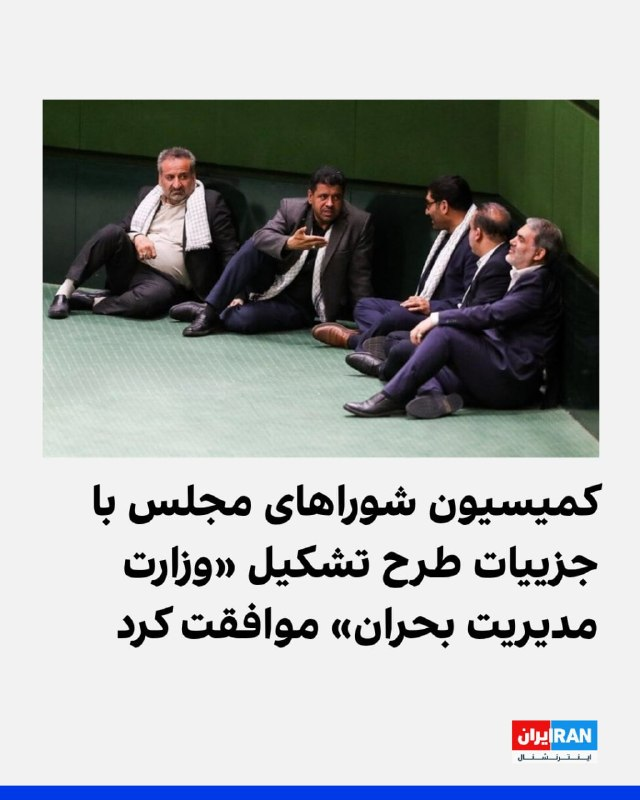
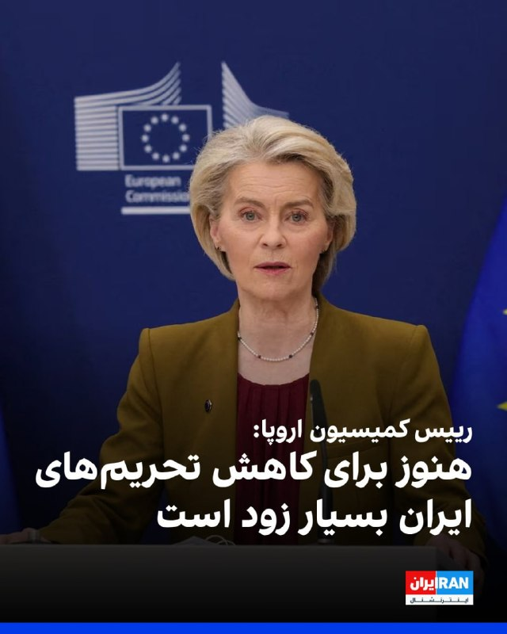
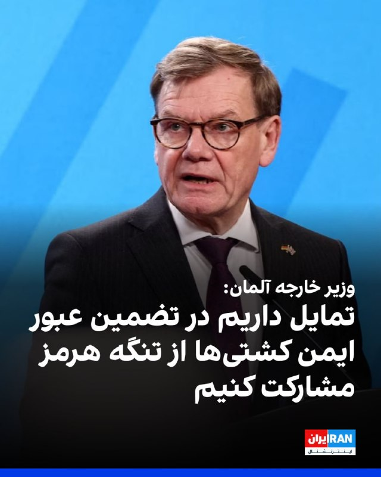
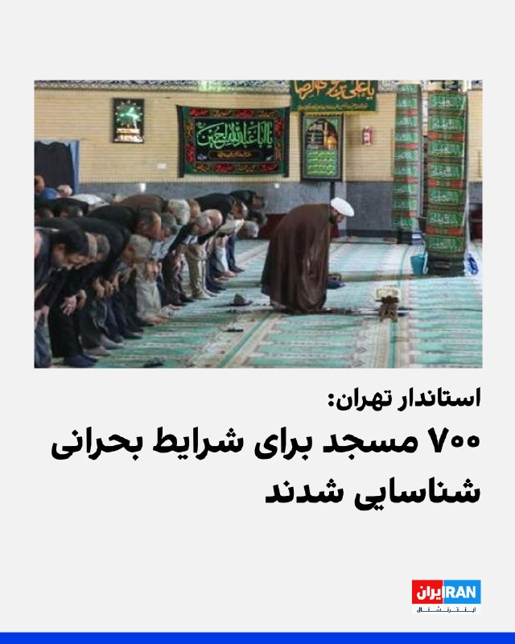
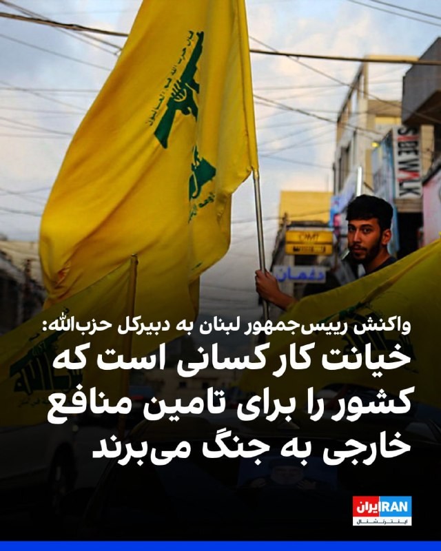
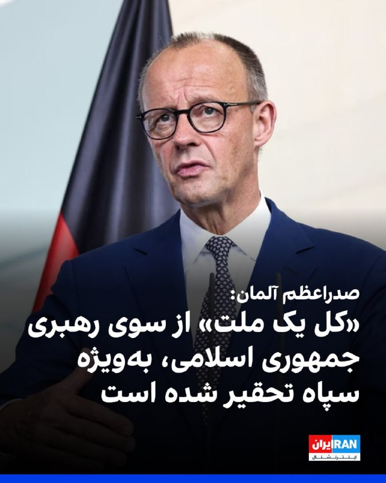

# Channel IranintlTV

## Message 334208

[Video](media/334208_0.mp4)

یک شهروند با ارسال پیامی به ایران‌اینترنشنال در خصوص قطعی اینترنت می‌گوید: «با کلی بدبختی یک کانفیگ گران خریدم تا به اینترنت وصل شوم. گرانی بیداد می‌کند و قطعی اینترنت زندگی ما را فلج کرده است.»

---

## Message 334210

[Video](media/334210_0.mp4)

یکی از شهروندان با ارسال ویدیویی به ایران‌اینترنشنال در خصوص گرانی دارو می‌گوید: «چند قلم دارو را با قیمت هنگفت خریده‌ام و مجبور شدم به‌خاطر تهیه آنها از پول خورد و خوراک خود بزنم.»

---

## Message 334211

[Video](media/334211_0.mp4)

سرخط خبرهای دوشنبه ۷ اردیبهشت
@iranintltv

---

## Message 334212

[Video](media/334212_0.mp4)

خبرگزاری‌های ایران با انتشار ویدیوهایی از فرود نخستین پرواز ایرانی در فرودگاه نجف پس از حدود دو ماه و از زمان آغاز جنگ خبر دادند.
گفت‌وگو با نرگس هورخش، خبرنگار ایران‌اینترنشنال
@iranintltv

---

## Message 334213

[Video](media/334213_0.mp4)

عباس عراقچی، وزیر خارجه جمهوری اسلامی پس از سفر به عمان و پاکستان به روسیه سفر کرد.
عراقچی با وزیر خارجه عربستان سعودی نیز گفت‌وگو کرده است.
مرتضی کاظمیان، عضو تحریریه ایران‌اینترنشنال، از پیوند تهران و مسکو و دیپلماسی غیرملی و التماسی جمهوری اسلامی می‌گوید
@iranintltv

---

## Message 334214

[Video](media/334214_0.mp4)

یکی از شهروندان با ارسال پیامی به ایران‌اینترنشنال می‌گوید: «من در شرکت پتروشیمی ماهشهر کار می‌کردم که در جریان جنگ تعطیل شد و الان خیلی از ما کارگرها بیکار شدیم. همه‌اش به‌خاطر لجبازی و تصمیم‌گیری نادرست سپاه پاسداران و سران حکومت است که این جنگ رخ داد.»

---

## Message 334215

[Video](media/334215_0.mp4)

پلیس بریتانیا اعلام کرد در جریان تحقیقات درباره مجموعه‌ای از حملات به اماکن یهودیان در لندن، یک مرد ۳۷ ساله را به ظن آماده‌سازی اقدامات خشونت‌آمیز و مرتبط با پرونده بازداشت کرده است.
گفت‌وگو با علی رشید، خبرنگار ایران‌اینترنشنال
@iranintltv

---

## Message 334217

[Video](media/334217_0.mp4)

مروری بر روزنامه‌های دوشنبه ۷ اردیبهشت، با مجتبی هاشمی، روزنامه‌نگار و تحلیل‌گر سیاسی
@iranintltv

---

## Message 334218

[Video](media/334218_0.mp4)

یک رسانه اماراتی گزارش داد پس از ناکامی دور نخست مذاکرات آتش‌بس در اسلام‌آباد، پاکستان نه توان تحمیل توافق را دارد و نه طرفین حاضر به عقب‌نشینی از خواسته‌های خود هستند.
گفت‌وگو با تروسکه صادقی، خبرنگار ایران‌اینترنشنال
@iranintltv

---

## Message 334219

[Video](media/334219_0.mp4)

در تاریخ معاصر افغانستان، کمتر رویدادی به اندازه کودتای ۱۳۵۷ مسیر این کشور را دگرگون کرد؛ کودتایی که به کشته‌شدن محمد داوود خان، نخستین رییس‌جمهور افغانستان، انجامید.
گزارش مهدی بیگی، عضو تحریریه ایران‌اینترنشنال
@iranintltv

---

## Message 334221

[Video](media/334221_0.mp4)

موسسه بین‌المللی پژوهش‌های صلح استکهلم گزارش داد هزینه‌های نظامی جهان در سال گذشته میلادی با رشد ۲.۹ درصدی به دو هزار و ۹۰۰ میلیارد دلار رسیده است.
گفت‌وگو با نیلوفر پورابراهیم، خبرنگار ایران‌اینترنشنال
@iranintltv

---

## Message 334222

[Video](media/334222_0.mp4)

پلیس بریتانیا اعلام کرد یک مرد ۳۷ ساله در ارتباط با حملات به اماکن مرتبط با یهودیان در شمال‌غرب لندن بازداشت شده است. پیش‌تر از این نیز دو مظنون ۱۹ و ۲۶ ساله در جریان این تحقیقات بازداشت شده بودند.
گفت‌وگو با تاج‌الدین سروش، عضو تحریریه ایران‌اینترنشنال
@iranintltv

---

## Message 334204

**Date:** 2026-04-27T09:33:57+00:00

🔻
نظم جدید نظامی در ایران می‌تواند به خطرات بیشتر در خارج کشور منجر شود (۱/۲)
تحلیلگران می‌گویند ساختار جدید قدرت در ایران پس از کشته شدن علی خامنه‌ای، ممکن است این کشور را به سمت رفتارهای تهاجمی‌تر در خارج از مرزها سوق دهد. روندی که نشانه‌های آن در حملات اخیر به اهداف مرتبط با اسرائیل و یهودیان دیده می‌شود.
رهبری جدید در تهران که تحت سلطه سپاه پاسداران است، احتمالا کمتر تحت محدودیت‌های مذهبی و ایدئولوژیک خواهد بود و بیشتر با انگیزه‌های امنیتی و انتقامی عمل خواهد کرد.
این ارزیابی در شرایطی مطرح است که از زمان حملات ۹ اسفند ۱۴۰۴ آمریکا و اسرائیل به جمهوری اسلامی، مجموعه‌ای از حمله‌ها علیه اهداف یهودی و اسرائیلی در نقاط مختلف جهان رخ داده است.
در اروپا، گروهی مرتبط با ایران با نام «حرکت اصحاب الیمین الاسلامیه» مسئولیت چندین حمله را بر عهده گرفته است؛ از جمله هدف قرار دادن آمبولانس‌های داوطلب یهودی در لندن، حمله ناکام به دفترهای بانک آمریکا در پاریس، یک کنیسه در بلژیک و یک کنیسه و مدرسه یهودی در هلند.
در جمهوری آذربایجان نیز مقام‌ها اعلام کرده‌اند طرحی منتسب به ایران برای هدف قرار دادن سفارت اسرائیل در باکو و مراکز جامعه یهودی را خنثی کرده‌اند.
افزایش تهدید حملات انفرادی
دنی سیترینوویچ، پژوهشگر ارشد موسسه مطالعات امنیت ملی در تل‌آویو، به ایران‌اینترنشنال گفت جمهوری اسلامی پس از علی خامنه‌ای احتمالا به سمت رفتارهای تهاجمی‌تر عملیاتی حرکت می‌کند و تهدید ناشی از هسته‌های خفته و حملات انفرادی، افزایش می‌یابد.
او گفت که «حملات انفرادی تهدید بزرگ‌تری هستند» و توضیح داد این نوع حملات زمانی رخ می‌دهند که یک فرد بدون دستور مستقیم، اقدام به خشونت کند.
سیترینوویچ افزود: «فقط کافی است فضا را ایجاد کنید؛ همین باعث می‌شود کسی تصمیم بگیرد دست به اقدام بزند.»
او ساختار جدید جمهوری اسلامی در سال ۱۴۰۵ را «انقلاب سوم» توصیف کرد: «سومین مرحله تحول این نظام از سال ۱۹۷۹ (۱۳۵۷)، که در آن یک ساختار نظامی عملا کنترل دکترین ولایت فقیه را در دست گرفته و سپاه پاسداران بر تصمیم‌های کلیدی مسلط شده است.»
به گفته او، این نظام نشان داده است از طریق نیروهای خارجی که برای سرکوب اعتراضات ژانویه ۲۰۲۶ (دی ۱۴۰۴) به کار گرفته، از حمایت قابل توجهی در خارج از مرزهای خود برخوردار است.
سیترینوویچ گفت: «این نظام تلاش خواهد کرد خود را ادامه حکومت علی خامنه‌ای نشان دهد.»
با این حال، او تاکید کرد که این رهبری همچنان با محدودیت‌هایی مواجه است، زیرا ساختاری را به ارث برده که جذابیت انقلابی آن مدت‌هاست از محبوبیت داخلی‌اش پیشی گرفته.
نقش نیروهای نیابتی و شبکه‌های منطقه‌ای
گزارش‌ها نشان می‌دهند حدود ۸۰۰ نیروی شبه‌نظامی عراقی، از جمله اعضای کتائب حزب‌الله و حرکت النجباء، چند روز پیش از سرکوب اعتراضات دی ماه وارد ایران شدند. سرکوبی که به کشته شدن ده‌ها هزار معترض انجامید.
همچنین گزارش‌هایی از حضور نیروهای شیعه از ترکیه، افغانستان و پاکستان در ایران منتشر شده است.
نیروهای پاکستانی، موسوم به تیپ زینبیون، شاخه‌ای از شبکه ایدئولوژیک تهران هستند که از میان جوامع شیعه جنوب آسیا جذب شده‌اند. با این حال، تحلیلگران تاکید می‌کنند که این تنها بخشی از یک تصویر کلی است.
در همین زمینه، سایمون ولفگانگ فوکس، استاد دانشیار دانشگاه عبری اورشلیم، جواد نقوی، روحانی مستقر در لاهور را فردی توصیف می‌کند که شبکه‌ای گسترده و پیچیده از مدارس علوم دینی شیعه را اداره می‌کند.
به گفته او، این مراکز روحانیون آموزش‌دیده در قم، محتوای رسانه‌ای باکیفیت و یک مدل سیاسی مشخص تولید می‌کنند.
فوکس به ایران‌اینترنشنال گفت: «نقوی معتقد است باید مدل ایرانی در پاکستان اجرا شود.»
او افزود این مدل از حزب‌الله الهام گرفته است؛ گروهی از اقلیت شیعه لبنان که با پذیرش ولایت فقیه، به بازیگر مسلط در سیاست این کشور تبدیل شد.
فوکس گفت «این تصور که می‌توان بر دولت مسلط شد، وجود دارد»، هرچند تاکید کرد این مقایسه محدود است، زیرا جامعه شیعه پاکستان سابقه مبارزه مسلحانه ندارد.
🔗
وب‌سایت ایران‌اینترنشنال
@iranintltv

---

## Message 334205

**Date:** 2026-04-27T09:34:12+00:00

🔻
نظم جدید نظامی در ایران می‌تواند به خطرات بیشتر در خارج کشور منجر شود (۲/۲)
نفوذ فراتر از مرزها؛ از کشمیر تا هند
کلیف اسمیت، پژوهشگر انجمن خاورمیانه، که به کشمیر تحت کنترل هند سفر کرده، گفت تلاش جمهوری اسلامی برای تثبیت خود به‌عنوان رهبر شیعیان «تا حدی موفق بوده» است.
او گفت: «ایده ایران در خارج از مرزهایش قوی‌تر از داخل آن است.»
هند که بین ۲۰ تا ۴۰ میلیون شیعه دارد - دومین جمعیت بزرگ شیعه پس از ایران - کمتر مورد توجه قرار گرفته است.
اسمیت گفت دولت هند عملا نفوذ تهران در میان شیعیان را تحمل کرده، زیرا آن را به‌عنوان «موازنه‌ای در برابر افراط‌گرایی سنی از پاکستان و مفید دانسته» است.
با این حال، اعتراضات پس از کشته شدن خامنه‌ای باعث بازنگری در این رویکرد شده است.
او گفت یکی از کارشناسان هندی به او گفته: «بعد از دیدن اعتراضات، فهمیدیم باید زودتر به این موضوع توجه می‌کردیم.»
ابیناو پاندیا، از بنیاد اوسناس در هند، نیز گفت: «این غفلت گسترده‌تر است و نفوذ ایران تنها به شیعیان محدود نمی‌شود.»
او گفت هند حدود ۲۰۰ میلیون مسلمان - سومین جمعیت مسلمان جهان - را دارد و «تمرکز بیش از حد بر تهدید سنی»، باعث شده نفوذ جمهوری اسلامی در میان شیعیان نادیده گرفته شود.
پاندیا گفت: «بزرگ‌ترین سوءتفاهم این است که تصور می‌شود تهدید جهادی فقط از سوی سنی‌هاست و شیعیان کاملا وفادار هستند.»
او افزود: «شیعیان تاکنون نقش عمده‌ای در فعالیت‌های تروریستی نداشته‌اند، اما این برداشت می‌تواند مشکل‌ساز باشد.»
خطر تشدید درگیری و گسترش فعالیت‌ها
سیترینوویچ هشدار داد عواقب کشته شدن خامنه‌ای می‌تواند درگیری جمهوری اسلامی با آمریکا و اسرائیل را به «سطحی دشوارتر برای مهار» تبدیل کند.
او گفت: «این می‌تواند به نوعی جنگ مذهبی منجر شود که باید از گسترش آن جلوگیری کرد.»
او همچنین در مورد افزایش فعالیت‌های برون‌مرزی حکومت ایران هشدار داد و گفت: «با توجه به این ظرفیت‌ها و حضور جوامع همسو در جهان، به‌ویژه در کشورهایی مانند هند، احتمال افزایش این فعالیت‌ها بسیار بالاست.»
🔗
وب‌سایت ایران‌اینترنشنال
@iranintltv

---

## Message 334206

**Date:** 2026-04-27T09:44:13+00:00

اعضای کمیسیون شوراهای مجلس با جزییات طرح تشکیل «وزارت پیشگیری و مدیریت بحران» موافقت کردند؛ این طرح برای رای‌گیری نهایی و تبدیل به قانون، در صحن علنی مجلس مطرح خواهد شد.
پیش‌تر ابوالفضل ابوترابی، عضو کمیسیون شوراهای مجلس از تصویب کلیات طرح تشکیل وزارت مدیریت بحران خبر داده بود.
https://iranintl.com/202604270131

---

## Message 334207

**Date:** 2026-04-27T09:53:14+00:00

اورسولا فون در لاین، رییس کمیسیون اروپا، در واکنش به اظهارات فردریش مرتس، صدراعظم آلمان، تاکید کرد هنوز برای کاهش تحریم‌های جمهوری اسلامی «بسیار زود» است.
ابتدا باید شاهد یک تغییر بنیادین در ایران باشیم تا بتوان درباره لغو تحریم‌ها اقدام کرد.
مرتس چهارم اردیبهشت گفته بود در صورت آمادگی تهران برای مصالحه، اتحادیه اروپا آماده کاهش تحریم‌ها خواهد بود.
https://iranintl.com/202604270506

---

## Message 334209

**Date:** 2026-04-27T10:17:56+00:00

وزیر خارجه آلمان پیش از عزیمت به نیویورک گفت که این کشور تمایل دارد در تضمین عبور ایمن کشتی‌های تجاری از تنگه هرمز مشارکت کند.
یوهان وادفول افزود: «شورای امنیت سازمان ملل متحد می‌تواند برای این موضوع حکمی صادر کند.»
https://iranintl.com/202604276609

---

## Message 334216

**Date:** 2026-04-27T11:01:56+00:00

محمدصادق معتمدیان، استاندار تهران، گفت: «۷۰۰ مسجد در ۲۲ منطقه تهران شناسایی شد تا برای شرایط و سناریوهای سخت بتوانیم آمادگی داشته باشیم.»
او افزود: «این تعداد [مسجد] در استفاده از پنل‌های خورشیدی، ژنراتور و مولدها، ذخایر آب، اسکان اضطراری و تغذیه به کار گرفته می‌شوند.»
معتمدیان ادامه داد: «همچنین هلال احمر بیش از ۵ میلیون شبکه مردمی در کشور دارد... تجهیزات در اختیار این افراد قرار می‌گیرد تا خود محلات تا رسیدن نیروهای امداد و نجات اقدامات لازم را به‌سرعت انجام دهند.»
https://iranintl.com/202604272046

---

## Message 334220

**Date:** 2026-04-27T11:30:23+00:00

رییس‌جمهور لبنان در واکنش به خیانت خوانده شدن مذاکرات با اسرائیل گفت: «خیانت را کسانی مرتکب می‌شوند که کشور خود را برای تامین منافع خارجی به جنگ می‌برند.»
دفتر ریاست‌جمهوری لبنان اعلام کرد آتش‌بس پیش‌شرط هرگونه مذاکره با اسرائیل است و وزارت خارجه آمریکا هم این شرط را پذیرفته است.
پیش‌تر نعیم قاسم، دبیرکل حزب‌الله، مذاکره دولت لبنان با اسرائیل را «خیانت» خوانده بود.
https://iranintl.com/202604275395

---

## Message 334223

**Date:** 2026-04-27T11:39:56+00:00

فریدریش مرتس، صدراعظم آلمان، اعلام کرد در حال حاضر مشخص نیست که ایالات متحده چه راهبردی برای خروج از جنگ ایران در نظر دارد.
مرتس افزود «کل یک ملت» از سوی رهبری جمهوری اسلامی، به‌ویژه سپاه پاسداران، «تحقیر شده است.»
او گفت مذاکره‌کنندگان جمهوری اسلامی گفت‌وگوها را «با مهارت بالایی» پیش می‌برند و «ایرانی‌ها به‌وضوح قوی‌تر از آن چیزی هستند که تصور می‌شد.»
صدراعظم آلمان همچنین به بحران تنگه هرمز اشاره کرد و گفت بخشی از این گذرگاه راهبری مین‌گذاری شده است.
او با اشاره به تاثیرات مستقیم جنگ ایران بر اقتصاد آلمان، خواستار پایان هرچه سریع‌تر این درگیری شد.
https://iranintl.com/202604271532

---
