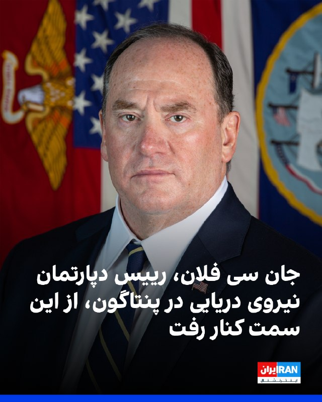
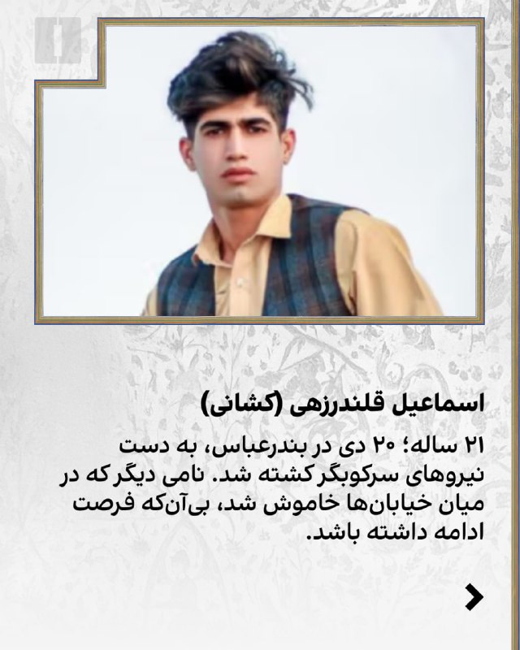
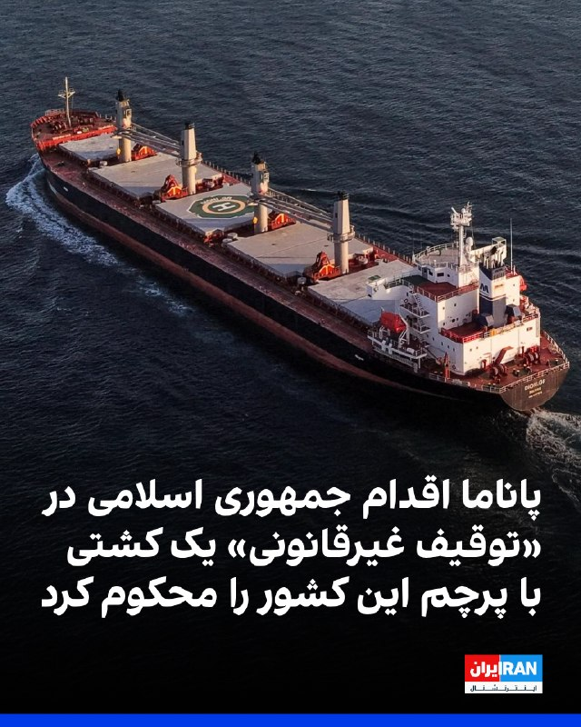
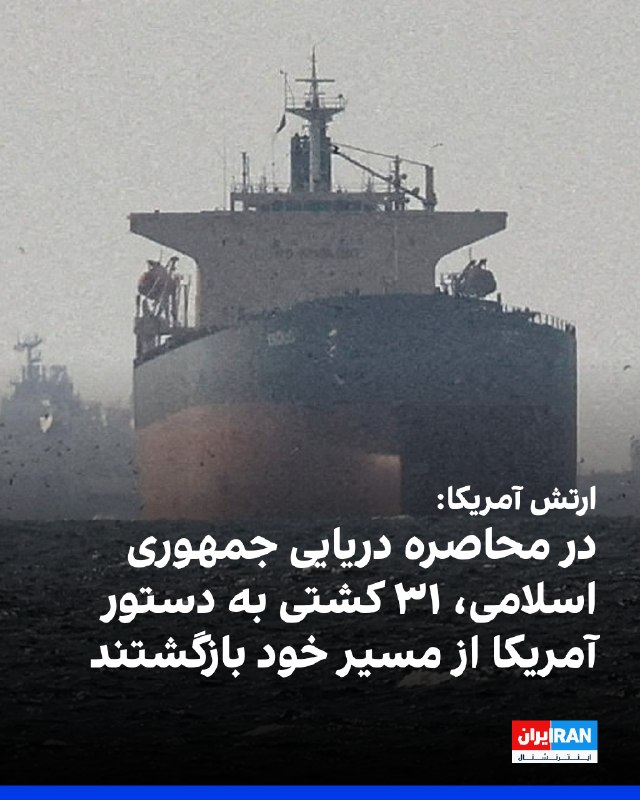

# Channel IranintlTV

## Message 333419

[Video](media/333419_0.mp4)

آزادی بیان روی شتر؛ اما دولا دولا!
اصطلاح «شترسواری دولادولا» در فرهنگ عامه به رفتاری دوگانه و متناقض اشاره دارد؛ وضعیتی که فرد می‌خواهد از یک موقعیت بهره ببرد، اما هزینه و مسئولیت آن را نپذیرد.
کامبیز حسینی در «برنامه» به این موضوع می‌پردازد.
«یک ایران صدای شما را می‌شنود»
دوشنبه تا پنجشنبه ۱۱ شب تهران
از تلویزیون ایران اینترنشنال
تماشای نسخه کامل این قسمت از «برنامه» در یوتیوب:
https://youtu.be/xnZWEPtMivo
@iranintltv

---

## Message 333420

[Video](media/333420_0.mp4)

چرا دیگر «از دموکراسی بگو!» نمی‌گویند؟
کامبیز حسینی در «برنامه» به این موضوع می‌پردازد که چرا دیگر «از دموکراسی بگو!» نمی‌گویند.
«یک ایران صدای شما را می‌شنود»
دوشنبه تا پنجشنبه ۱۱ شب تهران
از تلویزیون ایران اینترنشنال
تماشای نسخه کامل این قسمت از «برنامه» در یوتیوب:
https://youtu.be/xnZWEPtMivo
@iranintltv

---

## Message 333435

[Video](media/333435_0.mp4)

احمد دنیامالی، وزیر ورزش و جوانان دولت مسعود پزشکیان، با اشاره به حملات آمریکا و اسرائیل به جمهوری اسلامی، به قطع دست و پای ماموران لانچرهای موشک سپاه اشاره کرد و گفت شخصا با حضور تیم فوتبال ایران در رقابت‌های پیش‌روی جام جهانی مخالف است.
@iranintltv

---

## Message 333421

**Date:** 2026-04-23T00:01:42+00:00

شان پارنل، سخنگوی وزارت جنگ آمریکا، اعلام کرد جان سی فلان، رییس دپارتمان نیروی دریایی در پنتاگون، از این سمت می‌رود و این تصمیم بلافاصله اجرایی می‌شود.
سخنگوی وزارت جنگ آمریکا ضمن قدردانی از خدمات جان سی فلان، گفت هونگ کائو، معاون رییس دپارتمان نیروی دریایی در وزارت جنگ، به عنوان سرپرست این دپارتمان منصوب خواهد شد.
هنوز دلیلی رسمی برای بیرون رفتن جان سی فلان از این سمت ارائه نشده است، اما رویترز به نقل از دو منبع آگاه گزارش داد فلان به این دلیل که برای اجرای اصلاحات جهت تسریع ساخت کشتی، خیلی کند عمل می‌کرد و همچنین به این دلیل که با رهبران کلیدی پنتاگون اختلاف داشت، برکنار شده است.
یکی از منابع نیز به روابط بد فلان با وزیر جنگ و همچنین هونگ کائو، فرد شماره دو نیروی دریایی، اشاره کرد.
https://iranintl.com/202604224417

---

## Message 333422

**Date:** 2026-04-23T00:01:54+00:00

این نام‌ها، هرکدام روایتی از زندگی‌های ناتمام‌اند؛ جوانانی که در روزهای اعتراض، در خیابان‌ها جان باختند و فرصت ادامه از آن‌ها گرفته شد. آنچه باقی مانده، نام‌هایی‌ست که باید در حافظه جمعی زنده بمانند.
جاویدنامان انقلاب ملی ایرانیان:
مهدی نجفی، احمد خسروانی، محمد احمدی، احمد جلیل، اسماعیل قلندرزهی (کشانی)، آیدا حیدری، حسین کریمی، مبینا بهشتی
یادشان، فراتر از زمان و فراموشی، در روایت‌ها ادامه دارد.
#جاویدنامان_انقلاب_ملی_ایرانیان

---

## Message 333431

**Date:** 2026-04-23T00:04:29+00:00

🎧
نسخه صوتی  برنامه با کامبیز حسینی؛ آتش‌بس به نفع چه کسی تمدید شد؟
@iranintlTV

---

## Message 333432

**Date:** 2026-04-23T00:12:23+00:00

🗣
روایت شما از زندگی در آتش‌بس- پنج‌شنبه ۳ اردیبهشت ۱۴۰۵
🔹
می‌دونم صبرمون تموم شده و انتظار سخته، ولی نگران نباشید، ناامید نشین. ترامپ می‌دونه داره چه‌کار می‌کنه، می‌خواد با کمترین هزینه برد باارزش داشته باشه.
🔹
از مشهد: من شغلم به اینترنت وابسته است. ۲ ماه دارد می‌گذرد که فقط از پس‌اندازم استفاده می‌کنم. امیدوارم هرچه زودتر تکلیف ما جوان‌ها مشخص بشود.
🔹
امشب رفتم از نزدیک تئاترهای خیابونی رژیم رو ببینم. شاید باور نکنین این برنامه‌ها هیچ پشتوانه مردمی ندارن و همه‌اش ارگانی و سازماندهی‌شده است. همه‌شون مزدبگیر و جیره‌خوارن.
🔹
خطاب به مردم: شما واقعاً اقدامات ترامپ را نمی‌بینید؟ خیلی بیشتر از جنگ دارد رژیم را نابود می‌کند. کمی دقت کنید.
🔹
گرونی خیلی بیش از حد شده است.
🔹
خطاب به مردم سختی‌کشیده ایران: تو رو خدا یکم دیگه تحمل کنید، چیزی نمونده تا آزادی. گول این حرفای مذاکره رو نخورید و الکی ماتم نگیرید. محکم‌تر از قبل ادامه بدید.
🔹
چهارشنبه دوم اردیبهشت ساعت ۲۳:۱۵ برق بیشتر منطقه ۱۳ و میدان شهدا و صفا و امام حسین کلاً قطع شده است.
🔹
من یه فروشنده لباسم. واقعاً تا این حد گرونی تا حالا ندیده بودم. جنس‌ها هر هفته ۳۵ درصد گرون میشه. این آتش‌بس چیه هی تمدید می‌کنید؟ بزنید تموم کنید دیگه. واقعاً حال و روحیه و پول نداریم.
🔹
تمام خیابونا رو بستن، نمی‌تونیم کاسبی کنیم، نه اجاره می‌تونیم بدیم نه کاسبی داریم.
🔹
از تهران: اوضاع در ایران خیلی داغونه. همه منتظر حمله آقای ترامپ هستیم. هنوز حقوق‌ها رو ندادن. مردم بجز ارزشی‌ها که پول می‌گیرن و پرچم تکون میدن ناراحتن. به امید پیروزی. جاوید شاه.
🔹
امیدوارم هرچی سریع‌تر کار جمهوری اسلامی تموم بشه و واقعاً امیدوارم ترامپ از ما مردم ایران برای منفعت خودش استفاده نکنه که امتیازاتی بگیره.
🔹
از رشت: آتش‌بس برای ما نون و آب نمی‌شه. جنگ باید نتیجه داشته باشه. متأسفانه شرایط زندگیمون بدتر شده. این نظم جهانی چی شد؟ یعنی ما باز جمهوری اسلامی رو باید ببینیم؟ خدایا خودت کمک کن.
🔹
از همدان: اینجا خبری از ایست‌های بازرسی یا نیروهای نیابتی نیست. فقط سیرک‌های شبانه دارن. احتمالاً در شهرستان‌ها مثل اینجا برای اعتراض خیابونی و فراخوان بهتر است.
🔹
در این وضعیتی که اینترنت را برامون قطع کرده‌اند ما مردم باید هوای همو داشته باشیم. لطفاً انصاف داشته باشید، ما خودمون به خودمون رحم نمی‌کنیم، چه انتظاری از بقیه داریم؟
🔹
واقعاً از این وضعیت خیلی خسته شدم. کلی اذیتم کردن. درآمدمون صفر شده. حتی نمی‌دونم می‌تونم واسه یک هفته آینده برنامه‌ای داشته باشم یا نه. امیدوارم مردم کشورمون روزهای خوب را ببینند.

---

## Message 333433

**Date:** 2026-04-23T00:40:28+00:00

🗣
تازه‌ترین خبرها به روایت شاهدان عینی – پنج‌شنبه ۳ اردیبهشت ۱۴۰۵
🔹
پنج‌شنبه سوم اردیبهشت ساعت ۲:۴۰ بامداد فعالیت پدافند در پردیس تهران شنیده شد.
🔹
پنج‌شنبه سوم اردیبهشت ساعت ۲:۵۳ بامداد صدای پنج انفجار در حوالی پردیس استان تهران شنیده شد.
🔹
بامداد پنج‌شنبه سوم اردیبهشت صدای فعالیت شدید پدافند در چیتگر شنیده شد.
🔹
ساعت ۳:۰۵ بامداد پنج‌شنبه ۳ اردیبهشت فعالیت دوباره پدافند برای دومین بار در یک ساعت در پردیس تهران شنیده شد.
🔹
بامداد پنج‌شنبه ۳ اردیبهشت از ساعت حدود ۲:۵۰ نیمه‌شب دست‌کم صدای ۱۰ انفجار از منطقه‌های مختلف سمت پردیس شنیده شد. ما سمت فاز ۴ هستیم و نسبتاً نزدیک و شدید بود.
🔹
ساعت ۳:۳۰ پنج‌شنبه ۳ اردیبهشت صدای پدافند در تهران شنیده شد.
🔹
ساعت ۲:۴۸ پنج‌شنبه ۳ اردیبهشت صدای ۶ انفجار پشت سر هم از پردیس اومد.
🔹
ساعت ۲:۵۰ بامداد پنج‌شنبه ۳ اردیبهشت جنگ شروع شد.

---

## Message 333434

**Date:** 2026-04-23T00:56:23+00:00

وزارت خارجه پاناما در بیانیه‌ای اقدام جمهوری اسلامی در «توقیف غیرقانونی» یک کشتی با پرچم این کشور را محکوم کرد و آن را نقض قوانین بین‌المللی خواند. طبق این بیانیه، این کشتی که متعلق به یک شرکت ایتالیایی است، چهارشنبه «به زور» به آب‌های ایران برده شد.
وزارت خارجه پاناما توقیف این کشتی را نشان‌دهنده حمله جدی به امنیت دریایی و تشدید غیرضروری تنش دانست.
به گزارش آسوشیتدپرس، هنوز مشخص نیست که آیا این شناور همچنان در توقیف ایران است یا نه.
https://iranintl.com/202604235703

---

## Message 333436

**Date:** 2026-04-23T01:54:07+00:00

ستاد فرماندهی مرکزی آمریکا، سنتکام، اعلام کرد در چارچوب محاصره دریایی بنادر و سواحل جنوب ایران، نیروهای آمریکایی به ۳۱ کشتی دستور داده‌اند تا مسیر خود را تغییر دهند و یا به بندر مبدا بازگردند.
طبق این گزارش، بیشتر کشتی‌هایی که بازگشته‌اند نفتکش بوده‌اند.
به گفته سنتکام، بیش از ۱۰ هزار نیروی نظامی آمریکا، بیش از ۱۰۰ فروند جنگنده، بالگرد و هواپیمای شناسایی و بیش از ۱۷ ناو جنگی در عملیات محاصره بنادر جنوبی ایران شرکت دارند.
https://iranintl.com/202604238931

---

## Message 333437

**Date:** 2026-04-23T02:11:15+00:00

🗣
روایت شما از زندگی در آتش‌بس- پنج‌شنبه ۳ اردیبهشت ۱۴۰۵
🔹
از کرج: درگیر بازی انسان‌ها نشید. رسیدن به قله آزادی از چه راهی مهم نیست، مهم اینه که بالاخره می‌رسیم. عشق رو در قلبتون زنده نگه دارید و کامیاب باشید. نور بر تاریکی پیروزه.
🔹
هنوز اینترنت مردم قطع است و این نباید عادی بشه.
🔹
نیروهای رژیم در شهرستان بروجن دارن افرادی که فیلترشکن می‌فروشند رو بازداشت می‌کنن و بیشتر مغازه‌ها را پلمب کردن و هرکسی که فیلترشکن استفاده کند را بازداشت می‌کنند.
🔹
از مشهد: آقای ترامپ گمان می‌کند با آتش‌بس و محاصره اقتصادی این‌ها را نابود می‌کند اما در اصل مردم ایران رو بیچاره کرده. دو میلیون نفر از قطعی اینترنت ایران بیکار شدن. همه اخراج یا تعدیل شدن، هیچ‌کس حداقل حقوق رو نمی‌ده، داریم نابود می‌شیم. مردم هم نمیان بیرون چون می‌ترسن.
🔹
بعد از مدت‌ها که عابربانک‌ها پول نقد نمی‌دادند امروز موفق شدم پول نقد بگیرم. همه کاملاً نو هستن. بازم پول بی‌پشتوانه چاپ کردن. خدا به خیر کنه.
🔹
همه‌چیز بعد از گفتن آتش‌بس از سوی ترامپ چندین برابر شده است. خدا کند همه‌چیز درست شود.
🔹
ارتش اعلام حمایت از مردم ایران کنه. بعد از این همه سختی همگی لایق آزادی هستیم. دقت کنین آزادی برای همه است.
🔹
نه بچه‌ام که بگم تا بزرگ بشم درست شده، نه پیرم که بگم من که زندگی‌ام رو کردم، یعنی قشنگ اومد نشست وسط جوونی ما.
🔹
از کرج: من بی‌صبرانه منتظر پیام شاهزاده هستم تا دوباره به خیابان برگردم. جاوید شاه، پاینده ایران.
🔹
باور کنید قالیباف قالی می‌بافت، الان بدبختی نداشتیم.
🔹
باید ترامپ یکی از شروط توافق را برقراری اینترنت بدون فیلتر برای همه مردم ایران بگذارد.
🔹
تنها کشوری در خاورمیانه که جمعیت بسیار زیادی از مردمش طرفدار آمریکا و اسرائیل هستند ایرانه. ترامپ و نتانیاهو هرگز نباید این سرمایه عظیم رو از دست بدهند، این آخرین فرصته که مردم رو ناامید نکنن از خودشون.
🔹
تعارف نداریم، ترامپ با عدم قاطعیت در تصمیم‌هایش دو تا لطف خیلی بزرگ به جمهوری اسلامی کرد. اول، برگه برنده تنگه هرمز رو به رژیم داد و دوم، خیابان‌ها رو در تسخیر طرفداران حکومت درآورد.
🔹
از پاکدشت: اینجا اکثر شرکت‌ها تعطیل کردن، بیکاری داره زیاد میشه.
🔹
از مشهد: دوستان ناامید نشوید. ترامپ تا به حال با زدن خامنه‌ای و سران نظام بزرگ‌ترین لطف را در حق ما انجام داده. ترامپ می‌داند دارد چه کار می‌کند، مطمئن باشید کارشان رو به اتمامه.
🔹
خواهش می‌کنم حساب این حکومت را از مذهب مردم ایران جدا کنید چون این‌ها با رفتار و اعمال‌شان ثابت کردند که کمونیست هستند و به چیزی اعتقاد ندارند.

---

## Message 333438

**Date:** 2026-04-23T02:19:28+00:00

طبق گزارش‌های منتشر شده و پیام‌هایی که از مخاطبان به ایران‌اینترنشنال رسیده است، بامداد پنج‌شنبه چندین صدای انفجار در مناطق شرقی و غربی تهران شنیده شد.
به گفته کاربران، این صداها شبیه صدای فعال شدن پدافند هوایی بود.
طبق پیام‌هایی که مخاطبان به ایران‌اینترنشنال ارسال کردند، بامداد پنج‌شنبه از ساعت ۲:۵۰ صداهای انفجار در محدوده پردیس در شرق تهران شنیده شد.
همچنین به گزارش وحید آنلاین، صداهای مداوم انفجار در غرب تهران، از جمله در چیتگر شنیده شد.
https://iranintl.com/202604234925

---
