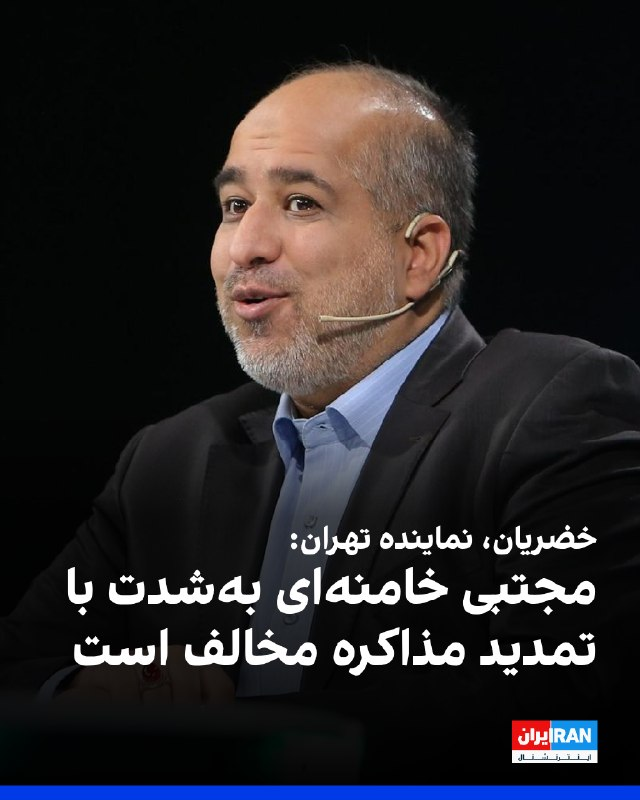
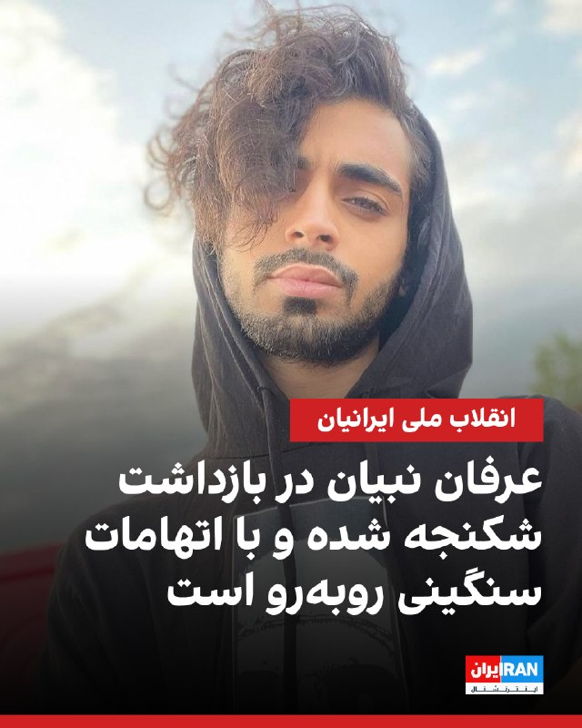
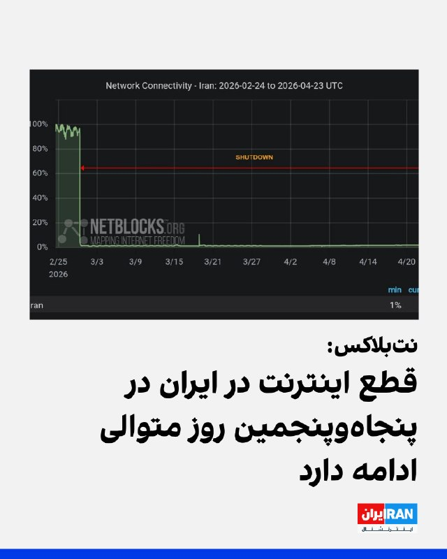
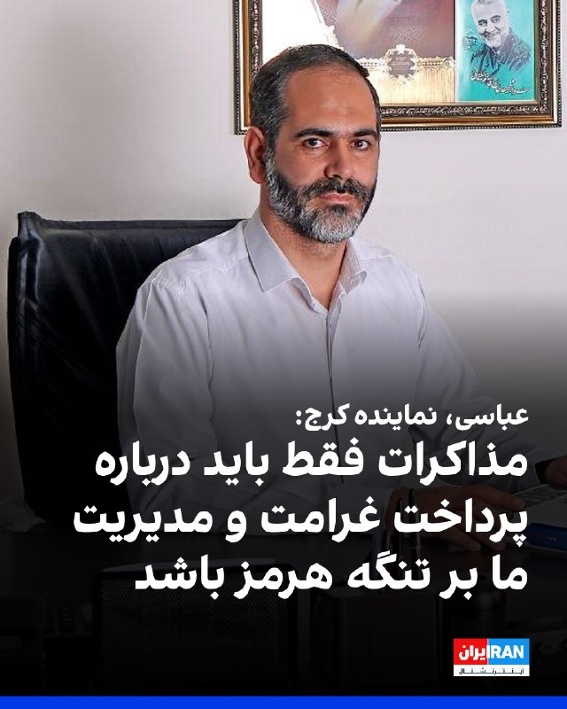
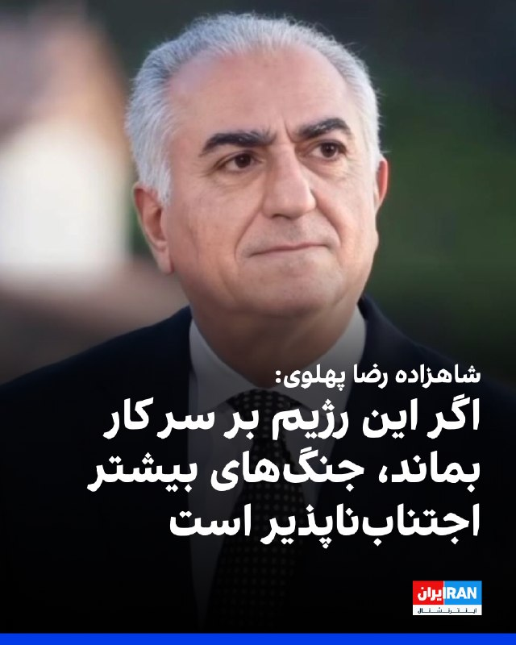
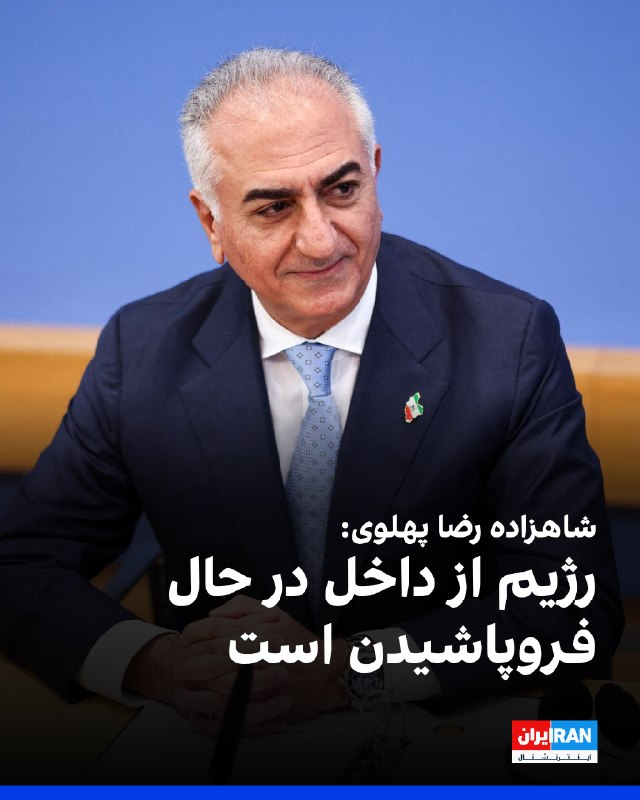
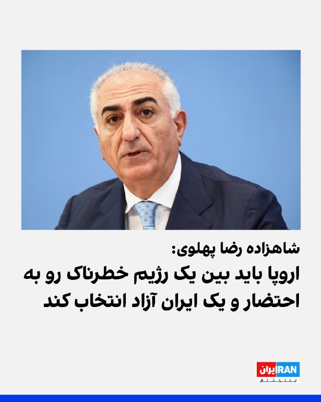
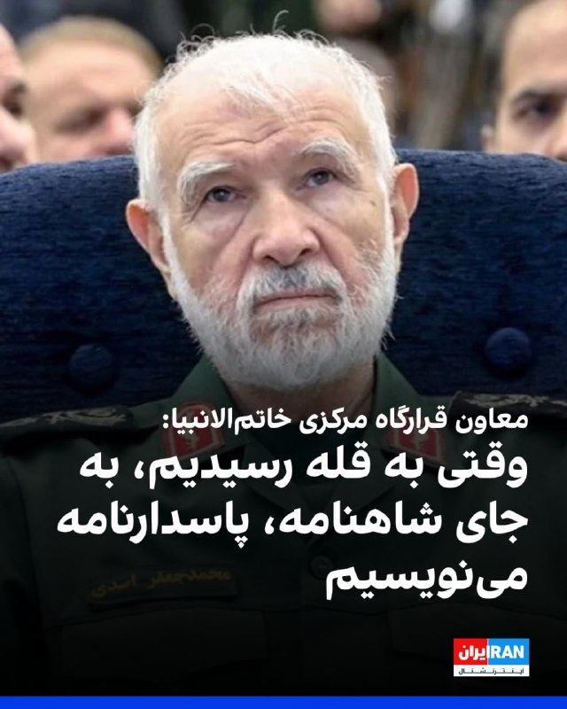
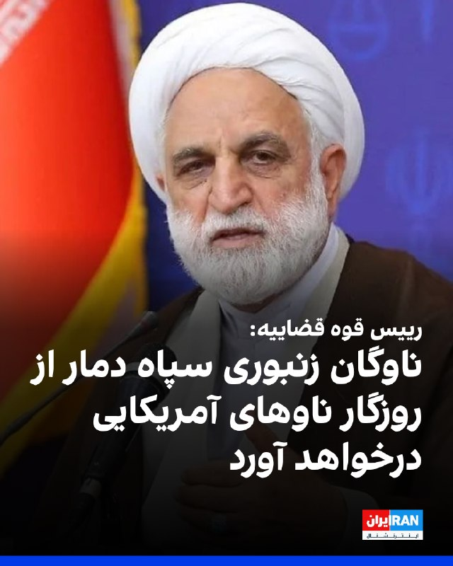
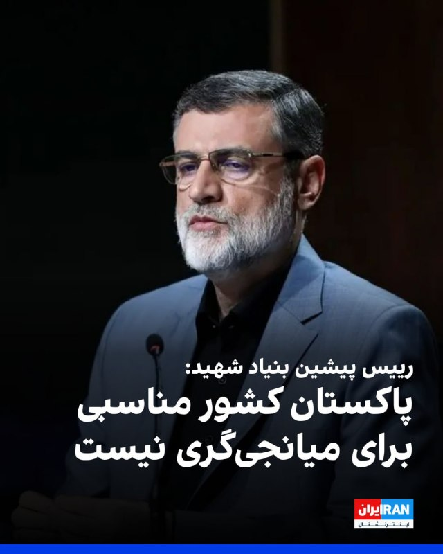

# Channel IranintlTV

## Message 333467

[Video](media/333467_0.mp4)

کارولین لیویت، سخنگوی کاخ سفید، گفت جمهوری اسلامی برای پایان دادن به جنگ باید با تحویل اورانیوم غنی‌شده به آمریکا موافقت کند. او تاکید کرد دونالد ترامپ برای تمدید آتش‌بس خواستار دریافت پاسخ یکپارچه از جمهوری اسلامی شده، اما مهلتی تعیین نکرده است.
گفت‌وگو با مرتضی کاظمیان، عضو تحریریه ایران‌اینترنشنال
@iranintltv

---

## Message 333470

[Video](media/333470_0.mp4)

شاهزاده رضا پهلوی در جریان یک نشست خبری در برلین گفت: «همین حالا که صحبت می‌کنیم، جمهوری اسلامی ۲۰ زندانی سیاسی را به اعدام محکوم کرده است». او همچنین افزود ۸ هفته است که رژیم ایران، اینترنت مردم را قطع کرده است.
@iranintltv

---

## Message 333472

[Video](media/333472_0.mp4)

شاهزاده رضا پهلوی در جریان یک نشست خبری در برلین گفت: «قالیباف، عراقچی و سپاه پاسداران هیچ‌کدام عملگرا نیستند و این‌ها صرفا چهره‌هایی از همان ماشین کشتار هستند.»
@iranintltv

---

## Message 333473

[Video](media/333473_0.mp4)

شاهزاده رضا پهلوی در یک نشست خبری در برلین گفت: «تا زمانی که جمهوری اسلامی بر سر کار است، اروپا همچنان با تهدید مواجه خواهد بود و هیچ مذاکره یا توافقی این تهدید را از میان نخواهد برد.» او همچنین با اشاره به تجمع ۱۴ فوریه ایرانیان در مونیخ تاکید کرد: «اروپا باید به مطالبات ایرانیان خارج از کشور گوش دهد وبا کسانی که آن‌ها را وادار به تبعید کرده‌اند، وارد مذاکره نشود.»
@iranintltv

---

## Message 333478

[Video](media/333478_0.mp4)

شاهزاده رضا پهلوی، در نشست خبری خطاب به دولت‌های غربی گفت جهان باید بابت سال‌ها نادیده گرفتن مردم ایران و مماشات با جمهوری اسلامی از ایرانیان عذرخواهی کند. او گفت مردم ایران بارها در ۴۷ سال گذشته قیام کردند اما فقط «ژست‌های نمادین» دیده‌اند.
@iranintltv

---

## Message 333479

[Video](media/333479_0.mp4)

نشست خبری شاهزاده رضا پهلوی در برلین به پایان رسید. او در این نشست بر ضرورت خودداری اروپا از گفت‌وگو با نمایندگان جمهوری اسلامی تاکید کرد و از لزوم پوشش تحولات مرتبط با مردم ایران در رسانه‌های اروپایی، از جمله ایستادگی آن‌ها، قطع اینترنت و اعدام‌ها گفت.
احمد صمدی، خبرنگار ایران‌اینترنشنال، گزارش می‌دهد
@iranintltv

---

## Message 333480

[Video](media/333480_0.mp4)

سرخط خبرهای پنجشنبه ۳ اردیبهشت
@iranintltv

---

## Message 333481

[Video](media/333481_0.mp4)

شاهزاده رضا پهلوی در یک نشست خبری تاکید کرد مردم ایران باید سرنوشت خود را آزادانه انتخاب کنند. او همچنین گفت: «من تصمیم‌گیرنده نهایی نیستم. پیشنهاد من برگزاری انتخابات آزاد است تا مردم بتوانند خود مسیر آینده را تعیین کنند.»
@iranintltv

---

## Message 333482

[Video](media/333482_0.mp4)

مادر جاویدنام آریا علیدوست و پدر جاویدنام سام افشاری در نشست خبری شاهزاده رضا پهلوی در برلین حضور داشتند.
گفت‌وگوی احمد صمدی، خبرنگار ایران‌اینترنشنال با آن‌ها پس از پایان این نشست
@iranintltv

---

## Message 333463

**Date:** 2026-04-23T07:23:02+00:00

علی خضریان، نماینده تهران در مجلس، در برنامه‌ای تلویزیونی گفت: «هوشیاری رهبری درباره مذاکرات، به عنوان فردی که فرمانده کل قواست و کشور را اداره می‌کند، قابل توجه است. اخبار ما مبنی بر این است که او به‌شدت با هرگونه تمدید مذاکره در چنین شرایطی مخالف است.»
او ادامه داد: «ترامپ که می‌داند در جمهوری اسلامی، ولایت فقیه حاکم است و همه تحت امر ولی‌امر مسلمین هستند، تلاش می‌کند شکافی ایجاد کند. دیدید که در همان مطالب منتشرشده، اشاره‌ای به شکاف در دولت و این‌ها کرده است.»
https://iranintl.com/202604234363

---

## Message 333464

**Date:** 2026-04-23T07:32:20+00:00

بر اساس اطلاعات رسیده به ایران‌اینترنشنال، عرفان نبیان، جوان معترض ۲۶ ساله، از زمان بازداشت تحت شکنجه برای اعتراف اجباری قرار گرفته و با اتهامات سنگینی روبه‌روست که می‌تواند منجر به صدور حکم اعدام شود.
https://iranintl.com/202604239780

---

## Message 333465

**Date:** 2026-04-23T07:52:33+00:00

وبسایت نت‌بلاکس، نهاد ناظر بر اختلال‌های اینترنتی در جهان، صبح پنج‌شنبه، سوم اردیبهشت گزارش داد قطعی اینترنت در ایران در پنجاه‌وپنجمین روز متوالی ادامه دارد و پس از ۱۲۹۶ ساعت، اتصال به دو درصد از سطح عادی کاهش یافته است.
بنا بر این گزارش محدودیت‌ها در دسترسی به شبکه جهانی همچنان مانع تجارت آنلاین، سیستم‌های پرداخت و بخش‌های وابسته به اقتصاد دیجیتال می‌شود.
https://iranintl.com/202604235440

---

## Message 333466

**Date:** 2026-04-23T08:14:28+00:00

علیرضا عباسی، نماینده کرج در مجلس گفت: «هرگونه مذاکره باید تنها به موضوعاتی چون پرداخت غرامت و مدیریت جمهوری اسلامی بر تنگه هرمز محدود شود و مذاکره‌کنندگان نباید با فریب فرانچسکوهای خیالی در دام اسنپ‌بک‌های جدید بیفتند.»
او افزود: «موضوع هسته‌ای باید برای همیشه از دستور کار مذاکرات خارج شود.»
او ادامه داد: «ترامپ مطلقا زبان مذاکره و منطق را نمی‌فهمد، اما زبان قدرت و قاطعیت را خیلی خوب می‌فهمد، پس مذاکره‌کنندگان ما باید در یک حرکت انقلابی و دیپلماتیک صحیح حتی در آن جلسه مذاکره نمایشی شرکت هم نکنند.»
https://iranintl.com/202604233040

---

## Message 333468

**Date:** 2026-04-23T08:21:25+00:00

شاهزاده رضا پهلوی، در دیدار با نمایندگان پارلمان آلمان و خبرنگاران گفت: «اگر این رژیم بر سر کار بماند، جنگ‌های بیشتر اجتناب‌ناپذیر است.»
او افزود: «جمهوری اسلامی حتی در خاک آلمان نیز جنایت‌هایی انجام داده و دادگاه‌های آلمان این موارد را مستند کرده‌اند.»
شاهزاده رضا پهلوی ادامه داد: «رژیم جمهوری اسلامی به قتل‌های مخالفان خود در خاک آلمان و اروپا، مانند مخالفان کرد و فریدون فرخزاد افتخار می‌کند.»
https://iranintl.com/202604234784

---

## Message 333469

**Date:** 2026-04-23T08:35:39+00:00

شاهزاده رضا پهلوی در دیدار با برخی نمایندگان پارلمان آلمان و در حضور خبرنگاران گفت: «رژیم از داخل در حال فروپاشیدن است و بسیاری از ماموران از انجام وظایف خود سر باز زدند و حکومت مجبور شده نیروهایی را از عراق و لبنان و افغانستان وارد کشور کند که کار کثیف کشتن مردم را انجام دهند.»
او ادامه داد: «این که فکر کنیم که رژیم به صلح پایدار متعهد باشد، بسیار خوشبیانه است.»
https://iranintl.com/202604236509

---

## Message 333471

**Date:** 2026-04-23T08:47:57+00:00

شاهزاده رضا پهلوی در دیدار با برخی نمایندگان پارلمان آلمان گفت: «انتخاب اروپا میان جنگ و صلح نیست، بلکه بین یک رژیم خطرناک رو به احتضار و یک ایران آزاد است.»
او افزود اکنون پرسش این است که آیا سیاستمداران کشورهای دیگر سمت مردم ایران می‌ایستند یا در برابر شر کرنش خواهند کرد.
شاهزاده رضا پهلوی با اشاره به حمله تروریستی به رستوران میکونوس و ترور فریدون فرخزاد در آلمان، گفت جمهوری اسلامی به این اقدامات خود افتخار می کند و اروپا را نیز با موشک‌های دوربرد تهدید می کند.
او از کشورهای اروپایی خواست سفیران جمهوری اسلامی را اخراج و از دولت انتقالی حمایت کنند.
شاهزاده رضا پهلوی تاکید کرد دولت انتقالی او متعهد به صلح خواهد بود و جاه‌طلبی هسته‌ای جمهوری اسلامی را برمی‌چیند.
او وعده داد یک ایران آزاد پایانی بر جنگ‌های نیابتی در منطقه خواهد بود.
https://iranintl.com/202604233550

---

## Message 333474

**Date:** 2026-04-23T09:11:34+00:00

محمدجعفر اسدی، معاون بازرسی قرارگاه مرکزی خاتم‌الانبیا گفت: «تا یک پاسدار در این کشور حیات دارد، نمی‌گذارند پای یک آمریکایی در این کشور باز شود. در نهایت، وقتی به قله رسیدیم، آن وقت قرار است کسانی بیایند و شاهنامه را ببندند و پاسدارنامه و بسیجی‌نامه را بنویسند.»
https://iranintl.com/202604230931

---

## Message 333475

**Date:** 2026-04-23T09:19:01+00:00

غلامحسین محسنی اژه‌ای، رییس قوه قضاییه گفت: «ناوگان زنبوری سپاه با قایق‌های تندرو و شهپادها، از غارهای دریایی جزیره فارور، انتظار ناوهای متجاوز آمریکایی را می‌کشند تا با اشباع پدافندی، دمار از روزگار متجاوزان درآورند.»
او افزود: «روز گذشته هم سه کشتی متخلف در این آبراه راهبردی، اعمال قانون شدند. آمریکایی‌ها نیز جرات نزدیک شدن به تنگه هرمز را ندارند.»
https://iranintl.com/202604233486

---

## Message 333476

**Date:** 2026-04-23T09:57:34+00:00

امیرحسین قاضی‌زاده هاشمی، رییس پیشین بنیاد شهید، با اشاره به مذاکرات اسلام‌آباد نوشت: «پاکستان به دلیل وابستگی مالی به عربستان سعودی و نفوذ گسترده آمریکا در سرویس امنیتی و ارتش این کشور، کشور مناسبی برای میانجی‌گری نیست.»
او افزود: «حضور سرویس‌های امنیتی و مالی امارات متحده عربی در بلوچستان پاکستان و حمایت از گروه‌های تجزیه‌طلب، این کشور را به محیطی نامناسب برای مذاکره تبدیل کرده است.»
https://iranintl.com/202604235919

---

## Message 333477

**Date:** 2026-04-23T09:58:53+00:00

حمیدرضا حاجی‌بابایی، نایب‌رییس مجلس گفت: «هرگونه مذاکره تا زمانی که آمریکا به شکست اقرار نکرده، ممنوع است.»
او افزود که باید «فرودگاه، هتل و شاه» کشورهایی که امکانات و فرودگاه در اختیار «تروریست‌ها» برای کشتن مقام‌های جمهوری اسلامی قرار می‌دهند، هدف قرار گیرند.
https://iranintl.com/202604235743

---
