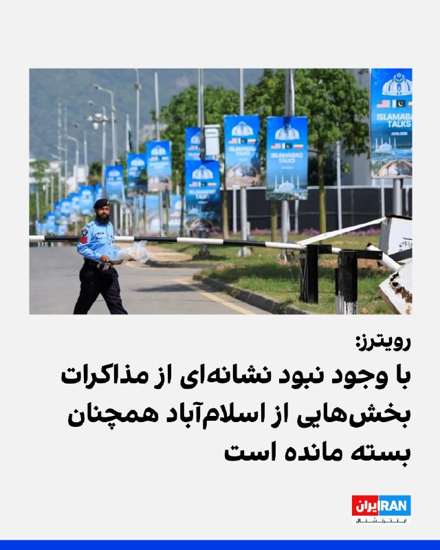
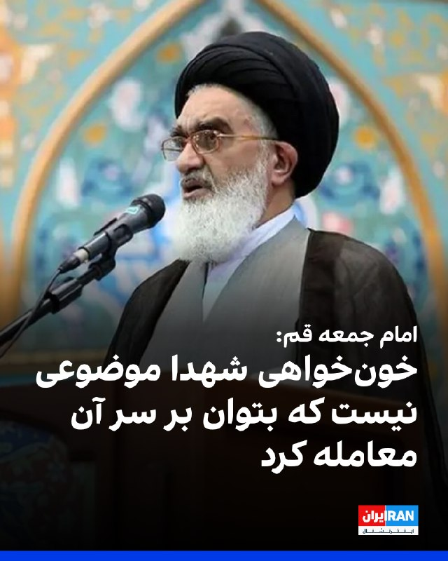
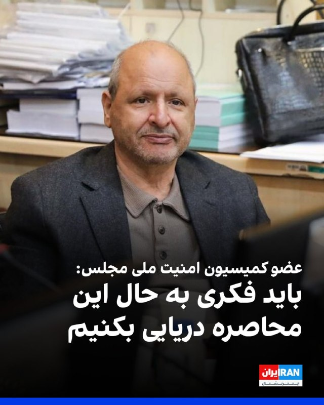
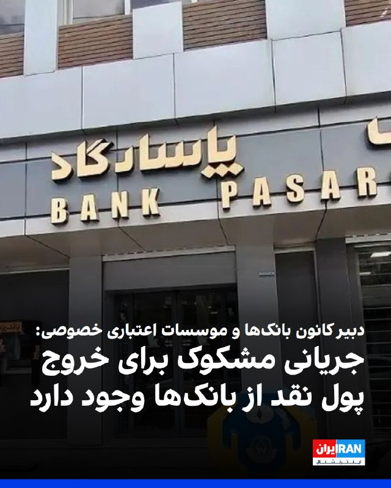
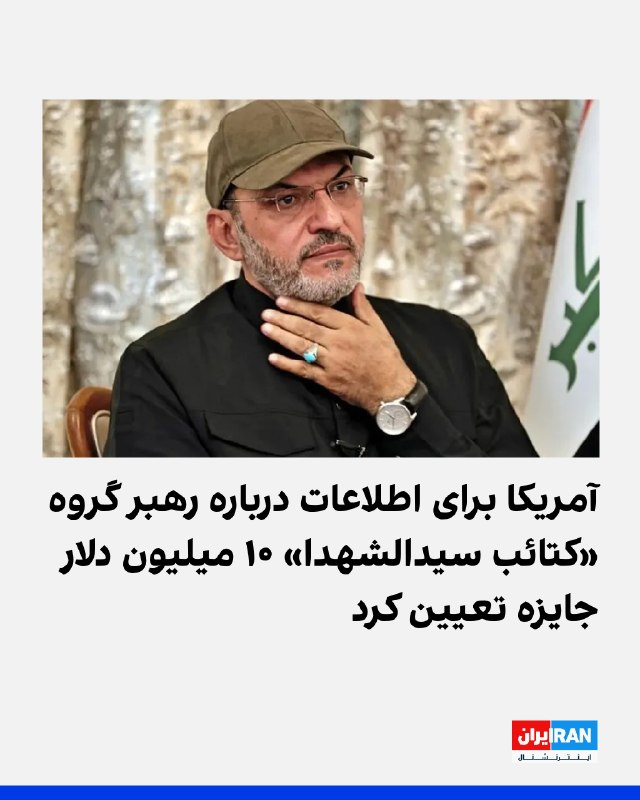
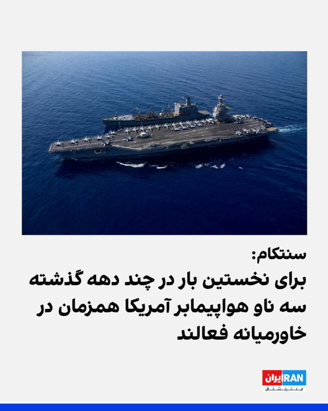
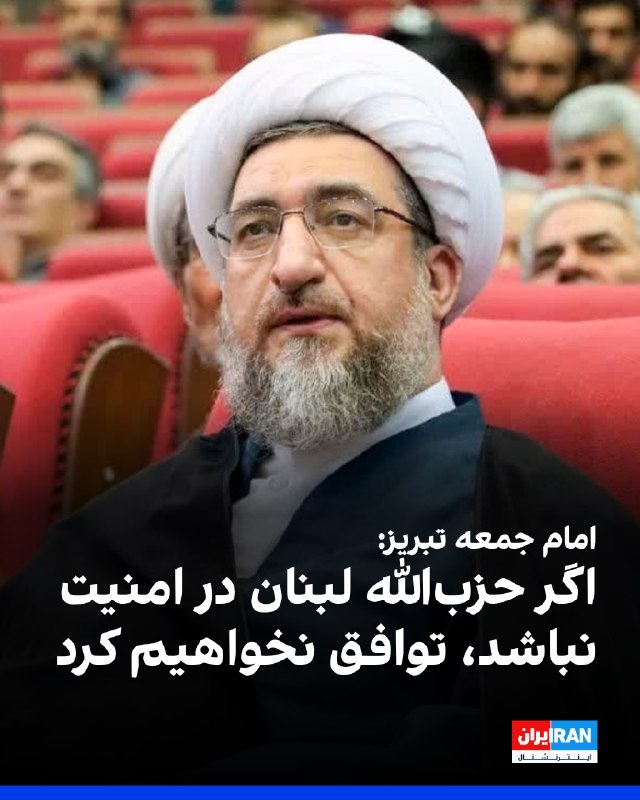
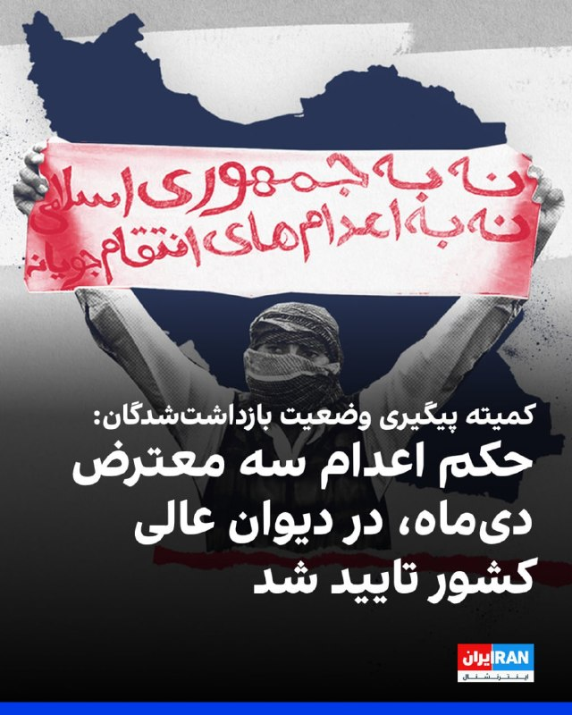

# Channel IranintlTV

## Message 333645

[Video](media/333645_0.mp4)

دومین روز نشست سران اتحادیه اروپا برای بررسی وضعیت خاورمیانه و جنگ اوکراین در نیکوزیا، پایتخت قبرس، در حال برگزاری است.
جزییات بیشتر با لی‌لی نیکفر، خبرنگار ایران‌اینترنشنال
@iranintltv

---

## Message 333646

[Video](media/333646_0.mp4)

مهدی علی‌نژاد، دبیرکل کمیته ملی المپیک ایران، اعلام کرد درباره حضور ایران در جام جهانی ۲۰۲۶ هنوز تصمیمی گرفته نشده و تصمیم نهایی بر عهده دولت است اما روند آماده‌سازی تیم در حال انجام است.
گفت‌وگو با علیرضا مدیری، عضو تحریریه ورزشی ایران‌اینترنشنال
@iranintltv

---

## Message 333650

[Video](media/333650_0.mp4)

شهروندان در پیام‌های خود به مدیابات ایران‌اینترنشنال از پرداخت نشدن حقوق یا تاخیر در پرداخت‌ها، هم‌زمان با ادامه قطع اینترنت و بحران اقتصادی خبر دادند.
جزییات بیشتر با لیلا سعادتی، عضو تحریریه ایران‌اینترنشنال
@iranintltv

---

## Message 333656

سرخط خبرهای جمعه ۴ اردیبهشت
@iranintltv

---

## Message 333658

[Video](media/333658_0.mp4)

دونالد ترامپ، رییس‌جمهوری آمریکا، اختلاف‌نظر شدید میان مقام‌های جمهوری اسلامی را مانعی برای مذاکره و توافق دانست. در واکنش، مقام‌های حکومت ایران با انتشار متون مشابه از وحدت‌نظر و تبعیت از مجتبی خامنه‌ای گفتند.
گفت‌وگو با مرتضی کاظمیان، عضو تحریریه ایران‌اینترنشنال
@iranintltv

---

## Message 333661

[Video](media/333661_0.mp4)

دادستانی لندن از محاکمه دو مرد ایرانی به نام‌های نعمت‌الله شاهسونی، ۴۰ ساله و علیرضا فراستی، ۲۲ ساله، به اتهام جاسوسی برای جمهوری اسلامی خبر داد.
گفت‌وگو با محمدجواد اکبرین، عضو تحریریه ایران‌اینترنشال
@iranintltv

---

## Message 333663

[Video](media/333663_0.mp4)

بر اساس گزارش شبکه ال‌بی‌سی، روند به‌کارگیری شهروندان بریتانیایی از سوی عوامل حکومت ایران برای انجام عملیات خرابکارانه در لندن با شتابی قابل‌ توجه در جریان است.
نیلوفر پورابراهیم، خبرنگار ایران‌اینترنشنال، گزارش می‌دهد
@iranintltv

---

## Message 333647

**Date:** 2026-04-24T09:23:12+00:00

رویترز در گزارشی نوشت که با وجود آن که نشانه‌ای از مذاکرات آمریکا و جمهوری اسلامی دیده نمی‌شود، بخش‌های وسیعی از اسلام‌آباد همچنان بسته شده است.
یکی از مقام‌های پاکستانی به این خبرگزاری گفت: «به ما گفته شده مذاکرات ممکن است هر روزی برگزار شود.»
https://iranintl.com/202604247408

---

## Message 333648

**Date:** 2026-04-24T09:30:07+00:00

🔻
نمایش وحدت در تهران؛ پاسخ هماهنگ به بحران رهبری یا انکار واقعیت‌ها؟
هم‌زمان با ادامه غیبت مجتبی خامنه‌ای از عرصه عمومی و گزارش‌ها از تشدید اختلافات در تهران بر سر مذاکره با واشینگتن، اظهارات دونالد ترامپ درباره سردرگمی در ساختار جمهوری اسلامی به‌دلیل نامشخص بودن رهبری، واکنش گسترده مقام‌های حکومت را به دنبال داشت.
رییس‌جمهوری آمریکا سوم اردیبهشت در شبکه اجتماعی تروث‌سوشال نوشت جمهوری اسلامی در حال حاضر با سردرگمی جدی در تعیین رهبر خود مواجه است و عملا نمی‌داند چه کسی در راس قرار دارد.
او افزود کشمکش‌های داخلی میان «تندروها» که در صحنه نبرد به‌شدت تضعیف شده‌اند و «میانه‌روها که چندان هم میانه‌رو نیستند»، به آشفتگی در ساختار حاکمیت ایران دامن زده است.
ترامپ همچنین گفت‌وگوی مارک تیسن، تحلیل‌گر سیاسی، با شبکه فاکس‌نیوز را در تروث‌سوشال بازنشر کرد.
تیسن در این مصاحبه گفته بود: «اگر دو گروه در ایران وجود دارد که یکی خواهان توافق و دیگری مخالف آن است، بیایید افراد مخالف [توافق] را بکشیم.»
در واکنش به اظهارات ترامپ که سرنوشت نامشخص رهبری جمهوری اسلامی را برجسته کرد، حساب منتسب به مجتبی خامنه‌ای در شبکه‌های اجتماعی بخشی از پیام نوروزی او را بازنشر کرد که در آن، نسبت به «عملیات روانی دشمن» برای «خدشه در وحدت و امنیت ملی» هشدار داده شده است.
سایر مقام‌های حکومت نیز در تلاش برای «نمایش وحدت»، متن‌هایی با مضامین یکسان در شبکه‌های اجتماعی منتشر کردند.
مسعود پزشکیان، رییس دولت و محمدباقر قالیباف، رییس مجلس شورای اسلامی، با انتشار متنی مشترک در شبکه اجتماعی ایکس نوشتند: «در ایران ما تندرو و میانه‌رو وجود ندارد. همه ما ایرانی و انقلابی هستیم و با اتحاد آهنین ملت و دولت، با تبعیت کامل از رهبر معظم انقلاب، متجاوز جنایتکار را پشیمان خواهیم کرد.»
در انتهای این پیام آمده است: «یک خدا، یک رهبر، یک ملت، و یک راه»
غلامحسین محسنی اژه‌ای، رییس قوه قضاییه، نیز در ایکس نوشت: «تندرو و میانه‌رو واژگانی مجعول و بی‌مایه است که در ادبیات سیاسی غرب رواج دارد. در ایران اسلامی همه اقشار و جناح‌ها در نهایت قوام و انسجام در ذیل اوامر رهبری معظم انقلاب هستند.»
اسماعیل قاآنی، فرمانده نیروی قدس، محسن رضایی و محمد مخبر، مشاوران مجتبی خامنه‌ای، محمدرضا عارف، معاون اول پزشکیان، علی‌اکبر احمدیان، عضو شورای دفاع، محمد مرندی، عضو هیات مذاکره‌کننده، فرمانده هوافضا و فرمانده نیروی دریایی سپاه پاسداران، محمدصادق معتمدیان، استاندار تهران و غلام‌رضا نوری قزلجه، وزیر جهاد کشاورزی، از دیگر مقام‌های حکومت بودند که با انتشار پیام‌هایی بر تبعیت از «یک رهبر» تاکید کردند.
اختلافات درونی حاکمیت؛ از تنش بر سر جنگ تا بن‌بست در مذاکرات هسته‌ای
علی‌رغم تلاش هماهنگ مقام‌های جمهوری اسلامی برای «نمایش وحدت»، به نظر می‌رسد اختلافات عمیق بر سر چالش‌های اساسی پیش روی حاکمیت غیرقابل کتمان است.
۱۶ اسفند و در بحبوحه جنگ، پزشکیان از حملات حکومت ایران به کشورهای همسایه عذرخواهی کرد و آن را به نیروهای «آتش به اختیار» نسبت داد. این اظهارات با انتقادات تند برخی مقام‌های نظامی و چهره‌های سیاسی و رسانه‌ای نزدیک به حکومت روبه‌رو شد.
۲۸ فروردین و به‌دنبال برقراری آتش‌بس در درگیری‌های ایران و سپس لبنان، عباس عراقچی، وزیر امور خارجه جمهوری اسلامی، از بازگشایی تنگه هرمز خبر داد، اما مدتی بعد، سپاه پاسداران اعلام کرد به‌دلیل تداوم محاصره دریایی بندرهای ایران، بار دیگر این گذرگاه را مسدود می‌کند.
این در حالی است که گزارش‌ها از اختلافات شدید میان مقام‌های حکومت بر سر مذاکرات با آمریکا، به‌ویژه در موضوع پرونده هسته‌ای، نیز حکایت دارند.
بر اساس اطلاعات رسیده به ایران‌اینترنشنال، اختلافات شدید میان تیم نزدیک به دولت و افراد وابسته به دفتر مجتبی خامنه‌ای، مانع اصلی سفر هیات جمهوری اسلامی به اسلام‌آباد برای برگزاری دور جدید مذاکرات با آمریکا بود.
به گفته منابع آگاه، در حالی که هیات مذاکره‌کننده حکومت ایران آماده عزیمت به اسلام‌آباد بود، پیامی از سوی حلقه نزدیک به دفتر مجتبی خامنه‌ای مبنی بر «ممنوعیت پرداختن به پرونده هسته‌ای» به آن‌ها ابلاغ شد.
بر پایه این گزارش، عراقچی در واکنش به این دستور، حضور در اسلام‌آباد را «اساسا بی‌فایده» خوانده و تاکید کرده این سیاست در عمل به معنای «حکم مرگ» مذاکرات است.
پیش‌تر و در ۳۱ فروردین نیز ایران‌اینترنشنال گزارش داد قالیباف در جلسه‌ای با مشاورانش، به‌تندی از مخالفان توافق با آمریکا و «برخی فعالان همسو با جبهه پایداری» انتقاد کرده و آنان را «عامل نابودی کشور» خوانده است.
🔗
وب‌سایت ایران‌اینترنشنال
@iranintltv

---

## Message 333649

**Date:** 2026-04-24T09:56:52+00:00

محمد سعیدی، امام جمعه قم گفت: «پذیرش ذلت در برابر ظالمان جایگاهی در مکتب ما ندارد و جامعه اسلامی باید در مسیر دفاع از حقوق خود استوار بماند.»
او افزود: «حقوق ملت، از جمله مطالبات اقتصادی و سیاسی و همچنین خون‌خواهی شهدا، موضوعاتی نیست که بتوان بر سر آن‌ها معامله یا چانه‌زنی کرد.»
https://iranintl.com/202604248381

---

## Message 333652

**Date:** 2026-04-24T10:17:03+00:00

🔻
آمریکا برای اطلاعات درباره رهبر گروه «کتائب سیدالشهدا» ۱۰ میلیون دلار جایزه تعیین کرد
گروه تحت امر السراجی که در فهرست «سازمان‌های تروریستی» آمریکا قرار دارد، به کشتار غیرنظامیان عراقی و سازمان‌دهی حملات متعدد به مراکز دیپلماتیک، پایگاه‌های نظامی و پرسنل ایالات متحده در عراق و سوریه متهم است.
وزارت خارجه آمریکا، جمعه چهارم اردیبهشت با انتشار بیانیه‌ای برای دریافت اطلاعات کلیدی از «هاشم فینیان رحیم السراجی»، مشهور به ابوالاء الولائی، رهبر گروه مسلح «کتائب سیدالشهدا» (KSS)، وابسته به جمهوری اسلامی، تا سقف ۱۰ میلیون دلار پاداش تعیین کرد.
فرد گزارش‌دهنده علاوه بر دریافت پاداش نقدی، ممکن است واجد شرایط اسکان مجدد (پناهندگی) نیز بشود.
السراجی عضو ائتلاف «چارچوب هماهنگی» شامل احزاب حاکم در پارلمان عراق است و این موضوع، چالش‌های دیپلماتیک را میان واشینگتن و بغداد افزایش داده است.
گروه‌های تحت حمایت جمهوری اسلامی بارها سفارت آمریکا در بغداد، تاسیسات لجستیک فرودگاه بین‌المللی این شهر و میادین نفتی تحت مدیریت شرکت‌های خارجی را هدف قرار داده‌اند.‌
عراق که پس از سال‌ها درگیری به ثباتی نسبی رسیده بود، تحت تاثیر جنگ اخیر با جمهوری اسلامی، بار دیگر به کانون درگیری بدل شده است، تا آنجا که به نوشته روزنامه وال‌استریت ژورنال، شبه‌نظامیان عراقی تحت حمایت تهران با پرتاب ده‌ها پهپاد به سمت عربستان سعودی و دیگر کشورهای خلیج فارس، یک «جنگ پنهان» را در منطقه آغاز کرده‌اند.
طبق این گزارش، مقام‌های سعودی برآورد کرده‌اند که نیمی از حدود ۱۰۰۰ حمله پهپادی انجام‌شده به این پادشاهی، از جمله حمله به پالایشگاه «ینبع» و میادین نفتی شرقی، از مبدا عراق صورت گرفته است.
این گروه‌ها با ۲۵۰ هزار عضو و بودجه‌ای میلیاردی، اکنون به قدرتی عظیم تبدیل شده‌اند که تضعیف تهران را تهدیدی وجودی برای خود می‌بینند.
اقدام اخیر وزارت خارجه آمریکا، دومین حرکت از این نوع در ماه جاری میلادی است.
پیش‌تر پاداش مشابهی برای احمد حمیداوی، رهبر «کتائب حزب‌الله»، در پی ربودن «شلی کیتلسون»، روزنامه‌نگار آمریکایی، تعیین شده بود.
هم‌زمان، واشینگتن ارسال دلار به عراق را متوقف و برنامه‌های همکاری امنیتی با ارتش این کشور را تعلیق کرده است تا بغداد را برای برچیدن شبه‌نظامیان مورد حمایت جمهوری اسلامی تحت فشار بگذارد.
آمریکا به‌تازگی تحویل نزدیک به ۵۰۰ میلیون دلار را مسدود کرده است.
تقابل واشینگتن و تهران در عراق در بن‌بست فعلی انتخاب نخست‌وزیر این کشور نیز خود را نشان می‌دهد.
معرفی نوری المالکی به عنوان گزینه نخست‌وزیری، به‌دلیل پیوندهای نزدیک او با تهران، با واکنش تند واشینگتن روبه‌رو شد.
دونالد ترامپ، رییس‌جمهوری آمریکا، تهدید کرده است در صورت بازگشت المالکی، حمایت خود را از عراق پس خواهد گرفت.
انتخاب نخست‌وزیر به‌دلیل اختلافات داخلی در «چارچوب هماهنگی» (بزرگ‌ترین فراکسیون پارلمان با ۱۸۵ کرسی)، به تعویق افتاده است.
🔗
وب‌سایت ایران‌اینترنشنال
@iranintltv

---

## Message 333653

**Date:** 2026-04-24T10:27:17+00:00

احمد بخشایش اردستانی، عضو کمیسیون امنیت ملی مجلس با اشاره به محاصره دریایی بنادر ایران از سوی آمریکا گفت: «باید فکری به حال این محاصره دریایی بکنیم، چرا که اگر مجبور به بستن چاه‌های نفت خود بشویم، برای آغاز به کار دوباره آنها به میلیاردها دلار نیاز داریم.»
او افزود: «بستن چاه‌های نفت ما به‌سادگی مثل بستن لوله آب نیست.»
او افزود: «ما که آتش‌بس را نپذیرفته‌ایم، می‌توانیم روی ناوشکن‌هایشان اقدام کنیم و باید پاسخی بدهیم.»
https://iranintl.com/202604245603

---

## Message 333654

**Date:** 2026-04-24T10:35:19+00:00

محمدرضا جمشیدی، دبیر کانون بانک‌ها و موسسات اعتباری خصوصی گفت: «جریان درخواست پول نقد مشکوک است و باید مورد بررسی نهادهای بازرسی و نظارتی قرار بگیرد، این درخواست‌ها یک جریان مشکوک سازمان‌یافته است.»
او افزود: «عده‌ای به دنبال خروج پول ملی و یا به دنبال فروش آن هستند.»
جمشیدی ادامه داد: «جریان درخواست فراگیر پول نقد تراول‌های ۵٠٠ هزار تومانی و یک میلیون تومانی از بانک‌ها در ارقام‌های بالا، از چند صد میلیون تا چند میلیارد تومان وجود دارد.»
https://iranintl.com/202604249430

---

## Message 333655

**Date:** 2026-04-24T10:39:22+00:00

🗣
روایت شما از زندگی در آتش‌بس- جمعه ۴ اردیبهشت ۱۴۰۵
🔹
چه خبره این همه آتش‌بس. مذاکرات هم این همه وقت به جایی نرسید، این هم نمی‌رسه اگر برگزار بشه. از بلاتکلیفی موندیم چه‌کار کنیم.
🔹
از دیروز تا الان مثل اسپند روی ذغال داغ، برافروخته و حال بدی دارم. حاضرم صد بار بمیرم و زنده شم اما حتی ذره‌ای خاطر عزیز شاهزاده رضا پهلوی آزرده نشه. جان ایشان جان تک‌تک ملت بزرگ و آزادی‌خواه ایرانه. تا ابد جاوید شاه.
🔹
مردم هیچ کاری نمی‌تونن یا نمی‌خوان انجام بدن، به خاطر ترس از جون خودشون و خانواده‌شون. کارمندان دولت به خاطر نگرفتن حقوق بسیار ناراحت و عصبی هستن و دنبال پاسخ هستن.
🔹
بر هم‌میهنان شریف و شجاع. عزیزان، همه ما الان تحت فشار هستیم. خیلی‌ها شغل و درآمدشون رو از دست دادن، اما فراموش نکنیم که بزرگ‌ترین ترس این رژیم خون‌خوار و وحشی امید و اتحاد ماست.
🔹
به یاد جاویدان صفورا جعفری، جانفدای ایران زمین از روستای چناسک. با کلی مشکل موفق به خرید کانفیگ هرگیگی ۵۰۰ تومان شدم تا فقط بگم هم‌وطنانم ناامید نباشید! آزادی بسیار بیشتر از اونی که فکرشو می‌کنیم نزدیک شده. با هدایت و رهبری شاهزاده رضا پهلوی حتما پیروز می‌شیم.
🔹
من از تبریز پیام می‌دم، وضعیت اقتصادی خیلی خرابه. مردم دارن پس‌اندازهاشونو خرج می‌کنن و عملا چرخش مالی وجود نداره. کارفرماها دنبال بهانه برای تعدیل نیرو هستن. اگه این‌جوری پیش بره تا آخر اردیبهشت بدون نیاز به فراخوان مردم رد می‌دن و می‌ریزن بیرون.
🔹
شرکت‌های بزرگ خودروسازی پایه حقوق سال ۱۴۰۴ رو پرداخت کردن، بدون افزایش حقوق، بدون مزایا و رفاهیات. دریافتی فروردین ما معادل سال ۱۴۰۳ بوده. با این تورم وحشتناک، گذران زندگی واقعا ممکن نیست.
🔹
ما که بخش آزاد کار می‌کنیم و از اول جنگ سر کار نرفته بودیم با اینکه به درخواست خود شرکت بود، حقوق فروردین رو بهمون ندادن. درسته که کارفرما هم حق داره ولی ما کارمندها باید چیکار کنیم هزینه این ماه رو.
🔹
من از آذرشهر پیام می‌دم، الان دو ماهه این حکومت نه حق و حقوق کارگران و کارمندان رو پرداخت کرده و نه کاری پیدا می‌شه در کاریابی‌ها. روز هفدهم جنگ ناحیه اطلاعات سپاه و نیروی انتظامی شهرستان آذرشهر مورد حمله موشکی قرار گرفت و به کلی نابود شد در داخل شهر.
🔹
من از تبریز پیام می‌دم، وضعیت اقتصادی خیلی خرابه. مردم دارن پس‌اندازهاشونو خرج می‌کنن و عملا چرخش مالی وجود نداره. کارفرماها دنبال بهانه برای تعدیل نیرو هستن. اگه این‌جوری پیش بره تا آخر اردیبهشت بدون نیاز به فراخوان مردم رد می‌دن و می‌ریزن بیرون.

---

## Message 333657

**Date:** 2026-04-24T10:42:36+00:00

وزارت خارجه آمریکا، جمعه چهارم اردیبهشت با انتشار بیانیه‌ای برای دریافت اطلاعات کلیدی از «هاشم فینیان رحیم السراجی»، مشهور به ابوالاء الولائی، رهبر گروه مسلح «کتائب سیدالشهدا»، وابسته به جمهوری اسلامی، تا سقف ۱۰ میلیون دلار پاداش تعیین کرد.
فرد گزارش‌دهنده علاوه بر دریافت پاداش نقدی، ممکن است واجد شرایط اسکان مجدد (پناهندگی) نیز بشود.
گروه تحت امر السراجی که در فهرست «سازمان‌های تروریستی» آمریکا قرار دارد، به کشتار غیرنظامیان عراقی و سازمان‌دهی حملات متعدد به مراکز دیپلماتیک، پایگاه‌های نظامی و پرسنل ایالات متحده در عراق و سوریه متهم است.
https://iranintl.com/202604245261

---

## Message 333659

**Date:** 2026-04-24T10:54:20+00:00

حساب سنتکام در ایکس نوشت که برای نخستین بار در چند دهه گذشته، سه ناو هواپیمابر یواس‌اس آبراهام لینکلن، یواس‌اس جرالدآر فورد و یواس‌اس جورج اچ دبلیو بوش، به طور همزمان در خاورمیانه فعالیت می‌کنند.
این در حالی است که جنگ میان جمهوری اسلامی و آمریکا و اسرائیل، در شرایط آتش‌بسی شکننده قرار دارد.
https://iranintl.com/202604242261

---

## Message 333660

**Date:** 2026-04-24T11:07:01+00:00

احمد مطهری اصل، امام جمعه تبریز گفت: «تنگه‌ هرمز در اختیار ماست و منطقه باید ایمن باشد، حزب‌الله لبنان در امنیت باشد و اسرائیل هیمنه و سلطه‌ خود را از منطقه بردارد، در غیر این صورت ما هیچ توافقی نخواهیم کرد و برای جان دادن، شهادت و نابودی دشمن آماده‌ایم.»
او افزود: « آمریکا، اسرائیل و همه دشمنان بدانند که ما تنها در چارچوب همان ۱۰ شرط تعیین‌شده وارد گفت‌وگو می‌شویم.»
https://iranintl.com/202604245444

---

## Message 333662

**Date:** 2026-04-24T11:23:19+00:00

کمیته پیگیری وضعیت بازداشت‌شدگان گزارش داد که حکم اعدام احسان حسینی‌پور، متین محمدی و عرفان امیری، سه شهروند بازداشت‌شده در جریان انقلاب ملی در دی‌ماه ۱۴۰۴، در دیوان عالی کشور تایید و به اجرای احکام ارسال شده است.
بنا بر این گزارش، با تایید حکم و ارسال آن به اجرای احکام، این سه جوان معترض در خطر اجرای حکم اعدام قرار دارند.
پیش‌تر ایران‌اینترنشنال گزارش داده بود احسان حسینی‌پور، زیر شکنجه تن به اعتراف اجباری داده و محاکمه او و دو معترض بازداشتی دیگر، روز ۲۵ بهمن در شعبه ۲۶ دادگاه انقلاب تهران، به ریاست قاضی ایمان افشاری برگزار شده است.
https://iranintl.com/202604248627

---

## Message 333664

**Date:** 2026-04-24T11:32:53+00:00

🔻
آ
تش‌بس؛ پایان درگیری و آغاز مواجهه با بحران مالی در پرداخت حقوق‌ها
پیام‌های مخاطبان به ایران‌اینترنشنال نشان می‌دهد در دوره آتش‌بس، فشارهای اقتصادی بر کارکنان بخش‌های دولتی و خصوصی از تاخیر و کاهش پرداخت حقوق‌ها تا حذف مزایا، تعدیل گسترده نیرو و توقف فعالیت‌های اقتصادی، تشدید شده است.
روایت شهروندان، تصویری از گسترش ناامنی شغلی و معیشتی در نقاط مختلف ایران ارائه می‌دهد.
موج تعدیل نیرو و تعطیلی کسب‌وکارها
از تبریز گزارش شده است: «در شهرک صنعتی سلیمی در ۳۵ کیلومتری تبریز، از هزار و ۵۰۰ کارخانه و واحد صنعتی کوچک و بزرگ، تنها ۶۰ کارخانه در حال کار هستند که آن‌ها هم به نوعی به دولت وابسته‌اند. بقیه از قبل عید تعطیل هستند و تمام کارکنان و کارگران بیکار شده‌اند.»
یکی از مخاطبان درباره اخراج‌ها نوشت: «شرکت ما با بیش از ۲۵ سال سابقه و ۳۰۰ نفر پرسنل، از شروع جنگ بخش‌های صادرات، دیجیتال مارکتینگ و رسانه را کامل تعدیل کرد و فقط مدیران باقی مانده‌اند.»
در نمونه‌ای دیگر، یک کارمند بخش خصوصی گفت: «شرکت ما در آستانه ورشکستگی است و در یکی دو ماه آینده تعدیل نیرو انجام می‌دهد.»
در حوزه حمل‌ونقل نیز پیام‌ها حاکی از تعطیل شدن شرکت‌های این حوزه است.
مخاطبی گفت: «بیش از هزار شرکت حمل‌ونقل که وابسته به اینترنت هم هستند، عملا قادر به فعالیت نیستند و در حال نابودی‌اند.»
از سوی دیگر، در اسکله «شهید رجایی»، یکی از مهم‌ترین مراکز اقتصادی کشور، گزارش‌ها از توقف فعالیت‌ها و بیکاری گسترده حکایت دارد.
یک کارمند بخش تکنولوژی اطلاعات در این اسکله گفت: «ما شاهد خلوت‌ترین روزهای اسکله هستیم. خبری از ترافیک چند کیلومتری در جاده نیست. پارکینگ ماشین‌ها خالی‌ست. عملا فعالیت اسکله رجایی متوقف شده و چندین هزار نفر بیکار شده‌اند.»
یک راننده این اسکله نیز خبر داد: «به ما گفتند دیگر سر کار نیایید چون کشتی نمی‌آید و همه بیکار شده‌ایم.»
مخاطب دیگری از منطقه پارس جنوبی گفت: «اینجا شرکت‌ها همه وضعیت جنگی دارند و از کل ظرفیت هر شرکت شاید ۱۵ الی ۲۰ درصد افراد سر کارند و برخی از شرکت‌ها کلا تعطیل هستند. حقوق از ماه ۱۱ پارسال پرداخت نشده و خبری هم از پرداخت نیست.»
تاخیر در پرداخت حقوق در شرکت‌های دولتی و خصوصی
یک کارمند وزارت بهداشت، از بزرگ‌ترین وزارت‌خانه‌های دولت به لحاظ تعداد کارمند، گفت: «حقوق فروردین داده نشده، و قادر به پرداخت هم نیستند. ماه قبل ۴.۵ میلیون تومان به‌عنوان بن‌کارت دادند که به‌عنوان هدیه محسوب شد، اما معوقات هنوز پرداخت نشده است».
یک پرستار نیز با اشاره به شرایط کاری در دوران جنگ نوشت: «با وجود لغو مرخصی‌ها در دوران جنگ، هنوز حقوق فروردین‌ماه را نداده‌اند و مشخص نیست چه زمانی پرداخت می‌شود.»
همچنین یک کارمند کادر درمان از تهران تاکید کرد: «امروز سوم اردیبهشت است و هنوز حقوق کارمندهای دولت و کادر درمان پرداخت نشده است.»
حذف مزایا و کاهش دریافتی کارمندان
کاهش پرداخت حقوق با حذف بخشی از آن یکی از مشکلات دیگر در این حوزه است. کارمندی از مازندران گزارش داده است که «این ماه فقط حقوق پایه پرداخت شده و رفاهیات و مزایا حذف شده» است.
یک کارمند دولت نیز نوشت: «با این همه تورم، فروردین فقط حقوق پایه، یعنی کمتر از ۲۰ میلیون تومان را پرداخت کردند. در حالی که بهمن سال گذشته دریافتی من حدود ۳۰ میلیون تومان بود، الان هیچ مزایا و رفاهیات هم به ما نداده‌اند.»
محقق نشدن وعده افزایش حقوق
در حالی که پیش‌تر وعده‌هایی درباره افزایش حقوق مطرح شده بود، گزارش‌ها نشان می‌دهد این وعده‌ها در بسیاری از موارد محقق نشده است.
یک پرستار در پیامی اعلام کرد: «علاوه بر تاخیر در پرداخت حقوق، گفته‌اند اگر هم حقوق را بدهند، مانند سال ۱۴۰۴ خواهد بود و شامل افزایش نمی‌شود.»
همچنین درباره پیشنهاد افزایش حقوق هیات علمی، یک مخاطب گفت: «وزارت علوم پیشنهاد ۷۵ درصد اضافه حقوق اعضای هیات علمی را ارائه داده اما سازمان برنامه و بودجه با آن موافقت نکرده است. از طرفی کارکنان بخش اداری هم به این پیشنهاد اعتراض کرده‌اند که چرا شامل حال آن‌ها نمی‌شود.»
در عین حال، یکی از مخاطبان به اختلاف در پرداخت‌ها اشاره کرد و گفت: «گفته می‌شود حقوق هیات علمی دانشگاه شیراز ۱۲۰ درصد افزایش یافته، اما حقوق ۲۰ تا ۳۰ میلیون تومانی ما کارمندان هنوز پرداخت نشده است.»
ابهام و نارضایتی در مورد پرداختی نهادهای حاکمیتی
برخی پیام‌ها به مشکلات ساختاری در پرداخت حقوق در نهادهای وابسته به حاکمیت اشاره کردند.
در یک مورد، درباره کارکنان سازمان زندان‌ها که زیر نظر قوه قضاییه است، آمده: «در فیش حقوقی ۵۰ میلیون تومان ثبت می‌شود، اما پس از بازنشستگی تنها ۱۵ میلیون پرداخت خواهد شد، زیرا بخشی از دریافتی‌ها بدون کسر بیمه بوده است.»
🔗
وب‌سایت ایران‌اینترنشنال
@iranintltv

---

## Message 333665

**Date:** 2026-04-24T11:35:33+00:00

احمد علم‌الهدی، امام جمعه مشهد گفت: «کسی اصلا صحبت از توافق با آمریکا نمی‌کند. الحمدالله مردم ما یکپارچه ایستاده‌اند، در رفس کشور نیز مقام رهبری باید تصمیم بگیرد، وقتی مذاکرات با آمریکا بی‌فایده و بی‌نتیجه ماند، دیگر تیم مذاکره‌کننده ما حاضر به مذاکره نشدند.»
او افزود: «چه کسی در این کشور می‌خواهد با آمریکا توافق کند؟ آیا کسی هست که بگوید اورانیوم را رایگان در اختیار آمریکا قرار بدهیم و فناوری‌های هسته‌ای خود را نابود و موشک‌های دوربرد خود را جمع کنیم؟ خدایی نکرده در بین مسئولین ما کسی از این حرف‌ها نمی‌زند.»
https://iranintl.com/202604240140

---
