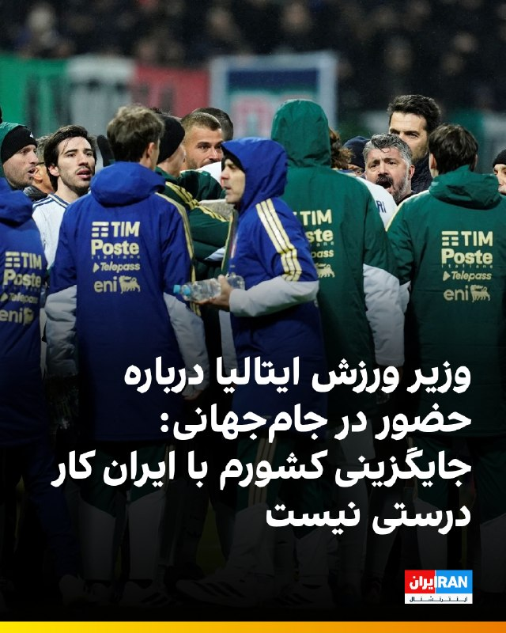
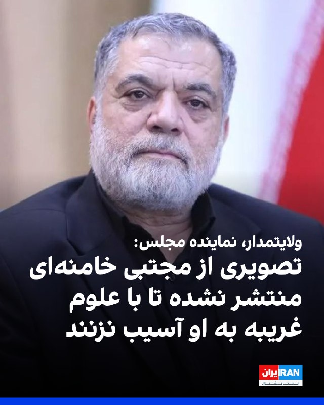
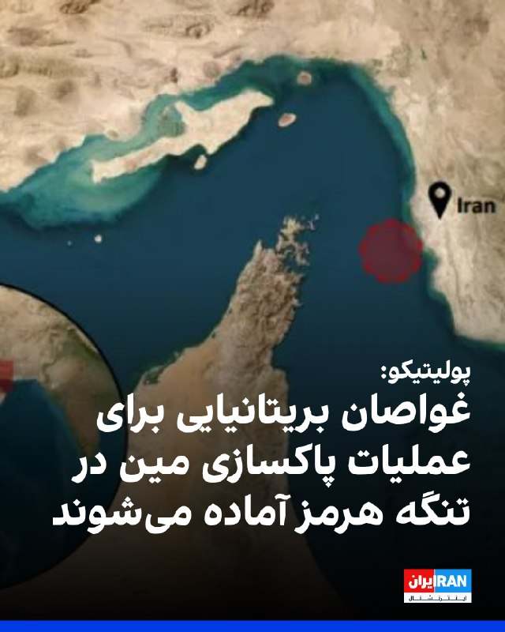
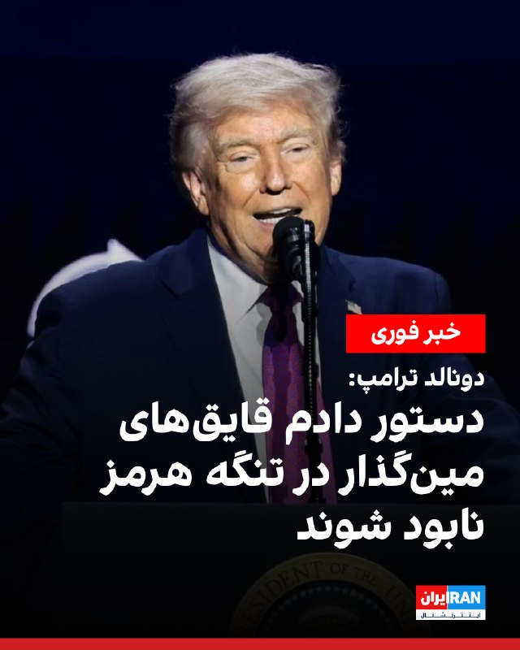
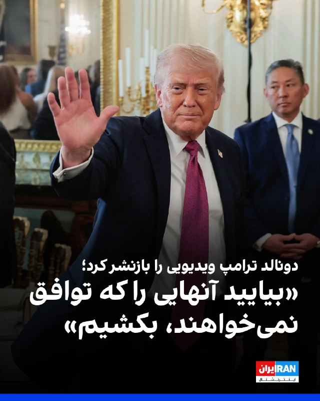
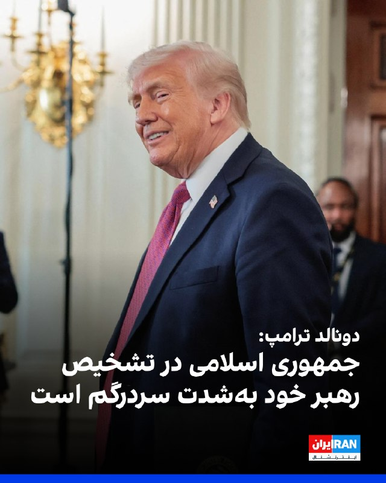
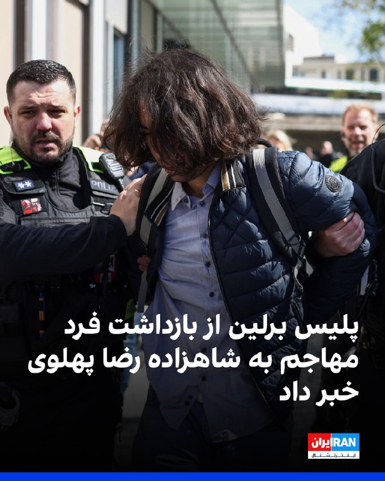

# Channel IranintlTV

## Message 333486

[Video](media/333486_0.mp4)

مخاطبان ایران‌اینترنشنال با ارسال پیام‌هایی، از تشدید بحران معیشتی ابراز نگرانی کردند و گفتند زندگی آن‌ها تحت تاثیر مشکلات اقتصادی، قطعی اینترنت و گرانی کالاها قرار گرفته است.
گفت‌وگو با لیلا سعادتی، عضو تحریریه ایران‌اینترنشنال
@iranintltv

---

## Message 333487

[Video](media/333487_0.mp4)

شاهزاده رضا پهلوی در یک نشست خبری و در پاسخ به احمد صمدی، خبرنگار ایران‌اینترنشال، گفت: «مردم ایران در مذاکرات جاری نماینده‌ای ندارند.» او تاکید کرد با رژیمی که خواسته‌های مردم ایران را نادیده می‌گیرد، نمی‌توان مذاکره و معامله‌ای انجام داد.
@iranintltv

---

## Message 333488

[Video](media/333488_0.mp4)

ویدیوی رسیده به ایران‌اینترنشنال در پنجشنبه سوم اردیبهشت، ساعتی پیش از آغاز سخنرانی شاهزاده رضا پهلوی در برلین را نشان می‌دهد. در این تجمع حامیان پرچم‌های شیروخورشید، اسرائیل و آمریکا را به اهتزاز در آوردند.

---

## Message 333490

[Video](media/333490_0.mp4)

سخنگوی ارتش اسرائیل اعلام کرد «در واکنش به فعالیت‌های تروریستی حزب‌الله»، نیروهای این کشور در طول دوره آتش‌بس موقت به حضور و استقرار خود در جنوب لبنان ادامه خواهند داد.
بابک اسحاقی، خبرنگار ایران‌اینترنشنال، گزارش می‌دهد
@iranintltv

---

## Message 333491

[Video](media/333491_0.mp4)

ایرانیان روز پنجشنبه سوم اردیبهشت در تجمع بزرگ برلین، در آستانه سخنرانی شاهزاده رضا پهلوی شعار «کینگ رضا پهلوی» سر دادند.

---

## Message 333493

[Video](media/333493_0.mp4)

حامیان شاهزاده رضا پهلوی در تجمع بزرگ برلین روز پنجشنبه شعار «جاویدشاه» را همزمان با پخش ترانه‌های ملی فریاد زدند.
@iranintltv

---

## Message 333495

[Video](media/333495_0.mp4)

پس از پایان نشست خبری شاهزاده رضا پهلوی در برلین و هنگام خروج او از ساختمان محل برگزاری، فردی به او نزدیک شد و از پشت سر مایعی قرمزرنگ که گفته شده آب گوجه‌فرنگی بوده، به سوی او پاشید.
جزییات بیشتر با احمد صمدی، خبرنگار ایران‌اینترنشنال
@iranintltv

---

## Message 333499

[Video](media/333499_0.mp4)

یک شهروند با ارسال پیامی به ایران‌اینترنشنال با اشاره به پاشیدن ماده رنگی روی شاهزاده رضا پهلوی در برلین، نسبت به کم  بودن اقدامات حفاظتی برای او انتقاد می‌کند. صدای این شهروند با هوش مصنوعی بازخوانی شده است.

---

## Message 333500

[Video](media/333500_0.mp4)

اپراتورهای تلفن همراه در ایران سرویسی با عنوان «اینترنت پرو» را با هزینه‌ای چندبرابر و دسترسی محدود فقط برای گروهی خاص ارائه کرده‌اند. کاربران رسانه‌های اجتماعی نسبت به دائمی‌شدن الگوی اینترنت طبقاتی ابراز نگرانی کرده‌اند.
عادله بورنگ، عضو تحریریه ایران‌اینترنشنال درباره واکنش کاربران می‌گوید
@iranintltv

---

## Message 333501

[Video](media/333501_0.mp4)

یک مخاطب در واکنش به تعرض صورت‌گرفته به شاهزاده رضا پهلوی با پاشیدن ماده رنگی به او در برلین، گفت که جان شاهزاده «جان میلیون‌ها ایرانی» است و باید حفاظت از او بیشتر شود.

---

## Message 333505

[Video](media/333505_0.mp4)

یک شهروند با ارسال پیامی به ایران‌اینترنشنال خواستار حفاظت بیشتر از شاهزاده رضا پهلوی شد. این پیام پس از پاشیدن ماده رنگی به روی شاهزاده در برلین ارسال شده است. این پیام با هوش مصنوعی خوانده شده است تا امنیت مخاطب حفظ شود.

---

## Message 333489

**Date:** 2026-04-23T12:16:37+00:00

🔻
آندریا آبودی، وزیر ورزش ایتالیا، در گفت‌وگو با اسکای‌نیوز، ایده جایگزینی ایتالیا با ایران در جام‌جهانی را رد کرد.
🔹
او گفت: «بازگشت احتمالی ایتالیا به جام‌جهانی ۲۰۲۶، که بر اساس گزارش‌ها از سوی پائولو زامپولی، فرستاده دونالد ترامپ، به فیفا پیشنهاد شده است، در درجه اول غیرممکن و در درجه دوم نامناسب است. نمی‌دانم کدام‌یک اولویت دارد؛ صعود به جام‌جهانی باید در زمین بازی رقم بخورد.»
🔹
طبق گزارش فایننشال‌تایمز، پائولو زامپولی، نماینده ویژه دونالد ترامپ، در پیشنهادی جنجالی از جیانی اینفانتینو، رییس فیفا، خواسته است تیم ملی ایتالیا را جایگزین ایران در جام‌جهانی ۲۰۲۶ کند.
🔹
زامپولی با اشاره به پیشینه درخشان و چهار قهرمانی لاجوردی‌پوشان، استدلال کرده است که حضور ایتالیا در تورنمنتی که به میزبانی آمریکا برگزار می‌شود، انتخابی توجیه‌پذیر است؛ هرچند طبق قوانین فیفا، در صورت حذف یک تیم آسیایی، اولویت جایگزینی معمولا با تیمی از همان قاره، مانند امارات، خواهد بود.
🔹
جزییات بیشتر را
اینجا
بخوانید
@iranintltvsport

---

## Message 333492

**Date:** 2026-04-23T12:24:55+00:00

سالار ولایتمدار، عضو کمیسیون امنیت ملی مجلس در خصوص مجتبی خامنه‌ای گفت: «بر اساس نظر علمای نجف، قم و مشهد و تصمیم مسئولان امنیتی، فعلا تصاویر و آثار جدیدی از او منتشر نمی‌شود تا دشمنان نتوانند از مسیرهای خاص و علوم غریبه که در دانشگاه‌هایی همچون تل‌آویو مطرح می‌شود، به او آسیب برسانند.»
او در پاسخ به پرسشی درباره وضعیت سلامت مجتبی خامنه‌ای، افزود: «براساس گزارشی که یکی از پاسداران حاضر در محل حادثه به کمیسیون امنیت ملی داد، زمانی که او از زیر آوار بیرون آورده شده، در حال ذکر گفتن و آسیب‌های او سطحی بوده و پزشک معالج نیز اعلام کرده بدنش سالم است و هیچ شکستگی ندارد.»
https://iranintl.com/202604231489

---

## Message 333494

**Date:** 2026-04-23T12:39:24+00:00

🗣
روایت شما از شرایط اقتصادی در آتش‌بس - پنج‌شنبه ۳ اردیبهشت ۱۴۰۵
🔹
از اصفهان پیام میدم: یک بسته نودالیت که قبل از عید قیمتش ۶۵ هزار تومان بود رو دیروز خریدیم ۲۱۰ هزار تومان. راست میگه جمهوری اسلامی ما پیروز شدیم! معلوم نیست نیروهای تعزیرات و بازرسی کجا هستن برای جواب به این همه گرونی.
🔹
مرغ سیمین خریدم از افق کوروش کیلویی ۳۴۰ هزار تومن. چهار تا مرغ کوچیک شد یک میلیون و ۶۶۶ هزار تومان. فقط تو هر بسته یک استکان آب بود، جدا از کلی اشغال که چهار کیلو و ۸۰۰ گرم مرغ رو پاک کردیم ازش سه کیلو دراومد. باقی آب و ضایعات بود.
🔹
وزارت علوم پیشنهاد ۷۵ درصد اضافه حقوق اعضای هیات علمی رو داده برای امسال که سازمان برنامه و بودجه با آن موافقت نکرده. از طرفی کارکنان بخش اداری هم به این پیشنهاد اعضای هیات علمی اعتراض کرده‌اند که چرا شامل حال آن‌ها نمی‌شود.
🔹
دل‌خوشی ما جوونا یه کافه رفتن بود. الان چایی رو میدن ۱۲۰ هزار تومن، قهوه ۲۳۰ هزار تومن به بالا. ما که هیچی نداشتیم، اینم گرفتید ازمون؟
🔹
من همسرم سرطان داره که متاستاز شده. داروی تدروکس رو هر ۲۱ روز باید زد؛ دو دوز اول رو ۶۵ میلیون، دو دوز دوم رو ۹۰ میلیون و دوز پنجم رو ۱۱۴ میلیون تومان خریدم. ظرف سه ماه این همه گرونی رو به چشم دیدم. کارد به استخوانمون رسیده.
🔹
من در شرکت تولید در و پنجره دوجداره کار می‌کنم. فروش تقریبا صفره. اکثر کارخانه‌های تولید پروفیل یو.پی.وی.سی به دلیل نبود مواد اولیه و آسیب صنایع پتروشیمی توان تولید ندارن. بعضی‌هاشون از ترکیه با قیمت بسیار گرون و به صورت محدود مواد اولیه وارد می‌کنن.
🔹
قیمت یه شات قهوه و یه بسته سیگار و یه چایی حدود ۴۰۰ هزار تومن شده، در حالی که حقوق ثابت یه کارمند دولت زیر ۲۰ میلیون تومنه. یه نفر اگر روزی یه قهوه و یه بسته سیگار و یه چایی مصرف کنه میشه ماهی ۱۲ میلیون. عملاً دیگه از مرحله بخور-نمیر هم عبور کردیم.
🔹
من کارمند دولتم، با این همه تورم، فروردین فقط حقوق پایه رو دادن، یعنی کمتر از ۲۰ میلیون تومن. در حالی که بهمن سال پیش حقوقم نزدیک به ۳۰ تومن بود، اما الان هیچ مزایا و رفاهیاتی بهمون ندادن. اینقدر خزانه‌شون خالیه حتی حقوق کارمندشونم دیگه نمی‌تونن بدن.
🔹
یادمه سال ۹۱ بابام پراید رو خرید ۹۸۰۰، همین دیروز ۵۸۰۰ دادم فقط برای ۱۰ گیگ اینترنت.

---

## Message 333497

**Date:** 2026-04-23T12:51:24+00:00

پولیتیکو در گزارشی نوشت که غواصان بریتانیایی برای عملیات پاکسازی مین در تنگه هرمز آماده می‌شوند.
بر اساس این گزارش، این اقدام به‌عنوان گامی مقدماتی در دومین روز گفت‌وگوهایی انجام می‌شود که به میزبانی لندن برای بازگشایی این تنگه برگزار شده است.
https://iranintl.com/202604233830

---

## Message 333498

**Date:** 2026-04-23T12:56:47+00:00

دونالد ترامپ، رییس‌جمهوری ایالات متحده در تروث سوشال نوشت: «دستور داده‌ام نیروی دریایی هر قایقی را که در آب‌های تنگه هرمز مین‌گذاری می‌کند، هدف قرار دهد و نابود کند و نباید در این کار تردیدی به خود راه دهند.»
او افزود: «مین‌روب‌های آمریکا در حال پاکسازی تنگه هرمز از مین‌ها هستند و این فعالیت در سطحی سه برابری ادامه خواهد یافت.»
https://iranintl.com/202604236110

---

## Message 333502

**Date:** 2026-04-23T13:24:32+00:00

دونالد ترامپ ویدیویی را در شبکه تروت سوشال منتشر کرد که در آن یکی از تحلیلگران شبکه فاکس‌نیوز درباره اختلاف‌نظر در حکومت ایران اظهارنظر می‌کند. همراه این ویدیو، اظهارات این تحلیلگر نوشته شده است که می‌گوید: «اگر در ایران دو جناح وجود دارد، یکی که خواهان توافق است و دیگری که نیست، بیایید آنهایی را که توافق نمی‌خواهند بکشیم.»
https://iranintl.com/202604239822

---

## Message 333503

**Date:** 2026-04-23T13:35:13+00:00

🗣
روایت شما از زندگی در آتش‌بس- پنج‌شنبه ۳ اردیبهشت ۱۴۰۵
🔹
هموطنان خارج از کشور؛ ما که دسترسی به ترامپ نداریم، لطفا شما در تجمعاتتون به ترامپ بگید برای جمهوری اسلامی فقط یک شرط بذاره برای پایان جنگ: برگزاری رفراندوم برای مردم.
🔹
آقای ترامپ کدوم تغییر رژیم؟ شما می‌دونین اینا تو شهر چیکار می‌کنن؟ اگر بمونن مردم ایران نابود می‌شن. به فکر مردم باشین که با جنگ فقط شرایط مردم سخت‌تر شده و چیزی تغییر نکرده.
🔹
درود بیکران به ملت شریف ایران، شرایط بسیار سخت و پرتنش و استرسیه، به نظرم شاهزاده باید هرچه سریع‌تر فراخوان نهایی رو صادر کنن. این نوع زندگی از مرگ بدتره، یا مرگ یا آزادی.
🔹
یادتون باشه ترامپ و بی‌بی اولویتشون کشور خودشونه، همون‌طور که باید باشه. ایران رو ایرانی‌ها آزاد می‌کنن، امیدتون رو از دست ندین.
🔹
ما قبل جنگ حداقل می‌تونستیم چند تا قلم جنس رو تهیه کنیم، الان همونم نمی‌تونیم از بس گرون شده. کاش یکی به داد ما مردم مظلوم ایران برسه.
🔹
برای فروپاشی جمهوری اسلامی باید این بها رو بدیم که همه بیکار بشیم تا اقتصاد فروبپاشه. ما مردم ایران فقط و فقط خواستار رفتن این رژیم و رسیدن به حکومت سکولار و دموکرات، با رهبری شاهزاده رضا پهلوی هستیم. این شرایط جزوی از مسیرمونه.
🔹
می‌دونم شرایط سخته، قبل از جنگم سخت بود. برای شکست رژیم حاضریم چقدر سختی بکشیم؟ خواهش می‌کنم انقدر گله و شکایت نکنید، تحمل کنید. می‌تونیم یه سال سختی رو تحمل کنیم و تو فشار باشیم. برای مبارزه با قاتلان باید بهاشو بدیم، اما بعدش آزادی ایران عزیزمونه.
🔹
جمهوری اسلامی اگه توافق هم بکنه مجبوره یه چیزایی رو بده که باعث میشه طرفدارهاش کم بشه، پس از توافق هم نترسید، طرفدارهاش که کم بشه راحت‌تر میشه انقلاب کرد.
🔹
ما مذاکره و توافق نمی‌خوایم، خسته شدیم از ظلم. لطفا با جمهوری اسلامی صلح نکنید، نابودش کنید آقای ترامپ.
🔹
بعد از نهایی شدن توافق ترامپ با شیاطین تهران، مردم ایران باید بین ماندن جمهوری اسلامی برای دهه‌های طولانی و ساخت آینده‌ای روشن در سایه یک حکومت ملی و دموکراتیک با یک رفراندوم آزاد، فورا خیابان را تسخیر کنند.

---

## Message 333504

**Date:** 2026-04-23T13:38:01+00:00

دونالد ترامپ، رییس‌جمهوری آمریکا، در تروث سوشال نوشت که جمهوری اسلامی در تشخیص اینکه چه کسی رهبری آن را بر عهده دارد، دچار سردرگمی شده و درگیری بین دو دسته «تندروهای شکست‌خورده در میدان نبرد» با «میانه‌روهای نه‌چندان میانه‎رو» به شدت بالا گرفته است.
ترامپ در این پست نوشت: «ایران در حال حاضر با دشواری زیادی در تشخیص این‌که رهبرش چه کسی است، مواجه است؛ آن‌ها واقعا نمی‌دانند! درگیری‌های داخلی میان «تندروها» که در میدان نبرد به‌شدت در حال شکست خوردن هستند، و «میانه‌روها» که چندان هم میانه‌رو نیستند (اما در حال کسب احترام هستند)، به‌شدت بالا گرفته است.»
ترامپ در این پست بار دیگر بر بسته‌بودن تنگه هرمز تا زمان رسیدن به توافق با جمهوری اسلامی تاکید کرد: «ما کنترل کامل بر تنگه هرمز داریم. هیچ کشتی بدون تایید نیروی دریایی ایالات متحده نمی‌تواند وارد یا خارج شود. این تنگه «به‌طور کامل بسته شده است» تا زمانی که ایران قادر به دستیابی به یک توافق شود.»
https://iranintl.com/202604238237

---

## Message 333506

**Date:** 2026-04-23T13:54:22+00:00

پلیس برلین در واکنش به تعرض به شاهزاده رضا پهلوی با پاشیدن ماده قرمزرنگ به روی او، اعلام کرد فردی که در مقابل نشست مطبوعاتی فدرال بازداشت شد، در حال حاضر برای انجام مراحل اداری و شناسایی در بازداشت پلیس به سر می‌برد.
در بیانیه پلیس آمده است که این فرد نه کارت شناسایی خبرنگاری داشت و نه مجوز رسانه‌ای همراهش بود و پیش از این نیز توجه پلیس را جلب نکرده بود.
پلیس برلین اعلام کرد تحقیقات علیه این فرد به اتهام «ایراد صدمه بدنی، تخریب اموال و توهین به افراد در عرصه سیاسی» آغاز می‌شود. همچنین امکان ادامه بازداشت او برای امروز در حال بررسی است.
در این بیانیه تاکید شده است که نیروهای عملیاتی در حالت آماده‌باش قرار گرفته‌اند و تدابیر امنیتی برای مهمان بار دیگر تنظیم شده است.
https://iranintl.com/202604236739

---
