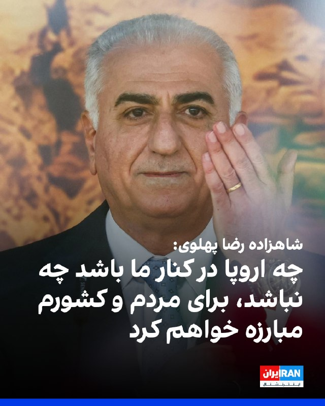
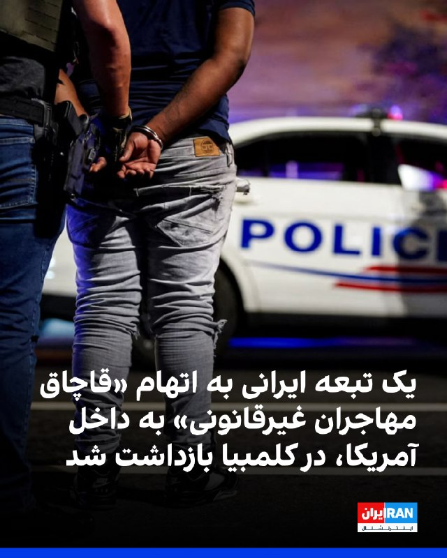
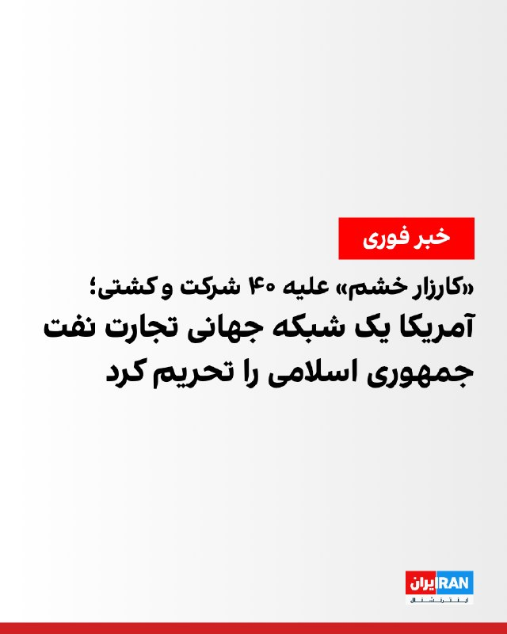
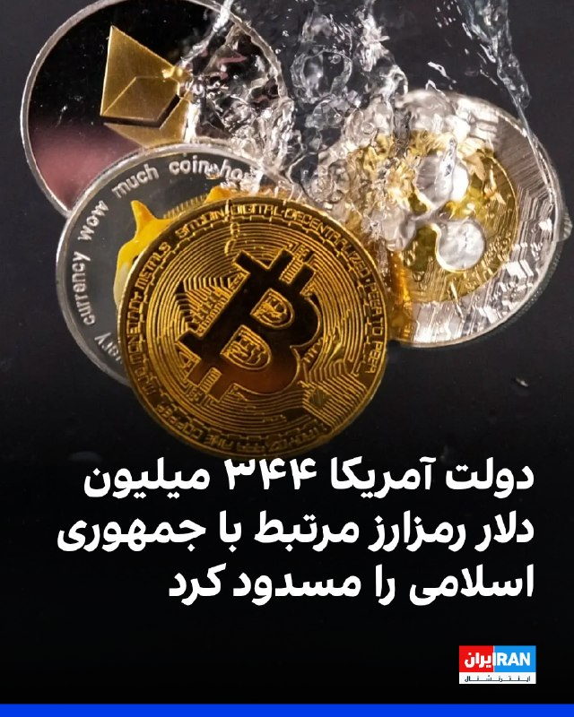
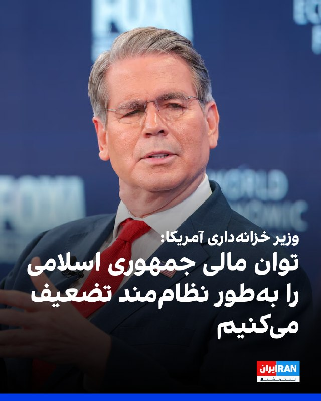
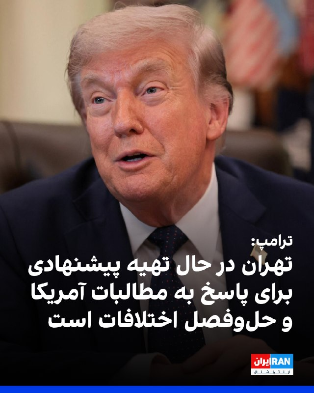
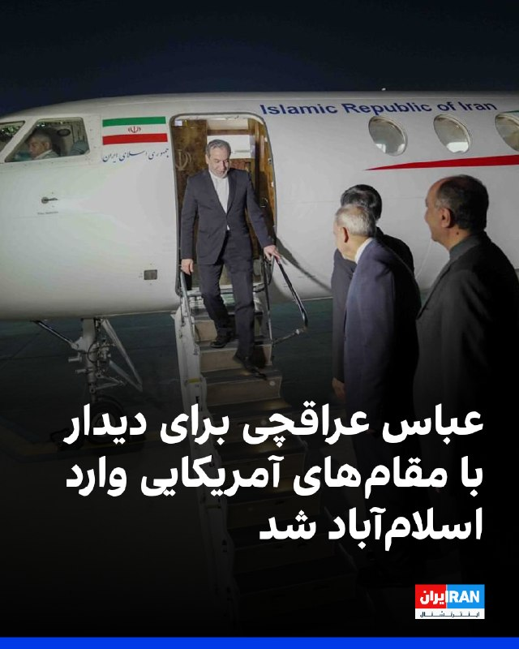
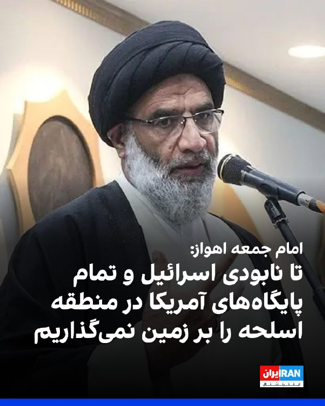
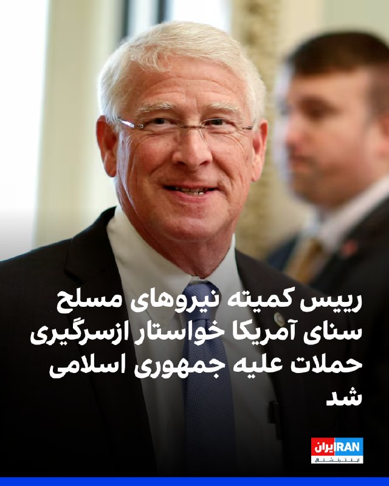

# Channel IranintlTV

## Message 333720

[Video](media/333720_0.mp4)

۲۴ با فرداد فرحزاد
@iranintltv

---

## Message 333721

[Video](media/333721_0.mp4)

۲۴ با فرداد فرحزاد
@iranintltv

---

## Message 333726

در اقتصاد به وضعیتی که بازار سرمایه‌ی ایران در آن گیر کرده، «عدم قطعیت نایتی» گفته می‌شود. در عدم قطعیت فرانک نایت، شرایط طوری است که احتمال رخدادها قابل محاسبه نیست و مدل‌های متعارف مدیریت ریسک از کار می‌افتند.
سرمایه‌گذار ایرانی ماه‌هاست در چنین فضایی تصمیم می‌گیرد: آینده‌ی تنش نظامی نامشخص، مسیر مذاکره مبهم، سیاست ارزی دولت متغیر از ماهی به ماه دیگر، و میزان دقیق خسارت وارد بر شرکت‌های بورسی از سهامدارانشان پنهان است.
تماشای نسخه کامل «چرتکه» در یوتیوب:
https://youtu.be/c_GC6uBjudc
@iranintltv

---

## Message 333727

[Video](media/333727_0.mp4)

یک شهروند با ارسال پیامی به ایران اینترنشنال با اشاره به وضعیت بد مراکز تولید و کسب و کار می‌گوید دو شهرک صنعتی در قزوین هم در حال تعدیل نیروهای خود هستند.

---

## Message 333735

[Video](media/333735_0.mp4)

یک شهروند با ارسال پیامی به ایران اینترنشنال از بحران کمبود کیسه پلاستیکی در فروشگاه‌ها خبر داده و می‌گوید برخی فروشندگان به خریداران بیش از یک پلاستیک نمی‌دهند.
@iranintltv

---

## Message 333736

[Video](media/333736_0.mp4)

کارولین لیویت، سخنگوی کاخ سفید، گفت: «واقعیت این است که ایرانی‌ها تمایل دارند به‌صورت حضوری گفت‌وگو کنند و رییس‌جمهوری هم همواره آماده است به دیپلماسی فرصت بدهد.»
او افزود: «استیو ویتکاف و جرد کوشنر برای شنیدن دیدگاه‌های طرف ایرانی عازم پاکستان می‌شوند و امیدواریم این نشست به پیشرفت‌هایی منجر شود.»
@iranintltv

---

## Message 333717

**Date:** 2026-04-24T18:24:23+00:00

شاهزاده رضا پهلوی در پیامی ویدیویی خطاب به مردم اروپا گفت: «چه اروپا در کنار ما باشد، چه نباشد، چه روزنامه‌نگاران شما کار خود را انجام دهند، یا ندهند، چه سیاستمداران شما شجاعت اقدام داشته باشند یا نه، من برای مردم و کشورم مبارزه خواهم کرد.»
شاهزاده رضا پهلوی گفت: «حتی اگر مجبور باشیم این کار را به‌تنهایی انجام دهیم، تا زمانی که ایران آزاد شود، مبارزه خواهیم کرد.»
https://iranintl.com/202604248634

---

## Message 333718

**Date:** 2026-04-24T18:33:21+00:00

نخست‌وزیر بریتانیا از تلاش برای اقدام قانونی علیه سپاه پاسداران خبر داد
کی‌یر استارمر، نخست‌وزیر بریتانیا، اعلام کرد دولت او در نشست آینده پارلمان که چند هفته دیگر آغاز می‌شود، لایحه‌ای را برای قرار دادن سپاه پاسداران در فهرست سازمان‌های ممنوعه ارائه خواهد کرد.
استارمر جمعه چهارم اردیبهشت در جریان بازدید از یک کنیسه که هدف حمله قرار گرفته بود به نشریه جوییش کرونیکل گفت «بسیار نگران» افزایش استفاده از نیروهای نیابتی از سوی حکومت ایران است.
او تاکید کرد لایحه مربوط به ممنوع اعلام کردن سپاه پاسداران در «چند هفته آینده» و همزمان با آغاز نشست جدید پارلمان در ژوئیه ارائه خواهد شد.
نخست‌وزیر بریتانیا، در پاسخ به سوالی درباره وعده حزب کارگر برای قرار دادن سپاه پاسداران در فهرست سازمان‌های ممنوعه گفت برای مقابله با «عوامل مخرب دولتی» به قانون‌گذاری کلی نیاز است و دولت در حال پیشبرد این قانون با سرعت است.
او افزود: «چند هفته دیگر وارد نشست جدید پارلمان می‌شویم و آن لایحه را ارائه خواهیم کرد.»
محاکمه در لندن
همزمان با این اظهارات دو مرد به اتهام جاسوسی برای جمهوری اسلامی و جمع‌آوری اطلاعات درباره اماکن یهودی و اسرائیلی در لندن، در دادگاه کیفری مرکزی انگلستان، موسوم به اولد بیلی، محاکمه خواهند شد.
جلسه محاکمه مقدماتی این دو نفر که جمعه چهارم اردیبهشت به ریاست قاضی چیما گراب برگزار می‌شود، به بررسی ماهیت پرونده نمی‌پردازد و دادگاه در این مرحله درباره مجرم بودن یا بی‌گناهی متهمان، تصمیمی اتخاذ نخواهد کرد.
دادگاه مقدماتی بر امور اجرایی پرونده متمرکز خواهد بود؛ از جمله چگونگی پیشبرد روند دادرسی، نحوه ارائه مدارک و تعیین زمان‌بندی جلسات آینده.
چیما گراب پیش‌تر قضاوت پرونده دانیل خلیفه، سرباز پیشین ارتش بریتانیا، را که به جاسوسی برای جمهوری اسلامی متهم شده بود، بر عهده داشت.
خلیفه، بهمن ۱۴۰۳ به‌دلیل «نقض قانون اسرار رسمی، نقض قانون تروریسم و فرار از زندان»، در مجموع به ۱۴ سال و سه ماه حبس محکوم شد.
در سال‌های اخیر، افزایش تهدیدات جمهوری اسلامی در اروپا، به‌ویژه در بریتانیا، به نگرانی‌ها درباره گسترش دامنه نفوذ حکومت ایران دامن زده است.
شبکه ال‌بی‌سی، جمعه چهارم اردیبهشت گزارش داد روند به‌کارگیری شهروندان بریتانیایی از سوی عوامل حکومت ایران برای انجام عملیات خرابکارانه «با شتابی قابل‌ توجه» در جریان است.
پیش‌تر در ۹ فروردین، روزنامه تلگراف نوشت پرس‌تی‌وی، شبکه خبری انگلیسی‌زبان صداوسیمای جمهوری اسلامی، از دفتر خود در لندن به‌عنوان پوششی برای جذب مهره استفاده می‌کند.
🔗
وب‌سایت ایران‌اینترنشنال
@iranintltv

---

## Message 333719

**Date:** 2026-04-24T18:34:37+00:00

وزارت دادگستری ایالات متحده اعلام کرد که یک تبعه ایرانی به اتهام «قاچاق مهاجران غیرقانونی» به داخل آمریکا تحت پیگرد قرار گرفته است. این فرد با همکاری نهادهای تحقیقاتی در کلمبیا بازداشت شده و قرار است برای رسیدگی قضایی به ایالات متحده منتقل شود.
در بیانیه این وزارتخانه آمده است: «تامین امنیت مرزها و مقابله با قاچاق مهاجران از اولویت‌های اصلی وزارت دادگستری است.»
تاد بلانش، سرپرست دادستان کل، گفته است که این متهم ظاهرا تعداد زیادی مهاجر غیرقانونی را به ایالات متحده منتقل کرده و با سوءاستفاده از قوانین مهاجرتی، مانع از بررسی و ارزیابی دقیق افراد ورودی شده است.
https://iranintl.com/202604245890

---

## Message 333722

**Date:** 2026-04-24T18:50:01+00:00

🎧
نسخه صوتی حرف آخر با پوریا زراعتی - ۴۸ ساعت حیاتی: مذاکره یا حذف مجتبی
@iranintlTV

---

## Message 333723

**Date:** 2026-04-24T18:51:58+00:00

دومین سفر زلنسکی به عربستان سعودی در یک ماه اخیر؛ دیپلماسی فروش سامانه‌های ضدپهپادی
حضور پیاپی رییس‌جمهوری اوکراین در خاک عربستان، نشان‌دهنده چرخش معنادار دیپلماسی کی‌یف به سمت خلیج فارس و تبدیل شدن اوکراین از یک کشور درگیر جنگ، به یک صادرکننده کلیدی تخصص‌های نظامی و امنیتی است.
ولودیمیر زلنسکی، رییس‌جمهوری اوکراین، چهارشنبه چهارم اردیبهشت، در سفری استراتژیک وارد جده شد تا برای دومین بار در یک ماه گذشته با مقام‌های عالی‌رتبه عربستان سعودی، از جمله محمد بن سلمان، ولیعهد این کشور، دیدار کند.
مقابله با تهدیدات پهپادی در آسمان عربستان
این سفر در شرایطی انجام می‌شود که امنیت عربستان سعودی در جنگ اخیر با جمهوری اسلامی، به‌شدت تحت تاثیر حملات موشکی و پهپادی بوده است.
طبق آمارهای رسمی و تجمیع داده‌های وزارت دفاع عربستان، این کشور در جریان جنگ اخیر، بیش از ۱۰۰۰ بار هدف حملات موشکی و پهپادی جمهوری اسلامی و متحدان شبه‌نظامی‌اش قرار گرفته است.
گزارش‌ها حاکی است که تنها تا ۲۰ فروردین‌ماه، دست‌کم ۱۰۴ موشک بالستیک و ۹۱۶ پهپاد انتحاری در آسمان عربستان رهگیری و منهدم شده‌اند.
این حجم از تهدیدات، نیاز ریاض به فناوری‌های نوین و امتحان‌پس‌داده سامانه‌های ضدپهپادی را بیش از پیش برجسته کرده است.
استقرار سامانه «اسکای مپ» در پایگاه پرنس سلطان
خبرگزاری رویترز، چهارشنبه دوم اردیبهشت، در گزارشی اختصاصی به استفاده ارتش آمریکا از فناوری‌های ضدپهپادی اوکراین برای مقابله با حملات جمهوری اسلامی به خاک عربستان سعودی پرداخت.
طبق گفته پنج منبع آگاه به رویترز، ارتش ایالات متحده در هفته‌های گذشته سامانه فرماندهی و کنترل اوکراینی موسوم به «اسکای مپ» (Sky Map) را در پایگاه هوایی استراتژیک «پرنس سلطان» مستقر کرده است.
این سامانه که به‌طور ویژه از سوی مهندسان اوکراینی برای شناسایی و رهگیری پهپادهای شاهد طراحی شده، پس از آن به خدمت گرفته شد که حملات پهپادی پیشین به این پایگاه، منجر به تخریب ساختمان‌ها، انهدام هواپیماها و کشته شدن دست‌کم یک نیروی نظامی شد.
استقرار این سامانه در پایگاهی که تنها ۶۴۰ کیلومتر با ایران فاصله دارد، از دید تحلیل‌گران به معنای اعتراف ضمنی به نقاط ضعف پدافند هوایی سنتی آمریکا و کارآمدی فناوری‌های ضدپهپادی اوکراین است.
زلنسکی در بدو ورود به جده با انتشار پیامی تاکید کرد که پس از کسب تضمین‌های مالی از رهبران اروپا، اکنون اولویت او پیشبرد توافقات امنیتی، انرژی و زیرساختی با ریاض است.
او پیش‌تر گفته بود که کارشناسان نظامی اوکراینی در جریان جنگ در چندین کشور خاورمیانه مستقر شده و با استفاده از سامانه‌های پدافندی، پهپادهای ساخت ایران را با موفقیت سرنگون کرده‌اند.
حضور مجدد زلنسکی در جده نشان‌دهنده شکل‌گیری یک بلوک امنیتی جدید است که در آن تخصص میدانی اوکراین با نیازهای دفاعی کشورهای خلیج فارس پیوند می‌خورد.
اوکراین اکنون نه تنها به دنبال جلب حمایت سیاسی و مالی ریاض، بلکه به دنبال بازاریابی برای فناوری‌های «بسیار پیشرفته» خود است.
🔗
وب‌سایت ایران‌اینترنشنال
@iranintltv

---

## Message 333724

**Date:** 2026-04-24T18:52:11+00:00

وزارت خزانه‌داری آمریکا در دور تازه‌ای از تحریم‌ها علیه جمهوری اسلامی، حدود ۲۰ شرکت و ۱۹ کشتی را که بخشی از ناوگان موسوم به «سایه» هستند، به فهرست تحریم‌ها اضافه کرد.
در این بسته تحریمی، شرکت پالایشگاهی مستقل هنگلی پتروکمیکال (دالیان) در چین به‌دلیل خرید گسترده نفت ایران تحریم شده است. به گفته مقام‌های آمریکایی، این شرکت یکی از مشتریان اصلی نفت ایران بوده است.
شرکت‌ها و نهادهای تحریم‌شده در کشورها و حوزه‌های قضایی مختلف، از جمله چین، هنگ‌کنگ، امارات متحده عربی، جزایر مارشال، پاناما، لیبریا، جزایر کیمن، ویتنام و جزایر ویرجین بریتانیا، ثبت یا مستقر هستند.
به گفته وزارت خزانه‌داری آمریکا، این اقدام در چارچوب کارزار موسوم به «خشم اقتصادی» و با هدف محدود کردن توان ایران برای کسب درآمد و تامین مالی فعالیت‌های منطقه‌ای انجام شده است.
وزارت خزانه‌داری آمریکا همچنین اعلام کرد مجوز عمومی‌ صادر کرده است که بر اساس آن شرکت‌ها می‌توانند تا ماه آینده برخی معاملات مرتبط با پالایشگاه هنگلی و شرکت‌های وابسته به آن را صرفا برای پایان دادن به همکاری‌ها جمع‌بندی کنند.
https://iranintl.com/202604240433

---

## Message 333725

**Date:** 2026-04-24T18:52:59+00:00

🗣
روایت شما از شرایط اقتصادی در آتش‌بس - جمعه ۴ اردیبهشت:
🔹
من در بیمارستانی در تهران کار می‌کنم. در این اوضاع بد اقتصادی و گرانی، فقط نیمی از حقوق فروردین را پرداخت کرده‌اند.
🔹
برای دسترسی به اینترنت، برای هر گیگ یک میلیون تومان هزینه کردم.
🔹
اینجا واقعا شرایط سخت است، از وضعیت اقتصادی گرفته تا تحمل تجمعات شبانه نیروهای حکومتی؛ اما امید به آزادی هنوز زنده است.
🔹
شرایط خیلی سخت شده، قیمت مواد خوراکی سر به فلک کشیده و هر روز هم گران‌تر می‌شود.
🔹
ما کارمندان جهاد کشاورزی و شرکت‌های تابعه کمترین حقوق را در بین وزارتخانه‌های ایران می‌گیریم.قرار بود آیتمی به‌نام امنیت غذایی به حقوق کارمندان اضافه شود که نشده است، با این گرانی و حقوق کم، زندگی سخت می‌گذرد.
🔹
اوضاع اقتصادی خیلی بد است و خیلی‌ها بیکار شده‌اند و درآمدی ندارند، این وسط مزاحمت شبانه خیابانی نیروهای حکومتی هم آسایش و خواب را از ما گرفته.
🔹
چنان قیمت اجناس گران شده که وحشتناک است؛ یک بطری روغن ۱۳۵۰ گرمی ۵۵۰ هزار تومان!
🔹
من مغازه لوازم خانگی دارم. الان قیمت ماشین لباسشویی شده ۱۰۰ میلیون؛ یخچال قیمت ۳۰۰ میلیون؛ هیچ تقاضایی برای جهیزیه عروس نداریم.

---

## Message 333728

**Date:** 2026-04-24T19:06:18+00:00

وزارت خزانه‌داری آمریکا اعلام کرد چندین کیف پول دیجیتال مرتبط با جمهوری اسلامی را در چارچوب تشدید فشارهای مالی تحریم کرده است؛ اقدامی که به مسدود شدن ۳۴۴ میلیون دلار رمزارز انجامیده است.
شرکت تتر، فعال در حوزه ارز دیجیتال که تراکنش‌های رمزارزی را در سراسر جهان تسهیل می‌کند، روز پنج‌شنبه اعلام کرد در مسدودسازی ۳۴۴ میلیون دلار رمزارز در دو آدرس دیجیتال با دولت آمریکا همکاری کرده است. این شرکت گفت این اقدام پس از دریافت اطلاعات از «چند نهاد آمریکایی درباره فعالیت‌های مرتبط با رفتار غیرقانونی» انجام شده است.
یک مقام آمریکایی به سی‌ان‌ان گفت دولت اطلاعاتی در اختیار دارد که این رمزارز را به ایران مرتبط می‌کند. او افزود دولت آمریکا با همکاری کارشناسان تحلیل بلاک‌چین شواهدی از ارتباط با حکومت ایران مشاهده کرده است؛ از جمله تراکنش‌های تاییدشده با صرافی‌های ایرانی و مجموعه‌ای از تراکنش‌ها که از طریق آدرس‌های واسطه‌ای انجام شده و با کیف پول‌های مرتبط با بانک مرکزی ایران در تعامل بوده‌اند.
https://iranintl.com/202604245160

---

## Message 333729

**Date:** 2026-04-24T19:13:06+00:00

اسکات بسنت، وزیر خزانه‌داری آمریکا، با اشاره به تحریم‌های جدید این کشور علیه جمهوری اسلامی اعلام کرد واشینگتن در چارچوب کارزار موسوم به «خشم اقتصادی» به‌طور نظام‌مند توان تهران برای تولید، جابه‌جایی و بازگرداندن منابع مالی را تضعیف خواهد کرد.
او گفت دفتر کنترل دارایی‌های خارجی وزارت خزانه‌داری چندین کیف پول دیجیتال مرتبط با جمهوری اسلامی را تحریم کرده است؛ اقدامی که به مسدود شدن ۳۴۴ میلیون دلار رمزارز انجامیده است.
بسنت افزود: «ما جریان پولی را که تهران با ناامیدی تلاش می‌کند از کشور خارج کند دنبال خواهیم کرد و تمامی شریان‌های مالی مرتبط با حکومت را هدف قرار می‌دهیم.»
به گفته مقام‌های آمریکایی، این اقدام بخشی از سیاست فشار اقتصادی برای محدود کردن منابع مالی جمهوری اسلامی است.
https://iranintl.com/202604246730

---

## Message 333730

**Date:** 2026-04-24T19:13:52+00:00

دونالد ترامپ، رییس‌جمهوری آمریکا، در گفت‌وگو با رویترز اعلام کرد: «جمهوری اسلامی خواهان گفت‌وگو است و قصد دارد بررسی کند آیا امکان دستیابی به توافق وجود دارد یا خیر. تهران در حال تهیه پیشنهادی است که هدف آن پاسخ به مطالبات ایالات متحده و حل‌وفصل اختلافات است.»
رییس‌جمهوری آمریکا گفت: «مقام‌های آمریکایی که در حال مذاکره با جمهوری اسلامی هستند، با افرادی گفت‌وگو می‌کنند که در حال حاضر مسئول تصمیم‌گیری در ایران هستند.»
https://iranintl.com/202604248027

---

## Message 333731

**Date:** 2026-04-24T19:28:07+00:00

عباس عراقچی، وزیر خارجه جمهوری اسلامی، شامگاه جمعه برای از سرگیری مذاکرات با آمریکا وارد اسلام‌آباد شد. او در بدو ورود از سوی وزیر خارجه و فرمانده ارتش پاکستان مورد استقبال قرار گرفت.
سخنگوی کاخ سفید اعلام کرد جمهوری اسلامی در تماسی خواستار گفت‌وگوی حضوری شده است و استیو ویتکاف و جرد کوشنر صبح شنبه برای «شنیدن دیدگاه‌های آنها» عازم پاکستان می‌شوند.
نیویورک‌تایمز به نقل از دو مقام جمهوری اسلامی گزارش داد عباس عراقچی با پاسخ مکتوب به پیشنهاد آمریکا برای توافق صلح به پاکستان سفر کرده و قرار است در دیدار با مقام‌های آمریکایی درباره ادامه مذاکرات گفت‌وگو کند.
خبرگزاری تسنیم، وابسته به سپاه پاسداران، با رد این گزارش‌ها، تاکید کرد که سفر عراقچی برای مذاکره با آمریکایی‌ها نیست بلکه او با طرف پاکستانی درباره ملاحظات جمهوری اسلامی درباره پایان جنگ گفت‌وگو خواهد کرد.
ایران‌اینترنشنال پیش‌تر گزارش داده بود عباس عراقچی با هیاتی کوچک وارد اسلام‌آباد خواهد شد. به گفته منبعی که با ایران‌اینترنشنال گفت‌وگو کرده، تیم پشتیبانی لجستیکی و امنیتی آمریکا نیز برای شرکت در مذاکرات در اسلام‌آباد حضور دارد.
https://iranintl.com/20

---

## Message 333732

**Date:** 2026-04-24T19:33:08+00:00

محمدنبی موسوی‎‌فرد، امام جمعه اهواز، گفت: «تا زمانی که آمریکا در منطقه است و نگاه چپ به انقلاب ما کرده، سلاح بر دست یک پیام می‌دهیم که هم‌دوش با حزب‌الله و غزه و یمن و عراق، تا وقتی پایگاه‌های آمریکا و اسرائیل را محو و نابود نکنیم، سلاح بر زمین نخواهیم گذاشت.»
https://iranintl.com/202604241026

---

## Message 333733

**Date:** 2026-04-24T19:37:46+00:00

🗣
روایت شما از شرایط اقتصادی در آتش‌بس - جمعه ۴ اردیبهشت:
🔹
با این اقتصاد و گرونی و قسط و وام‌های عقب‌افتاده فقط داریم صبح رو شب و شب رو صبح می‌کنیم، خسته شدیم.
🔹
همه‌چی گرون شده، مخصوصا دارو. ولی مشکل بزرگ‌تر اینه که خیلی از داروها نایاب شده.
🔹
من در یکی از بیمارستان‌های شهرکرد پرستار هستم، حقوق فروردین ماه رو پرداخت نکردن و جوابگو هم نیستن، در این شرایط گرونی بیش از حد فقط امیدواریم هر چه زودتر این وضعیت تموم بشه.
🔹
حقوق کارمندان و نیروهای علوم‌پزشکی رو واریز نکردن، فقط دو هفته پیش مبلغ ۴/۵ میلیون بن خرید واریز کردن که همونم درستش ۱۰ میلیون بود.
🔹
من یه مهندس کامپیوترم. ماه فروردین نصف حقوق دادن بهمون. اعتراض هم که می‌کنیم می‌گن همینه و نداریم، حق ما رو می‌خورن، کسی هم نیست حمایت کنه، کار نیست، کلی قسط و قرض دارم و از همه خجالت می‌کشم.
🔹
پنج روز از ماه گذشته هنوز وزارت بهداشت نتوانسته حقوق ۱۵ میلیونی ما را بده.
🔹
قرص پلاویکس که پرمصرف‌ترین داروی بیماران قلبی است قبلا ۳۰۰ هزار تومان بود اما الان پیدا نمی‌شه و اگر هم پیدا بشه قیمتش به یک میلیون و چهارصد هزار تومان رسیده. خسته و عصبانی‌ام.
🔹
با این‌که فشار اقتصادی زیادی بهمون وارد می‌شه اما حتی فکر یک لحظه بدون وجود جمهوری اسلامی، باعث می‌شه فکر کنم ارزش چنین سختی‌هایی را داره.

---

## Message 333734

**Date:** 2026-04-24T19:45:56+00:00

راجر ویکر، رییس کمیته نیروهای مسلح سنای آمریکا، روز جمعه با انتشار بیانیه‌ای از دونالد ترامپ، رییس‌جمهوری آمریکا، خواست حملات تهاجمی علیه ایران را از سر بگیرد. او گفت: «زمان مذاکره با حکومت ایران به پایان رسیده است.»
این سناتور جمهوری‌خواه ایالت میسیسیپی افزود: «جانشینان تندروی خامنه‌ای هرگز قابل اعتماد نیستند که به هیچ وعده یا توافقی پایبند بمانند.» ویکر ادامه داد: «فرمانده کل قوای ما باید به رهبران نظامی کارآزموده خود دستور دهد توانمندی‌های نظامی متعارف ایران را به‌طور کامل نابود کنند و هر آنچه از برنامه هسته‌ای آنها باقی مانده است از میان ببرند.»
او تاکید کرد چنین اقدامی را تنها راه تضمین ثبات پایدار در منطقه می‌داند.
https://iranintl.com/202604248817

---
