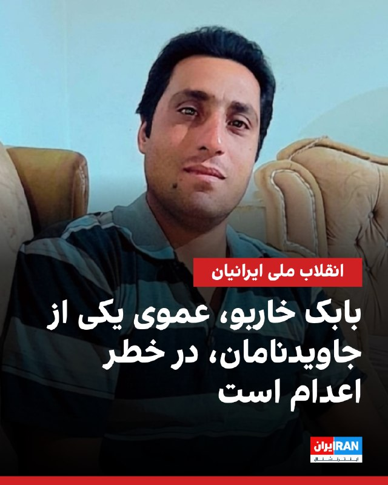
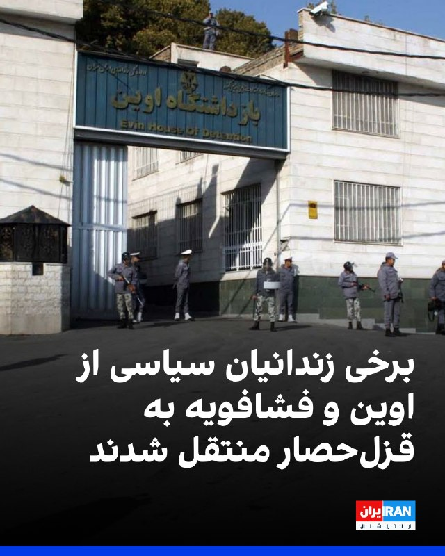
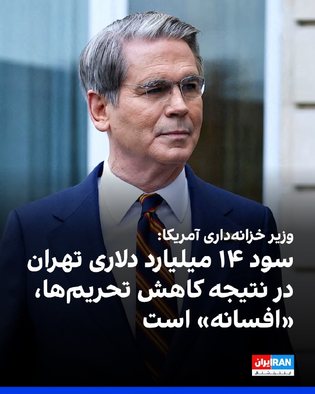
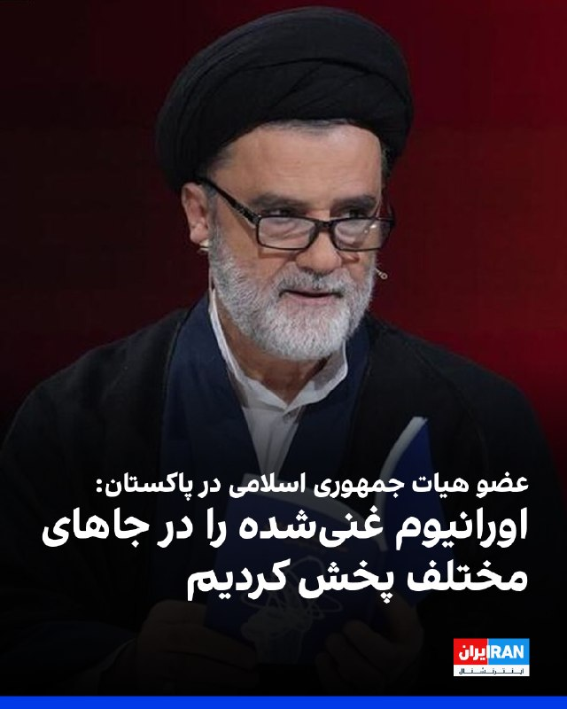
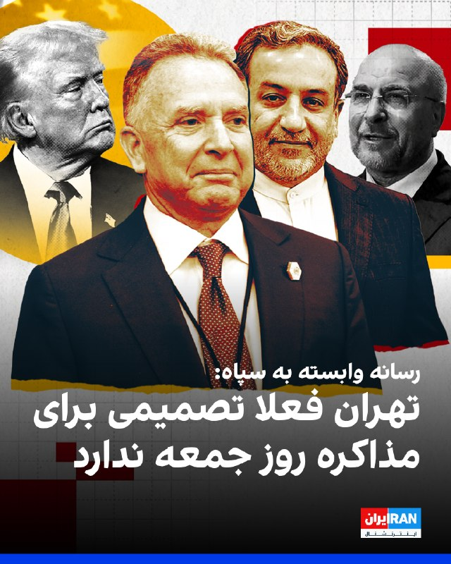
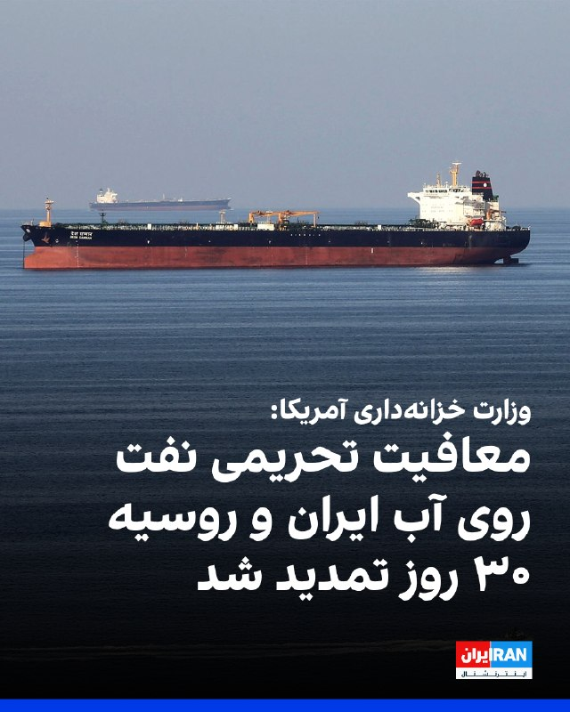
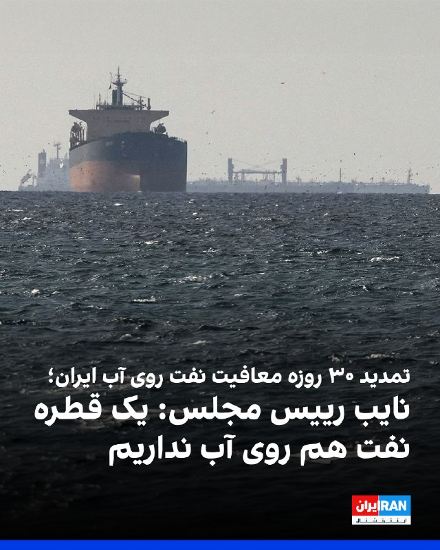

# Channel IranintlTV

## Message 333337

[Video](media/333337_0.mp4)

تصمیم دونالد ترامپ برای تمدید آتش‌بس با جمهوری اسلامی با واکنش‌های گسترده شهروندان مواجه شده است. مخاطبان در پیام‌هایی به ایران‌اینترنشنال از احساسات متناقض خود، از خشم تا خوش‌بینی، نسبت به رویدادها می‌گویند.
سبا حیدرخانی، عضو تحریریه ایران‌اینترنشنال، گزارش می‌دهد
@iranintltv

---

## Message 333339

[Video](media/333339_0.mp4)

سرخط خبرهای چهارشنبه ۲ اردیبهشت
@iranintltv

---

## Message 333340

محمود کریمی، مداح دفتر رهبر جمهوری اسلامی، در یک مصاحبه ویدیویی با اشاره به خاطره حضورش در جلسه‌ای با علی خامنه‌ای گفت که خامنه‌ای یک قاشق قیمه را در دهان او و قاسم سلیمانی گذاشته بود.

---

## Message 333342

[Video](media/333342_0.mp4)

یک شهروند در پیامی به ایران اینترنشنال درباره وضعیت اقتصادی و بیکار شدن کارمندان گفت که اسکله رجایی به راننده‌ها گفته که دیگر سر کار حاضر نشوند چون کشتی تردد نمی‌کند.

---

## Message 333343

[Video](media/333343_0.mp4)

یک نماینده مجلس با استناد به گزارش دولت، میزان خسارت مستقیم و غیرمستقیم جنگ با اسرائیل و آمریکا را حدود ۱۲۰ میلیارد دلار اعلام کرد.
گفت‌وگو با آرش آزرمی، دبیر بخش اقتصادی ایران‌اینترنشنال
@iranintltv

---

## Message 333347

[Video](media/333347_0.mp4)

یک شهروند با ارسال پیام صوتی به ایران‌اینترنشنال با اشاره به وخامت وضعیت اقتصادی ایران می‌گوید که دولت توان پرداخت حقوق کارمندان را ندارد و این مسئله موجب مشکلات برای کارکنان شده است.

---

## Message 333349

[Video](media/333349_0.mp4)

در حالی که وب‌سایت آکسیوس به نقل از یک مقام آمریکاییی مدت زمان آتش‌بس‌ تمدیدی را سه تا پنج روز اعلام کرده، یک عضو کمیسیون امنیت ملی مجلس شورای اسلامی می‌گوید مجتبی خامنه‌ای، رهبر جمهوری اسلامی، با مذاکره و معامله بر سر برنامه هسته‌ای را مخالفت کرده است.
گزارشی از مجتبا پورمحسن
@iranintltv

---

## Message 333352

[Video](media/333352_0.mp4)

تیتر اول با نیوشا صارمی، چهارشنبه ۲ اردیبهشت
@iranintltv

---

## Message 333353

[Video](media/333353_0.mp4)

سازمان تامین اجتماعی، به‌عنوان یکی از ارکان اصلی امنیت معیشتی، با یکی از جدی‌ترین چالش‌های مالی خود روبه‌رو شده است. کسری قابل‌توجه بودجه، کاهش منابع ورودی و افزایش تعهدات، این نهاد را در شرایط بحرانی قرار داده است.
از پیامدهای این وضعیت می‌توان به تاخیر در پرداخت‌ها و فشار بر خدمات درمانی و معیشت بازنشستگان اشاره کرد.
آیه دریس، عضو تحریریه ایران‌اینترنشنال، به این مساله پرداخته است.
@iranintltv

---

## Message 333354

مهرداد قاسمفر، روزنامه‌نگار و تحلیل‌گر مسائل ایران می‌گوید درک چندپارگی درون جمهوری اسلامی دشوار شده؛ جایی که یک جناح ادامه جنگ را غیرممکن می‌داند و جناح امنیتی بر ادامه آن تأکید دارد؛ شکافی که تصویر متناقضی از تصمیم‌گیری در تهران نشان می‌دهد.

---

## Message 333357

همزمان با تمدید آتش‌بس برای از سرگیری مذاکرات، آمریکا در حال تقویت حضور نظامی خود در منطقه است. ترامپ هشدار داده در صورت ناکامی گفت‌وگوها، آماده از سرگیری حملات خواهد بود؛ نشانه‌ای از تداوم فضای پرتنش در کنار مذاکرات.

---

## Message 333338

**Date:** 2026-04-22T14:29:37+00:00

بر اساس اطلاعات رسیده به ایران‌اینترنشنال، بابک خاربو، عموی علیرضا خاربو، از جاوید‌نامان انقلاب ملی ایرانیان، که ۲۱ بهمن در شهرستان دیزیچه اصفهان بازداشت شد، با اتهام سنگینی روبه‌روست و در خطر اعدام قرار دارد.
بنا بر این اطلاعات، این شهروند ۳۳ ساله که پدر سه فرزند خردسال است، پس از بازداشت تحت بازجویی و شکنجه قرار گرفته و سپس به زندان دستگرد اصفهان منتقل شده است.
منابع نزدیک به خانواده گفتند به همسر بابک خاربو اطلاع داده شده است از پیگیری روند آزادی او خودداری کند.
او از حق دسترسی به وکیل محروم است.
https://iranintl.com/202604221832

---

## Message 333341

**Date:** 2026-04-22T14:50:10+00:00

طبق اطلاعات رسیده به ایران‌اینترنشنال، روز دوشنبه ۲۴ فروردین، شماری از زندانیان سیاسی  از زندان‌های اوین و فشافویه به زندان قزلحصار منتقل شدند. وحید سرخ‌گل، علی شیدایی، محسن پیرایش و مهدی وفایی‌ثانی چهار نفر از این زندانیان هستند اما هویت چهار نفر دیگر همچنان نامشخص است.
همچنین دو زندانی دیگر از فشافویه به این گروه اضافه شده‌اند.
این زندانیان در واحد سه بند ۳۵ زندان قزلحصار موسوم به «سوئیت» و بخش مرتبط با سلول‌های انفرادی نگهداری می‌شوند؛ بخشی که طبق گزارش‌ها عمدتاً برای زندانیان با احکام سنگین از جمله اعدام استفاده می‌شود. منابع مطلع گفته‌اند این افراد در سلول‌هایی حدود ۱۰ متر مربع، بدون دسترسی مناسب به هواخوری، تلفن و امکانات بهداشتی نگهداری می‌شوند و شرایط بسیار سختی دارند.
بر اساس همین گزارش‌ها، در زمان انتقال به قزلحصار، برخی از این زندانیان با چشم‌بند، دستبند قپانی و همراه با برخورد خشونت‌آمیز منتقل شده‌اند. هنوز مشخص نیست علت این جابه‌جایی گروهی چیست و وضعیت حقوقی سایر زندانیان نامشخص مانده است.
https://iranintl.com/202604227955

---

## Message 333344

**Date:** 2026-04-22T14:59:27+00:00

اسکات بسنت، وزیر خزانه‌داری آمریکا، گفت ادعای کسب ۱۴ میلیارد دلار سود برای جمهوری اسلامی از محل لغو تحریم‌ها «افسانه» است.
او افزود هفته گذشته ۱۰ کشور که بیشترین آسیب‌پذیری را در برابر کمبود نفت دارند، برای تمدید معافیت‌های تحریمی نفت با او تماس گرفته‌اند.
بسنت اضافه کرد وزارت خزانه‌داری با اعطای معافیت‌های تحریمی توانست بیش از ۲۵۰ میلیون بشکه نفت در دریا را آزاد کند و افزود در صورت انجام نشدن این اقدام، قیمت‌ها بالاتر می‌رفت.
https://iranintl.com/202604223202

---

## Message 333345

**Date:** 2026-04-22T15:26:19+00:00

محمود نبویان، نماینده مجلس و از اعضای هیات اعزامی جمهوری اسلامی به پاکستان، گفت: «اصلا معلوم نیست که اورانیوم غنی‌شده ما در اصفهان باشد، مواد همه جا پخش شده و جاهای مختلف قرار دارد.»
او افزود: «آمریکا در باتلاق گیر کرده و به دنبال دستاورد سازی است؛ حتی شاید آن‌ها وارد یک منطقه شده و بشکه خالی را با خاک پر کنند و به اسم اورانیوم، اعلام پیروزی کنند.»
https://iranintl.com/202604220070

---

## Message 333346

**Date:** 2026-04-22T15:34:14+00:00

خبرگزاری تسنیم، وابسته به سپاه پاسداران، در واکنش به گزارشی از نیویورک‌پست که از احتمال برگزاری مذاکرات در روز جمعه خبر داده بود، اعلام کرد: «تا این لحظه هیچ تغییری در برنامه ایران برای عدم شرکت در مذاکره ایجاد نشده است.»
ساعاتی پیش، نیویورک‌پست به نقل از دونالد ترامپ گزارش داده بود که احتمال آغاز دور تازه مذاکرات صلح «از همین جمعه» وجود دارد.
در این گزارش همچنین آمده بود که منابعی در اسلام‌آباد از پیشرفت در تلاش‌های میانجی‌گرانه خبر داده‌اند و گفته‌اند احتمال ازسرگیری گفت‌وگوها در بازه «۳۶ تا ۷۲ ساعت آینده» افزایش یافته است. ترامپ نیز در پاسخ به پرسش این روزنامه درباره این تحولات، در یک پیام متنی نوشت: «ممکن است!»
https://iranintl.com/202604222896

---

## Message 333348

**Date:** 2026-04-22T16:01:34+00:00

اسکات بسنت، وزیر خزانه‌داری آمریکا، چهارشنبه اعلام کرد معافیت تحریمی نفت روی دریا متعلق به روسیه و ایران را به مدت ۳۰ روز تمدید کرده است.او گفت این تصمیم پس از درخواست حدود ۱۰ کشور آسیب‌پذیر در برابر کمبود نفت به‌دلیل بسته بودن تنگه هرمز اتخاذ شد.
بسنت اضافه کرد وزارت خزانه‌داری با اعطای معافیت‌های تحریمی توانست بیش از ۲۵۰ میلیون بشکه نفت در دریا را آزاد کند و افزود در صورت انجام نشدن این اقدام، قیمت‌ها بالاتر می‌رفت.
همزمان ‌محمود نبویان، نماینده مجلس و از اعضای هیات اعزامی جمهوری اسلامی به پاکستان، گفت: «در طول جنگ فروش نفت ما بسیار بیشتر شد؛ ما حالا همه نفت‌های روی آب را به ۲ برابر قیمت فروختیم و الان یک قطره هم نفت روی آب نداریم.»
https://iranintl.com/202604224614

---

## Message 333351

**Date:** 2026-04-22T16:34:07+00:00

🗣
روایت شما از زندگی در آتش‌بس- چهارشنبه ۲ اردیبهشت ۱۴۰۵
🔹
از مشهد: برای همه زندگی سخت شده و وضع معیشتی برای همه همینه. اما باید صبر کنیم و امیدمون رو حفظ کنیم تا روز فراخوان برسه. این بازی‌های سیاسته ولی در نهایت این رژیم باید بره که به دست ما مردم حتماً میره.
🔹
کاش می‌شد به ترامپ گفت فقط یه شرط علنی برای ج.ا بذاره و بگه در ایران برای مردم رفراندوم بذارید، بعدش جنگ و تحریم‌ها کامل تموم میشه. نمی‌دونم چجوری میشه اینو به ترامپ گفت، شاید هم‌وطنان خارج از کشور بتونن.
🔹
درود بر همه ایرانیان داخل و خارج که با شروع انقلاب شیر و خورشید با هم متحد و یکصدا خواستار برکناری حکومت پلید آخوندی هستن و با همه سختی‌ها مبارزه می‌کنن.
🔹
از تهران: بعد از ۵۴ روز وصل شدم که فقط پیام بدم و بگم می‌دونم خسته‌اید و حق دارید، اما نباید امیدمون رو از دست بدیم. در نهایت نور بر تاریکی پیروز میشه، نمی‌دونم چطور اما حتمیه.
🔹
کانفیگ گیگی یک تومن خریدم که بیام اینجا بگم ما در ایران فقط به گرفتن انتقام خون جاویدنام‌ها فکر می‌کنیم، چه با کمک آمریکا چه بدون کمک.
🔹
بعد از تقریباً دو هفته وصل شدم. کاش یکی صدای ما مردم ایران رو می‌شنید و می‌پرسید ما چی می‌خوایم. خسته شدیم؛ از بلاتکلیفی، از سختی، از فکر و خیال. من یه جوان ۲۱ ساله از کرمانشاه هستم. واقعاً می‌خوام بگم همه ما جوونا خسته شدیم. یکی صدای ما رو بشنوه.
🔹
از تهران هستم. خواستم بگم فلج اقتصادی جمهوری اسلامی الان بهترین و کم‌هزینه‌ترین راه سرنگونی جمهوری اسلامی‌ه. الان وقت سازماندهی نیروی اپوزوسیونه. لطفاً اختلاف‌ها رو کنار بذارید و متحد بشید که با هم سقوط این سیستم فاسد رو رقم بزنیم.

---

## Message 333355

**Date:** 2026-04-22T16:53:58+00:00

‌محمود نبویان، نماینده مجلس و از اعضای هیات اعزامی جمهوری اسلامی به پاکستان،  گفت: «در طول جنگ فروش نفت ما بسیار بیشتر شد؛ ما حالا همه نفت‌های روی آب را به ۲ برابر قیمت فروختیم و الان یک قطره هم نفت روی آب نداریم.»
این در حالی است که وزارت خزانه‌داری آمریکا اعلام کرد معافیت تحریمی نفت روی دریا متعلق به روسیه و ایران را به‌دلیل درخواست حدود ۱۰ کشور آسیب‌پذیر از کمبود نفت ناشی از بسته بودن تنگه هرمز ۳۰ روز تمدید کرده است.
https://iranintl.com/202604225824

---

## Message 333356

**Date:** 2026-04-22T16:56:18+00:00

انجمن قلم آمریکا اعلام کرد گلرخ ایرایی، نویسنده و زندانی سیاسی محبوس در زندان اوین، برنده جایزه «آزادی نوشتن پن/باربی» در سال ۲۰۲۶ شده است.
علی اسداللهی، شاعر و مترجم نیز دیگر برنده این جایزه است؛ جایزه‌ای که به نویسندگان تحت تعقیب به‌دلیل بیان دیدگاه‌هایشان اهدا می‌شود.
قرار است از این دو نویسنده در مراسم ادبی پن آمریکا در ۲۴ اردیبهشت ۱۴۰۵ برابر با ۱۴ مه ۲۰۲۶ در موزه تاریخ طبیعی آمریکا در نیویورک تقدیر شود.
https://iranintl.com/202604222031

---
