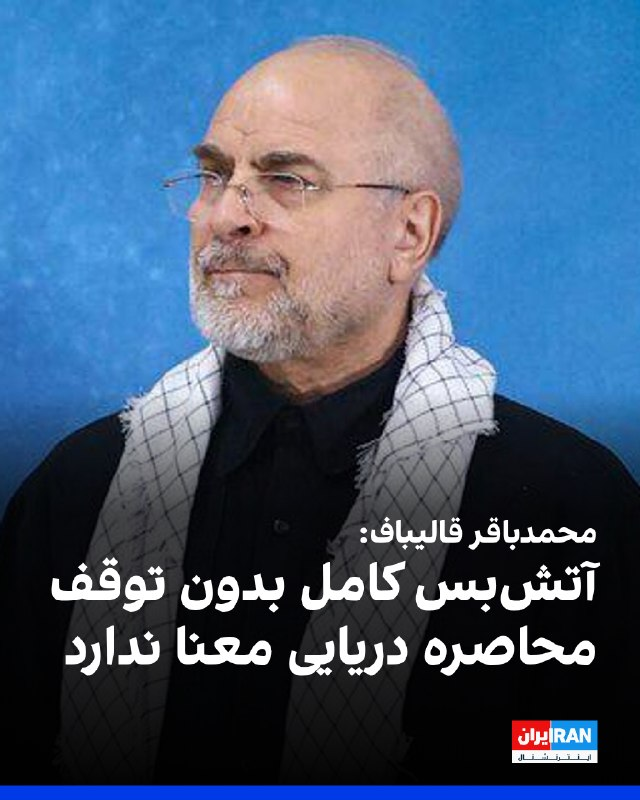
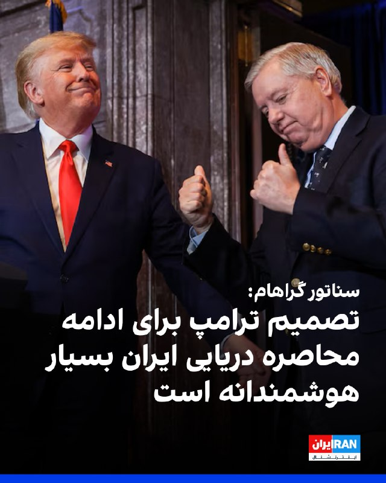
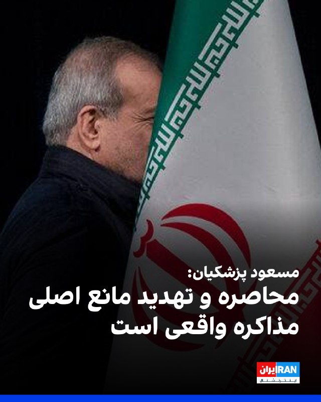
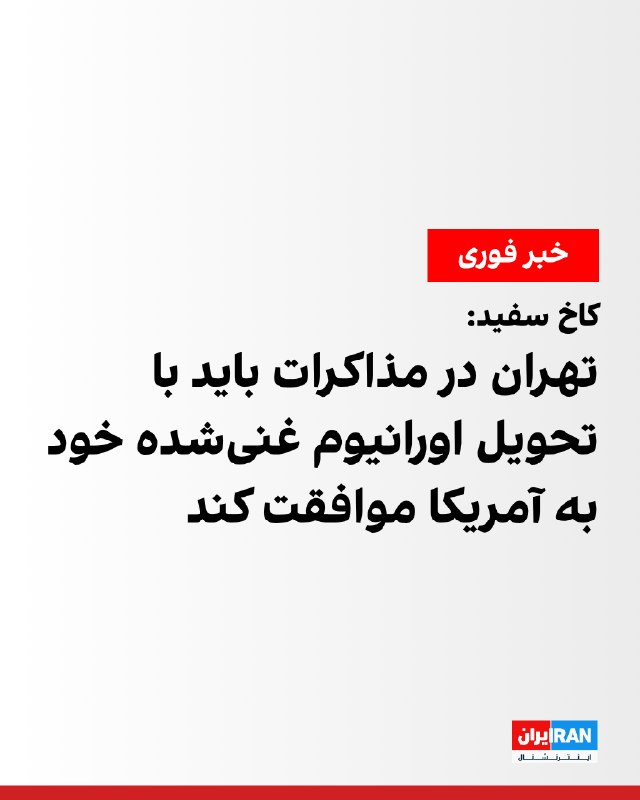

# Channel IranintlTV

## Message 333365

با تمدید آتش‌بس برای ازسرگیری مذاکرات، آمریکا همزمان در حال تقویت نیروها و تجهیزات نظامی خود در منطقه است. ترامپ هشدار داده در صورت شکست مذاکرات، حملات از سر گرفته خواهد شد. گفت‌وگو با فرزین ندیمی، پژوهشگر ارشد امور دفاعی و امنیتی

---

## Message 333366

موج تازه‌ای از مسدودسازی اکانت‌های وابسته به جمهوری اسلامی در شبکه ایکس آغاز شده و شماری از چهره‌های شناخته‌شده نیز در میان آن‌ها هستند. گزارش‌ها دلیل این اقدام را نقض قوانین پلتفرم، از جمله انتشار اطلاعات نادرست و فعالیت‌های سازمان‌یافته عنوان می‌کنند. گفت‌وگو با امین ثابتی، کارشناس امنیت اینترنتی

---

## Message 333368

[Video](media/333368_0.mp4)

ویدیوی رسیده از یک مخاطب نشان می‌دهد که ماموران حکومت در ورودی شهر گرگان در ادامه افزایش کنترل تردد شهروندان یک ایست بازرسی مستقر کرده‌اند.

---

## Message 333370

[Video](media/333370_0.mp4)

گزارش‌ها حاکی است دور دوم مذاکرات ممکن است جمعه برگزار شود و مهلت دونالد ترامپ به تهران بسیار محدود و بین سه تا پنج روز تعیین شده است تا به جمع‌بندی برسد.
همزمان تسنیم، رسانه وابسته به سپاه، نوشت تهران فعلا تصمیمی برای مذاکره ندارد.
گفت‌وگو با مسعود کاظمی، روزنامه‌نگار و سمیرا قرایی، خبرنگار ایران‌اینترنشنال
@iranintltv

---

## Message 333371

[Video](media/333371_0.mp4)

جاویدنام محمد جباری، جوان ۲۶ ساله اهل دیزیچه استان اصفهان را ماموران جمهوری اسلامی شامگاه ۱۸ دی به ضرب گلوله در این شهر کشتند. یک بسیجی از بلندی به مردم تیراندازی کرد و او به همراه سه جاویدنام دیگر، مهدی نوری، حجت ملکی و علیرضا خاربو در دیزیچه کشته شدند.

---

## Message 333374

[Video](media/333374_0.mp4)

۲۴ با فرداد فرحزاد
@iranintltv

---

## Message 333375

[Video](media/333375_0.mp4)

آکسیوس گزارش داد دونالد ترامپ بین سه تا پنج روز به جمهوری اسلامی فرصت داده است، اما همچنان رویکرد تهران مشخص نیست و مواضع مختلف و متضادی از سوی مقام‌ها و رسانه‌های جمهوری اسلامی مطرح می‌شود.
گفت‌وگو با مهرداد قاسمفر، روزنامه‌نگار و تحلیل‌گر مسائل ایران
@iranintltv

---

## Message 333376

[Video](media/333376_0.mp4)

مهدی مهدوی‌آزاد در برنامه «چشم‌انداز» گفت: «عدم حضور نمایندگان جمهوری اسلامی در مذاکرات در پاکستان نشانه‌ای روشن از این است که تهران ادامه جنگ را انتخاب کرده است. ترامپ با عقب‌نشینی از زدن زیرساخت‌های ایران دیپلماسی را انتخاب کرد، اما جمهوری اسلامی نشان داد تمایلی به کاهش تنش‌ها و پایان درگیری ندارد.»
@iranintltv

---

## Message 333377

[Video](media/333377_0.mp4)

ویدیوهای منتشرشده در رسانه‌های اجتماعی نشان می‌دهند شهروندان سه‌شنبه اول اردیبهشت و در روز بزرگداشت سعدی،‌ شاعر پرآوازه ایران، بر  سرمزارش در شیراز رفته، اشعاری از او را خواندند و ترانه‌هایی را هم‌خوانی کردند.

---

## Message 333379

[Video](media/333379_0.mp4)

چرا حکومت ایران آشکارا به‌دنبال ادامه جنگ است؟
چشم‌انداز با مهدی مهدوی‌آزاد
تماشای نسخه کامل این برنامه در یوتیوب:
https://youtu.be/nPWTV2yIExU
@iranintltv

---

## Message 333381

[Video](media/333381_0.mp4)

آکسیوس گزارش داد فرصت دونالد ترامپ به تهران محدود و بین سه تا پنج روز است. رییس‌جمهوری آمریکا هشدار داد آتش‌بس تمدید نمی‌شود. همزمان محمدباقر قالیباف گفت تهدید و محاصره دریایی مانع از مذاکره است.
گفت‌وگو با امید معماریان، تحلیل‌گر سیاسی در موسسه دان و روح‌الله رحیم‌پور، تحلیل‌گر سیاسی
@iranintltv

---

## Message 333383

[Video](media/333383_0.mp4)

جانی ارنست، سناتور جمهوری‌خواه، به مرضیه حسینی، خبرنگار ایران‌اینترنشنال، گفت: «مهم است که رییس‌جمهوری تلاش می‌کند همه طرف‌ها را به میز مذاکره بیاورد تا به توافق برسند.»
او افزود: «هدف این است که اطمینان حاصل شود سپاه پاسداران تضعیف شده و دیگر نتواند به همسایگان یا خاک آمریکا آسیبی وارد کند و من از رییس‌جمهوری حمایت می‌کنم.»
@iranintltv

---

## Message 333364

**Date:** 2026-04-22T17:29:05+00:00

محمدباقر قالیباف، رییس مجلس، در شبکه ایکس نوشت: «آتش‌بس کامل وقتی معنا دارد که با محاصره دریایی و گروگان‌گیری اقتصاد دنیا نقض نشود و جنگ‌افروزی اسرائیل در همه جبهه‌ها متوقف باشد.»
او افزود: «بازگشایی تنگه هرمز با نقض فاحش آتش‌بس ممکن نیست.»
قالیباف اضافه کرد: «با تجاوز نظامی به اهداف خود نرسیدند، با قلدری هم نخواهند رسید. تنها راه، پذیرش حقوق ملت ایران است.»
https://iranintl.com/202604221780

---

## Message 333367

**Date:** 2026-04-22T17:59:52+00:00

🎧
نسخه صوتی تیتراول با نیوشا صارمی: اعزام ناو سوم آمریکا وتجهیزات نظامی جدید به منطقه با وجود تمدید آتش‌بس
@iranintlTV

---

## Message 333369

**Date:** 2026-04-22T18:05:00+00:00

لیندزی گراهام، سناتور جمهوری‌خواه آمریکا، اعلام کرد در گفت‌وگویی با دونالد ترامپ و پیت هگست درباره مسیر پیش‌رو در قبال [حکومت] ایران، از تصمیم واشینگتن برای ادامه محاصره حمایت کرده است. او این تصمیم را «بسیار هوشمندانه» توصیف کرد و گفت این اقدام توانایی [حکومت] ایران را برای ادامه نقش به‌عنوان «بزرگ‌ترین حامی دولتی تروریسم» تحت تاثیر قرار داده است.
گراهام همچنین پیش‌بینی کرد این محاصره تا زمان تغییر مسیر حکومت ایران ادامه یابد و حتی «گسترش یافته و به‌زودی ابعادی جهانی پیدا کند». او به کشورها و طرف‌هایی که در انتقال نفت ایران نقش دارند هشدار داد که خطر چنین اقدامی برعهده خودشان است. این سناتور در پایان با تمجید از ترامپ و تیم او، این وضعیت را «بهترین فرصت از سال ۱۹۷۹» برای تغییر رفتار حکومت ایران دانست و ابراز امیدواری کرد این هدف از طریق دیپلماسی محقق شود.
https://iranintl.com/202604227450

---

## Message 333372

**Date:** 2026-04-22T18:31:06+00:00

مسعود پزشکیان در شبکه ایکس نوشت جمهوری اسلامی همواره از گفت‌وگو و توافق استقبال کرده و می‌کند.
او افزود: «بدعهدی، محاصره و تهدید مانع اصلی مذاکره واقعی است‌ و دنیا شاهد پرحرفی‌های مزورانه و تناقض ادعا و عمل شماست.»
پیش‌تر نیز قالیباف گفت: «آتش‌بس کامل وقتی معنا دارد که با محاصره دریایی و گروگان‌گیری اقتصاد دنیا نقض نشود و جنگ‌افروزی اسرائیل در همه جبهه‌ها متوقف باشد.»
https://iranintl.com/202604220612

---

## Message 333373

**Date:** 2026-04-22T18:32:14+00:00

🗣
روایت شما از زندگی در آتش‌بس- چهارشنبه ۳ اردیبهشت ۱۴۰۵
🔹
یکی نیست به داد ما مشاغل آنلاین برسه؟ مگه همه کارمندند؟ کلی آدم از اینترنت درآمد داشتن. من برم اینترنت پرو بخرم، به کی باید جنس بفروشم؟ وقتی مردم عادی دسترسی ندارن، به چه درد می‌خوره؟
🔹
دوستم مدیر مدرسه هست و مجبورشون کردن موکب بزنن با هزینه مدرسه.
🔹
واقعاً ما مردم ایران دلمون یه زندگی آروم و بدون جنگ می‌خواد، فکر کنم کمترین حقمون این باشه، نه؟
🔹
درود به ملت باشرف ایران. من هم مثل شما بدون اینترنت، بدون پول، با گرونی وحشتناک و قسط عقب‌افتاده‌ام، ولی نباید ناامید شد. این رژیم بی‌ریشه و فاسد دیگه جایی برای فرار و زندگی نداره و نابود خواهد شد. روح جاویدنامان شاد.
🔹
مردم بذارید قیمت نفت تا جایی که میشه بالا بره، انتقاممون هم از چین گرفته میشه هم اروپا مخصوصاً بریتانیا. هممون داریم له می‌شیم اما صبر...
🔹
حقوق بازنشستگان با چند روز تأخیر واریز شد، اما دیدیم حدود ۵ میلیون تومان ازش کم شده. وقتی رفتیم بانک، دیدیم ده‌ها نفر دیگه هم همین مشکل رو دارن. نه بانک پاسخگو بود، نه کسی توضیح می‌ده چرا از حقوق مردم کم میشه.
🔹
شرایط خیلی سخت و غیرقابل‌تحمل شده، زودتر تکلیف رو روشن کنین. من به عنوان یه نوجوان دیگه هیچ امیدی برام نمونده. تمومش کنین زودتر.
🔹
من یه ایده دارم، اسرائیل می‌تونه اینترنت غزه رو قطع کنه تا شاید چپ‌های اروپایی یادشون بیفته دسترسی به اینترنت جزو حقوق انسان‌هاست.

---

## Message 333378

**Date:** 2026-04-22T19:15:15+00:00

🎧
نسخه صوتی چشم‌انداز: چرا حکومت ایران آشکارا به‌دنبال ادامه جنگ است؟
@iranintlTV

---

## Message 333380

**Date:** 2026-04-22T19:28:12+00:00

کارولین لیویت، سخنگوی کاخ سفید، چهارشنبه در گفت‌وگو با فاکس‌نیوز گفت جمهوری اسلامی باید در چارچوب مذاکرات برای پایان دادن به جنگ، با تحویل اورانیوم غنی‌شده خود به ایالات متحده موافقت کند.
https://iranintl.com/202604226926

---

## Message 333382

**Date:** 2026-04-22T19:58:24+00:00

🎧
نسخه صوتی  ۲۴ با فرداد فرحزاد: مهلت ۳ تا ۵ روزه ترامپ به جمهوری اسلامی
@iranintlTV

---
