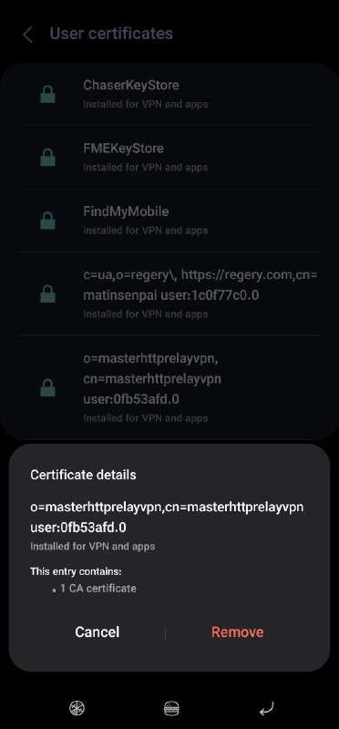
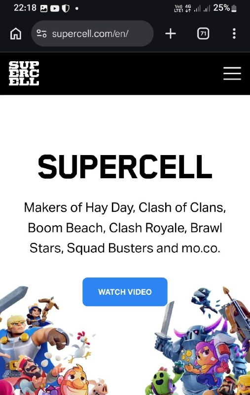

# Channel MatinSenPaii

## Message 2815

**Date:** 2026-04-22T21:56:21+00:00

دوستان توی متد Master Http Relay (به اختصار MHR) آیپی شما، آیپی خودتونه از ایران. سایت‌های مثل chatgpt، جمنای، و... ما رو تحریم کردن باز نمیشن. در نتیجه می‌تونید از extensionهای vpn مثل windscribe روی کروم استفاده کنید دوباره یا VPN OVER VPN بزنید.

---

## Message 2816

**Date:** 2026-04-23T06:28:24+00:00

httprelay (google script) for Mac
🔥
🔥
🔥
🔥
نسخه اولیه پیاده سازی شده با سویفت به صورت نیتیو برای مک الان در دسترسه!
قابلیت ها:
- آیدی اسکریپت و پسورد رو میگیره و تمام. دکمه استارت رو بزن و سیستمت وی پی ان میشه
- میتونی چند تا آیدی و پسورد بعنوان پروفایل های مختلف (مثل کانفیگ) اضافه کنی
لطف کنید به گیت هاب این دوست خوب برید و استار بدید و حتما ازشون حمایت کنید - زمان زیادی صرف درست کردن این پروژه ها میشه
https://github.com/g3ntrix/Shade
@whitedns

---

## Message 2817

**Date:** 2026-04-23T06:39:04+00:00

⚡️
نسخه اندروید MHR
https://github.com/therealaleph/MasterHttpRelayVPN-RUST/releases/tag/v1.0.2

---

## Message 2818

**Date:** 2026-04-23T07:07:06+00:00

💬
ترجمه‌ی دستورالعمل برنامه‌نویس:
🌐
نحوه استفاده (How to use)
1. یک یا چند URL مربوط به Apps Script deployment (یا فقط IDها) و همچنین auth_key خودت رو وارد کن.
2. روی گزینه Install MITM certificate بزن. پیام تأیید رو قبول کن.
گواهی در مسیر Downloads/mhrv-ca.crt ذخیره میشه و تنظیمات گوشی باز میشه.
داخل Settings جستجو کن «CA certificate»، روی همون نتیجه بزن (نه «VPN & app user certificate» و نه «Wi-Fi»)، بعد فایل mhrv-ca.crt رو از Downloads انتخاب کن.
اگر قفل صفحه نداری، ازت میخواد یکی تنظیم کنی (الزام اندروید).
3. قبل از زدن Start، بخش SNI pool + tester رو باز کن و روی Test all بزن.
اگر همه آیتم‌ها timeout شدن، یعنی google_ip در دسترس نیست. باید با یه IP جایگزینش کنی که روی دستگاهت resolve بشه (مثلاً با دستور nslookup
www.google.com
روی یه دستگاه سالم).
4. روی Start بزن و درخواست VPN رو قبول کن.
این حالت TUN کامل، تمام ترافیک دستگاه رو از طریق پراکسی عبور میده و نیازی به تنظیم جداگانه برای هر اپ نیست.
(در اندروید، VPNها از طریق یک تونل سراسری کل ترافیک رو هدایت می‌کنن )
5. اگر تو Chrome خطای 504 Relay timeout دیدی:
یعنی Apps Script پاسخ نمی‌ده. باید اسکریپت رو دوباره deploy کنی، لینک جدید /exec رو بگیری و جایگزین کنی.
در لاگ زنده (Live logs) به خطاهای "Relay timeout" و "connect:" دقت کن تا بفهمی مشکل از کدوم لایه است.
❓
محدودیت شناخته‌شده
سیستم Cloudflare Turnstile (همون «Verify you are human») معمولاً روی اکثر سایت‌های محافظت‌شده با Cloudflare وارد لوپ بی‌نهایت میشه.
دلیلش:
هر درخواست Apps Script از یک IP دیتاسنتر گوگل متفاوت ارسال میشه
ولی User-Agent و TLS fingerprint ثابت هست
کوکی cf_clearance به ترکیب (IP، UA، JA3) وابسته‌ست
پس وقتی IP عوض میشه، Cloudflare دوباره چالش میده.
هیچ راه‌حلی داخل این اپ برای این مشکل وجود نداره، چون ذاتاً به نحوه کار Apps Script برمی‌گرده.
فقط سایت‌هایی که فقط صفحه اول رو بررسی می‌کنن (نه همه درخواست‌ها) بعد از یک بار تأیید، کار خواهند کرد
✔️

---

## Message 2820

**Date:** 2026-04-23T08:44:48+00:00

💬
ترجمه‌ی دستورالعمل برنامه‌نویس:
🌐
نحوه استفاده (How to use)  1. یک یا چند URL مربوط به Apps Script deployment (یا فقط IDها) و همچنین auth_key خودت رو وارد کن.   2. روی گزینه Install MITM certificate بزن. پیام تأیید رو قبول کن. گواهی در مسیر Downloads/mhrv…

---

## Message 2821

**Date:** 2026-04-23T08:50:10+00:00

متین به کجا رسیدی میگی بیلبیلک سبز

---

## Message 2822

**Date:** 2026-04-23T09:06:47+00:00

ببینید من سر این تمام مراحل دیپلوی‌منت رو با گوشی انجام دادم که بهتون بگم آقا، کسی که لپ تاپ نداره هم میتونه.
1- این کد رو کپی می‌کنید:
/**
* DomainFront Relay — Google Apps Script
*
* TWO modes:
*   1. Single:  POST { k, m, u, h, b, ct, r }       → { s, h, b }
*   2. Batch:   POST { k, q: [{m,u,h,b,ct,r}, ...] } → { q: [{s,h,b}, ...] }
*      Uses UrlFetchApp.fetchAll() — all URLs fetched IN PARALLEL.
*
* DEPLOYMENT:
*   1. Go to
https://script.google.com
→ New project
*   2. Delete the default code, paste THIS entire file
*   3. Click Deploy → New deployment
*   4. Type: Web app  |  Execute as: Me  |  Who has access: Anyone
*   5. Copy the Deployment ID into config.json as "script_id"
*
* CHANGE THE AUTH KEY BELOW TO YOUR OWN SECRET!
*/
const AUTH_KEY = "CHANGE_ME_TO_A_STRONG_SECRET";
// Keep browser capability headers (sec-ch-ua*, sec-fetch-*) intact.
// Some modern apps, notably Google Meet, use them for browser gating.
const SKIP_HEADERS = {
host: 1, connection: 1, "content-length": 1,
"transfer-encoding": 1, "proxy-connection": 1, "proxy-authorization": 1,
"priority": 1, te: 1,
};
function doPost(e) {
try {
var req = JSON.parse(e.postData.contents);
if (req.k !== AUTH_KEY) return _json({ e: "unauthorized" });
// Batch mode: { k, q: [...] }
if (Array.isArray(req.q)) return _doBatch(req.q);
// Single mode
return _doSingle(req);
} catch (err) {
return _json({ e: String(err) });
}
}
function _doSingle(req) {
if (!req.u
typeof req.u !== "string"
!req.u.match(/^https?:\/\//i)) {
return _json({ e: "bad url" });
}
var opts = _buildOpts(req);
var resp = UrlFetchApp.fetch(req.u, opts);
return _json({
s: resp.getResponseCode(),
h: _respHeaders(resp),
b: Utilities.base64Encode(resp.getContent()),
});
}
function _doBatch(items) {
var fetchArgs = [];
var errorMap = {};
for (var i = 0; i < items.length; i++) {
var item = items[i];
if (!item.u
typeof item.u !== "string"
!item.u.match(/^https?:\/\//i)) {
errorMap[i] = "bad url";
continue;
}
var opts = _buildOpts(item);
opts.url = item.u;
fetchArgs.push({ _i: i, _o: opts });
}
// fetchAll() processes all requests in parallel inside Google
var responses = [];
if (fetchArgs.length > 0) {
responses = UrlFetchApp.fetchAll(
fetchArgs.map
(function(x) { return x._o; }));
}
var results = [];
var rIdx = 0;
for (var i = 0; i < items.length; i++) {
if (errorMap.hasOwnProperty(i)) {
results.push({ e: errorMap[i] });
} else {
var resp = responses[rIdx++];
results.push({
s: resp.getResponseCode(),
h: _respHeaders(resp),
b: Utilities.base64Encode(resp.getContent()),
});
}
}
return _json({ q: results });
}
function _buildOpts(req) {
var opts = {
method: (req.m || "GET").toLowerCase(),
muteHttpExceptions: true,
followRedirects: req.r !== false,
validateHttpsCertificates: true,
escaping: false,
};
if (req.h && typeof req.h === "object") {
var headers = {};
for (var k in req.h) {
if (req.h.hasOwnProperty(k) && !SKIP_HEADERS[k.toLowerCase()]) {
headers[k] = req.h[k];
}
}
opts.headers = headers;
}
if (req.b) {
opts.payload = Utilities.base64Decode(req.b);
if (req.ct) opts.contentType = req.ct;
}
return opts;
}
function _respHeaders(resp) {
try {
if (typeof resp.getAllHeaders === "function") {
return resp.getAllHeaders();
}
} catch (err) {}
return resp.getHeaders();
}
function doGet(e) {
return HtmlService.createHtmlOutput(
"<!DOCTYPE html><html><head><title>My App</title></head>" +
'<body style="font-family:sans-serif;max-width:600px;margin:40px auto">' +
"<h1>Welcome</h1>
This application is running normally.
" +
"</body></html>"
);
}
function _json(obj) {
return ContentService.createTextOutput(JSON.stringify(obj)).setMimeType(
ContentService.MimeType.JSON
);
}

---

## Message 2823

**Date:** 2026-04-23T09:09:06+00:00

ببینید من سر این تمام مراحل دیپلوی‌منت رو با گوشی انجام دادم که بهتون بگم آقا، کسی که لپ تاپ نداره هم میتونه. 1- این کد رو کپی می‌کنید:  /**  * DomainFront Relay — Google Apps Script  *  * TWO modes:  *   1. Single:  POST { k, m, u, h, b, ct, r }       → {…

---

## Message 2824

**Date:** 2026-04-23T18:00:29+00:00

حواستون باشه که بعد از تموم شدن این داستان‌ها، سرتیفیکیت ها و دسترسی‌شون رو پاک کنید کلا.
همینطور دوباره تاکید میکنم از حساب اصلی گوگلتون استفاده نکنید توی سایت اسکریپت. ممکنه مسدود بشه یا مشکلی واسش پیش بیاد

---

## Message 2825

**Date:** 2026-04-23T18:12:29+00:00

حواستون باشه که بعد از تموم شدن این داستان‌ها، سرتیفیکیت ها و دسترسی‌شون رو پاک کنید کلا. همینطور دوباره تاکید میکنم از حساب اصلی گوگلتون استفاده نکنید توی سایت اسکریپت. ممکنه مسدود بشه یا مشکلی واسش پیش بیاد

---

## Message 2826

**Date:** 2026-04-23T18:17:36+00:00

برای حذف کردن سرتیفیکیت،  1- توی اندروید، از همون قسمتی که رفتید Privacy and security, more security settings, User certificates اون مستر دی ان اس پایین رو ریموو کنید

---

## Message 2827

**Date:** 2026-04-23T18:21:29+00:00

پنل سنایی نصب کردم الان چیکار کنم کانفیگم تونل بشه

---

## Message 2828

**Date:** 2026-04-23T18:54:02+00:00

سایت
Supercell.com
روی همراه اول وایت لیست شده. جدای از احمقانه بودنش، این کار دوتا پیام ممکنه داشته باشه:
1- دارن واقعا فیلترینگ رو شل تر میکنن که خب خوبه.
2- تلاش مذبوحانه برای وایت لیستینگ ادامه داره و می‌خوان صدای اونایی که از خودشونن کمتر در بیاد که این باعث میشه بتونیم سوراخ‌های بیشتری توی دیوار فیلترینگ پیدا کنیم و بازم خوبه

---

## Message 2829

**Date:** 2026-04-24T05:12:37+00:00

☠️
بدون فیلترشکن به یوتوب وصل شو! آموزش استفاده از Master Http Relay برای دور زدن فیلترینگ Youtube   فایل استفاده شده توی ویدئو: https://t.me/MatinSenPaii/2786 دستور اجرا: python main.py آموزش متنی: https://github.com/masterking32/MasterHttpRelayVPN/blob/p…

---

## Message 2830

**Date:** 2026-04-24T05:23:53+00:00

برا من ۲ ساعت ویدیو پخش شد بعد دیگه هرکار کردم relay time out میدهد
یوتوبم بالا میاد ویدیو پخش نمیشه دیگ

---

## Message 2831

**Date:** 2026-04-24T13:00:47+00:00

برنامه نویسا قویه ریاضیشون

---

## Message 2832

**Date:** 2026-04-24T13:02:38+00:00

برای برنامه‌نویسی توی ۹۵ درصد حوزه ها شما نیازی به ریاضی قوی ندارید. حتی نیاز به دانش کامپیوتر بالا هم ندارید. یه راننده‌ی فرمول یک شاید از مکانیک ماشینش و طرز کار گیربکس و انجین چیزی ندونه، اما راننده‌ی خوبیه. برنامه‌نویس هم لزوما نباید چیز زیادی از کامپیوتر…

---

## Message 2833

**Date:** 2026-04-24T13:07:22+00:00

برنامه نویسی مرده دوستان. وقتتون رو تلف نکنین
🤣

---

## Message 2834

**Date:** 2026-04-24T13:12:31+00:00

مشکل اینه که اغلب از ب بسم الله میخوان با Ai شروع کنن

---

## Message 2835

**Date:** 2026-04-24T13:21:37+00:00

تو مدت خیلی کوتاهی به این نقطه میرسه. یکسال پیش هوش های مصنوعی درحد مدل زبانی بودن

---
