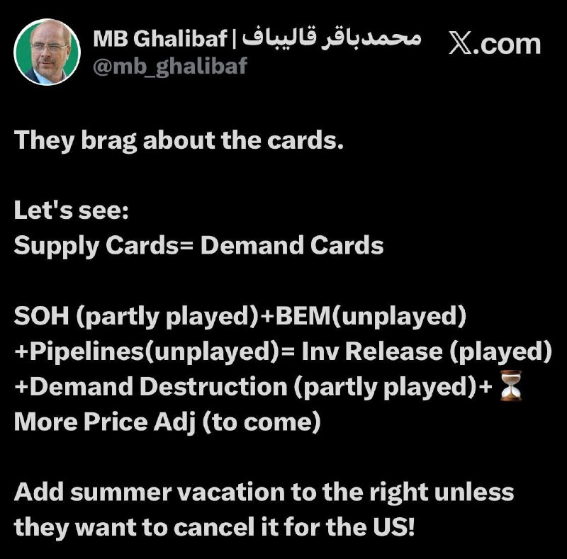
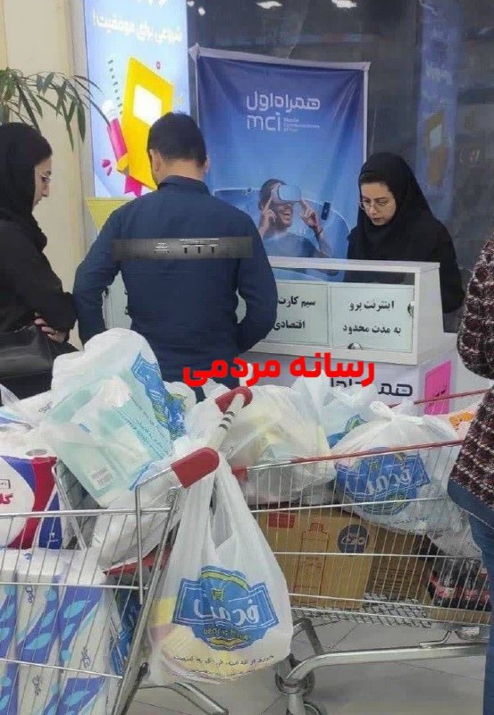
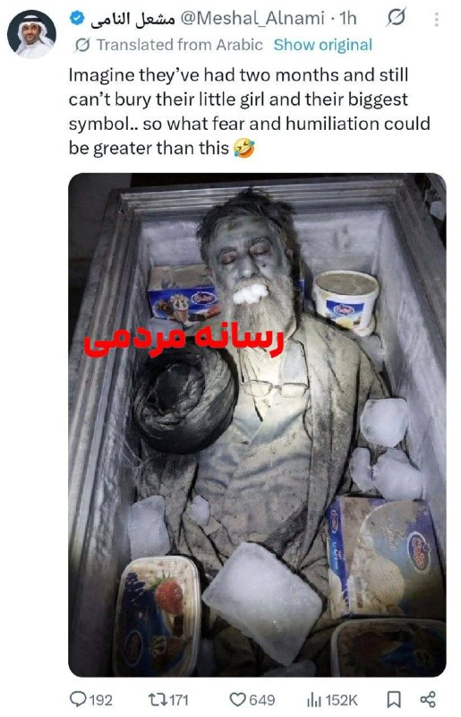

# Channel iransocial

## Message 30994

**Date:** 2026-04-26T16:27:01+00:00

‏تانکر ترکرز: گارد ساحلی آمریکا حدود ۳۸۰ میلیون دلار نفت خام ایران را در اقیانوس هند توقیف کرده است؛ به نظر می‌رسد این محموله‌ها به سمت آمریکا در حرکت هستند.
-
@iransocial

---

## Message 30995

**Date:** 2026-04-26T18:54:16+00:00

علی هاشم، خبرنگار الجزیره: ایران به میانجی‌ها اعلام کرده که در حال حاضر درباره برنامه هسته‌ای یا تنگه هرمز مذاکره نخواهد کرد.
-
@iransocial

---

## Message 30996

**Date:** 2026-04-26T20:23:23+00:00

‏
🔴
قالیباف در ایکس نوشت: آمریکا به «کارت‌های» خود می‌بالد اما معادله واقعی، توازن عرضه و تقاضاست. جمهوری اسلامی هنوز «کارت تنگه هرمز» را به طور کامل و «کارت باب المندب» و «خطوط لوله نفت» را بازی نکرده است.
-
@iransocial

---

## Message 30997

**Date:** 2026-04-26T20:42:15+00:00

مقامات پاکستانی به آسوشیتدپرس: روند مذاکرات غیرمستقیم میان ایالات متحده آمریکا و ایران همچنان در جریان است.
-
@iransocial

---

## Message 30998

**Date:** 2026-04-27T05:12:42+00:00

🔴
عضو کمیسیون امنیت ملی مجلس: آرایش نظامی آمریکا در منطقه نشان می‌دهد، هر لحظه ممکن است جنگ‌ دیگری آغاز شود.
-
@iransocial

---

## Message 30999

**Date:** 2026-04-27T05:48:00+00:00

قاآنی، فرمانده سپاه قدس: امروز تمرکز بر حمایت از حزب‌الله و سایر اجزاء جبهه مقاومت داریم.
-
@iransocial

---

## Message 31000

**Date:** 2026-04-27T05:57:15+00:00

عراقچی: گفت‌وگوها در اسلام‌آباد در خصوص بررسی شرایط ازسرگیری مذاکرات با آمریکا بود.
-
@iransocial

---

## Message 31001

**Date:** 2026-04-27T06:40:12+00:00

قیمت نفت خام برنت به بالاترین حد خود در سه هفته گذشته و به حدود ۱۰۸ دلار در هر بشکه رسید.
-
@iransocial

---

## Message 31002

**Date:** 2026-04-27T07:08:29+00:00

🔴
مارک لوین: رئیس‌جمهور آمریکا دیگه فریب همان مزخرفات تکراری‌ای رو که این رژیم همیشه به کار می‌برد، نخواهد خورد.
-
@iransocial

---

## Message 31003

**Date:** 2026-04-27T07:25:08+00:00

🔴
آکسیوس به نقل از مقام‌های آمریکایی: ترامپ روز دوشنبه جلسه‌ای به همراه مشاوران امنیتی ارشد خود در اتاق وضعیت درباره ایران برگزار می‌کند.
-
@iransocial

---

## Message 31004

**Date:** 2026-04-27T07:30:09+00:00

شاه اردن: هرگونه توافقی با ایران باید امنیت کشورهای عربی را نیز تضمین کند.
-
@iransocial

---

## Message 31005

**Date:** 2026-04-27T08:19:20+00:00

محمدجواد لاریجانی، برادر علی لاریجانی: به جای مذاکره با آمریکا باید به اون فحش بدیم و کتکش بزنیم.
-
@iransocial

---

## Message 31006

**Date:** 2026-04-27T08:24:16+00:00

حسین کنعانی‌مقدم، از فرماندهان پیشین سپاه پاسداران انقلاب اسلامی، گفت: آمریکا فقط می‌خواهد با مذاکره زمان بخرد تا بتواند مقدمات جنگ بعدی را فراهم کند.
-
@iransocial

---

## Message 31007

**Date:** 2026-04-27T08:39:37+00:00

روزنامه اطلاعات: قطع اینترنت، کسب و کارهای مجازی بسیار زیادی رو تعطیل کرده، یک پنجم شرکتهای دیجیتال در معرض تعدیل نیرو قرار دارن و زیان ناشی از قطع اینترنت روزانه ۵ هزار میلیارد تومان برآورد شده.
-
@iransocial

---

## Message 31008

**Date:** 2026-04-27T09:10:13+00:00

اینترنت پرو در غرفه های همراه‌اول سراسر کشور داره به راحتی خرید و فروش میشه!
-
@iransocial

---

## Message 31009

**Date:** 2026-04-27T09:15:27+00:00

مشعل النامی، اینفلوئنسر رسانه‌های اجتماعی عرب با قرار دادن جنازه متعفن علی خامنه‌ای در سردخانه بستنی ميهن در شبکه اجتماعی ایکس نوشت: تصور کنید دو ماه گذشته و هنوز نمی‌توانند دختر کوچولویشان و بزرگترین نمادشان را دفن کنند... پس چه ترس و تحقیری می‌تواند بزرگتر از این باشد؟
🤣
-
@iransocial

---

## Message 31010

**Date:** 2026-04-27T09:23:30+00:00

وزیر آموزش و پرورش: آزمون‌های داخلی طبق برنامه انجام می‌شوند اما آزمون‌های نهایی بعید است در زمان‌های مشخص شده برگزار شوند.
-
@iransocial

---

## Message 31011

**Date:** 2026-04-27T10:06:40+00:00

سخنگوی کمیسیون امنیت ملی مجلس: آمریکا گزینه‌ای جز تن دادن به شرایط ما رو نداره.
-
@iransocial

---

## Message 31012

**Date:** 2026-04-27T10:19:48+00:00

نت بلاکس: خاموشی اینترنت ایران اکنون وارد پنجاه و نهمین روز خود شده است، پس از ۱۳۹۲ ساعت قطع تقریبا کامل از دنیای خارج. این قطع طولانی‌مدت همچنان پرده‌ای از تاریکی دیجیتال بر نقض حقوق بشر در این کشور افکنده است.
-
@iransocial

---

## Message 31013

**Date:** 2026-04-27T10:29:14+00:00

رئیس کمیسیون اروپا: برای کاهش تحریم‌ها علیه ایران هنوز زود است و تحریم‌ها به‌دلیل سرکوب مردم ایران اعمال شده‌، پیش از لغو تحریم‌ها باید شاهد تغییری اساسی باشیم.
-
@iransocial

---
