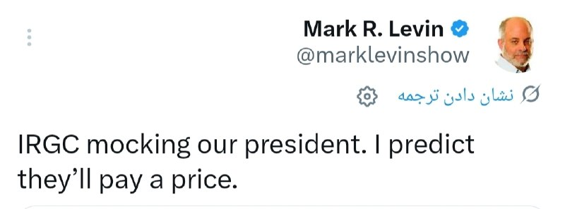

# Channel iransocial

## Message 30851

بعد از علی علیپور و شجاع خلیل‌زاده حالا علیرضا بیرانوند توی تجمعات حکومتی شرکت کرده تا با دماغش مثل لانچر، موشک پرتاب کنه. سپاه وعده داده روی دماغ علیرضا بیرانوند ۳ موشک خرمشهر و ۳ تا خیبرشکن میتونه لانچ کنه. توی سوراخاشم قراره شهر موشکی بسازه.
-
@iransocial

---

## Message 30844

**Date:** 2026-04-21T21:17:06+00:00

رسایی: تمدید آتش بس بی معنیه؛ باید با قدرت به آمریکا حمله کنیم.
-
@iransocial

---

## Message 30845

**Date:** 2026-04-21T21:19:32+00:00

نخست‌ وزیر پاکستان: از رئیس‌جمهور ترامپ به خاطر پذیرش درخواست ما برای تمدید آتش‌بس تشکر می‌کنم.
-
@iransocial

---

## Message 30846

**Date:** 2026-04-21T21:20:19+00:00

تسنیم: ایران درخواستی برای تمدید آتش‌بس نداده بود.
-
@iransocial

---

## Message 30847

**Date:** 2026-04-22T07:14:52+00:00

🔴
اسکات بسنت، وزیر خزانه‌داری آمریکا: در عرض چندروز، ذخیره‌سازی تو جزیره خارگ پر میشه و چاه‌های نفت حساس ایران بسته میشن. محدود کردن تجارت دریایی ایران به‌طور مستقیم هدف اصلی، یعنی منابع درآمدی رژیم رو نشونه میگیره. ما به مسدود کردن وجوه سرقت شده توسط رهبری فاسد، به نمایندگی از مردم ایران، ادامه میدیم.
-
@iransocial

---

## Message 30848

**Date:** 2026-04-22T07:17:45+00:00

🔴
سیتنا: احتمال می رود طی ساعات آتی گشایش هایی در اتصال به اینترنت بین الملل فراهم شود.
تکذیب شد.
-
@iransocial

---

## Message 30849

**Date:** 2026-04-22T08:13:02+00:00

🔴
اکسیوس: ترامپ منتظر جوابی از مجتبی خامنه‌ایه ولی هیچکس بهش دسترسی نداره و تنها راه ارتباط با مجتبی، احمد وحیدیه.
-
@iransocial

---

## Message 30850

**Date:** 2026-04-22T08:38:51+00:00

کیهان: کشتی‌ های آمریکا را در تنگه هرمز مصادره کنیم؛ محموله کشتی‌های غیر‌آمریکایی را هم به غنیمت بگیریم.
-
@iransocial

---

## Message 30852

**Date:** 2026-04-22T09:12:23+00:00

خبرگزاری رویترز به نقل از منابع امنیتی و نیروی دریایی سلطنتی بریتانیا: امروز حداقل ۳ کشتی در تنگه هرمز هدف تیراندازی قرار گرفته‌اند.
-
@iransocial

---

## Message 30853

**Date:** 2026-04-22T09:43:55+00:00

🚨
توئیت جدید مشاور قالیباف: تداوم محاصره تفاوتی با بمباران ندارد؛ تمدید آتش‌ بس به معنای خرید زمان برای حمله غافلگیرانه‌ است.
-
@iransocial

---

## Message 30854

**Date:** 2026-04-22T09:55:13+00:00

خبرگزاری تسنیم وابسته سپاه، کشورهای خلیج فارس رو به قطع کابل‌های اینترنت تهدید کرد.
-
@iransocial

---

## Message 30855

**Date:** 2026-04-22T10:00:01+00:00

اژه‌ای درباره تمدید آتش‌ بس از سمت دونالد ترامپ: دشمن در جایگاهی نیست که برای ما زمان تعیین کنه.
-
@iransocial

---

## Message 30856

**Date:** 2026-04-22T10:07:22+00:00

🔴
آکسیوس به نقل از یک منبع آمریکایی: ترامپ حاضر است سه تا پنج روز دیگر آتش‌بس را تمدید کند تا ایرانی‌ها اوضاعشان را سر و سامان بدهند. این وضعیت نامحدود نخواهد بود.
-
@iransocial

---

## Message 30857

**Date:** 2026-04-22T10:18:42+00:00

🔴
شبکه i24 اسرائیل: سپاه پاسداران انقلاب اسلامی مدعی شد که دو کشتی را در تنگه هرمز توقیف کرده است که یکی از آن‌ها با اسرائیل مرتبط بوده و آن‌ها را به سمت آب‌های سرزمینی ایران هدایت می‌کند.
-
@iransocial

---

## Message 30858

**Date:** 2026-04-22T13:44:01+00:00

🔴
واشینگتن‌پست به نقل از مقامات آمریکایی: عملیات دریایی علیه ایران گسترش یافته و شامل مناطقی خارج از خاورمیانه نیز می‌شود.
-
@iransocial

---

## Message 30859

**Date:** 2026-04-22T13:49:50+00:00

🔴
العربیه: پاکستان به جمهوری اسلامی درباره تموم شدن مهلت زمانی مذاکرات هشدار داد.
-
@iransocial

---

## Message 30860

**Date:** 2026-04-22T13:55:01+00:00

بیات، نماینده مجلس: با کشتن ترامپ و نتانیاهو کار تموم نمیشه اما باید انجامش بدیم.
-
@iransocial

---

## Message 30861

**Date:** 2026-04-22T13:59:01+00:00

🔴
فاکس‌نیوز به نقل از مقام کاخ سفید: ترامپ آتش‌ بس رو فقط ۳ تا ۵ روز تمدید کرده.
-
@iransocial

---

## Message 30862

**Date:** 2026-04-22T14:01:01+00:00

🔴
ترامپ به نیویورک پست: ممکنه دور جدید مذاکرات از جمعه شروع شه و دستیابی به موفقیت در مذاکرات ظرف ۳۶ تا ۷۲ ساعت امکان پذیره.
-
@iransocial

---

## Message 30863

**Date:** 2026-04-22T16:55:21+00:00

🔴
مارک لوین، فعال رسانه‌ای نزدیک به ترامپ: سپاه پاسداران ترامپ رو مسخره می‌کنه؛ پیش‌بینی می‌کنم که اونا هزینه‌ش رو خواهند پرداخت.
-
@iransocial

---
