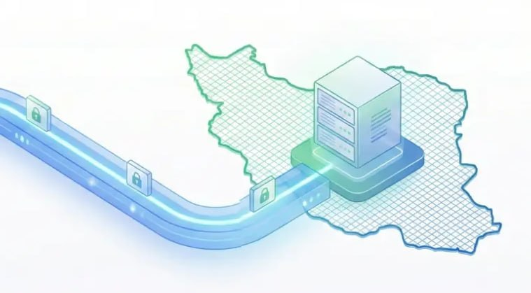

# Latest message in ircfspace

## Message 2209

**Date:** 2026-04-23T09:43:33+00:00

اگر برای باز کردن تلگرام، ایکس، کیف پول رمزارز و ... از روش MasterHttpRelay یا موارد مشابه استفاده می‌کنین، حواستون به این نکات باشه:
۱. آیپی شما تغییر نمی‌کنه: برخلاف فیلترشکن‌های عادی، آیپی شما تو این روش همون ایران می‌مونه. در نتیجه سایت‌های تحریمی براتون باز نمیشن و حتی ممکنه سایت‌های حساس اکانتتون رو به خاطر آی‌پی ایران شناسایی یا مسدود کنن.
۲. از اکانت اصلی جی‌میل استفاده نکنید: گوگل ممکنه اکانت‌هارو مسدود کنه. بهتره ریسک نکنین و از یک اکانت جی‌میل جایگزین استفاده کنین.
©
iAghapour
🔗
ᴡᴇʙꜱɪᴛᴇ
•
ᴠᴘɴʜᴜʙ
•
ɢɪᴛʜᴜʙᴍɪʀʀᴏʀ
@ircfspace

---
