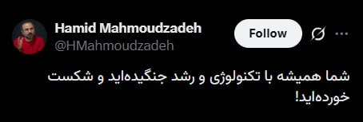

# Channel ircfspace

## Message 2191

نحوه دور زدن فیلترینگ یوتیوب با استفاده از اسکریپت MasterHttpRelay ...
📽
youtu.be/jzaqdKl40Ww
💡
github.com/masterking32/MasterHttpRelayVPN
💡
t.me/ircf_toolbox/23
©
MatinSenPaii
🔗
ᴡᴇʙꜱɪᴛᴇ
•
ᴠᴘɴʜᴜʙ
•
ɢɪᴛʜᴜʙᴍɪʀʀᴏʀ
@ircfspace

---

## Message 2181

**Date:** 2026-04-21T05:34:42+00:00

چرا جمهوری اسلامی ۵۳ روزه اینترنت رو بصورت سراسری بسته؟
قطع سراسری اینترنت و پارازیت روی شبکه‌های ماهواره‌ای، فقط یه تصمیم امنیتی نیستن؛ از نظر روانشناسی و علوم ارتباطات، اینکار مستقیماً روی ذهن و درک آدم‌ها اثر میذاره و عملاً فضا رو برای اثرگذاری پروپاگاندا آماده‌تر می‌کنه.
وقتی دسترسی به اینترنت و رسانه‌های آزاد محدود میشن، آدم‌ها توی Filter Bubble یا یک فضای بسته میفتن، که فقط یک نوع خبر و روایت داخلش می‌چرخه. تو این وضعیت مغز چون گزینه دیگه‌ای نداره، به خاطر کمبود منابع مقایسه‌ای و سوگیری‌های شناختی، وزن‌دهی به اطلاعات موجود بیشتر میشه و احتمالا اونو مبنا قرار میده.
بعدش Confirmation Bias یا همون تمایل ذهن به پذیرفتن چیزهایی که با اطلاعات فعلیش میخونه، قوی‌تر میشه؛ چون عملاً چیزی برای مقایسه وجود نداره. طبق تئوری Agenda-Setting، رسانه‌ای که تنها منبعه، تعیین می‌کنه اصلاً مردم به چه موضوعاتی فکر کنن. در نهایت بخاطر Illusory Truth Effect، هرچی یک روایت بیشتر تکرار بشه، حتی اگه غلط باشه واقعی‌تر بنظر میاد.
به همین دلیله که وقتی اینترنت یا دسترسی به رسانه‌های مختلف برمی‌گرده، ناگهان فضا عوض میشه. آدم‌ها روایت‌های مختلف رو می‌بینن، مقایسه می‌کنن و حتی اگه در حد ساده، دوباره شروع می‌کنن به تحلیل کردن.
پس این تغییری که تو رفتار و طرز فکر بعضی‌ها دیده میشه، عجیب نیست؛ آدم‌ها عوض نمیشن، این محیط اطلاعاتیشونه که داره ذهنشون رو شکل میده.
🔗
ᴡᴇʙꜱɪᴛᴇ
•
ᴠᴘɴʜᴜʙ
•
ɢɪᴛʜᴜʙᴍɪʀʀᴏʀ
@ircfspace

---

## Message 2182

**Date:** 2026-04-21T05:58:29+00:00

وقتی حق دیروز را به عنوان «آپشن امروز» می‌فروشند!
ظهور پدیده
#اینترنت_طبقاتی
در پوشش واژه‌ی
#اینترنت_پرو
، حکایت از تجارتی جدید دارد که در آن «حق دسترسی آزاد»، به ابزاری برای پاداش و تنبیه تبدیل شده است. /سیتنا
🔗
ᴡᴇʙꜱɪᴛᴇ
•
ᴠᴘɴʜᴜʙ
•
ɢɪᴛʜᴜʙᴍɪʀʀᴏʀ
@ircfspace

---

## Message 2184

**Date:** 2026-04-21T06:02:57+00:00

شما همیشه با تکنولوژی و رشد جنگیده‌اید و شکست خورده‌اید!
🔗
ᴡᴇʙꜱɪᴛᴇ
•
ᴠᴘɴʜᴜʙ
•
ɢɪᴛʜᴜʙᴍɪʀʀᴏʀ
@ircfspace

---

## Message 2185

**Date:** 2026-04-21T07:18:47+00:00

کار از کار گذشته دیگر. خبر تعدیل دو هزار نیروی دیجی کالا نشان می‌دهد که کسب‌وکارهای کوچک که فرو ریخته هیچ؛ بزرگ‌ترین کسب‌وکارها و ستون فقرات اقتصاد دیجیتال هم نابود و از هم پاشیده شدند.
جمهوری اسلامی میتوانست با وصل کردن اینترنت نشان دهد که به‌دنبال بازسازی کشور است و به معیشت و زندگی مردم اهمیت میدهد ولی نشان داد که مردم و‌معیشت آنها هیچ اهمیتی برایش ندارد.
بروزرسانی: یکی از اعضای تیم دیجیکالا گفته که این عدد درست نیست.
©
AManafii
🔗
ᴡᴇʙꜱɪᴛᴇ
•
ᴠᴘɴʜᴜʙ
•
ɢɪᴛʜᴜʙᴍɪʀʀᴏʀ
@ircfspace

---

## Message 2186

**Date:** 2026-04-21T07:21:37+00:00

کشتی رو کوبیدن به کوه یخ
#قطع_اینترنت
و مردم دسته دسته دارن می‌افتن توی دریای بیکاری و غرق می‌شن، اما کاپیتان معتقده چند تا قایق نجات برای طبقه اشراف کافیه و نشسته پول می‌شمره و صندلی
#پرو
می‌فروشه.
عده‌ای هم روی تخته‌پاره‌های کانفیگ‌ها مدتیه لرزان روی آب هستن و مقاومت می‌کنند.
©
Hamed
🔗
ᴡᴇʙꜱɪᴛᴇ
•
ᴠᴘɴʜᴜʙ
•
ɢɪᴛʜᴜʙᴍɪʀʀᴏʀ
@ircfspace

---

## Message 2187

**Date:** 2026-04-21T08:45:21+00:00

فیلترچی دوباره دسترسی به گوگل، جی‌میل و گیت‌هاب رو روی ملانت مسدود کرد.
🔗
ᴡᴇʙꜱɪᴛᴇ
•
ᴠᴘɴʜᴜʙ
•
ɢɪᴛʜᴜʙᴍɪʀʀᴏʀ
@ircfspace

---

## Message 2188

**Date:** 2026-04-21T11:46:39+00:00

قطع دسترسی به گوگل، جی‌میل و گیت‌هاب یک اختلال فنی نبود و طبق اخبار رسیده با هدف شناسایی Signature برخی VPNها توسط تیم امن‌افزار گستر شریف متعلق به رسول جلیلی (یکی از افرادی که بعنوان
#قصاب_اینترنت
شناسایی میشه) انجام شد.
این تست با موفقیت در زمان کوتاهی انجام شده و مجددا دسترسی به سرویسهای مذکور رو برگردوندن!
🔗
ᴡᴇʙꜱɪᴛᴇ
•
ᴠᴘɴʜᴜʙ
•
ɢɪᴛʜᴜʙᴍɪʀʀᴏʀ
@ircfspace

---

## Message 2189

**Date:** 2026-04-21T15:30:31+00:00

مدیرعامل دیجی‌کالا گفته خبر تعدیل ۲ هزار نیرو صحت نداره و حدود ۲۰۰ نفر درسته. البته اگر دوباره ۲۰۰ نفر هم تکذیب بشه و بگن ۲۰ نفر بوده، بازم اصل ماجرای تعدیل نیروها در شرایطی که اینترنت کشور ۵۳ روزه بصورت سراسری قطعه، سرجاشه!
🔗
ᴡᴇʙꜱɪᴛᴇ
•
ᴠᴘɴʜᴜʙ
•
ɢɪᴛʜᴜʙᴍɪʀʀᴏʀ
@ircfspace

---

## Message 2190

**Date:** 2026-04-21T15:42:34+00:00

از شرایط جنگی و بحرانی پیش آمده در کشور استفاده کردن و طرح صیانت رو پله به پله اجرا کردن. همه در طول دولتی که با وعده مبارزه با فیلترینگ روی کار آمد.
و حالا با فروش اینترنت پرو، قصد تثبیت شرایط فعلی و قطع و محدودیت کامل اینترنت رو دارن.
©
atakhalighi
🔗
ᴡᴇʙꜱɪᴛᴇ
•
ᴠᴘɴʜᴜʙ
•
ɢɪᴛʜᴜʙᴍɪʀʀᴏʀ
@ircfspace

---

## Message 2192

**Date:** 2026-04-21T15:52:02+00:00

شرکت ماریسکز هشدار داده افراد ناشناس با جعل هویت مقام‌های جمهوری اسلامی، از شرکت‌های کشتیرانی برای عبور امن از تنگه هرمز درخواست پرداخت بصورت رمزارز می‌کنند، که کلاهبرداری است. /رویترز
🔗
ᴡᴇʙꜱɪᴛᴇ
•
ᴠᴘɴʜᴜʙ
•
ɢɪᴛʜᴜʙᴍɪʀʀᴏʀ
@ircfspace

---

## Message 2193

**Date:** 2026-04-21T16:00:15+00:00

تکذیب تعدیل ۲ هزار نفر از پرسنل دیجی‌کالا و تقلیل اون به حدود ۲۰۰ نفر، فقط به بخش قابل مشاهده ماجرا، یعنی همون سطح مربوط میشه. در لایه‌های زیرین، شبکه گسترده‌ای از فروشندگان، تأمین‌کنندگان و کل زنجیره تأمین قرار دارن، که هیچ آمار شفافی از وضعیت اونها منتشر نشده.
در مقیاس کلان، آمار تعدیل نیرو و بیکاری در کشور روندی افزایشی و ملموس داره، اما بدلیل نبود نهادهای مستقل و شفاف برای جمع‌آوری و انتشار داده‌ها، تصویر دقیقی از ابعاد این مسئله در دسترس نیست.
با تداوم قطع گسترده اینترنت که مستقیماً بر کسب‌وکارهای آنلاین اثر میذاره، این روند تشدید و به گسترش بیکاری در لایه‌های مختلف اقتصاد منجر میشه.
🔗
ᴡᴇʙꜱɪᴛᴇ
•
ᴠᴘɴʜᴜʙ
•
ɢɪᴛʜᴜʙᴍɪʀʀᴏʀ
@ircfspace

---

## Message 2194

**Date:** 2026-04-22T06:09:34+00:00

شما
گه
می‌خورید وقتی ۵۳ روزه اینترنت مردم رو قطع کردید، دنبال آزادی بیان می‌گردید.
©
gh0lch0magh
🔗
ᴡᴇʙꜱɪᴛᴇ
•
ᴠᴘɴʜᴜʙ
•
ɢɪᴛʜᴜʙᴍɪʀʀᴏʀ
@ircfspace

---

## Message 2195

**Date:** 2026-04-22T06:28:39+00:00

یک ابزار گرافیکی برای MasterHttpRelay، جهت دور زدن DPI و پنهان‌سازی TLS SNI از طریق یک رله مبتنی بر Google Apps Script، که از پراکسی HTTP و SOCKS5 پشتیبانی می‌کنه.
👉
github.com/therealaleph/MasterHttpRelayVPN-RUST/releases
💡
t.me/PersianGithubMirror/2944
💡
shorturl.at/rJx72
🔗
ᴡᴇʙꜱɪᴛᴇ
•
ᴠᴘɴʜᴜʙ
•
ɢɪᴛʜᴜʙᴍɪʀʀᴏʀ
@ircfspace

---

## Message 2196

**Date:** 2026-04-22T06:46:11+00:00

قطع سراسری اینترنت در ایران وارد روز ۵۴م شده!
رئیس کمیسیون بلاک‌چین نصر کشور برآورد کرده که زیان تحمیل شده به اقتصاد دیجیتال از قطع اینترنت یک میلیارد دلار بوده، وزیر قطع‌ارتباطات گفته تداوم قطع اینترنت اشتغال ۱۰ میلیون ایرانی رو تهدید می‌کنه، رئیس شورای اطلاع‌رسانی دولت گفته بعد از جنگ و پیروزی کامل بر دشمن، اینترنت هم باز میشه و یک نماینده مجلس گفته به جای قطع اینترنت باید از چین الگو بگیریم!
🔗
ᴡᴇʙꜱɪᴛᴇ
•
ᴠᴘɴʜᴜʙ
•
ɢɪᴛʜᴜʙᴍɪʀʀᴏʀ
@ircfspace

---

## Message 2197

**Date:** 2026-04-22T13:28:51+00:00

چندتا سرویس و وب‌سایت دیگه رو روی
#ملانت
به اسم بازگشایی تدریجی اینترنت بین‌الملل باز کردن. بازم این مدل وایت‌لیست کردن باعث نمیشه به آشغالی که در اختیارمون میذارن بگیم اینترنت.
🔗
ᴡᴇʙꜱɪᴛᴇ
•
ᴠᴘɴʜᴜʙ
•
ɢɪᴛʜᴜʙᴍɪʀʀᴏʀ
@ircfspace

---

## Message 2198

**Date:** 2026-04-22T13:31:21+00:00

آخر و عاقبت نوآوری، تلاش، زحمت، استارتاپ و … با قطع اینترنت.
©
kharabatii
🔗
ᴡᴇʙꜱɪᴛᴇ
•
ᴠᴘɴʜᴜʙ
•
ɢɪᴛʜᴜʙᴍɪʀʀᴏʀ
@ircfspace

---

## Message 2199

**Date:** 2026-04-22T13:33:40+00:00

میگن از دلایل قطع اینترنت، به دلیل مسائل امنیتی و حفاظت از جان افراد مهم هست. خب! خیلی ساده هست. به اون افراد مهم بگید نیان اینترنت! چرا ملت را بیچاره و اقتصاد را فلج میکنید!
همونایی که در خطر هستن الان با سیم‌کارت سفید در واتس‌اپ، تلگرام و ایکس هستن! زیبا نیست؟!
©
EzHosseini
🔗
ᴡᴇʙꜱɪᴛᴇ
•
ᴠᴘɴʜᴜʙ
•
ɢɪᴛʜᴜʙᴍɪʀʀᴏʀ
@ircfspace

---

## Message 2200

**Date:** 2026-04-22T13:40:39+00:00

بعد از اعطای
#اینترنت_پرو
به اساتید و هیات‌های علمی، سازمان نظام صنفی رایانه‌ای، سازمان نظام پزشکی و ...، شبکه فروش و خدمات حضوری اپراتورها برای معرفی و جذب شرکت‌های فعال وارد عمل شدن!
🔗
ᴡᴇʙꜱɪᴛᴇ
•
ᴠᴘɴʜᴜʙ
•
ɢɪᴛʜᴜʙᴍɪʀʀᴏʀ
@ircfspace

---

## Message 2201

**Date:** 2026-04-22T13:42:15+00:00

این سطح از فیلترینگ دیگه به آخوند بر نمی‌گرده. به عشق آخوند بر می‌گرده. شما مستعان رو داده بودی دست آخوند می‌گفتی فیلترینگ همینه، همین بودجه رو بهت داده بود. خوش‌رقصی اضافی ابتکار خودتون بوده دیگه.
©
Gerduo
🔗
ᴡᴇʙꜱɪᴛᴇ
•
ᴠᴘɴʜᴜʙ
•
ɢɪᴛʜᴜʙᴍɪʀʀᴏʀ
@ircfspace

---
