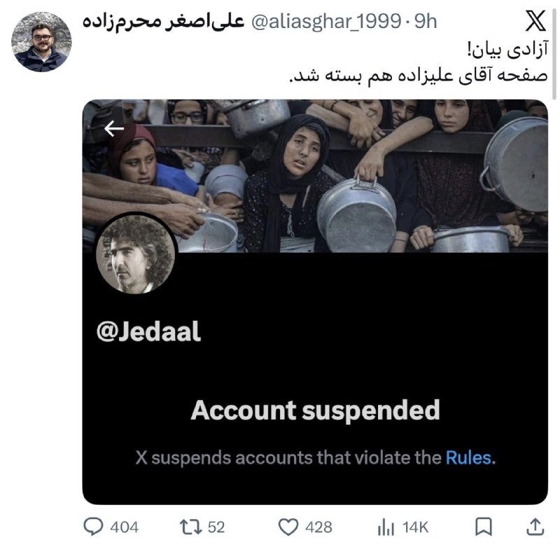
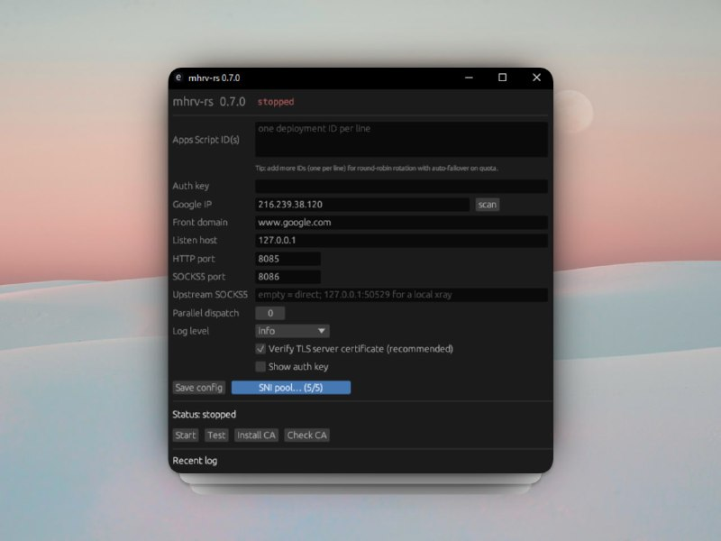

# Channel ircfspace

## Message 2191

نحوه دور زدن فیلترینگ یوتیوب با استفاده از اسکریپت MasterHttpRelay ...
📽
youtu.be/jzaqdKl40Ww
💡
github.com/masterking32/MasterHttpRelayVPN
💡
t.me/ircf_toolbox/23
©
MatinSenPaii
🔗
ᴡᴇʙꜱɪᴛᴇ
•
ᴠᴘɴʜᴜʙ
•
ɢɪᴛʜᴜʙᴍɪʀʀᴏʀ
@ircfspace

---

## Message 2190

**Date:** 2026-04-21T15:42:34+00:00

از شرایط جنگی و بحرانی پیش آمده در کشور استفاده کردن و طرح صیانت رو پله به پله اجرا کردن. همه در طول دولتی که با وعده مبارزه با فیلترینگ روی کار آمد.
و حالا با فروش اینترنت پرو، قصد تثبیت شرایط فعلی و قطع و محدودیت کامل اینترنت رو دارن.
©
atakhalighi
🔗
ᴡᴇʙꜱɪᴛᴇ
•
ᴠᴘɴʜᴜʙ
•
ɢɪᴛʜᴜʙᴍɪʀʀᴏʀ
@ircfspace

---

## Message 2192

**Date:** 2026-04-21T15:52:02+00:00

شرکت ماریسکز هشدار داده افراد ناشناس با جعل هویت مقام‌های جمهوری اسلامی، از شرکت‌های کشتیرانی برای عبور امن از تنگه هرمز درخواست پرداخت بصورت رمزارز می‌کنند، که کلاهبرداری است. /رویترز
🔗
ᴡᴇʙꜱɪᴛᴇ
•
ᴠᴘɴʜᴜʙ
•
ɢɪᴛʜᴜʙᴍɪʀʀᴏʀ
@ircfspace

---

## Message 2193

**Date:** 2026-04-21T16:00:15+00:00

تکذیب تعدیل ۲ هزار نفر از پرسنل دیجی‌کالا و تقلیل اون به حدود ۲۰۰ نفر، فقط به بخش قابل مشاهده ماجرا، یعنی همون سطح مربوط میشه. در لایه‌های زیرین، شبکه گسترده‌ای از فروشندگان، تأمین‌کنندگان و کل زنجیره تأمین قرار دارن، که هیچ آمار شفافی از وضعیت اونها منتشر نشده.
در مقیاس کلان، آمار تعدیل نیرو و بیکاری در کشور روندی افزایشی و ملموس داره، اما بدلیل نبود نهادهای مستقل و شفاف برای جمع‌آوری و انتشار داده‌ها، تصویر دقیقی از ابعاد این مسئله در دسترس نیست.
با تداوم قطع گسترده اینترنت که مستقیماً بر کسب‌وکارهای آنلاین اثر میذاره، این روند تشدید و به گسترش بیکاری در لایه‌های مختلف اقتصاد منجر میشه.
🔗
ᴡᴇʙꜱɪᴛᴇ
•
ᴠᴘɴʜᴜʙ
•
ɢɪᴛʜᴜʙᴍɪʀʀᴏʀ
@ircfspace

---

## Message 2194

**Date:** 2026-04-22T06:09:34+00:00

شما
گه
می‌خورید وقتی ۵۳ روزه اینترنت مردم رو قطع کردید، دنبال آزادی بیان می‌گردید.
©
gh0lch0magh
🔗
ᴡᴇʙꜱɪᴛᴇ
•
ᴠᴘɴʜᴜʙ
•
ɢɪᴛʜᴜʙᴍɪʀʀᴏʀ
@ircfspace

---

## Message 2195

**Date:** 2026-04-22T06:28:39+00:00

یک ابزار گرافیکی برای MasterHttpRelay، جهت دور زدن DPI و پنهان‌سازی TLS SNI از طریق یک رله مبتنی بر Google Apps Script، که از پراکسی HTTP و SOCKS5 پشتیبانی می‌کنه.
👉
github.com/therealaleph/MasterHttpRelayVPN-RUST/releases
💡
t.me/PersianGithubMirror/2944
💡
shorturl.at/rJx72
🔗
ᴡᴇʙꜱɪᴛᴇ
•
ᴠᴘɴʜᴜʙ
•
ɢɪᴛʜᴜʙᴍɪʀʀᴏʀ
@ircfspace

---

## Message 2196

**Date:** 2026-04-22T06:46:11+00:00

قطع سراسری اینترنت در ایران وارد روز ۵۴م شده!
رئیس کمیسیون بلاک‌چین نصر کشور برآورد کرده که زیان تحمیل شده به اقتصاد دیجیتال از قطع اینترنت یک میلیارد دلار بوده، وزیر قطع‌ارتباطات گفته تداوم قطع اینترنت اشتغال ۱۰ میلیون ایرانی رو تهدید می‌کنه، رئیس شورای اطلاع‌رسانی دولت گفته بعد از جنگ و پیروزی کامل بر دشمن، اینترنت هم باز میشه و یک نماینده مجلس گفته به جای قطع اینترنت باید از چین الگو بگیریم!
🔗
ᴡᴇʙꜱɪᴛᴇ
•
ᴠᴘɴʜᴜʙ
•
ɢɪᴛʜᴜʙᴍɪʀʀᴏʀ
@ircfspace

---

## Message 2197

**Date:** 2026-04-22T13:28:51+00:00

چندتا سرویس و وب‌سایت دیگه رو روی
#ملانت
به اسم بازگشایی تدریجی اینترنت بین‌الملل باز کردن. بازم این مدل وایت‌لیست کردن باعث نمیشه به آشغالی که در اختیارمون میذارن بگیم اینترنت.
🔗
ᴡᴇʙꜱɪᴛᴇ
•
ᴠᴘɴʜᴜʙ
•
ɢɪᴛʜᴜʙᴍɪʀʀᴏʀ
@ircfspace

---

## Message 2198

**Date:** 2026-04-22T13:31:21+00:00

آخر و عاقبت نوآوری، تلاش، زحمت، استارتاپ و … با قطع اینترنت.
©
kharabatii
🔗
ᴡᴇʙꜱɪᴛᴇ
•
ᴠᴘɴʜᴜʙ
•
ɢɪᴛʜᴜʙᴍɪʀʀᴏʀ
@ircfspace

---

## Message 2199

**Date:** 2026-04-22T13:33:40+00:00

میگن از دلایل قطع اینترنت، به دلیل مسائل امنیتی و حفاظت از جان افراد مهم هست. خب! خیلی ساده هست. به اون افراد مهم بگید نیان اینترنت! چرا ملت را بیچاره و اقتصاد را فلج میکنید!
همونایی که در خطر هستن الان با سیم‌کارت سفید در واتس‌اپ، تلگرام و ایکس هستن! زیبا نیست؟!
©
EzHosseini
🔗
ᴡᴇʙꜱɪᴛᴇ
•
ᴠᴘɴʜᴜʙ
•
ɢɪᴛʜᴜʙᴍɪʀʀᴏʀ
@ircfspace

---

## Message 2200

**Date:** 2026-04-22T13:40:39+00:00

بعد از اعطای
#اینترنت_پرو
به اساتید و هیات‌های علمی، سازمان نظام صنفی رایانه‌ای، سازمان نظام پزشکی و ...، شبکه فروش و خدمات حضوری اپراتورها برای معرفی و جذب شرکت‌های فعال وارد عمل شدن!
🔗
ᴡᴇʙꜱɪᴛᴇ
•
ᴠᴘɴʜᴜʙ
•
ɢɪᴛʜᴜʙᴍɪʀʀᴏʀ
@ircfspace

---

## Message 2201

**Date:** 2026-04-22T13:42:15+00:00

این سطح از فیلترینگ دیگه به آخوند بر نمی‌گرده. به عشق آخوند بر می‌گرده. شما مستعان رو داده بودی دست آخوند می‌گفتی فیلترینگ همینه، همین بودجه رو بهت داده بود. خوش‌رقصی اضافی ابتکار خودتون بوده دیگه.
©
Gerduo
🔗
ᴡᴇʙꜱɪᴛᴇ
•
ᴠᴘɴʜᴜʙ
•
ɢɪᴛʜᴜʙᴍɪʀʀᴏʀ
@ircfspace

---

## Message 2202

**Date:** 2026-04-23T07:34:21+00:00

جمله کاملتر:
اینترنت طبقاتی و
#اینترنت_پرو
با سیاست‌های دولت و رئیس‌جمهور در تضاده و رئیس جمهور در ایران هیچ‌کاره است.
🔗
ᴡᴇʙꜱɪᴛᴇ
•
ᴠᴘɴʜᴜʙ
•
ɢɪᴛʜᴜʙᴍɪʀʀᴏʀ
@ircfspace

---

## Message 2203

**Date:** 2026-04-23T07:39:41+00:00

نت‌بلاکس: قطع اینترنت در ایران وارد پنجاه‌وپنجمین روز متوالی خود شده و پس از ۱۲۹۶ ساعت، سطح اتصال به حدود ۲٪ از حالت عادی سقوط کرده است.
🔗
ᴡᴇʙꜱɪᴛᴇ
•
ᴠᴘɴʜᴜʙ
•
ɢɪᴛʜᴜʙᴍɪʀʀᴏʀ
@ircfspace

---

## Message 2204

**Date:** 2026-04-23T07:45:57+00:00

لابد روزی تامین اجتماعی هم برای
#بیمه_بیکاری
بسته «تامین اجتماعی پرو» خواهد فروخت.
جیک وکیل و وزیر «خادم ملت» هم در برابر خفه کردن صدای ۹۰ میلیون نفر و ظلم و تبعیض بزرگ
#اینترنت_طبقاتی
در نمیاد؛ البته تعجبی نیست وقتی پیشتر در برابر جان آدم‌ها هم ساکت بودن.
©
Hamed
🔗
ᴡᴇʙꜱɪᴛᴇ
•
ᴠᴘɴʜᴜʙ
•
ɢɪᴛʜᴜʙᴍɪʀʀᴏʀ
@ircfspace

---

## Message 2205

**Date:** 2026-04-23T07:47:19+00:00

این اینترنت لعنتی رو باز کنید. خدا رو شکر زندگی اقتصادیمون هم به جایی رسوندید که توان خرید فیلترشکن چند میلیونیتون هم نداریم.
©
zahrakeshvari
🔗
ᴡᴇʙꜱɪᴛᴇ
•
ᴠᴘɴʜᴜʙ
•
ɢɪᴛʜᴜʙᴍɪʀʀᴏʀ
@ircfspace

---

## Message 2206

**Date:** 2026-04-23T08:03:36+00:00

یک تحلیل درباره "گلوگاه بودن تنگه هرمز و پیامدهای قطع کابل‌های اینترنت برای کشورهای حاشیه خلیج فارس" مطرح شده، در حالی که "ایران به‌دلیل اتکای بیشتر به مسیرهای زمینی از طریق ترکیه، ارمنستان و آذربایجان و سهم کمتر کابل‌های جنوبی در تأمین ترافیک، آسیب‌پذیری کمتری در این سناریو داره".
برخی رسانه‌های خارج از کشور از این خبر تسنیم برداشت "تهدید" به قطع کردن زیرساخت‌های ارتباطی کشورهای حاشیه خلیج فارس در تنگه هرمز داشتن، اما این برداشت بیشتر نتیجه تفسیر و فضای سیاسی و جنگیه و صراحتا چنین تهدیدی مطرح نشده.
🔗
ᴡᴇʙꜱɪᴛᴇ
•
ᴠᴘɴʜᴜʙ
•
ɢɪᴛʜᴜʙᴍɪʀʀᴏʀ
@ircfspace

---

## Message 2207

**Date:** 2026-04-23T08:08:55+00:00

مورد داشتیم طرف اومده اسم برند یه داروی مهمش رو گفته که شدیدا دنبالشه، ولی چون اسم ژنریک [عمومی] رو نمیدونست و اینترنت نداشتیم سرچ کنیم گفتیم برو تا فیلترشکن وصل شد بهت زنگ میزنیم، میگیم دارو رو داریم یا نه!
نبود اینترنت تقریبا همه رو فلج کرده!
©
blackmahs
🔗
ᴡᴇʙꜱɪᴛᴇ
•
ᴠᴘɴʜᴜʙ
•
ɢɪᴛʜᴜʙᴍɪʀʀᴏʀ
@ircfspace

---

## Message 2208

**Date:** 2026-04-23T09:31:00+00:00

کاری اگر در توانم بوده بی‌منت انجام دادم، اما در شرایط فعلی کار بیشتری ازم برنمیاد. یادمم نمیاد از کسی پولی دریافت کرده باشم، یا بدهی‌ای وجود داشته باشه که حالا بعضیا بابتش طلبکارن!
حدود ۲ ماهه که کسب‌وکارم بخاطر قطع سراسری اینترنت عملاً متوقف شده. مثل خیلی‌های دیگه با فشار مالی، بدهی و سختی روزمره سعی کردم صورتمو سرخ نگه دارم. نه درخواست حمایت و دونیت داشتم، نه تبلیغی نمایش دادم، نه فاندی گرفتم.
البته انگار فهمیدنش برای یه تعداد اندکی سخته؛ پس بهتره شکایتشون رو ببرن پیش رئیس‌جمهور و وزیر قطع‌ارتباطاتشون!
🔗
ᴡᴇʙꜱɪᴛᴇ
•
ᴠᴘɴʜᴜʙ
•
ɢɪᴛʜᴜʙᴍɪʀʀᴏʀ
@ircfspace

---

## Message 2209

**Date:** 2026-04-23T09:43:33+00:00

اگر برای باز کردن تلگرام، ایکس، کیف پول رمزارز و ... از روش MasterHttpRelay یا موارد مشابه استفاده می‌کنین، حواستون به این نکات باشه:
۱. آیپی شما تغییر نمی‌کنه: برخلاف فیلترشکن‌های عادی، آیپی شما تو این روش همون ایران می‌مونه. در نتیجه سایت‌های تحریمی براتون باز نمیشن و حتی ممکنه سایت‌های حساس اکانتتون رو به خاطر آی‌پی ایران شناسایی یا مسدود کنن.
۲. از اکانت اصلی جی‌میل استفاده نکنید: گوگل ممکنه اکانت‌هارو مسدود کنه. بهتره ریسک نکنین و از یک اکانت جی‌میل جایگزین استفاده کنین.
©
iAghapour
🔗
ᴡᴇʙꜱɪᴛᴇ
•
ᴠᴘɴʜᴜʙ
•
ɢɪᴛʜᴜʙᴍɪʀʀᴏʀ
@ircfspace

---
