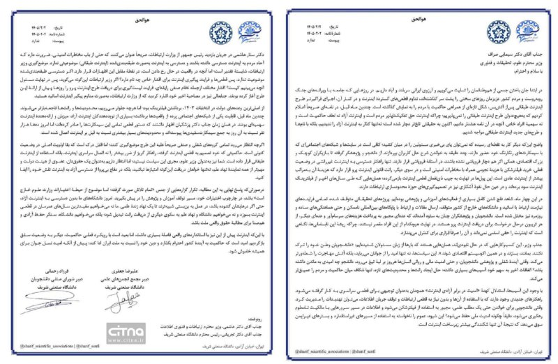
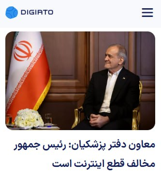
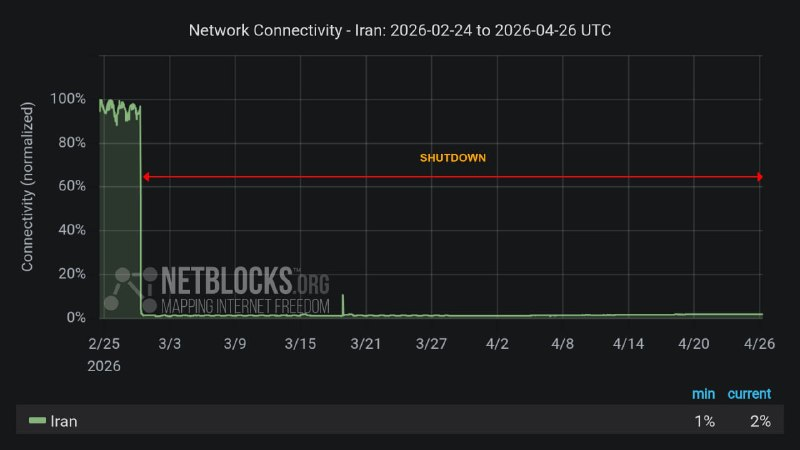
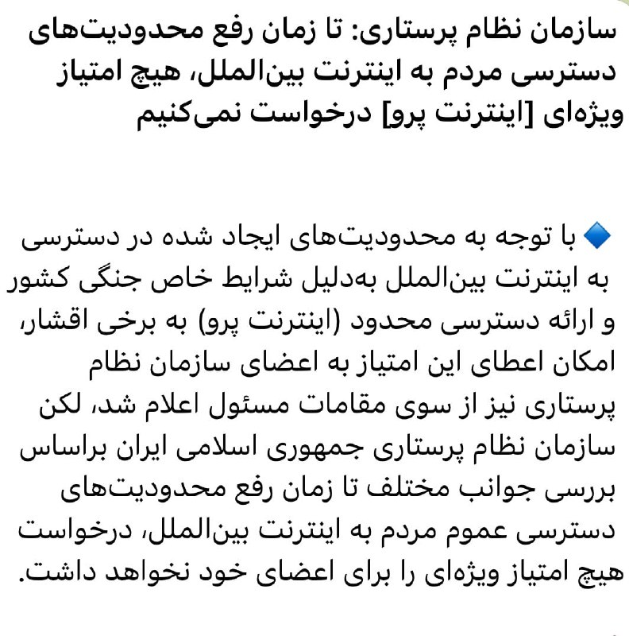
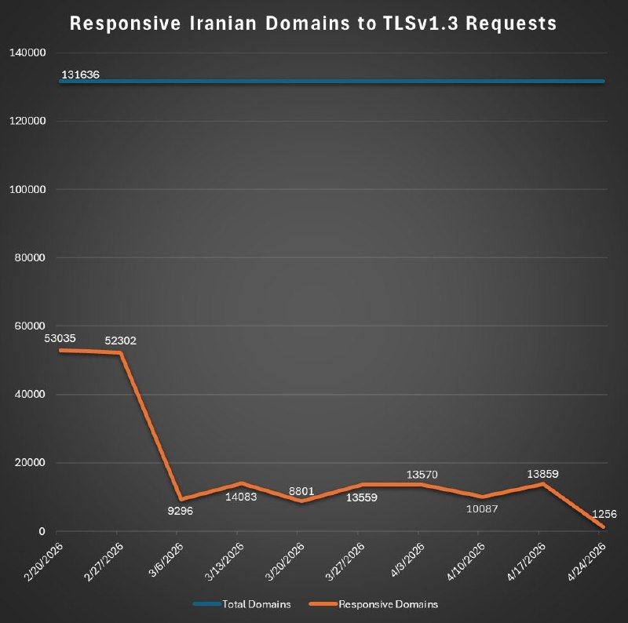
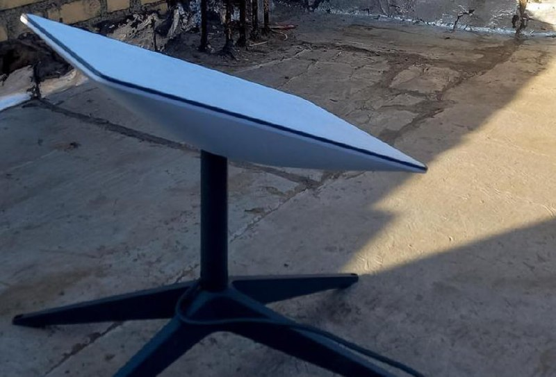
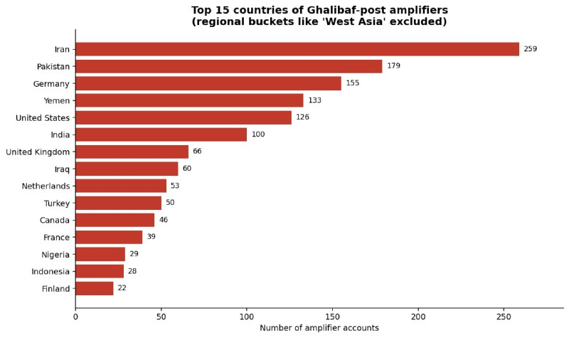
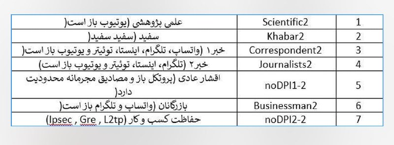
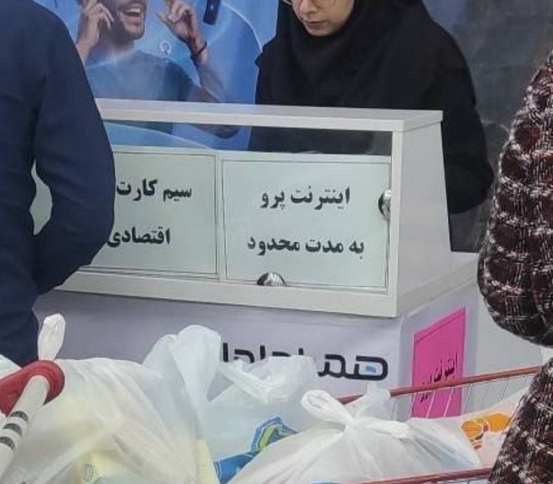
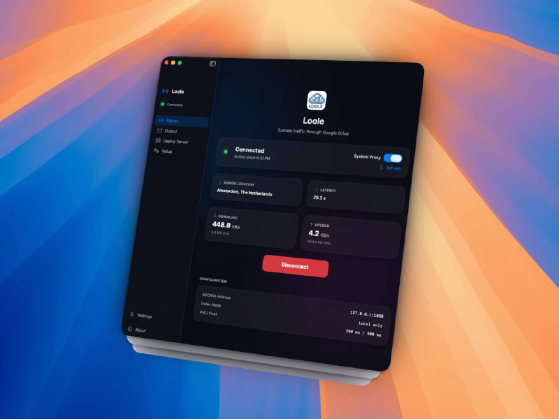

# Channel ircfspace

## Message 2218

**Date:** 2026-04-25T18:42:09+00:00

از صبح با خودم کلنجار رفتم که امروز نگم چندمین روزه اینترنت رو بصورت سراسری در ایران قطع کردن، ولی واقعاً نمیشه سکوت کرد. یه عده که یا شکم سیرن یا خودشونو زدن به نفهمی، با چسبوندن یه مشت توجیه پوشالی مثل امنیت و تدبیر و از این مزخرفات، چشمشونو بستن روی این همه فشاری که به زندگی مردم اومده؛ کسب‌وکارهایی که خوابیدن، آدم‌هایی که بیکار یا تعدیل شدن، حقوق‌هایی که عقب افتاده، سفره‌هایی که هر روز کوچیکتر میشن، و دردسرهایی که برای کار و درس و آموزش درست شده.
بعضی چیزا رو نباید گذاشت از یاد برن. مثل ده‌ها هزار نفری که دی‌ماه قتل‌عام کردن؛ امروز هم پنجاه‌وهفتمین روز از قطع سراسری اینترنته. ۵۷ روز خاموشی دیجیتال، زیر سایه جمهوری اسلامی ادامه داره.
🔗
ᴡᴇʙꜱɪᴛᴇ
•
ᴠᴘɴʜᴜʙ
•
ɢɪᴛʜᴜʙᴍɪʀʀᴏʀ
@ircfspace

---

## Message 2219

**Date:** 2026-04-25T18:58:39+00:00

قطع اینترنت امنیت ایجاد نمی‌کند
قطع اینترنت نه‌تنها امنیت ایجاد نمی‌کند، بلکه آن را تضعیف می‌کند. امنیت واقعی بر پایه اتصال، بروزرسانی مداوم، ابزارهای جهانی و معماری‌های مقاوم و غیرمتمرکز است، نه ایزوله‌سازی.
شبکه‌های بسته با ایجاد تمرکز، اهدافی آسیب‌پذیرتر برای حمله می‌سازند. از طرفی، تهدیدها فقط از بیرون نیستند و می‌توانند از داخل شبکه یا زنجیره تأمین شکل بگیرند.
هدف جمهوری اسلامی از قطع اینترنت، امنیت نیست؛ بلکه قطع ارتباط مردم است. تجربه هک‌های سریالی سامانه‌های داخلی هم نشان داده که ایده ایزوله‌سازی، رویکردی منسوخ است.
حکومتی که صنایع فولادش به‌خاطر نرم‌افزارهای قفل‌شکسته هک شده و سامانه سوختش به‌دلیل استفاده از ویندوز سرور منقضی از دسترس خارج شده، چطور ادعا می‌کند می‌تواند با چیزی که اینترنت ملی می‌نامد، امنیت ایجاد کند؟
👉
telegra.ph/Internet-shutdowns-do-not-create-security-04-25
©
AManafii
🔗
ᴡᴇʙꜱɪᴛᴇ
•
ᴠᴘɴʜᴜʙ
•
ɢɪᴛʜᴜʙᴍɪʀʀᴏʀ
@ircfspace

---

## Message 2220

**Date:** 2026-04-25T19:06:06+00:00

دو تشکل دانشجویی دانشگاه شریف به
#اینترنت_طبقاتی
و ادامه
#قطع_اینترنت
انتقاد کردند.
در بیانیه شورای صنفی دانشجویان و مجمع انجمن‌های علمی دانشگاه صنعتی شریف خطاب به وزیر علوم آمده که "امروز دانشگاه‌های ما بدون دسترسی به اینترنت آزاد، حتی اگر درهایشان گشوده باشد، در عمل به بن‌بست شبیه‌ترند تا یک نهاد زنده علمی. ما نه می‌خواهیم مفیدترین سال‌های عمرمان در قطع اینترنت بسوزد و نه می‌خواهیم دانشگاه و نهاد علم به سکوی دیگری از دریافت رانت تبدیل شود".
©
Citna
🔗
ᴡᴇʙꜱɪᴛᴇ
•
ᴠᴘɴʜᴜʙ
•
ɢɪᴛʜᴜʙᴍɪʀʀᴏʀ
@ircfspace

---

## Message 2221

**Date:** 2026-04-26T14:15:20+00:00

خب، ما الان چکار کنیم؟
🔗
ᴡᴇʙꜱɪᴛᴇ
•
ᴠᴘɴʜᴜʙ
•
ɢɪᴛʜᴜʙᴍɪʀʀᴏʀ
@ircfspace

---

## Message 2222

**Date:** 2026-04-26T14:17:23+00:00

در شرایطی که اینترنت کشور (به جز نورچشمی‌ها) قطعه و هر تلاشی برای دسترسی از روزنه‌های یافته شده زود مسدود می‌شه، یک سری «سرور» اینترنت دارن و روشون VPN با ترافیک بالا می‌فروشن. نمی‌تونن این ترافیک رو در شبکه ببینن؟ حتماً می‌تونن.
پس چطوری بازه؟ TCP over corruption
©
Hamed
🔗
ᴡᴇʙꜱɪᴛᴇ
•
ᴠᴘɴʜᴜʙ
•
ɢɪᴛʜᴜʙᴍɪʀʀᴏʀ
@ircfspace

---

## Message 2223

**Date:** 2026-04-26T14:20:51+00:00

۵۸ روز قطع اینترنت
۵۸ روز خاموشی سراسری
۵۸ روز سرکوب دیجیتال
🔗
ᴡᴇʙꜱɪᴛᴇ
•
ᴠᴘɴʜᴜʙ
•
ɢɪᴛʜᴜʙᴍɪʀʀᴏʀ
@ircfspace

---

## Message 2224

**Date:** 2026-04-26T14:27:59+00:00

سازمان نظام پرستاری گفته با وجود امکان دریافت امتیاز اینترنت پرو، تا زمان رفع محدودیت‌های دسترسی عموم مردم به اینترنت بین‌الملل، درخواست هیچ امتیاز ویژه‌ای را برای اعضای خود نخواهد داشت.
©
ardalanmousavi
🔗
ᴡᴇʙꜱɪᴛᴇ
•
ᴠᴘɴʜᴜʙ
•
ɢɪᴛʜᴜʙᴍɪʀʀᴏʀ
@ircfspace

---

## Message 2225

**Date:** 2026-04-26T14:31:33+00:00

مسئله فقط اینترنت نیست، ما از مدار روایت جهان خارج شدیم.
بی‌سر‌و‌صدا، از جایی که فردا ساخته میشه، کنار گذاشته شدیم. جهان جلو میره، ما بیرون قاب موندیم. یک حذف تدریجی از روایت‌ها و اتفاقات جهانی.
©
Mardetanha
🔗
ᴡᴇʙꜱɪᴛᴇ
•
ᴠᴘɴʜᴜʙ
•
ɢɪᴛʜᴜʙᴍɪʀʀᴏʀ
@ircfspace

---

## Message 2226

**Date:** 2026-04-26T14:33:35+00:00

حدود ۲ سال پیش یه پروژه تو گیت‌هاب راه افتاد، که خودکار هر هفته حدود ۱۳۱ هزار تا دامنهٔ ایرانی رو از نظر TLSv1.3 اسکن می‌کنه و یه لیست از اونایی که این پروتکل رو ساپورت می‌کنن درمیاره.
قبل از شروع جنگ، حدود ۵۳ هزار تا دامنه فعال بودن. بعد از قطع اینترنت، این عدد رسید به حدود ۱۳ هزار تا. بعد از اعمال NAT سراسری هم رسیده به حدود ۱۲۰۰ تا!
👉
github.com/aleskxyz/iran-domains
©
aleskxyz
🔗
ᴡᴇʙꜱɪᴛᴇ
•
ᴠᴘɴʜᴜʙ
•
ɢɪᴛʜᴜʙᴍɪʀʀᴏʀ
@ircfspace

---

## Message 2227

**Date:** 2026-04-26T14:35:26+00:00

مرکز اطلاع‌رسانی فرماندهی انتظامی تهران بزرگ از پلمب ۳ واحد صنفی در شمال غرب تهران خبر داد. بر اساس این اطلاعیه، دلیل پلمب این سه واحد صنفی "استفاده غیرمجاز از تجهیزات اینترنت ماهواره‌ای" عنوان شده است.
©
dw_persian
🔗
ᴡᴇʙꜱɪᴛᴇ
•
ᴠᴘɴʜᴜʙ
•
ɢɪᴛʜᴜʙᴍɪʀʀᴏʀ
@ircfspace

---

## Message 2228

**Date:** 2026-04-26T14:36:39+00:00

قطع اینترنت، روشن‌ترین رفراندوم است. فقط حکومتی حاضر می‌شود میلیون‌ها نفر را با قطع اینترنت بی‌کار، هزاران کسب‌وکار را تعطیل و میلیاردها دلار خسارت به مردم بزند که یقین دارد طرفدارانش در اقلیت محض هستند.
قطع اینترنت ۹۰ میلیون مردم ایران، بزرگ‌ترین گروگان‌گیری تاریخ است.
©
SharifiZarchi
🔗
ᴡᴇʙꜱɪᴛᴇ
•
ᴠᴘɴʜᴜʙ
•
ɢɪᴛʜᴜʙᴍɪʀʀᴏʀ
@ircfspace

---

## Message 2229

**Date:** 2026-04-26T14:43:09+00:00

ظاهرا جمهوری اسلامی یه بخش زیادی از بودجه پدافند غیرعاملش رو‌ هزینه خرید لایک از پاکستان کرده. باقر و عباس هر مهملی میگن ده‌هاهزار پاکستانی براشون لایک می‌ریزند. قبل از پروژه لایک‌ریزی صفحه بزرگواران سوت و‌ کور بود.
©
SGhasseminejad
حدود دو هزار حساب Amplifierهای پست‌های قالیباف رو بررسی کردیم، که همه‌ی دیتا و لوکیشن‌ها رو اینجا منتشر می‌کنیم:
۱- بیشتر این حساب‌ها از کشورهای ایران، پاکستان، آلمان و یمن هستند.
۲- پنجاه و دو درصد این حساب‌ها بعد از هفت اکتبر ساخته شدند.
۳- سی و دو درصد این حساب‌ها رفتار بات گونه دارند و انسان پشت این حساب‌ها نیست.
👉
github.com/goldenowlosint/Islamic-Republic-Influence-Networks/blob/main/Data/Ghalibaf.json
©
sabber_dev
🔗
ᴡᴇʙꜱɪᴛᴇ
•
ᴠᴘɴʜᴜʙ
•
ɢɪᴛʜᴜʙᴍɪʀʀᴏʀ
@ircfspace

---

## Message 2230

**Date:** 2026-04-26T14:58:56+00:00

دولت همچنان بر مخالفت خود با «اینترنت طبقاتی» تأکید می‌کند، اما بررسی‌ها از چند منبع نشان می‌دهد طرحی که امروز با نام اینترنت پرو شناخته می‌شود، نه‌تنها به تصویب نهادهای بالادستی رسیده، بلکه اجرای آن به‌طور مشخص به دستگاه‌های مربوطه از‌جمله به مرکز ملی فضای مجازی سپرده شده است. /شرق
🔗
ᴡᴇʙꜱɪᴛᴇ
•
ᴠᴘɴʜᴜʙ
•
ɢɪᴛʜᴜʙᴍɪʀʀᴏʀ
@ircfspace

---

## Message 2231

**Date:** 2026-04-26T15:33:04+00:00

طبقات مختلف
#اینترنت_طبقاتی
©
mamlekate
🔗
ᴡᴇʙꜱɪᴛᴇ
•
ᴠᴘɴʜᴜʙ
•
ɢɪᴛʜᴜʙᴍɪʀʀᴏʀ
@ircfspace

---

## Message 2232

**Date:** 2026-04-27T05:06:44+00:00

۵۹ روز با قطع اینترنت مارو از جهان جدا کردن؛ به اسم امنیت!
بعدش اینترنت رو سهمیه‌بندی کردن و گذاشتن پشت باجه فروش.
اسم این دکان‌بازار امنیته؟ یا رسمی‌کردن نابرابری؟
🔗
ᴡᴇʙꜱɪᴛᴇ
•
ᴠᴘɴʜᴜʙ
•
ɢɪᴛʜᴜʙᴍɪʀʀᴏʀ
@ircfspace

---

## Message 2233

**Date:** 2026-04-27T05:09:26+00:00

یه تشکر هم از بچه‌های سوپر اپلیکیشن روبیکا بکنیم. واقعا ساختن برنامه‌ای که فیلتر نیست، ولی از اونایی که فیلترن ضعیفتر و کندتر کار میکنه کار آسونی نیست.
©
danyydrinkwater
🔗
ᴡᴇʙꜱɪᴛᴇ
•
ᴠᴘɴʜᴜʙ
•
ɢɪᴛʜᴜʙᴍɪʀʀᴏʀ
@ircfspace

---

## Message 2234

**Date:** 2026-04-27T05:10:56+00:00

من تحقیق کردم، چون اینترنت پرو گیگی ۴۰ هزار تومنه، دیگه برا جاسوس نمیصرفه جاسوسی کنه. اینجوری امنیت تامین میشه. ایول.
©
SMoslemi
🔗
ᴡᴇʙꜱɪᴛᴇ
•
ᴠᴘɴʜᴜʙ
•
ɢɪᴛʜᴜʙᴍɪʀʀᴏʀ
@ircfspace

---

## Message 2235

**Date:** 2026-04-27T05:22:50+00:00

اپ Loole یک ابزار مدرن برای مدیریت تانل SOCKS5 در سیستم‌عامل macOS هست، که برای عبور از محدودیت‌های شبکه طراحی شده و با استفاده از Google Drive و روش MasterHttpRelay، یک مسیر ارتباطی پایدار و کمتر قابل‌شناسایی ایجاد می‌کنه.
فرآیند راه‌اندازی بجای درگیری با مراحل پیچیده و زمان‌بر، از طریق یک ویزارد ساده انجام میشه که کاربر رو قدم‌به‌قدم هدایت می‌کنه و حتی بخش‌های حساس مثل تنظیمات Google Cloud رو با راهنمایی دقیق و لینک‌های مستقیم پوشش میده.
👉
github.com/g3ntrix/Loole/releases/latest
💡
t.me/PersianGithubMirror/3455
🔗
ᴡᴇʙꜱɪᴛᴇ
•
ᴠᴘɴʜᴜʙ
•
ɢɪᴛʜᴜʙᴍɪʀʀᴏʀ
@ircfspace

---

## Message 2236

**Date:** 2026-04-27T05:31:57+00:00

در آپدیت جدید theFeed مشکل نمایش بعضی پست‌ها به شکل نظرسنجی برطرف شده، باگ هنگ کردن اپلیکیشن رفع شده و امکان اشتراک کلاینت روی شبکه اضافه شده.
پروژه دفید یه راهکار مبتنی بر DNS برای دسترسی به محتوای کانال‌های تلگرام توی شرایط فیلترینگ شدید اینترنت و مواقعی هست که همه مسیرهای معمول بسته میشن، اما DNS هنوز قابل استفاده می‌مونه. ایده اصلی اینه که بدون نیاز به اتصال مستقیم به تلگرام، بتونی آخرین پیام کانال‌هارو دریافت کنی.
سمت سرور (خارج از ایران) به تلگرام وصل میشه و پیام‌هارو می‌خونه، بعد اونهارو بصورت پاسخ‌های DNS از نوع TXT و به شکل رمزنگاری‌شده در اختیار کلاینت قرار میده. سمت کاربر، کلاینت با تعداد محدودی کوئری DNS میتونه این داده‌ها رو بازیابی کنه. طراحی سیستم طوریه که مصرف کوئری پایین بمونه و در عین حال در برابر محدودیت‌ها و فیلترینگ مقاوم باشه.
برای اینکه ترافیک قابل شناسایی نباشه، از تکنیک‌های مختلف ضد DPI مثل padding تصادفی، تغییر اندازه بلاک‌ها و پخش کردن کوئری‌ها بین resolverهای مختلف استفاده شده. کل ارتباط رمزنگاری‌شده هست و هر درخواست بصورت مستقل پردازش میشه، تا ردگیری سخت‌تر بشه.
کلاینت یه رابط وب داره که امکاناتش فراتر از فقط خوندن پیام‌هاست. امکان جستجو بین پیام‌ها، کپی گرفتن از چند پیام، نمایش لینک‌ها، ریپلای‌ها و تا حدی نظرسنجی‌ها اضافه شده. اگر سمت سرور اجازه داده شده باشه، حتی می‌تونی پیام ارسال کنی یا کانال‌ها رو مدیریت کنی.
یکی از تغییرات مهم نسخه‌های اخیر، اضافه شدن بانک Resolver مشترکه؛ یعنی دیگه هر کانفیگ لیست جدا نداره و همه resolverها یکجا نگهداری و امتیازدهی میشن، برنامه هم بصورت دوره‌ای اونها رو بررسی می‌کنه تا بهترین‌ها استفاده بشن. یه اسکنر داخلی هم داره که می‌تونه رنج‌های IP رو بررسی کنه و resolverهای سالم پیدا کنه.
👉
github.com/sartoopjj/thefeed/releases/latest
💡
t.me/PersianGithubMirror/3393
🔗
ᴡᴇʙꜱɪᴛᴇ
•
ᴠᴘɴʜᴜʙ
•
ɢɪᴛʜᴜʙᴍɪʀʀᴏʀ
@ircfspace

---

## Message 2237

**Date:** 2026-04-27T05:47:51+00:00

حکومت حدود ۲ ماهه اینترنت رو بصورت سراسری قطع کرده تا طرح
#اینترنت_طبقاتی
رو جا بندازه. بعدشم با کیسه دوختن برای مردمی که دنبال حق طبیعیشون هستن، یه بازار سیاه برای فروش آیپی رانتی و
#اینترنت_پرو
راه انداختن.
قبل از اینکه روش تازه‌تری مثل «پرو-پرو» برای خالی‌کردن جیب ملت پیدا کنن، چندین کانال مختلف دارن هماهنگ (حتی توی رنج قیمت) همین اینترنت سفید رو به مردم میفروشن.
🔗
ᴡᴇʙꜱɪᴛᴇ
•
ᴠᴘɴʜᴜʙ
•
ɢɪᴛʜᴜʙᴍɪʀʀᴏʀ
@ircfspace

---
