# Channel ircfspace

## Message 2217

نحوه راه‌اندازی SlipGate برای مدیریت تانل‌های DNS و راه‌اندازی کانفیگ‌های DNSTT، NoizDNS، Slipstream، VayDNS و NaiveProxy ...
👉
youtube.com/v/lRYVud1TKQU
💡
t.me/ircfspace/2074
©
iranux
🔗
ᴡᴇʙꜱɪᴛᴇ
•
ᴠᴘɴʜᴜʙ
•
ɢɪᴛʜᴜʙᴍɪʀʀᴏʀ
@ircfspace

---

## Message 2197

**Date:** 2026-04-22T13:28:51+00:00

چندتا سرویس و وب‌سایت دیگه رو روی
#ملانت
به اسم بازگشایی تدریجی اینترنت بین‌الملل باز کردن. بازم این مدل وایت‌لیست کردن باعث نمیشه به آشغالی که در اختیارمون میذارن بگیم اینترنت.
🔗
ᴡᴇʙꜱɪᴛᴇ
•
ᴠᴘɴʜᴜʙ
•
ɢɪᴛʜᴜʙᴍɪʀʀᴏʀ
@ircfspace

---

## Message 2198

**Date:** 2026-04-22T13:31:21+00:00

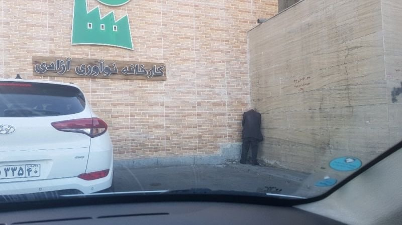

آخر و عاقبت نوآوری، تلاش، زحمت، استارتاپ و … با قطع اینترنت.
©
kharabatii
🔗
ᴡᴇʙꜱɪᴛᴇ
•
ᴠᴘɴʜᴜʙ
•
ɢɪᴛʜᴜʙᴍɪʀʀᴏʀ
@ircfspace

---

## Message 2199

**Date:** 2026-04-22T13:33:40+00:00

میگن از دلایل قطع اینترنت، به دلیل مسائل امنیتی و حفاظت از جان افراد مهم هست. خب! خیلی ساده هست. به اون افراد مهم بگید نیان اینترنت! چرا ملت را بیچاره و اقتصاد را فلج میکنید!
همونایی که در خطر هستن الان با سیم‌کارت سفید در واتس‌اپ، تلگرام و ایکس هستن! زیبا نیست؟!
©
EzHosseini
🔗
ᴡᴇʙꜱɪᴛᴇ
•
ᴠᴘɴʜᴜʙ
•
ɢɪᴛʜᴜʙᴍɪʀʀᴏʀ
@ircfspace

---

## Message 2200

**Date:** 2026-04-22T13:40:39+00:00

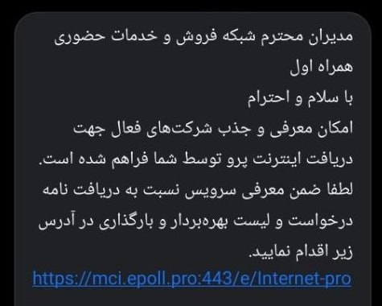

بعد از اعطای
#اینترنت_پرو
به اساتید و هیات‌های علمی، سازمان نظام صنفی رایانه‌ای، سازمان نظام پزشکی و ...، شبکه فروش و خدمات حضوری اپراتورها برای معرفی و جذب شرکت‌های فعال وارد عمل شدن!
🔗
ᴡᴇʙꜱɪᴛᴇ
•
ᴠᴘɴʜᴜʙ
•
ɢɪᴛʜᴜʙᴍɪʀʀᴏʀ
@ircfspace

---

## Message 2201

**Date:** 2026-04-22T13:42:15+00:00

این سطح از فیلترینگ دیگه به آخوند بر نمی‌گرده. به عشق آخوند بر می‌گرده. شما مستعان رو داده بودی دست آخوند می‌گفتی فیلترینگ همینه، همین بودجه رو بهت داده بود. خوش‌رقصی اضافی ابتکار خودتون بوده دیگه.
©
Gerduo
🔗
ᴡᴇʙꜱɪᴛᴇ
•
ᴠᴘɴʜᴜʙ
•
ɢɪᴛʜᴜʙᴍɪʀʀᴏʀ
@ircfspace

---

## Message 2202

**Date:** 2026-04-23T07:34:21+00:00

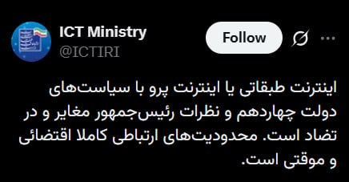

جمله کاملتر:
اینترنت طبقاتی و
#اینترنت_پرو
با سیاست‌های دولت و رئیس‌جمهور در تضاده و رئیس جمهور در ایران هیچ‌کاره است.
🔗
ᴡᴇʙꜱɪᴛᴇ
•
ᴠᴘɴʜᴜʙ
•
ɢɪᴛʜᴜʙᴍɪʀʀᴏʀ
@ircfspace

---

## Message 2203

**Date:** 2026-04-23T07:39:41+00:00

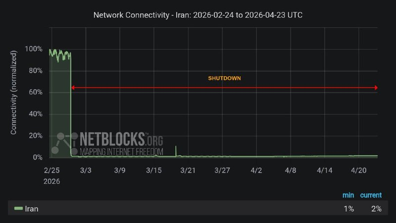

نت‌بلاکس: قطع اینترنت در ایران وارد پنجاه‌وپنجمین روز متوالی خود شده و پس از ۱۲۹۶ ساعت، سطح اتصال به حدود ۲٪ از حالت عادی سقوط کرده است.
🔗
ᴡᴇʙꜱɪᴛᴇ
•
ᴠᴘɴʜᴜʙ
•
ɢɪᴛʜᴜʙᴍɪʀʀᴏʀ
@ircfspace

---

## Message 2204

**Date:** 2026-04-23T07:45:57+00:00

لابد روزی تامین اجتماعی هم برای
#بیمه_بیکاری
بسته «تامین اجتماعی پرو» خواهد فروخت.
جیک وکیل و وزیر «خادم ملت» هم در برابر خفه کردن صدای ۹۰ میلیون نفر و ظلم و تبعیض بزرگ
#اینترنت_طبقاتی
در نمیاد؛ البته تعجبی نیست وقتی پیشتر در برابر جان آدم‌ها هم ساکت بودن.
©
Hamed
🔗
ᴡᴇʙꜱɪᴛᴇ
•
ᴠᴘɴʜᴜʙ
•
ɢɪᴛʜᴜʙᴍɪʀʀᴏʀ
@ircfspace

---

## Message 2205

**Date:** 2026-04-23T07:47:19+00:00

این اینترنت لعنتی رو باز کنید. خدا رو شکر زندگی اقتصادیمون هم به جایی رسوندید که توان خرید فیلترشکن چند میلیونیتون هم نداریم.
©
zahrakeshvari
🔗
ᴡᴇʙꜱɪᴛᴇ
•
ᴠᴘɴʜᴜʙ
•
ɢɪᴛʜᴜʙᴍɪʀʀᴏʀ
@ircfspace

---

## Message 2206

**Date:** 2026-04-23T08:03:36+00:00

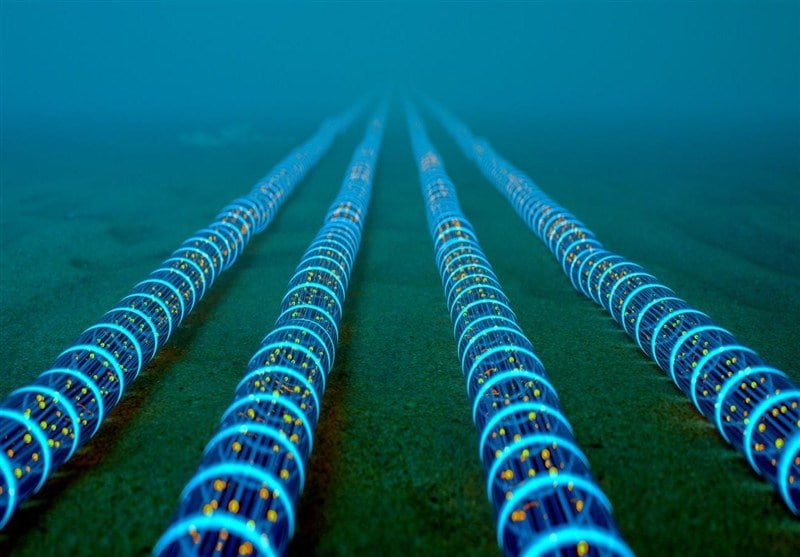

یک تحلیل درباره "گلوگاه بودن تنگه هرمز و پیامدهای قطع کابل‌های اینترنت برای کشورهای حاشیه خلیج فارس" مطرح شده، در حالی که "ایران به‌دلیل اتکای بیشتر به مسیرهای زمینی از طریق ترکیه، ارمنستان و آذربایجان و سهم کمتر کابل‌های جنوبی در تأمین ترافیک، آسیب‌پذیری کمتری در این سناریو داره".
برخی رسانه‌های خارج از کشور از این خبر تسنیم برداشت "تهدید" به قطع کردن زیرساخت‌های ارتباطی کشورهای حاشیه خلیج فارس در تنگه هرمز داشتن، اما این برداشت بیشتر نتیجه تفسیر و فضای سیاسی و جنگیه و صراحتا چنین تهدیدی مطرح نشده.
🔗
ᴡᴇʙꜱɪᴛᴇ
•
ᴠᴘɴʜᴜʙ
•
ɢɪᴛʜᴜʙᴍɪʀʀᴏʀ
@ircfspace

---

## Message 2207

**Date:** 2026-04-23T08:08:55+00:00

مورد داشتیم طرف اومده اسم برند یه داروی مهمش رو گفته که شدیدا دنبالشه، ولی چون اسم ژنریک [عمومی] رو نمیدونست و اینترنت نداشتیم سرچ کنیم گفتیم برو تا فیلترشکن وصل شد بهت زنگ میزنیم، میگیم دارو رو داریم یا نه!
نبود اینترنت تقریبا همه رو فلج کرده!
©
blackmahs
🔗
ᴡᴇʙꜱɪᴛᴇ
•
ᴠᴘɴʜᴜʙ
•
ɢɪᴛʜᴜʙᴍɪʀʀᴏʀ
@ircfspace

---

## Message 2208

**Date:** 2026-04-23T09:31:00+00:00

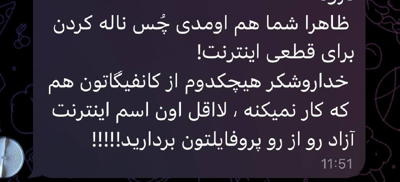

کاری اگر در توانم بوده بی‌منت انجام دادم، اما در شرایط فعلی کار بیشتری ازم برنمیاد. یادمم نمیاد از کسی پولی دریافت کرده باشم، یا بدهی‌ای وجود داشته باشه که حالا بعضیا بابتش طلبکارن!
حدود ۲ ماهه که کسب‌وکارم بخاطر قطع سراسری اینترنت عملاً متوقف شده. مثل خیلی‌های دیگه با فشار مالی، بدهی و سختی روزمره سعی کردم صورتمو سرخ نگه دارم. نه درخواست حمایت و دونیت داشتم، نه تبلیغی نمایش دادم، نه فاندی گرفتم.
البته انگار فهمیدنش برای یه تعداد اندکی سخته؛ پس بهتره شکایتشون رو ببرن پیش رئیس‌جمهور و وزیر قطع‌ارتباطاتشون!
🔗
ᴡᴇʙꜱɪᴛᴇ
•
ᴠᴘɴʜᴜʙ
•
ɢɪᴛʜᴜʙᴍɪʀʀᴏʀ
@ircfspace

---

## Message 2209

**Date:** 2026-04-23T09:43:33+00:00

اگر برای باز کردن تلگرام، ایکس، کیف پول رمزارز و ... از روش MasterHttpRelay یا موارد مشابه استفاده می‌کنین، حواستون به این نکات باشه:
۱. آیپی شما تغییر نمی‌کنه: برخلاف فیلترشکن‌های عادی، آیپی شما تو این روش همون ایران می‌مونه. در نتیجه سایت‌های تحریمی براتون باز نمیشن و حتی ممکنه سایت‌های حساس اکانتتون رو به خاطر آی‌پی ایران شناسایی یا مسدود کنن.
۲. از اکانت اصلی جی‌میل استفاده نکنید: گوگل ممکنه اکانت‌هارو مسدود کنه. بهتره ریسک نکنین و از یک اکانت جی‌میل جایگزین استفاده کنین.
©
iAghapour
🔗
ᴡᴇʙꜱɪᴛᴇ
•
ᴠᴘɴʜᴜʙ
•
ɢɪᴛʜᴜʙᴍɪʀʀᴏʀ
@ircfspace

---

## Message 2211

**Date:** 2026-04-23T14:54:16+00:00

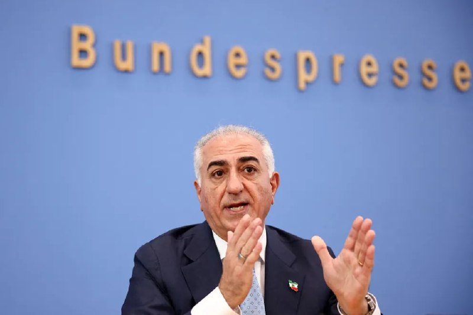

شاهزاده رضا پهلوی در یک نشست خبری در برلین خواستار توجه جامعه جهانی به موضوع قطع اینترنت و نقض گسترده حقوق بشر در ایران شد و از سیاست مماشات‌ کشورهای اروپایی در برابر جمهوری اسلامی انتقاد کرد.
او قطع اینترنت در ایران را مساله‌ای «حیاتی» دانست و تاکید کرد «یکی از جنبه‌های مذاکرات باید موضوعات حقوق بشری و اینترنت باشد»، زیرا میان مردم ایران و جمهوری اسلامی آتش‌بس برقرار نشده است.
©
iranintl
🔗
ᴡᴇʙꜱɪᴛᴇ
•
ᴠᴘɴʜᴜʙ
•
ɢɪᴛʜᴜʙᴍɪʀʀᴏʀ
@ircfspace

---

## Message 2212

**Date:** 2026-04-23T15:04:34+00:00

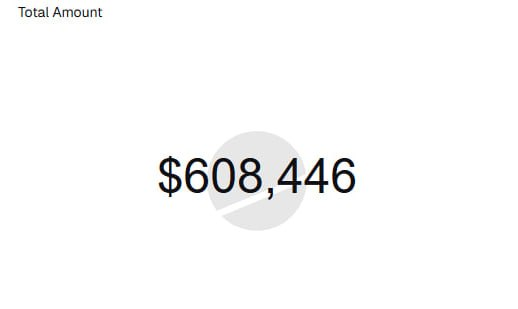

یکی از کاربران در ایکس که با بررسی تراکنش‌های آدرس ولت یک کانال فروش فیلترشکن،
نوشته بود
"این کانال در حدود چهل روز ۲۰۳ هزار دلار درآمد داشته"، حالا خبر داده که این مبلغ به ۶۰۸ هزار دلار (یعنی حدود ۹۳ میلیارد تومان) رسیده.
این مورد تنها مربوط به یک کانال بوده و میزان مبالغی که در این ایام توسط فروشندگان مختلف و البته اسکمرها بصورت رمزارز یا ریالی دریافت شده، نامشخصه.
©
mosi115
🔗
ᴡᴇʙꜱɪᴛᴇ
•
ᴠᴘɴʜᴜʙ
•
ɢɪᴛʜᴜʙᴍɪʀʀᴏʀ
@ircfspace

---

## Message 2213

**Date:** 2026-04-24T05:45:26+00:00

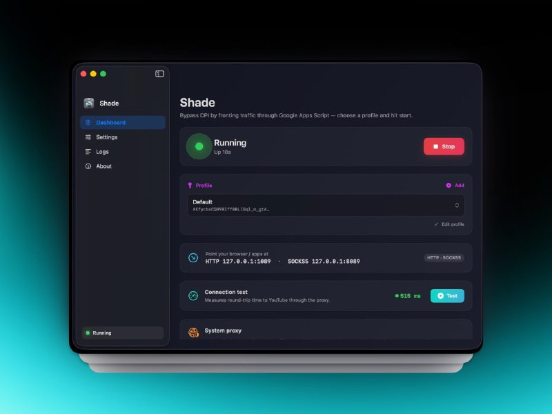

اپ Shade یه ابزار ساده برای عبور ترافیک از طریق روش MasterHttpRelay در macOS هست، که از امکاناتی نظیر اجرای پراکسی محلی HTTP و SOCKS5، تست اتصال داخلی، پشتیبانی از چند پروفایل (ScriptID/AuthKey)، لودبالانسر، حل خودکار مشکلات سرتیفیکیت و ... برخورداره.
👉
github.com/g3ntrix/Shade
💡
t.me/PersianGithubMirror/3146
🔗
ᴡᴇʙꜱɪᴛᴇ
•
ᴠᴘɴʜᴜʙ
•
ɢɪᴛʜᴜʙᴍɪʀʀᴏʀ
@ircfspace

---

## Message 2214

**Date:** 2026-04-24T05:49:14+00:00

قطع سراسری اینترنت در ایران به روز پنجاه و ششم رسید.
هنوز بعضیا منتظرن همون کسی که این وضعیت رو ساخته، خودش از سر لطف حلش کنه، اما واقعیت اینه از ظالم نمیشه انتظار داشت با دست خودش بساط ظلمش رو جمع کنه!
این وضعیت اینترنت یک شبه ساخته نشده؛ سالها قدم به قدم، با سیاستهای تدریجی، زیرساخت همین اینترنت طبقاتی رو چیدن. هر گشایشی هم اگر اتفاق بیفته، نه از سر مهربونیه و نه دلسوزی.
🔗
ᴡᴇʙꜱɪᴛᴇ
•
ᴠᴘɴʜᴜʙ
•
ɢɪᴛʜᴜʙᴍɪʀʀᴏʀ
@ircfspace

---

## Message 2215

**Date:** 2026-04-24T05:51:43+00:00

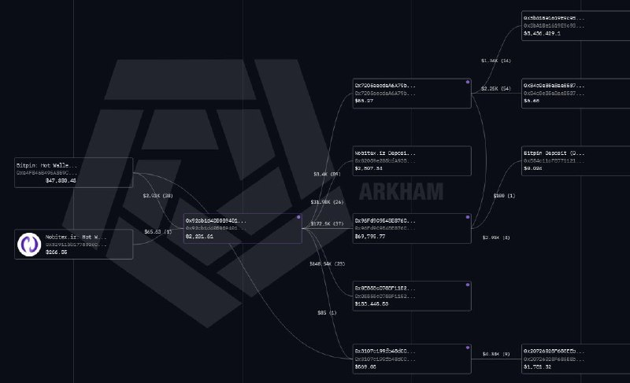

به نظرتون کدوم VPN فروش در این شرایط می‌تونه حداقل ۶۰ هزار کاربر رو پشتیبانی کنه، پولش مستقیما از صرافی ایرانی بیاد و مستقیما به صرافی ایرانی واریز داشته باشه
و به تخمش نباشه
؟
©
mah_azadi
🔗
ᴡᴇʙꜱɪᴛᴇ
•
ᴠᴘɴʜᴜʙ
•
ɢɪᴛʜᴜʙᴍɪʀʀᴏʀ
@ircfspace

---

## Message 2216

**Date:** 2026-04-24T13:13:05+00:00

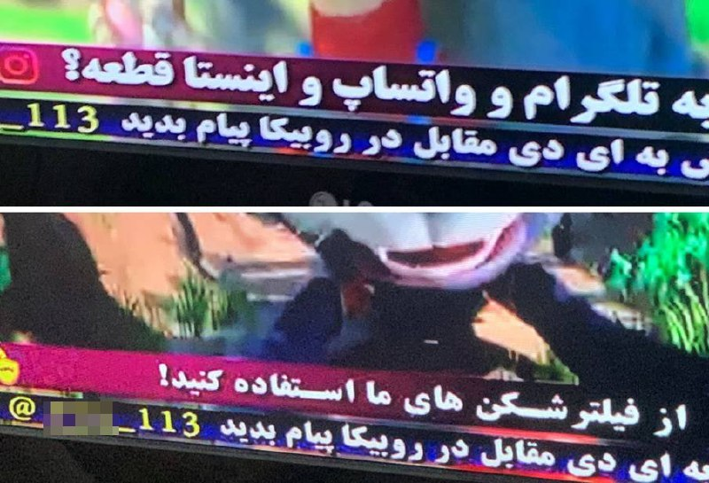

از اندک کاربردهای پیامرسان‌های رانتی بومی!
🔗
ᴡᴇʙꜱɪᴛᴇ
•
ᴠᴘɴʜᴜʙ
•
ɢɪᴛʜᴜʙᴍɪʀʀᴏʀ
@ircfspace

---
