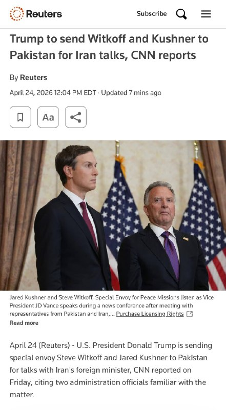
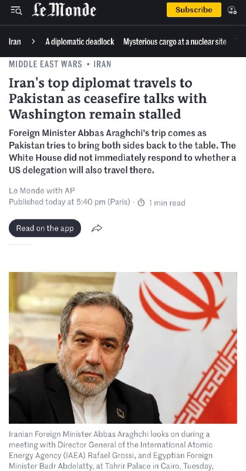
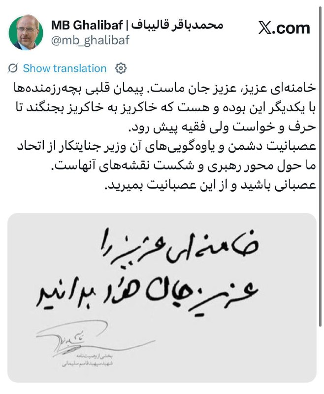
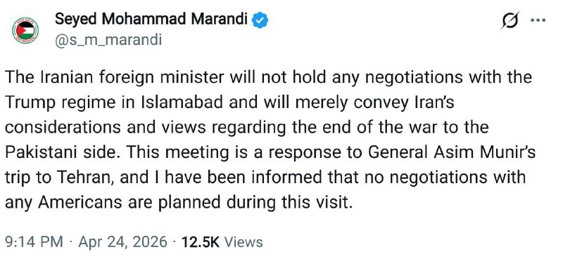
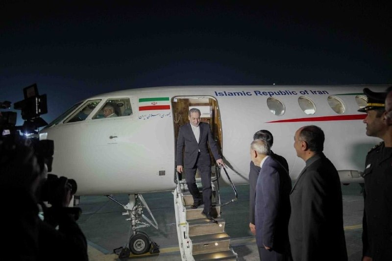
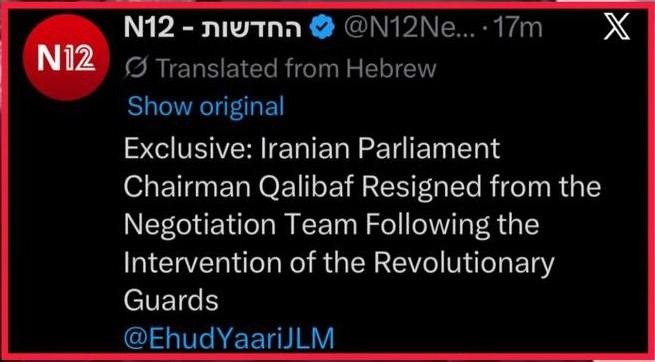
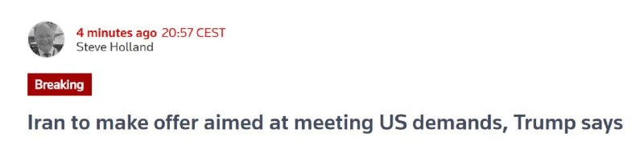

# Channel putakk

## Message 24652

🚨
کارولین لیویت، سخنگوی کاخ سفید، اعلام کرد:
استیو ویتکاف و جرد کوشنر صبح فردا بار دیگر راهی پاکستان خواهند شد تا گفت‌وگوهای مستقیم با نمایندگان هیئت ایرانی انجام دهند.
به گفته او، این طرف ایرانی بوده که برای این مذاکرات درخواست داده و خواستار انجام این گفت‌وگو شده است.

---

## Message 24653

[Video](media/24653_0.mp4)

🚨
کارولین لیویت، سخنگوی کاخ سفید، اعلام کرد:
جی‌دی ونس در حالت آماده‌باش قرار دارد
و در صورت نیاز، آماده است به پاکستان اعزام شود،
اگر تشخیص داده شود که این کار استفاده مناسبی از زمان اوست.

---

## Message 24655

[Video](media/24655_0.mp4)

در چند هفته اخیر در سفر به دور اروپا با اعضای پارلمان‌ها، دولت‌ها و رسانه‌ها گفت‌وگو کرده‌ام.
سفر من یک هدف داشت: این که صدای میلیون‌ها ایرانی باشم که تحت سلطه جمهوری اسلامی، ترورهای آن و قطع اینترنت، گروگان گرفته شده‌اند؛ میلیون‌ها ایرانی که صدایشان خاموش شده است.
اما اکنون با اطمینان می‌توانم بگویم این  سکوت، این سانسور، نه‌تنها توسط رژیم در ایران، بلکه توسط رسانه‌های بین‌المللی و به‌ویژه اروپایی انجام می‌شود.
بنابراین، می‌خواهم به طور مستقیم با مردم اروپا صحبت کنم.
I have spent the past several weeks traveling across Europe, speaking to members of parliaments, governments, and the press.
My visit had one objective: to give a voice to the millions of Iranians held hostage by the Islamic Republic, its terror, and its Internet blackout. The millions of Iranians who have been silenced.
But I can now say with confidence that that silencing, that censorship, is not just happening at the hands of the regime in Iran, but by the international, and particularly the European, media.
So I want to speak directly to the people of Europe.
@OfficialRezaPahlavi

---

## Message 24662

[Video](media/24662_0.mp4)

🚨
تصاویری از عراقچی در پاکستان

---

## Message 24648

**Date:** 2026-04-24T16:16:29+00:00

🇺🇸
🇺🇸
📞
🇮🇷
🇮🇷
رویترز به نقل از سی ان ان:
رئیس‌جمهور ایالات متحده دونالد ترامپ در حال ارسال نماینده ویژه خود استیو ویتکوف و دامادش جرد کوشنر به پاکستان برای گفتگو با عباس عراقچی، وزیر امور خارجه جمهوری اسلامی ایران، است.
💢
رئیس‌جمهور دونالد ترامپ نماینده ویژه خود استیو ویتکوف و جرد کوشنر را به پاکستان می‌فرستد تا این آخر هفته در گفتگوها با عباس عراقچی، وزیر امور خارجه ایران، شرکت کنند، دو مقام دولتی به سی‌ان‌ان گفتند.
🚫
معاون رئیس‌جمهور جی‌دی ونس در حال حاضر قصد شرکت ندارد، زیرا محمدباقر قالیباف، رئیس مجلس شورای اسلامی ایران، نیز در این گفتگوها شرکت نخواهد کرد، مقامات گفتند.
🇮🇷
قالیباف از سوی مقامات کاخ سفید به عنوان سرپرست هیئت جمهوری اسلامی و هم‌رده ونس در نظر گرفته می‌شود.

---

## Message 24649

**Date:** 2026-04-24T16:43:50+00:00

🚨
آمریکا ارز بیت کوین سپاه تروریست را مسدود کرد
سی ان ان: دولت ترامپ ۳۴۴ میلیون دلار ارز دیجیتال مرتبط با ایران را مسدود کرده است

---

## Message 24650

**Date:** 2026-04-24T17:30:56+00:00

🚨
عراقچی نماینده مذاکر کننده جمهوری اسلامی تروریسته
خبری از قالیباف همچنان نیست!!!

---

## Message 24651

**Date:** 2026-04-24T17:32:16+00:00

🚨
عراقچی نماینده مذاکر کننده جمهوری اسلامی تروریسته  خبری از قالیباف همچنان نیست!!!

---

## Message 24654

**Date:** 2026-04-24T17:44:21+00:00

🚨
تسنیم: عراقچی در اسلام‌آباد با آمریکایی‌ها مذاکره نخواهد کرد.

---

## Message 24656

**Date:** 2026-04-24T18:02:01+00:00

🚨
واکنش قالیباف تروریست به یاوه‌گویی‌های وزیر جنگ اسرائیل: عصبانیت آن‌ها از اتحاد ما حول محور رهبری و شکست نقشه‌های آنهاست؛ خامنه‌ای عزیز، عزیز جان ماست
رئیس مجلس با ارجاع به بخشی از وصیت‌نامهٔ سردار سلیمانی در حساب کاربری خود در شبکهٔ ایکس نوشت:
خامنه‌ای عزیز، عزیز جان ماست. پیمان قلبی و دلی بچه‌رزمنده‌ها با یکدیگر این بوده و هست که خاکریز به خاکریز بجنگند تا حرف و خواست ولی فقیه پیش رود.
عصبانیت دشمن و یاوه‌گویی‌های آن وزیر جنایتکار از اتحاد ما حول محور رهبری و شکست نقشه‌های آنهاست.
عصبانی باشید و از این عصبانیت بمیرید.

---

## Message 24657

**Date:** 2026-04-24T18:05:38+00:00

🚨
مرندی عضو تیم مذاکره کننده جمهوری اسلامی تروریست:
وزیر امور خارجه ایران هیچ مذاکره‌ای با رژیم ترامپ در اسلام‌آباد نخواهد داشت و صرفاً ملاحظات و دیدگاه‌های ایران در مورد پایان جنگ را به طرف پاکستانی منتقل خواهد کرد.
این دیدار در پاسخ به سفر ژنرال عاصم منیر به تهران است و به من اطلاع داده شده است که هیچ مذاکره‌ای با هیچ آمریکایی در این سفر برنامه‌ریزی نشده است.

---

## Message 24658

**Date:** 2026-04-24T18:06:16+00:00

سیرک جمهوری اسلامی!!!

---

## Message 24659

**Date:** 2026-04-24T19:18:28+00:00

🚨
دقایقی پیش عباس عراقچی وارد اسلام آباد پاکستان شد.

---

## Message 24660

**Date:** 2026-04-24T19:38:34+00:00

🚨
دقایقی پیش عباس عراقچی وارد اسلام آباد پاکستان شد.

---

## Message 24661

**Date:** 2026-04-24T19:39:27+00:00

🚨
تسنیم: عراقچی در اسلام‌آباد با آمریکایی‌ها مذاکره نخواهد کرد.

---

## Message 24663

**Date:** 2026-04-24T19:43:59+00:00

🚨
محمدباقر قالیباف رئیس طویله مجلس، توسط جناح‌هایی در درون سپاه تروریست مجبور به استعفا از تیم مذاکره‌کننده شده است.
🔺
کانالN12 اسرائیل
محمدباقر قالیباف، رئیس مجلس رژیم ایران از عضویت در هیئت ایرانی مذاکره کننده با آمریکا، استعفا کرد.
🔺
العربیه

---

## Message 24664

**Date:** 2026-04-24T19:46:16+00:00

🚨
ترامپ در گفت‌وگو با رویترز اعلام کرد که
ایران در حال آماده‌سازی یک
پیشنهاد جدید
است که هدف آن
راضی کردن خواسته‌های آمریکا است.
ترامپ گفت:
«آن‌ها در حال ارائه یک پیشنهاد هستند
باید ببینیم چه می‌شود.

---

## Message 24665

**Date:** 2026-04-24T19:46:54+00:00

🚨
واشنگتن پست، به نقل از مقامات آمریکایی:
تصمیم عدم اعزام جی دی ونس به اسلام‌آباد نشان دهنده کاهش سطح مذاکرات است.

---

## Message 24666

**Date:** 2026-04-24T19:47:50+00:00

یک نکته:
مذاکرات عراقچی با ویتکاف/کوشنر بعیده به جایی برسه.
در تهران، سیستم تصمیم‌گیری قفل شده و از منابعی در اسرائیل شنیدم مجتبی یا به پیام‌ها پاسخ نمی‌ده و یا جواب‌های مبهم می‌فرسته. ارتباط باهاش به مراتب سخت‌تر از روزهای گذشته شده، و این یعنی سپاه کنترل رو در دست داره.
اینکه بلندگوهای سپاه می‌گن عراقچی قرار نیست در پاکستان با آمریکایی‌ها دیدار کنه هم نشون‌دهنده‌ی همین بلاتکلیفی‌ست.
این شرایط، احتمالا به ازسرگیری دور بعدی حملات با هدف [اصلی] خنثی‌سازی‌ها خواهد انجامید.
نقل و انتقال‌های نظامی این چند روز و رسیدن ناو «جورج بوش» به منطقه‌ی فرماندهی سنتکام، نشون میده تهدید به حمله فقط بلوف نیست …
@pouriazeraati

---

## Message 24667

**Date:** 2026-04-24T19:48:36+00:00

🚨
سازمان تروریستی سپاه اعلام کرد:
یک کشتی مظنون به همکاری با ارتش آمریکا به دلیل نادیده گرفتن هشدارها و ارتکاب تخلفات توقیف شد.

---
