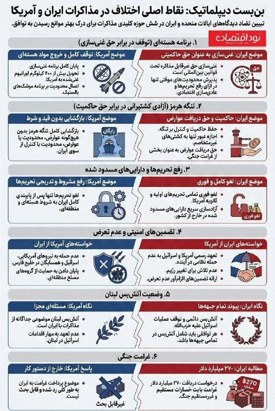
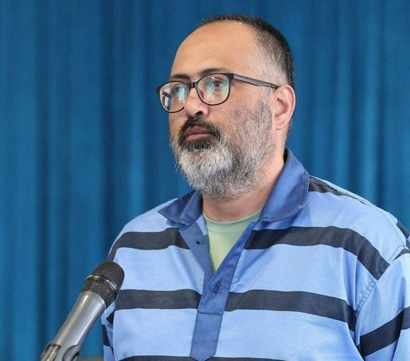
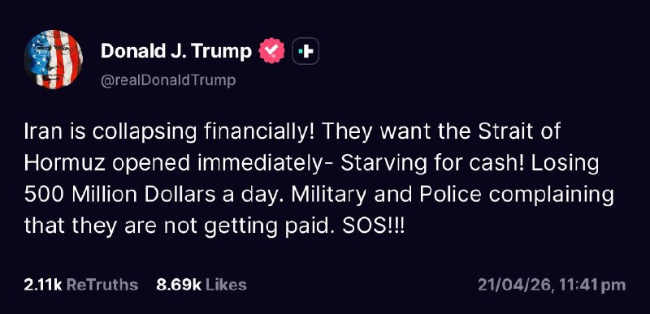
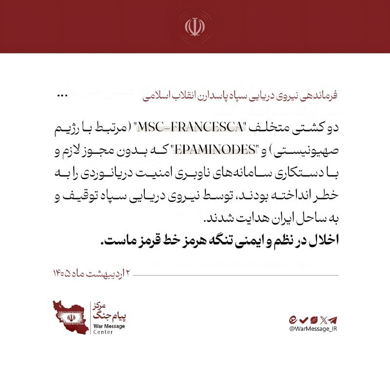
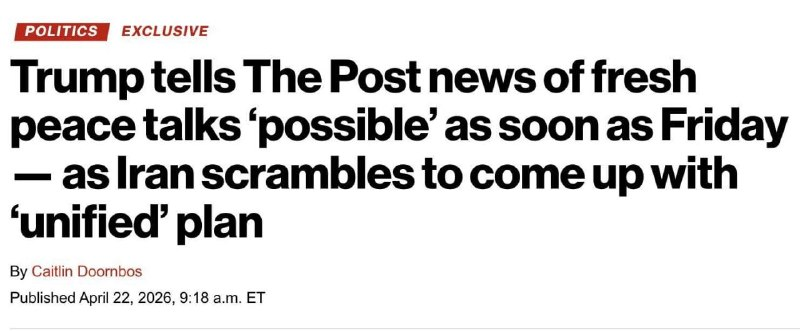
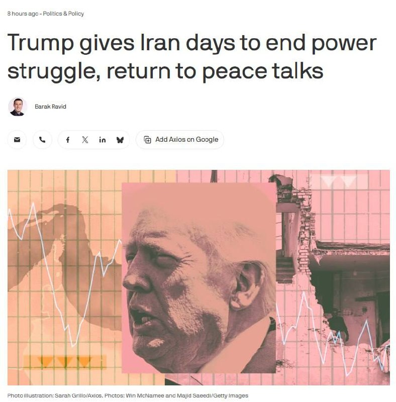
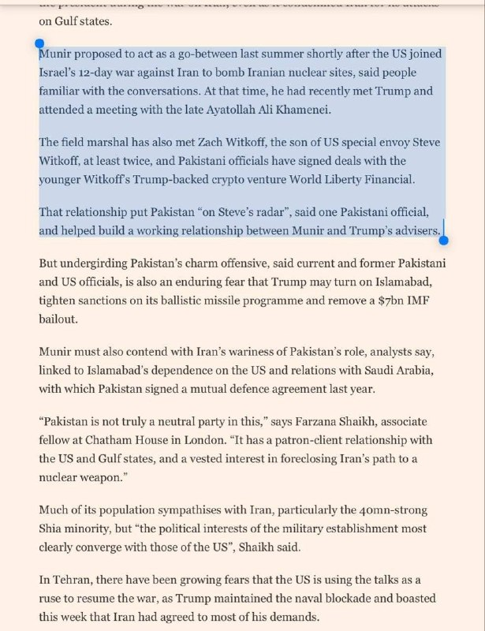

# Channel putakk

## Message 24456

[Audio](media/24456_0.ogg)

---

## Message 24462

[Video](media/24462_0.mp4)

🚨
وزیر خزانه‌داری ایالات متحده، اسکات بسنت:
رئیس‌جمهور ترامپ نشان داده است که در کاهش قیمت انرژی مهارت دارد.

---

## Message 24444

**Date:** 2026-04-22T05:45:16+00:00

🚨
نخست‌وزیر پاکستان: امیدواریم توافق صلح جامع بین ایران و آمریکا امضا شود

---

## Message 24445

**Date:** 2026-04-22T05:45:51+00:00

🚨
نقاط اصلی اختلاف در مذاکرات ایران و آمریکا

---

## Message 24446

**Date:** 2026-04-22T07:24:00+00:00

🚨
چین به آمریکا: این آخرین اخطار است «با آتش بازی نکنید»
سخنگوی وزارت امور خارجه چین: چین، متوجه توقیف غیرقانونی یک کشتی باری غیرنظامی که از چین به ایران در حرکت بود، توسط ایالات متحده شده است.
چنین اقداماتی به عنوان حمله مستقیم به حاکمیت، تجارت و منافع اصلی چین تلقی خواهد شد.
این آخرین هشدار به ایالات متحده است. اشتباه محاسبه نکنید. با آتش بازی نکنید.

---

## Message 24447

**Date:** 2026-04-22T07:26:22+00:00

🚨
مهدی  فرید به اتهام جاسوسی  اعدام شد.
وی  مسئول بخش مدیریت کمیته پدافند غیرعامل یکی از سازمان‌های حساس کشور بود.

---

## Message 24448

**Date:** 2026-04-22T07:27:26+00:00

🚨
مقامات ارشد آمریکایی معتقدند دلیل عدم پاسخ رژیم به پیشنهاد آمریکا، شکاف‌های درون حکومت ایران است!
دستیاران ارشد رئیس‌جمهور ترامپ اساساً معتقدند یکی از بزرگترین دلایلی که از ایرانی‌ها در مورد خواسته‌هایشان برای شروع این مذاکرات چیزی نشنیدند، به دلیل شکاف‌هایی در رهبری فعلی ایران است.
🔻
CNN

---

## Message 24449

**Date:** 2026-04-22T07:51:20+00:00

🚨
ترامپ:
ایران از نظر مالی در حال فروپاشیه!
اون‌ها می‌خوان تنگه هرمز فوراً باز بشه شدیداً به پول نیاز دارن!
روزانه ۵۰۰ میلیون دلار ضرر می‌کنن.
نیروهای نظامی و پلیس دارن شکایت می‌کنن که حقوقشون پرداخت نمی‌شه.
وضعیت اضطراریه — SOS!!!

---

## Message 24450

**Date:** 2026-04-22T08:03:14+00:00

🔴
ساعتی پیش قایق سپاه به یه کشتی کانتینری تو سواحل شمال شرق عمان شلیک و آسیب جدی بهش وارد کرد.

---

## Message 24451

**Date:** 2026-04-22T08:06:48+00:00

سیتنا   در دقایق اخیر کلودفلر روی برخی دیتاسنترهای داخلی روشن شده است که در صورت ادامه این روند، احتمال می‌رود طی ساعات آتی گشایش‌هایی در اتصال به اینترنت بین الملل فراهم شود.

---

## Message 24452

**Date:** 2026-04-22T09:13:21+00:00

🚨
فاکس نیوز :
تمدید آتش‌بسی که ترامپ برای ایران داده، اگه زود به توافق نرسن زیاد دوام نمیاره و کوتاهه؛
کلاً هم این تمدید بیشتر از سر احترام به میانجی‌های پاکستانی
🇵🇰
بوده.

---

## Message 24453

**Date:** 2026-04-22T10:25:09+00:00

🔴
شبکه i24 : سپاه پاسداران  مدعی شد که دو کشتی رو در تنگه هرمز توقیف کرده که یکی از آن‌ها با اسرائیل مرتبط بوده و آن‌ها را به سمت آب‌های سرزمینی ایران هدایت میکنه

---

## Message 24454

**Date:** 2026-04-22T10:26:41+00:00

نیرو دریایی سپاه پاسداران :
دو کشتی متخلف "MSC-FRANCESCA" (مرتبط با رژیم صهیونیستی) و "EPAMINODES" که بدون مجوز لازم و با دستکاری سامانه‌های ناوبری امنیت دریانوردی را به خطر انداخته بودند، توسط نیروی دریایی سپاه توقیف و به ساحل ایران هدایت شدند.

---

## Message 24455

**Date:** 2026-04-22T14:50:07+00:00

🚨
فوری/کاخ سفید به فاکس نیوز: ترامپ آتش‌بس با ایران را ۳ تا ۵ روز تمدید کرد

---

## Message 24457

**Date:** 2026-04-22T15:27:09+00:00

🚨
تصویری جنجالی از تجمعات شبانه جمهوری اسلامی تروریست

---

## Message 24458

**Date:** 2026-04-22T15:27:45+00:00

🚨
ترامپ به نیویورک پست: دور دوم مذاکرات با ایران ممکن است جمعه برگزار شود

---

## Message 24459

**Date:** 2026-04-22T15:29:11+00:00

🚨
طبق گزارش آکسیوس، دونالد ترامپ، رئیس‌جمهور آمریکا، مهلت کوتاهی حدود سه تا پنج روز به ایران داده است تا رهبری خود را متحد کرده و به مذاکرات صلح بازگردد و هشدار داده است که آتش‌بس به صورت نامحدود باقی نخواهد ماند.
مقامات آمریکایی می‌گویند هنوز امکان توافق وجود دارد، اما معتقدند ایران آن‌قدر در درون خود متفرقه است که نمی‌تواند پاسخی شفاف بدهد؛ یکی از مقامات اظهار داشت که ترامپ به آن‌ها فرصت کوتاهی داده «تا کارهایشان را مرتب کنند» و این پیشنهاد «باز نخواهد ماند».
در عین حال، چندین مقام آمریکایی و متحدان ترامپ می‌گویند او معتقد است آمریکا اهداف نظامی کلیدی خود را محقق کرده و اکنون می‌خواهد از جنگی که روزبه‌روز ناپسندتر می‌شود خارج شود و بعید است تا زمانی که تمام گزینه‌های دیگر به پایان نرسند، دوباره به درگیری بازگردد.
«قطعاً به نظر می‌رسد ترامپ دیگر نمی‌خواهد از زور نظامی استفاده کند و تصمیم گرفته است جنگ را به پایان برساند»، یک منبع آمریکایی نزدیک به ترامپ گفت.

---

## Message 24460

**Date:** 2026-04-22T15:59:13+00:00

🚨
واسطه‌های پاکستانی از ایران به دلیل امتناع ناگهانی از حضور در مذاکرات در اسلام‌آباد در روز سه‌شنبه بسیار خشمگین بودند، طبق گفته یک فرد مطلع از تلاش‌های دیپلماتیک که به شرط ناشناس ماندن برای بحث در مورد مذاکرات حساس پشت درهای بسته صحبت کرد.
▪
︎واشنگتن پست
تا کنون مقامات پاکستانی در تلاشند تا ایرانی‌ها را قانع کنند که موضع آمریکایی را بپذیرند و لزوماً در پی ارائه ایده‌های خلاقانه برای پر کردن شکاف‌ها نیستند.
▪
︎فایننشال تایمز

---

## Message 24461

**Date:** 2026-04-22T15:59:51+00:00

🚨
سفارت ایالات متحده: حریم هوایی ایران از دیروز تا حدی بازگشایی شده است. از شهروندان آمریکایی خواسته شده است که همین حالا از طریق هوایی یا زمینی ایران را به مقصد ارمنستان، آذربایجان، ترکیه یا ترکمنستان ترک کنند.
سفارت هشدار داد که ایران ممکن است از خروج شهروندان آمریکایی جلوگیری کند یا "هزینه خروج" دریافت کند. افراد دارای تابعیت دوگانه باید با گذرنامه ایرانی خارج شوند. به آمریکایی‌ها گفته شده است که به افغانستان، عراق یا منطقه مرزی پاکستان و ایران سفر نکنند.

---

## Message 24463

**Date:** 2026-04-22T16:07:44+00:00

🚨
ترامپ تو پست جدیدش : «صبحِ شکوه : آیا ترامپ تو جنگ با ایران میره سراغ مدل کامل “شرمن”؟
یعنی می‌پرسه ترامپ میره سمت «جنگ تمام‌عیار و سخت» علیه ایران یا نه

---
