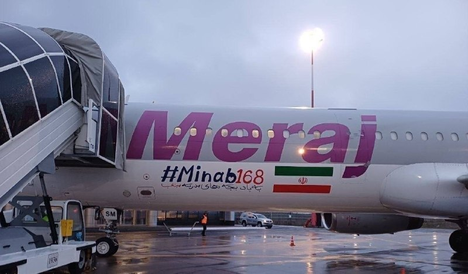
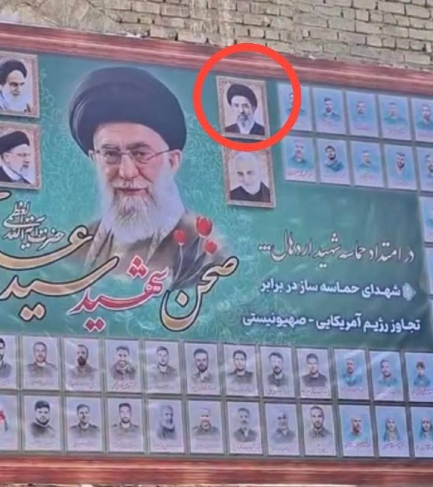
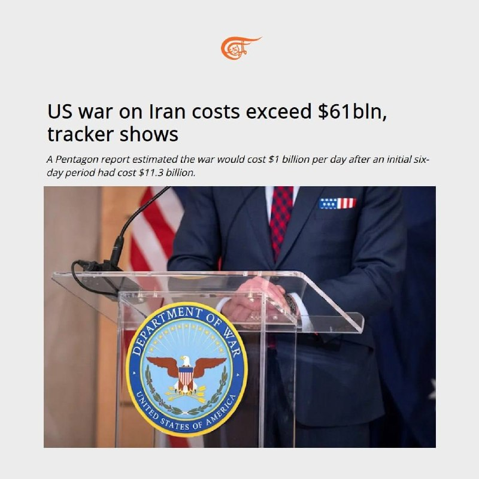
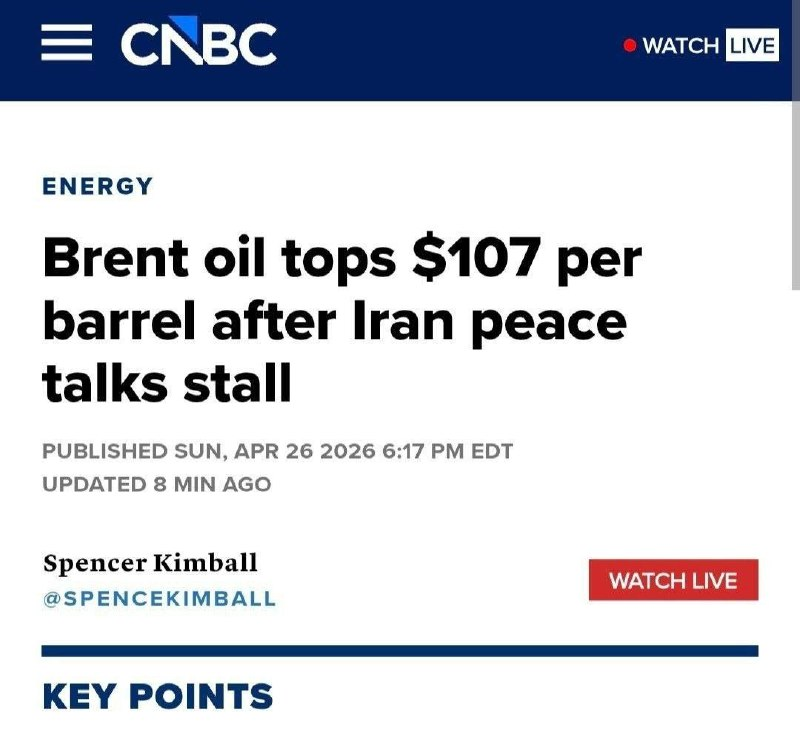

# Channel putakk

## Message 24868

📹
خبرنگار: به نظر می‌رسد که شما پایین می‌روید.
🇺🇸
ترامپ: آنها گفتند، «لطفاً روی زمین پایین بروید»، بنابراین من پایین رفتم.

---

## Message 24869

🇺🇸
ترامپ:
من متجاوز نیستم. به کسی تجاوز نکردم، من پدوفیل هم نیستم

---

## Message 24870

[Video](media/24870_0.mp4)

🇺🇸
ترامپ:
دلیل اینکه همچین آدم‌هایی به وجود میان اینه که بعضی‌ها شعار “پادشاهی نباشد” میدن. من پادشاه نیستم.
اگه پادشاه بودم، اصلاً با شما سر و کار نداشتم.

---

## Message 24871

[Video](media/24871_0.mp4)

🇺🇸
ترامپ درباره تیرانداز:
فکر می‌کنم لیگ NFL باید باهاش قرارداد ببنده خیلی سریع بود

---

## Message 24874

💢
🇮🇷
روایت عراقچی تروریست از دستور کار مذاکرات با مقامات ارشد روسیه/ مشورت‌های خوبی در پاکستان و عمان انجام شد
▪
دیدار امروز (با رئیس‌جمهور روسیه) فرصت مناسبی برای گفت‌وگو درباره تحولات جنگ و بررسی آخرین وضعیت در این زمینه خواهد بود و اطمینان دارم که این رایزنی‌ها و هماهنگی میان دو کشور در این زمینه  از اهمیت خاصی برخوردار خواهد بود.
▪
سفر به اسلام‌آباد، سفر خیلی خوبی بود و مشورت‌های خوبی انجام شد و طی آن بر آنچه که گذشته و اینکه در چه شرایطی، مذاکرات ایران و آمریکا می‌تواند ادامه پیدا کند، مروری صورت گرفت.
▪
شرایط جمهوری اسلامی ایران در مذاکرات از اهمیت زیادی برخوردار است؛ ما باید حتماً حقوق مردم ایران را پس از 40 روز مقاومت استیفا و منافع کشور را تأمین کنیم.
▪
ایران و عمان دو کشور ساحلی تنگه هرمز هستند و لازم است که با یکدیگر رایزنی داشته باشند، به ویژه آنکه عبور امن از تنگه هرمز به یک موضوع مهم در سطح جهانی تبدیل شده است.
▪
طبیعی است که ما به عنوان دو کشور ساحلی این تنگه باید با هم صحبت داشته باشیم  تا منافع مشترک ما تأمین شود.

---

## Message 24880

[Video](media/24880_0.mp4)

جاویدنام عرفان کیانی که شنبه ۵ اردیبهشت با اذان صبحتان اعدام شد،
تو ۱۰ ثانیه فیلم اعتراف اجباری ، ۲ بار اشکهایش را پاک میکند.
لعنت به شما و آیینتان.
انتقام خواهیم گرفت،
انتقام تک تک اشکهایی که ریختیم
تک تک جان‌هایی که ازمان گرفتید
تمام خانواده‌هایی که از هم پاشید.
روز انتقام‌ فراخواهد رسید و پیروزی ازآن ماست
💯

---

## Message 24885

[Video](media/24885_0.mp4)

🇺🇸
ترامپ درباره ایران:
ما کارامونو لزوماً برای خشونت نمی‌کنیم، ولی خب یه تبعاتی داره!
- این دوره ریاست‌جمهوری هم خیلی مهمه. کابینه‌م هم خیلی خوبه و کارای خوبی می‌کنن
- ولی خب بعضی چیزا که برای ما خوبه، برای بقیه خوب نیست،مثلا ایران؛ نمی‌ذاریم به سلاح هسته‌ای برسه
- اصلاً چنین چیزی نمی‌شه،قرار نیست دنیا رو منفجر کنن، یه کم دیوونه‌ان ولی اون‌قدر هم نیست که دنیا رو بترکونن
- واسه همینم خوشحال نیستن،وقتی هم خوشحال نباشن،آدما ممکنه کارای خشونت‌آمیز کنن
- من مستقیم ربطش نمی‌دم به اونا، ولی خب اگه یه فرصتی گیرشون بیاد، احتمالاً ازش استفاده می‌کنن

---

## Message 24887

[Video](media/24887_1.mp4)

🇮🇷
🇷🇺
عراقچی تروریست
وارد روسیه شد
!

---

## Message 24872

**Date:** 2026-04-26T23:56:08+00:00

🚨
عضو کمیسیون امنیت ملی طویله مجلس:
آرایش نظامی آمریکا در منطقه نشان می‌دهد،
هر لحظه ممکن است جنگ‌ دیگری آغاز شود.

---

## Message 24873

**Date:** 2026-04-27T05:15:15+00:00

🌟
شبکه سی ان ان: ۲۸ میلیارد دلار و بیشتر؛ اروپا هزینه بحران جدید انرژی را محاسبه می‌کند

---

## Message 24875

**Date:** 2026-04-27T05:17:41+00:00

🚨
مجتبی چی شد؟!
❌
یه عکس رو دیوار.
حتی لاشه‌ای ام ازش نمونده که چال کنن.

---

## Message 24876

**Date:** 2026-04-27T05:42:34+00:00

[Video](media/24876_0.mp4)

🇺🇸
حمله آمریکا به یک کشتی دیگر شرق اقیانوس آرام
فرماندهی جنوبی آمریکا اعلام کرد در جریان عملیاتی در شرق اقیانوس آرام، یک قایق مظنون به قاچاق مواد مخدر را هدف قرار داده است.
به گفته ارتش آمریکا، اطلاعات اطلاعاتی نشان می‌داد این قایق در فعالیت‌های مرتبط با آنچه «تروریسم مرتبط با مواد مخدر» خوانده شده، نقش داشته است. در این عملیات سه مظنون کشته شدند.

---

## Message 24877

**Date:** 2026-04-27T06:05:34+00:00

💢
🇮🇷
روایت عراقچی تروریست از دستور کار مذاکرات با مقامات ارشد روسیه/ مشورت‌های خوبی در پاکستان و عمان انجام شد
▪
دیدار امروز (با رئیس‌جمهور روسیه) فرصت مناسبی برای گفت‌وگو درباره تحولات جنگ و بررسی آخرین وضعیت در این زمینه خواهد بود و اطمینان دارم که این رایزنی‌ها…

---

## Message 24878

**Date:** 2026-04-27T06:06:57+00:00

🚨
🇮🇷
عراقچی: زیاده خواهی‌های آمریکا باعث شد مذاکرات به اهدافش نرسد
❌
وزیر امور خارجه رژیم تروریستی گفت: زیاده خواهی‌های آمریکا باعث شد مذاکرات دور قبلی علیرغم پیشرفت‌ها نتواند به اهدافش برسد.

---

## Message 24879

**Date:** 2026-04-27T06:07:59+00:00

🚨
روزنامه اطلاعات: قطع اینترنت، کسب و کارهای مجازی بسیار زیادی را تعطیل کرده
یک پنجم شرکتهای دیجیتال در معرض تعدیل نیرو قرار دارند
زیان ناشی از قطع اینترنت روزانه ۵ هزار میلیارد تومان است

---

## Message 24881

**Date:** 2026-04-27T07:08:38+00:00

🇮🇷
🇺🇸
المیادین: هزینه‌های جنگ آمریکا علیه ایران از ۶۱ میلیارد دلار فراتر رفته است

---

## Message 24882

**Date:** 2026-04-27T07:33:31+00:00

🚨
پس از باز شدن بازار، قیمت جهانی نفت برنت با رشدی ۲ دلاری به ۱۰۷ دلار به ازای هر بشکه رسید

---

## Message 24883

**Date:** 2026-04-27T07:48:21+00:00

🟥
فاکس نیوز:
ترامپ ممکنه از این به بعد جلیقه ضدگلوله بپوشه

---

## Message 24884

**Date:** 2026-04-27T07:49:01+00:00

🚨
به گزارش نت‌بلاکس؛ قطعی اینترنت در ایران، پس از ۱۳۹۲ ساعت قطعِ تقریباً کامل از دنیای خارج، اکنون وارد پنجاه و نهمین روز خود شده است.
این خاموشیِ طولانی‌مدت، همچنان پرده‌ای از تاریکیِ دیجیتال بر نقض حقوق بشر در صحنه حوادث افکنده است.

---
