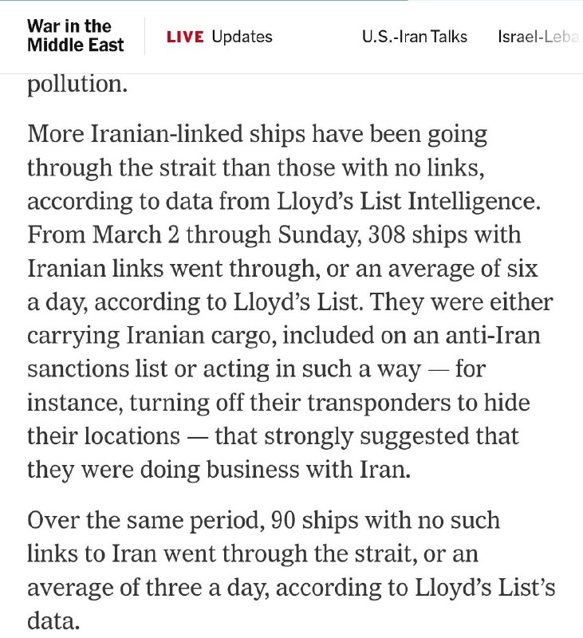
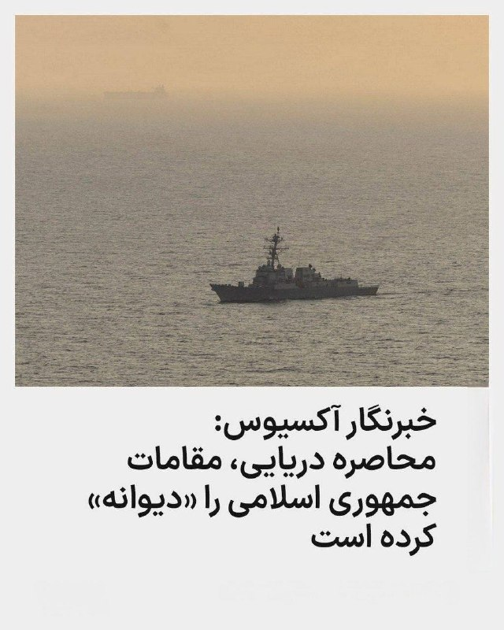

# Channel putakk

## Message 24520

[Video](media/24520_0.mp4)

🚨
اشیا ( موشک ) برفراز کویت

---

## Message 24526

[Video](media/24526_0.mp4)

🚨
ساعت ۰۳:۵۰ صبح پنجشنبه؛ حرکت پهپاد در آسمان غرب تهران

---

## Message 24531

[Video](media/24531_0.mp4)

🚨
ساعت حدود ۰۴:۳۰ صبح پنجشنبه؛ همچنان پهپاد (نقطه‌ی سریع متحرک) در آسمان تهران حضور دارند اما پدافندها دیگر فعال نیستند.
احتمالاً تمرکز این عملیات با استفاده از پهپادهای شناسایی، بر جمع‌آوری اطلاعات از مناطقی خاص در جهت افزایش آمادگی برای دور جدید حملات (روزهای آینده) است.

---

## Message 24538

[Video](media/24538_0.mp4)

🇮🇷
شاهزاده رضا پهلوی در جریان نشست در برلین:
قالیباف، عراقچی و سپاه پاسداران هیچ‌کدام عملگرا نیستند و این‌ها صرفا چهره‌هایی از همان ماشین کشتار هستند.

---

## Message 24519

**Date:** 2026-04-23T00:00:36+00:00

🚨
انفجار در شهریار و قم و تهران

---

## Message 24521

**Date:** 2026-04-23T00:04:03+00:00

🚨
حملات به اصفهان

---

## Message 24522

**Date:** 2026-04-23T00:09:48+00:00

🚨
انفجار در بندرعباس

---

## Message 24523

**Date:** 2026-04-23T00:10:49+00:00

این خبر هارو رسانه های اسرائیلی میزارند
به مخض رسیدن خبرهای  جدید
بروز رسانی میشوند

---

## Message 24524

**Date:** 2026-04-23T00:17:46+00:00

🚨
نیروی هوایی آمریکا رفته تو عملیات علیه ایران - UK Report

---

## Message 24525

**Date:** 2026-04-23T00:18:27+00:00

🚨
#مهم
❌
همه‌ی این خبرها فعلا غیررسمی هستن

---

## Message 24527

**Date:** 2026-04-23T00:23:07+00:00

🚨
رسانه های ایرانی هم اکنون از برگزاری رزمایش پدافند هوایی در مناطق مختلف کشور خبر می دهند

---

## Message 24528

**Date:** 2026-04-23T00:31:29+00:00

🚨
گزارشات از صدای انفجار در مناطقی از شرق تهران، رسانه های داخلی گفتن خنثی سازی مهمات زمان جنگه.

---

## Message 24529

**Date:** 2026-04-23T00:37:29+00:00

🚨
نفت برنت به ۱۰۵ دلار رسید!

---

## Message 24530

**Date:** 2026-04-23T00:43:25+00:00

🗣
تازه‌ترین خبرها به روایت شاهدان عینی – پنج‌شنبه ۳ اردیبهشت ۱۴۰۵
🔹
پنج‌شنبه سوم اردیبهشت ساعت ۲:۴۰ بامداد فعالیت پدافند در پردیس تهران شنیده شد.
🔹
پنج‌شنبه سوم اردیبهشت ساعت ۲:۵۳ بامداد صدای پنج انفجار در حوالی پردیس استان تهران شنیده شد.
🔹
بامداد پنج‌شنبه سوم اردیبهشت صدای فعالیت شدید پدافند در چیتگر شنیده شد.
🔹
ساعت ۳:۰۵ بامداد پنج‌شنبه ۳ اردیبهشت فعالیت دوباره پدافند برای دومین بار در یک ساعت در پردیس تهران شنیده شد.
🔹
بامداد پنج‌شنبه ۳ اردیبهشت از ساعت حدود ۲:۵۰ نیمه‌شب دست‌کم صدای ۱۰ انفجار از منطقه‌های مختلف سمت پردیس شنیده شد. ما سمت فاز ۴ هستیم و نسبتاً نزدیک و شدید بود.
🔹
ساعت ۳:۳۰ پنج‌شنبه ۳ اردیبهشت صدای پدافند در تهران شنیده شد.
🔹
ساعت ۲:۴۸ پنج‌شنبه ۳ اردیبهشت صدای ۶ انفجار پشت سر هم از پردیس اومد.
🔹
ساعت ۲:۵۰ بامداد پنج‌شنبه ۳ اردیبهشت جنگ شروع شد.

---

## Message 24532

**Date:** 2026-04-23T03:53:00+00:00

🚨
نیویورک‌تایمز: از زمان آغاز جنگ آمریکا با ایران، ۳۰۸ کشتیِ مرتبط با ایران از تنگه هرمز عبور کرده‌اند

---

## Message 24533

**Date:** 2026-04-23T06:27:28+00:00

🚨
وزیر کشور پاکستان با سفیر آمریکا در خصوص تلاش‌های دیپلماتیک مربوط به برگزاری دور دوم مذاکرات اسلام‌آباد گفتگو کرد.

---

## Message 24534

**Date:** 2026-04-23T06:28:23+00:00

پاکستان در این مسیر خودشو جر داد!!!

---

## Message 24535

**Date:** 2026-04-23T07:19:18+00:00

شنیده‌ها:
خبر رسانه‌های اسرائیلی درباره‌ی اینکه ترامپ تا روز یکشنبه به ج.ا مهلت داده درباره‌ی مذاکرات تصمیم بگیره صحت داره و پشت پرده پیام‌هایی رد و بدل شده.
تا این مهلت به جایی نرسن، احتمال از سرگیری حملات بالاست.
@pouriazeraati

---

## Message 24536

**Date:** 2026-04-23T07:20:43+00:00

🚨
خبرنگار آکسیوس، باراک راوید، به سی‌ان‌ان گفت که یک منبع غیرآمریکایی که با مقامات جمهوری اسلامی صحبت کرده است، شرایط حاضر را در یک جمله برای او این‌طور خلاصه کرد: مقامات رژیم «به‌خاطر این محاصره (دریایی) دیوانه شده‌اند.» او افزود آمریکا این محاصره را گسترش داده و با ورود تجهیزات بیشتر، واشنگتن به دنبال شناورهای جمهوری اسلامی فراتر از آب‌های منطقه خواهد رفت که این امر اثر دردناکتری بر جمهوری اسلامی خواهد گذاشت.

---

## Message 24537

**Date:** 2026-04-23T09:31:11+00:00

🚨
اژه ای سرکرده تروریستای جمهوری اسلامی:
ناوگان زنبوری سپاه با قایق‌های تندرو و شهپادها، از غارهای دریایی جزیره فارور، انتظار ناوهای متجاوز آمریکایی را می‌کشند تا دمار از روزگار متجاوزان درآورند.

---
