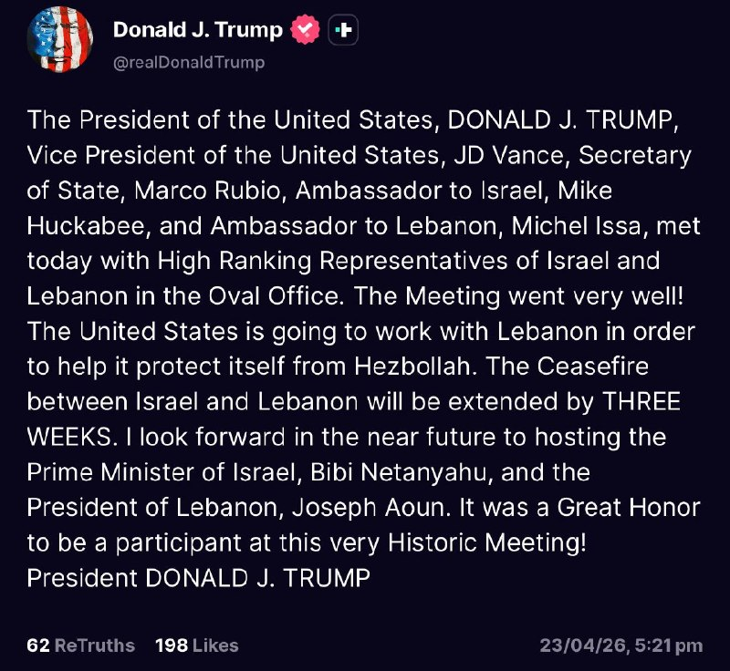
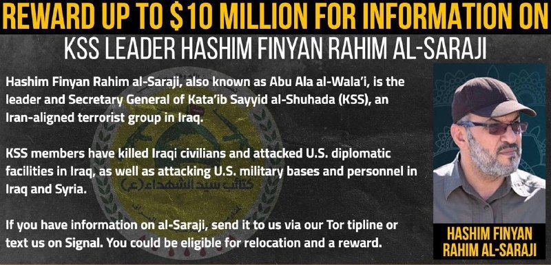
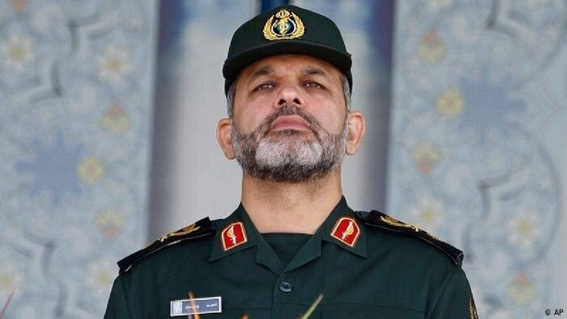
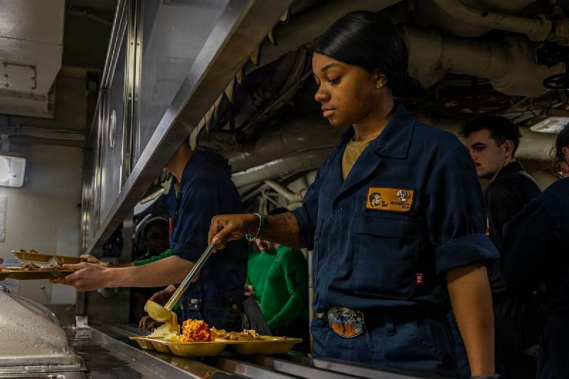

# Channel putakk

## Message 24617

[Video](media/24617_0.mp4)

🚨
دقایقی پیش ارتش اسرائیل چند حمله سنگین به جنوب لبنان انجام داد

---

## Message 24624

[Video](media/24624_0.mp4)

🚨
جی دی ونس، معاون رئیس‌جمهور ایالات متحده، درباره مذاکرات اسرائیل و لبنان:
«به نظر من این یک لحظه بزرگ و تاریخی است. قرار است آتش‌بس را به مدت سه هفته تمدید کنیم که همین الان بین اسرائیل و لبنان برقرار است. البته، این اتفاق بدون درگیری مستقیم رئیس‌جمهور هم می‌افتاد.»

---

## Message 24625

[Video](media/24625_0.mp4)

🚨
ترامپ: کاری که با محاصره کردیم واقعاً فوق‌العاده‌ست؛ما کنترل کامل داریم

---

## Message 24627

🚨
خبرنگار:
نظر شما در مورد جایگزینی ایران با ایتالیا در جام جهانی چیست؟
🇺🇸
ترامپ:
بگذارید کمی در موردش فکر کنم. مارکو؟
🇺🇸
روبیو:
هیچ چیزی از طرف ایالات متحده مبنی بر اینکه آنها نمی‌توانند بیایند، وجود ندارد.

---

## Message 24628

🚨
ترامپ درباره گفتگوهای اسرائیل و لبنان:
ما جلسه بسیار خوبی با مقامات بسیار عالی‌رتبه لبنان و مقامات بسیار عالی‌رتبه اسرائیل داشتیم... آن‌ها به تمدید آتش‌بس به مدت سه هفته دیگر توافق کرده‌اند...
این کار همزمان با اقدامات ما در ایران انجام خواهد شد و امری شگفت‌انگیز خواهد بود.

---

## Message 24629

[Video](media/24629_0.mp4)

🚨
خبرنگار: آیا از چین به خاطر ارسال اقلام به ایران عصبانی هستید؟
🇺🇸
ترامپ: نه، ما هم همین کار را با کشورهای دیگر انجام می‌دهیم، مگر نه؟

---

## Message 24630

[Video](media/24630_0.mp4)

🚨
مارکو روبیو، وزیر امور خارجه آمریکا:
اسرائیل و لبنان هر دو قربانی یک سازمان تروریستی یکسان ( حزب الله ) هستند.

---

## Message 24638

[Video](media/24638_0.mp4)

🚨
رادان سرکرده تروریستای جمهوری اسلامی:
مردم میدان را خالی نکنید، اگر می‌‌شد پای تک‌تک‌تان را می‌بوسیدم
.

---

## Message 24619

**Date:** 2026-04-23T21:29:14+00:00

🚨
فوری/ ترامپ اعلام کرد که آتش‌بس اسرائیل و لبنان پس از مذاکرات مستقیم بین این کشورها در واشنگتن به مدت سه هفته تمدید شد

---

## Message 24620

**Date:** 2026-04-23T21:29:37+00:00

🚨
ترامپ اعلام کرد که آتش بس اسرائیل و لبنان پس از گفتگوهای مستقیم بین کشورها در واشنگتن سه هفته دیگر تمدید شد!
رئیس جمهور ایالات متحده، دونالد جی. ترامپ، معاون رئیس جمهور ایالات متحده، جی دی ونس، وزیر امور خارجه، مارکو روبیو، سفیر در اسرائیل، مایک هاکبی، و میشل عیسی، سفیر در لبنان، امروز با نمایندگان عالی رتبه اسرائیل و لبنان در دفتر بیضی دیدار کردند.
جلسه خیلی خوب پیش رفت! ایالات متحده قصد دارد با لبنان همکاری کند تا از خود در برابر حزب الله محافظت کند.
آتش بس میان اسرائیل و لبنان تا سه هفته تمدید می شود.
من مشتاقانه منتظرم در آینده نزدیک میزبان بی بی نتانیاهو، نخست وزیر اسرائیل و جوزف عون، رئیس جمهور لبنان باشم. یک افتخار بزرگ بود که در این نشست تاریخی شرکت کردم!

---

## Message 24621

**Date:** 2026-04-23T21:31:04+00:00

خاورمیانه همینقدر میتونه عجیب و غیرقابل پیش بینی باشه
‼️

---

## Message 24622

**Date:** 2026-04-23T21:31:24+00:00

🚨
فوری/وای نت:
ترامپ قصد داره آتش بس در ایران رو به مدت ۱ماه تمدید کنه و تو این مدت با استفاده از اهرم محاصره دریایی، ایران رو مجبور به پذیرش توافق کنه

---

## Message 24623

**Date:** 2026-04-23T22:15:41+00:00

🚨
ترامپ: کاشت مین دریایی یک اشتباه بزرگ بود که ایران را از پول درآوردن سالها محروم خواهد کرد

---

## Message 24626

**Date:** 2026-04-23T22:17:41+00:00

🚨
وزارت امور خارجه ایالات متحده جایزه‌ای تا سقف ۱۰ میلیون دلار برای اطلاعات درباره ابو علا الولایی، دبیرکل حشد الشعبی و مقاومت اسلامی در عراق وابسته به گروه کتائب سید الشهداء اعلام کرد

---

## Message 24631

**Date:** 2026-04-23T22:23:14+00:00

🚨
خبرنگار: آیا از چین به خاطر ارسال اقلام به ایران عصبانی هستید؟
🇺🇸
ترامپ: نه، ما هم همین کار را با کشورهای دیگر انجام می‌دهیم، مگر نه؟

---

## Message 24632

**Date:** 2026-04-23T23:04:00+00:00

با این شرایط احتمال جنگ هر روز داره بیشتر میشه تا مسیر توافق بین دو طرف!!

---

## Message 24634

**Date:** 2026-04-23T23:26:25+00:00

🚨
سی‌ان‌ان: آمریکا عملیات ترور فیلد مارشال احمد وحیدی فرمانده کل سپاه را در دست بررسی دارد.

---

## Message 24635

**Date:** 2026-04-24T00:25:50+00:00

🚨
فرماندهی مرکزی ایالات متحده:
نیروهای روی ناو هواپیمابر یو‌ اس اس آبراهام لینکلن (CVN 72) وعده‌های غذایی را به خدمه سرو می‌کنند. یک گروه ضربه‌ای ناو هواپیمابر معمولی روزانه حدود ۴۰۰۰ تخم‌مرغ سرو می‌کند.
در حال حاضر سه گروه ضربه‌ای ناو هواپیمابر در خاورمیانه در حال عملیات هستند.
به طور مشترک، دریانوردان و تفنگداران دریایی این واحدها روزانه بیش از ۱۲۰۰۰ تخم‌مرغ مصرف می‌کنند.

---

## Message 24637

**Date:** 2026-04-24T03:37:43+00:00

---
