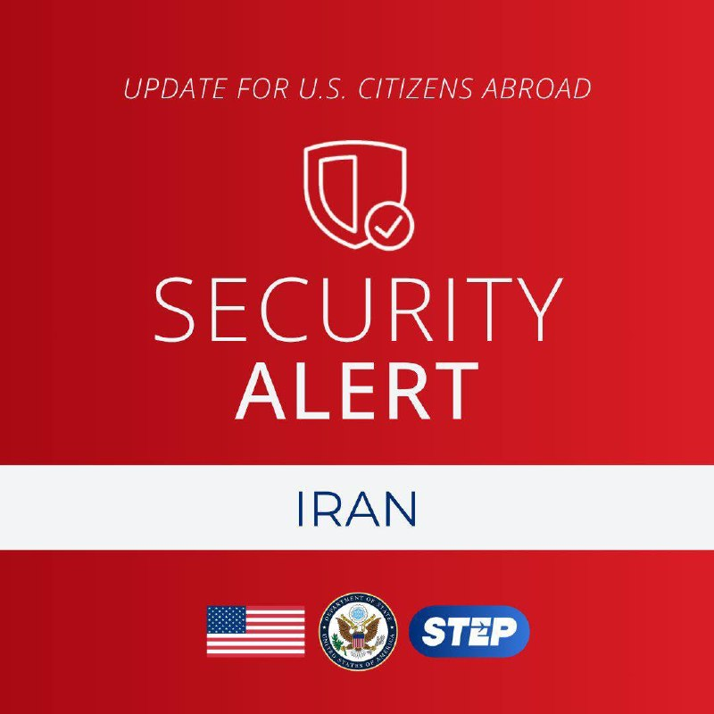
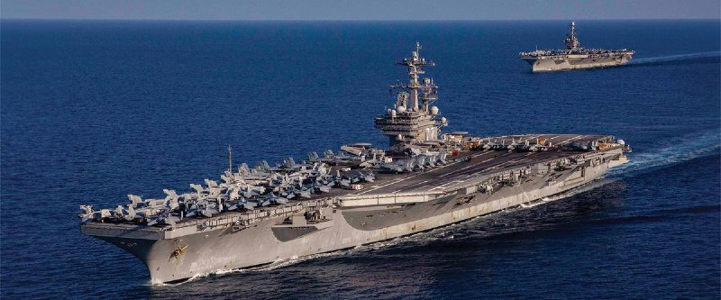
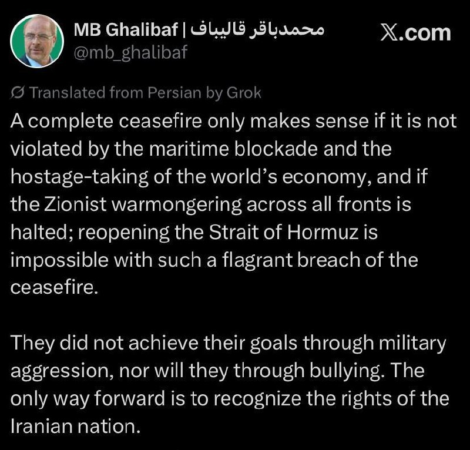
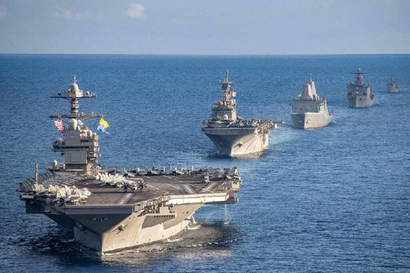
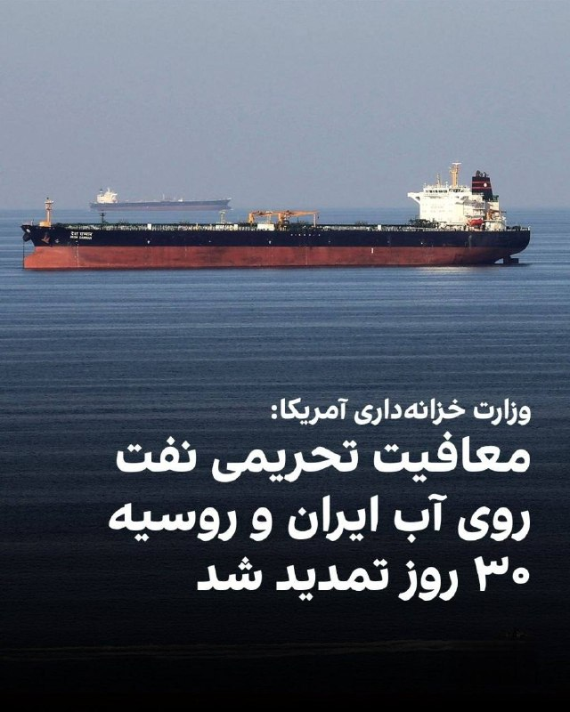
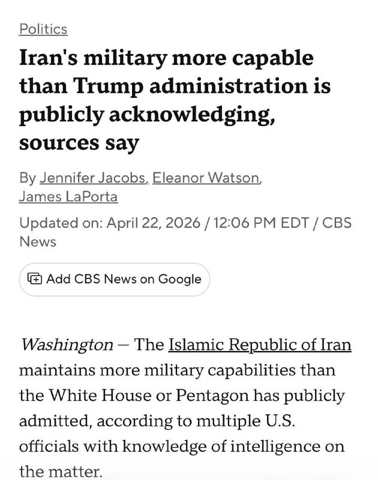
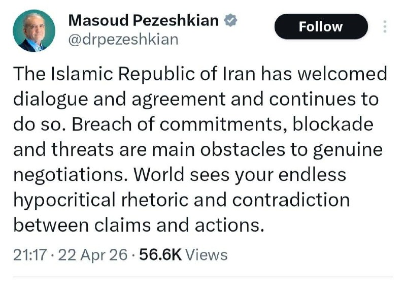
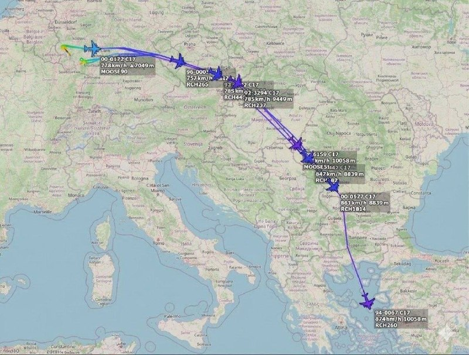
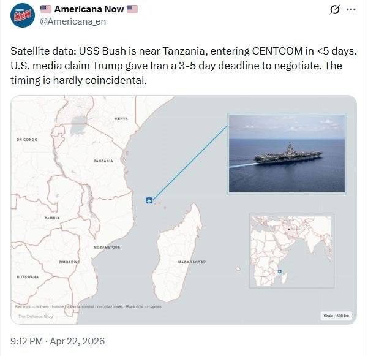

# Channel putakk

## Message 24462

[Video](media/24462_0.mp4)

🚨
وزیر خزانه‌داری ایالات متحده، اسکات بسنت:
رئیس‌جمهور ترامپ نشان داده است که در کاهش قیمت انرژی مهارت دارد.

---

## Message 24479

[Video](media/24479_0.mp4)

خامنه ای چطور کشته شد
ویدیو کامل:
https://www.youtube.com/watch?v=qDlo7avLcDo

---

## Message 24461

**Date:** 2026-04-22T15:59:51+00:00

🚨
سفارت ایالات متحده: حریم هوایی ایران از دیروز تا حدی بازگشایی شده است. از شهروندان آمریکایی خواسته شده است که همین حالا از طریق هوایی یا زمینی ایران را به مقصد ارمنستان، آذربایجان، ترکیه یا ترکمنستان ترک کنند.
سفارت هشدار داد که ایران ممکن است از خروج شهروندان آمریکایی جلوگیری کند یا "هزینه خروج" دریافت کند. افراد دارای تابعیت دوگانه باید با گذرنامه ایرانی خارج شوند. به آمریکایی‌ها گفته شده است که به افغانستان، عراق یا منطقه مرزی پاکستان و ایران سفر نکنند.

---

## Message 24463

**Date:** 2026-04-22T16:07:44+00:00

🚨
ترامپ تو پست جدیدش : «صبحِ شکوه : آیا ترامپ تو جنگ با ایران میره سراغ مدل کامل “شرمن”؟
یعنی می‌پرسه ترامپ میره سمت «جنگ تمام‌عیار و سخت» علیه ایران یا نه

---

## Message 24464

**Date:** 2026-04-22T17:06:56+00:00

🚨
ترامپ:
خبر بسیار خوبی دارم!
همین الان به من اطلاع داده شد که هشت زن معترض که قرار بود امشب در ایران اعدام شوند، دیگر کشته نخواهند شد.
چهار نفر فوراً آزاد می‌شوند و چهار نفر دیگر به یک ماه زندان محکوم خواهند شد.
من واقعاً قدردان این هستم که ایران و رهبرانش به درخواست من، به عنوان رئیس‌جمهور ایالات متحده، احترام گذاشتند و اجرای اعدام برنامه‌ریزی‌شده را متوقف کردند.
از توجه شما به این موضوع سپاسگزارم.
دونالد ترامپ

---

## Message 24465

**Date:** 2026-04-22T17:13:12+00:00

🚨
فوری / کانال ۱۲ اسرائیل: آمریکا به اسرائیل اعلام کرده است اولتیماتوم و آتش بس یک شنبه به پایان می‌رسد

---

## Message 24466

**Date:** 2026-04-22T17:15:18+00:00

🚨
فوری / کانال ۱۲ اسرائیل: آمریکا به اسرائیل اعلام کرده است اولتیماتوم و آتش بس یک شنبه به پایان می‌رسد

---

## Message 24467

**Date:** 2026-04-22T17:17:40+00:00

🚨
فوری / کانال ۱۲ اسرائیل: آمریکا به اسرائیل اعلام کرده است اولتیماتوم و آتش بس یک شنبه به پایان می‌رسد

---

## Message 24468

**Date:** 2026-04-22T17:18:34+00:00

🚨
قالیباف تروریست:
«آتش‌بس کامل تنها زمانی معنا دارد که توسط محاصره دریایی و گروگان‌گیری اقتصاد جهانی نقض نشود و اگر جنگ‌طلبی صهیونیستی در تمام جبهه‌ها متوقف شود؛ بازگشایی تنگه هرمز با چنین نقض آشکار آتش‌بس غیرممکن است.
آنها از طریق تجاوز نظامی به اهداف خود نرسیدند و از طریق زورگویی هم نخواهند رسید. تنها راه پیش رو، به رسمیت شناختن حقوق ملت ایران است.»

---

## Message 24469

**Date:** 2026-04-22T17:25:02+00:00

🚨
پنتاگون: ناو هواپیمابر جورج دبلیو بوش در 3 تا 5 روز آینده به خاورمیانه می‌رسد.

---

## Message 24470

**Date:** 2026-04-22T17:28:27+00:00

🚨
اسکات بسنت، وزیر خزانه‌داری آمریکا، چهارشنبه اعلام کرد معافیت تحریمی نفت روی دریا متعلق به روسیه و ایران را به مدت ۳۰ روز تمدید کرده است.او گفت این تصمیم پس از درخواست حدود ۱۰ کشور آسیب‌پذیر در برابر کمبود نفت به‌دلیل بسته بودن تنگه هرمز اتخاذ شد.
بسنت اضافه کرد وزارت خزانه‌داری با اعطای معافیت‌های تحریمی توانست بیش از ۲۵۰ میلیون بشکه نفت در دریا را آزاد کند و افزود در صورت انجام نشدن این اقدام، قیمت‌ها بالاتر می‌رفت.

---

## Message 24472

**Date:** 2026-04-22T17:34:10+00:00

🚨
ادعای وال‌استریت‌ژورنال: آمریکا و ایران از طریق واسطه‌ها پیام‌هایی رد و بدل کرده‌اند، اما پیشرفت کمی حاصل شده است
ایران اصرار دارد که تیم مذاکره‌کننده تا زمان لغو محاصره، تهران را ترک نخواهد کرد.
نیویورک‌تایمز: میانجیگران پاکستانی پس از تمدید آتش‌بس، سیگنال‌های مثبتی از ایران دریافت کرده‌اند

---

## Message 24473

**Date:** 2026-04-22T18:07:11+00:00

🚨
سی‌بی‌اس:
ایران همچنان نیمی از موشک‌های بالستیک خود را حفظ کرده است

---

## Message 24474

**Date:** 2026-04-22T18:07:42+00:00

🚨
پزشکیان:
جمهوری اسلامی ایران از گفتگو و توافق استقبال کرده و همچنان می‌کند. نقض تعهدات، محاصره و تهدید موانع اصلی مذاکرات واقعی هستند
جهان شاهد لفاظی‌های ریاکارانه بی‌پایان شما و تناقض بین ادعاها و اعمال شماست.

---

## Message 24475

**Date:** 2026-04-22T18:08:28+00:00

🚨
پنتاگون: ناو هواپیمابر جورج دبلیو بوش در 3 تا 5 روز آینده به خاورمیانه می‌رسد.

---

## Message 24476

**Date:** 2026-04-22T18:11:25+00:00

🚨
پنتاگون: ناو هواپیمابر جورج دبلیو بوش در 3 تا 5 روز آینده به خاورمیانه می‌رسد.

---

## Message 24477

**Date:** 2026-04-22T18:11:58+00:00

🚨
کتاب قدرت مذاکره عباس تو مارکت نیویورک تایمز جزو کتابای پرفروش شده
!!!

---

## Message 24478

**Date:** 2026-04-22T18:19:38+00:00

🏆
۵۰ روز دیگر جام جهانی ۲۰۲۶ آغاز می‌شود.

---

## Message 24480

**Date:** 2026-04-22T18:43:53+00:00

🚨
چندین خبرنگار گزارش داده‌اند که هشدار امنیتی در کاخ سفید صادر شده است و خبرنگاران و کارکنان به عنوان بخشی از تخلیه جزئی به اتاق جلسه منتقل شده‌اند

---

## Message 24481

**Date:** 2026-04-22T18:56:59+00:00

🚨
صداوسیما:
در نظرسنجی ۷۱ درصد مردم گفته‌اند بعد از جنگ وضعیت ایران بهتر خواهد شد

---
