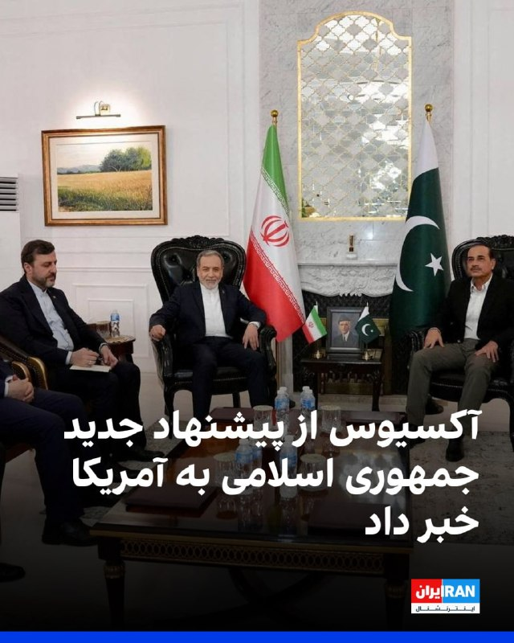

# Latest message in vahidonline

## Message 75032

**Date:** 2026-04-27T02:41:54+00:00

آکسیوس به نقل از منابعی در دولت آمریکا گزارش داد جمهوری اسلامی از طریق میانجیگران پاکستانی پیشنهاد تازه‌ای برای دستیابی به توافقی درباره بازگشایی تنگه هرمز و پایان جنگ به ایالات متحده ارائه کرده و مذاکرات هسته‌ای را به مرحله بعدی موکول کرده است.
به گفته این منابع، بر اساس این پیشنهاد، گفت‌وگوهای هسته‌ای تنها پس از بازگشایی تنگه هرمز و لغو محاصره آغاز خواهد شد.
آکسیوس همچنین گزارش داد انتظار می‌رود در نشست روز دوشنبه دونالد ترامپ، رییس‌جمهوری آمریکا، در اتاق وضعیت کاخ سفید، بن‌بست کنونی در مذاکرات با ایران و گزینه‌های احتمالی برای مراحل بعدی جنگ بررسی شود.
یکی از منابع آگاه نیز گفت عباس عراقچی، وزیر خارجه جمهوری اسلامی، در سفرهای دو روز گذشته به میانجیگران اعلام کرده در داخل ساختار رهبری ایران اجماعی درباره نحوه پاسخ به درخواست آمریکا برای تعلیق بلندمدت غنی‌سازی اورانیوم و انتقال ذخایر اورانیوم غنی‌شده از کشور وجود ندارد.
@
VahidOOnLine
سایت خبری آکسیوس می‌گوید دونالد ترامپ، رئیس جمهوری آمریکا قرار است روز دوشنبه در «اتاق وضعیت» کاخ سفید که برای تصمیم‌گیری‌های حساس از آن استفاده می‌شود، در مورد ایران با اعضای ارشد تیم امنیت ملی و سیاست خارجی خود تشکیل جلسه دهد.
@
VahidHeadline
📡
@VahidOnline

---
