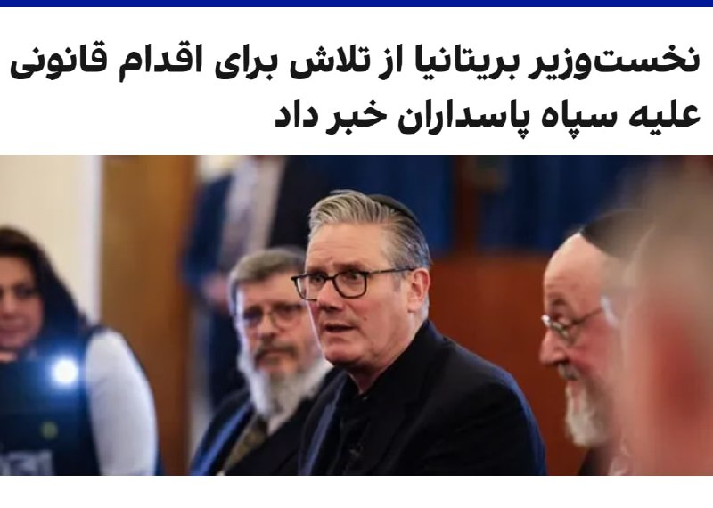

# Latest message in vahidonline

## Message 74983

**Date:** 2026-04-24T17:01:38+00:00

کی‌یر استارمر، نخست‌وزیر بریتانیا، اعلام کرد دولت او در نشست آینده پارلمان که چند هفته دیگر آغاز می‌شود، لایحه‌ای را برای قرار دادن سپاه پاسداران در فهرست سازمان‌های ممنوعه ارائه خواهد کرد.
استارمر جمعه چهارم اردیبهشت در جریان بازدید از یک کنیسه که هدف حمله قرار گرفته بود به نشریه جوییش کرونیکل گفت «بسیار نگران» افزایش استفاده از نیروهای نیابتی از سوی حکومت ایران است.
@
VahidOOnLine
دولت بریتانیا قصد دارد با تصویب قانون جدید، امکان قرار دادن سپاه در فهرست گروه‌های تروریستی را فراهم کند.
این تصمیم پس از افزایش فشارها بر دولت بریتانیا برای برخورد سخت‌گیرانه‌تر با تهدیدهای وابسته به جمهوری اسلامی مطرح شده است.
@
VahidOOnLine
📡
@VahidOnline

---
