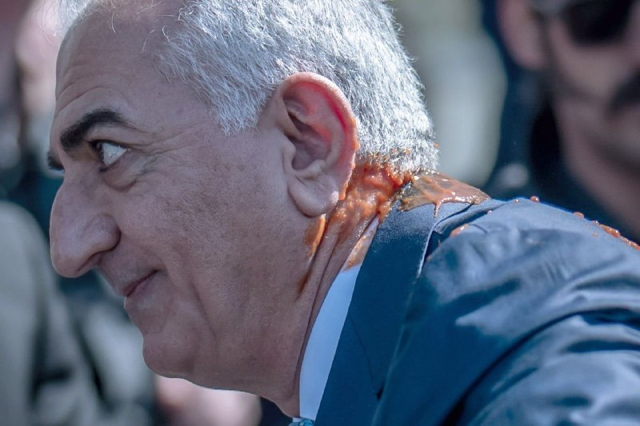
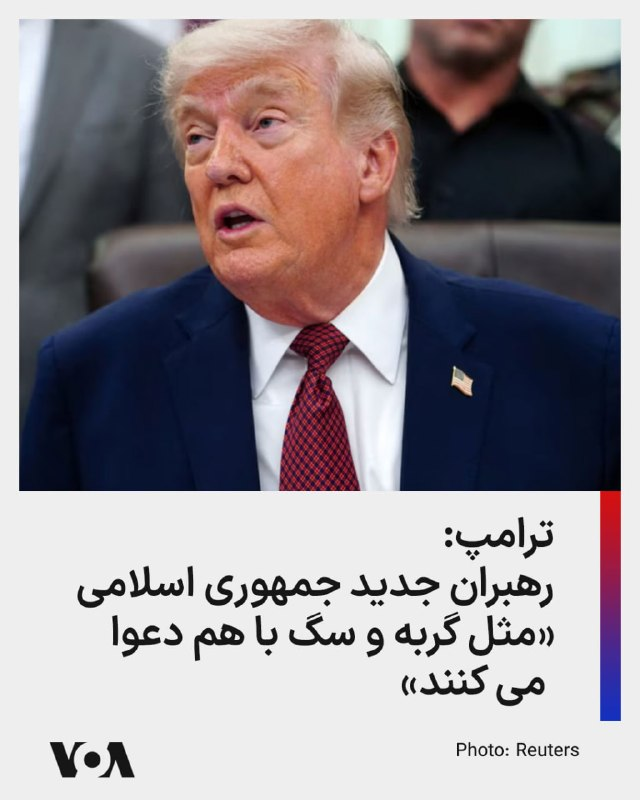
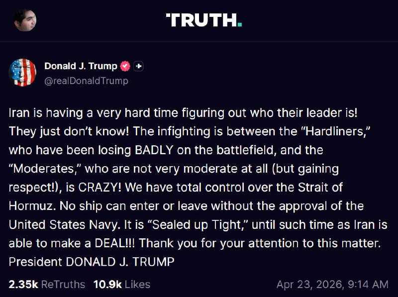
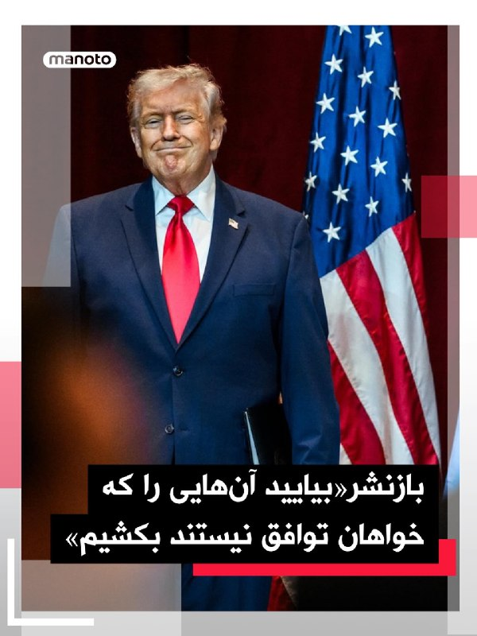
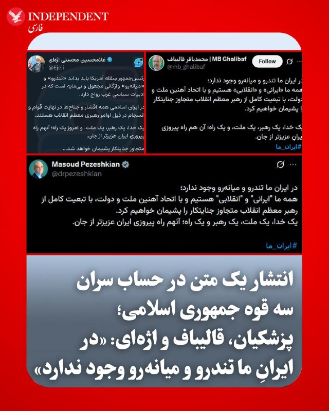
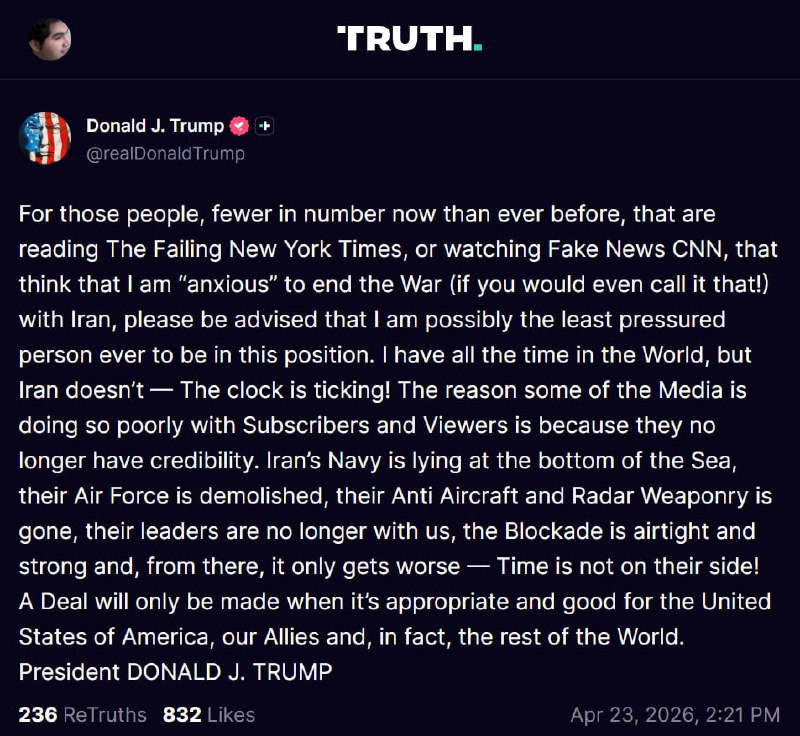
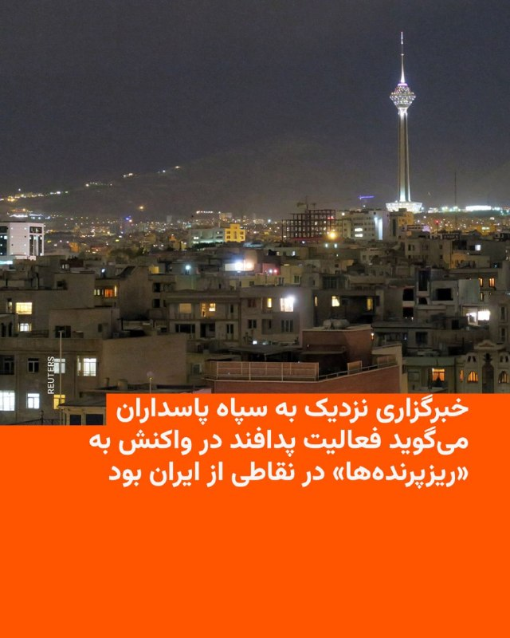

# Channel vahidonline

## Message 74948

[Video](media/74948_1.mp4)

شاهزاده رضا پهلوی روز پنج‌شنبه سوم اردیبهشت و در جریان سفر به برلین هدف پرتاب مایعی قرمز قرار گرفت.
پلیس اعلام کرد این فرد برای بررسی هویت و انگیزه تحت بازجویی قرار دارد و پیش‌تر نیز سابقه‌ای در پرونده‌های پلیس نداشته است. در ابتدا گفته شد از «گوجه‌فرنگی» در این حمله استفاده شده، اما بعداً فقط به «مایع قرمز» اشاره شد؛ تیم آقای پهلوی گفته این مایع سس گوجه‌فرنگی بوده است.
تصاویر منتشرشده نشان می‌دهد این ماده روی گردن و شانه او پاشیده شده، با این حال او پس از حادثه بدون واکنش خاصی به هوادارانش دست تکان داده است.
@
VahidHeadline
پلیس برلین اعلام کرد تحقیقات علیه فردی که در مقابل نشست مطبوعاتی فدرال بازداشت شد به اتهام «ایراد صدمه بدنی، تخریب اموال و توهین به افراد در عرصه سیاسی» آغاز می‌شود. همچنین امکان ادامه بازداشت او برای امروز در حال بررسی است.
@
VahidOOnLine
طی هفته‌های اخیر آقای پهلوی با سفر به چندین کشور اروپایی، با شماری از سیاستمداران و رسانه‌ها دیدار کرده و خواهان افزایش فشار بر جمهوری اسلامی و ادامه حمایت از اعتراضات مردم ایران شده است.
@
VahidHeadline
📡
@VahidOnline

---

## Message 74953

[Video](media/74953_0.mp4)

یسرائیل کاتز، وزیر دفاع اسرائیل، روز پنجشنبه، سوم اردیبهشت، با اعلام آمادگی کامل ارتش برای ازسرگیری جنگ علیه جمهوری اسلامی، تاکید کرد که اهداف عملیاتی به‌دقت تعیین شده‌اند. او گفت که اسرائیل برای آغاز حملات، منتظر «چراغ سبز ایالات متحده» است و هدف اصلی این مرحله، «حذف خاندان خامنه‌ای» و نابودی زیرساخت‌های حیاتی انرژی و برق ایران برای بازگرداندن این کشور به «عصر حجر» خواهد بود.
کاتز با اشاره به آسیب‌پذیری شدید تاسیسات استراتژیک در ایران، گفت که رهبران رژیم در تونل‌ها پنهان شده‌اند و در تصمیم‌گیری و ارتباطات با مشکل جدی مواجه هستند. او هشدار داد که دور جدید حملات، بسیار ویرانگرتر از گذشته خواهد بود و نقاطی را هدف قرار می‌دهد که پایه‌های رژیم را به لرزه درآورده و منجر به فروپاشی آن خواهد شد. وزیر دفاع اسرائیل تاکید کرد که برخلاف ادعاهای پیروزی از سوی تهران، بقای شخصی سران حکومت دیگر تضمین‌شده نیست.
@
VahidOOnLine
📡
@VahidOnline

---

## Message 74958

[Video](media/74958_1.mp4)

رئیس جمهوری آمریکا روز پنج‌شنبه در کاخ سفید گفت رهبران جمهوری اسلامی از بین رفته‌اند و رهبران جدید آن «مثل گربه و سگ با هم دعوا می کنند.»
دونالد ترامپ گفت اگر جمهوری اسلامی توافق نکند مسئله جمهوری اسلامی را به‌طور نظامی با زدن اهداف باقی‌مانده حل کند.
ترامپ گفت نمی‌گذارد جمهوری اسلامی تا پیش از توافق روزانه ۵۰۰ میلیون دلار بدست آورد و این آمریکا است که کنترل تنگه هرمز را در اختیار دارد.
او گفت جمهوری اسلامی خواهان توافق است اما به خاطر اختلافات داخلی «به‌شدت بی‌نظم» هستند.
آقای ترامپ همچنین به اقدام خود برای متوقف کردن اعدام هشت زن معترض جوان در ایران اشاره کرد.
او گفت در ازای اینکه آمریکایی‌ها مدتی بهای بیشتری برای بنزین بدهند، تهدید هسته‌ای جمهوری اسلامی علیه شهرهای آمریکا و حتی جهان از بین می‌رود.
رئیس جمهوری آمریکا تاکید کرد که جمهوری اسلامی نباید به سلاح هسته‌ای دست پیدا کند.
او در واکنش به سوالات خبرنگاران که می‌گفتند چه مدتی به جمهوری اسلامی وقت می‌دهد و یا درگیری با جمهوری اسلامی چه مدتی ادامه خواهد یافت گفت او هیچ عجله‌ای ندارد، آمریکا زمان زیادی دارد، تسلیحات آمریکا کامل است و او نمی‌خواهد بگذارد «دیوانه‌ها» در جمهوری اسلامی به سلاح هسته‌ای دست پیدا کنند و به شهرهای اروپایی از جمله پاریس حمله کنند.
آقای ترامپ با اشاره به حذف خامنه‌ای گفت رهبران جمهوری اسلامی رفته‌اند و ما نمی‌دانیم رهبران آن‌ها چه کسانی هستند. او گفت دسته اول و دوم رهبران رژیم از بین رفته‌اند و دسته سوم رهبران رژیم نیز نگران حذف شدن هستند.
رئیس جمهوری آمریکا در پاسخ به سوال خبرنگاری که از او پرسید آیا استفاده از سلاح‌ هسته‌ای در جنگ با جمهوری اسلامی در نظر می‌گیرد به این سوال با شدت پاسخ داد و ضمن رد این احتمال آن را «سوال احمقانه‌ای» خواند.
رئیس جمهوری آمریکا گفت ایالات متحده در جریان عملیات «خشم حماسی» یک «آشفتگی واقعی» برای جمهوری اسلامی ایجاد کرده است چرا که جمهوری اسلامی برای دنیا در طول ۴۷ سال گذشته آشفتگی ایجاد کرده بود.
@
VahidHeadline
📡
@VahidOnline

---

## Message 74964

[Video](media/74964_0.mp4)

وزیر خارجه آمریکا می‌گوید که هیچ مقام آمریکایی به ورزشکاران ایران نگفته است که نمی‌توانند در مسابقات جام جهانی فوتبال شرکت کنند.
مارکو روبیو می‌گوید: «چیزی که نمی‌توانند با خود بیاورند، گروهی از تروریست‌های سپاه پاسداران انقلاب اسلامی است که وانمود کنند خبرنگار یا مربی ورزشی هستند.»
این مسابقات از ۱۱ ژوئن، ۲۱ خرداد آغاز و به میزبانی آمریکا، کانادا و مکزیک برگزار خواهد شد.
@
VahidHeadline
📡
@VahidOnline

---

## Message 74945

**Date:** 2026-04-23T12:44:09+00:00

عضو کمیسیون امنیت ملی مجلس ایران می‌گوید، مجتبی خامنه‌ای، رهبر جمهوری اسلامی «مخالف» تمدید مذاکره با آمریکا بود.
علی خضریان در یک مصاحبه تلویزیونی گفته است: «اخبار ما مبنی بر این است که ایشان به‌شدت با هرگونه تمدید مذاکره در چنین شرایطی مخالف هستند.»
او گفته است که آمریکا در جنگ «دچار شکست شده و همه سناریوهایی که در طول دوران جنگ می‌توانست را به میدان آورد؛ همه ابزارهای جنگ رسانه‌ای و روانی را به میدان آورد و تلاش کرد در ساعات و روزهای پایانی آتش‌بس با سناریوی تهدید و تسلیم ایران را پای میز مذاکره بکشاند.»
این اظهارات در حالیست که پس از کشته شدن علی خامنه‌ای، رهبر پیشین جمهوری اسلامی ایران، ویدیو یا صوتی از مجتبی خامنه‌ای در دست نیست و فقط پیام‌های مکتوب منتسب به او در رسانه‌های ایران منتشر شده‌اند.
@
VahidHeadline
📡
@VahidOnline

---

## Message 74946

**Date:** 2026-04-23T12:53:48+00:00

Gerduo
📡
@VahidOnline

---

## Message 74947

**Date:** 2026-04-23T13:14:22+00:00

پست ترامپ ترجمه ماشین:
من به نیروی دریایی ایالات متحده دستور داده‌ام هر شناوری را ــ هرچند قایق‌های کوچک باشند (زیرا همه ناوهای آن‌ها، یعنی تمام ۱۵۹ فروند، در کف دریا قرار دارند!) ــ که در آب‌های تنگه هرمز مین‌گذاری می‌کند، هدف قرار داده و نابود کند.
در این‌باره نباید هیچ‌گونه تردیدی وجود داشته باشد. علاوه بر این، مین‌روب‌های ما هم‌اکنون در حال پاکسازی تنگه هستند.
بدین‌وسیله دستور می‌دهم این عملیات ادامه یابد، اما با شدتی سه‌برابر.
از توجه شما به این موضوع سپاسگزارم.
رئیس‌جمهور دونالد جی. ترامپ
realDonaldTrump
📡
@VahidOnline

---

## Message 74951

**Date:** 2026-04-23T14:08:07+00:00

پست ترامپ ترجمه ماشین:
ایران در تعیین این‌که رهبرش چه کسی است، با مشکل جدی روبه‌رو شده است؛ آن‌ها واقعاً نمی‌دانند!
درگیری داخلی میان «تندروها» که در میدان نبرد به‌شدت در حال شکست خوردن هستند و «میانه‌روها» که در واقع چندان هم میانه‌رو نیستند (اما در حال کسب احترام‌اند) به وضعیتی دیوانه‌وار رسیده است!
ما به‌طور کامل بر تنگه هرمز کنترل داریم. هیچ کشتی‌ای بدون تأیید نیروی دریایی ایالات متحده نمی‌تواند وارد شود یا از آن خارج شود.
این گذرگاه کاملاً «مهر و موم شده» است تا زمانی که ایران بتواند به یک توافق برسد!!!
از توجه شما به این موضوع سپاسگزارم.
رئیس‌جمهور دونالد جی. ترامپ
realDonaldTrump
📡
@VahidOnline

---

## Message 74952

**Date:** 2026-04-23T15:24:25+00:00

دونالد ترامپ در شبکه اجتماعی تروث سوشال به بازنشر پستی از مارک تیسن، ستون‌نویس محافظه‌کار آمریکایی، پرداخته بود که در آن آمده است: «اگر در ایران دو جناح وجود داشته باشد، یکی که خواهان توافق است و دیگری که مخالف آن است، بیایید آن‌هایی را که خواهان توافق نیستند بکشیم.
@
VahidOOnLine
دونالد ترامپ مقاله‌ای از مارک تیسن با عنوان «ترامپ برای رسیدن به اهدافش در ایران نیازی به توافق ندارد» که در واشنگتن‌پست منتشر شده بود را در شبکه اجتماعی تروث سوشال بازنشر کرد و نوشت: «کاملا درست است!»
تیسن در این یادداشت استدلال می‌کند که سران جمهوری اسلامی با برداشتی اشتباه از تمدید آتش‌بس، تصور می‌کنند ترامپ بیش از آن‌ها تشنه توافق است تا از بازگشت به جنگ اجتناب کند. او تاکید می‌کند که ترامپ باید این تصور را در هم بشکند. بر اساس این گزارش، ترامپ ضرب‌الاجلی ۳ تا ۵ روزه برای دریافت یک پیشنهاد متقابل جدی تعیین کرده است.
در این مقاله آمده است که اگر رهبری جمهوری اسلامی بین دو جناح موافق و مخالفِ توافق تقسیم شده، راهکار ساده‌ای وجود دارد: «حذف جناحی که مخالف توافق است».
@
VahidOOnLine
📡
@VahidOnline

---

## Message 74954

**Date:** 2026-04-23T17:27:14+00:00

پیام‌های دریافتی درباره شنیده شدن صدای فعالیت پدافند تهران:
ساعت ۲۰:۵۵ پدافند غرب شلیک میکنه
8:55 صدای پدافند و انفجار های متعدد شهرک اکباتان
پدافند مهرآباد خیلی سنگین مشغول فعالیت است ساعت 20:55
سلام وحید جان صدای پدافند شدید همین الان غرب تهران ساعت ۲۰/۵۵
مرزداران تهران ۲۰:۵۵ فعالیت ضدهوایی
وحید همین الان پدافند مهرآباد شروع به کار کرد
صدای پدافند و انفجار توی جنت اباد میاد ساعت 20 پنجاه شش
وحید جان سلام غرب تهران ۲۰:۵۶ رگبار بی وقفه پدافند، احتمالا تست هست.
سلام وحید، ساعت ۸:۵۶، جنت‌اباد مرکزی تهران، صداهای پشت سر هم اومد ولی به احتمال قوی پدافند بود
ساعت 20:56 شهرک اکباتان صدای پدافند میاد
صدای پدافند شدید اکباتان ساعت ۸:۵۵
۸:۵۵ شب ۳ اردیبهشت شهرآرا صدای انفجارهای زیاد و صدای پدافند میاد نمیدونم موشکه یا پهپاد، هنوزم صداها میاد
+ کلی پیام مشابه با اسم محل‌های مختلف غرب تهران که صدا رو شنیدند.
آپدیت:
در مرکز و جنوب و شرق هم صدای پدافند شنیده میشه.
📡
@VahidOnline

---

## Message 74955

**Date:** 2026-04-23T17:34:59+00:00

روز پنجشنبه، سوم اردیبهشت ماه، مسعود پزشکیان، محمدباقر قالیباف و غلامحسین محسنی اژه‌ای، روسای قوای مجریه، مقننه و قضاییه در جمهوری اسلامی متن مشترکی را در شبکه‌های اجتماعی منتشر کرده و مدعی شدند که در ایران «تندرو و میانه‌رو» وجود ندارد.
در این متن که به نظر می‌رسد واکنشی به مواضع اخیر ایالات متحده باشد، آمده است: «در ایران ما تندرو و میانه‌رو وجود ندارد همه ما «ایرانی» و «انقلابی» هستیم و با اتحاد آهنین ملت و دولت، با تبعیت کامل از رهبر معظم انقلاب متجاوز جنایتکار را پشیمان خواهیم کرد. یک خدا، یک ملت، یک رهبر و یک راه؛ آن هم راه پیروزی ایران عزیزتر از جان.»
@
VahidOOnLine
📡
@VahidOnline

---

## Message 74956

**Date:** 2026-04-23T18:28:02+00:00

پست ترامپ، ترجمه ماشین:
برای آن دسته از افرادی ــ که اکنون تعدادشان از هر زمان دیگری کمتر شده ــ که روزنامه رو به افول نیویورک‌تایمز را می‌خوانند یا شبکه جعلی سی‌ان‌ان را تماشا می‌کنند و تصور می‌کنند من برای پایان دادن به جنگ با ایران ــ اگر اصلاً بتوان نام جنگ بر آن گذاشت! ــ «بی‌قرار» هستم، باید بگویم که احتمالاً من کم‌فشارترین فردی هستم که تاکنون در چنین موقعیتی قرار گرفته است. من هر چقدر که لازم باشد وقت دارم، اما ایران ندارد؛ ساعت در حال تیک‌تاک است!
دلیل این‌که برخی رسانه‌ها از نظر شمار مشترکان و بینندگان چنین عملکرد ضعیفی دارند، این است که دیگر هیچ اعتباری برایشان باقی نمانده است. نیروی دریایی ایران در کف دریا آرمیده، نیروی هوایی آن نابود شده، سامانه‌های پدافند هوایی و تجهیزات راداری‌اش از میان رفته، رهبرانش دیگر در میان ما نیستند، محاصره دریایی کاملاً محکم و نفوذناپذیر است و از این‌جا به بعد، اوضاع فقط بدتر خواهد شد؛ زمان به سود آن‌ها نیست!
هرگونه توافق تنها زمانی انجام خواهد شد که مناسب و به سود ایالات متحده آمریکا، متحدان ما و در واقع بقیه جهان باشد.
رئیس‌جمهور دونالد جی. ترامپ
realDonaldTrump
📡
@VahidOnline

---

## Message 74957

**Date:** 2026-04-23T19:42:08+00:00

خبرگزاری فارس، نزدیک به سپاه پاسداران، گزارش داد که صدای پدافندها در تهران و چند شهر دیگر ایران در شامگاه پنج‌شنبه واکنش به «حضور ریزپرنده‌ها و پهپادهای کوچک در چند نقطه از کشور» بود.
این خبرگزاری اشاره‌ای به مبدا پرتاب این پهپادها نکرد. پیشتر رسانه‌های اسرائیل به نقل از منابعی در ارتش این کشور انجام حمله از سوی اسرائیل علیه ایران در پنج‌شنبه شب را رد کرده بودند.
خبرگزاری مهر هم گفته بود که پدافند در حال «مقابله با اهداف متخاصم» است.
@
VahidHeadline
📡
@VahidOnline

---

## Message 74963

**Date:** 2026-04-23T21:31:40+00:00

ترامپ: آتش‌بس بین اسرائیل و لبنان برای سه هفته دیگر تمدید خواهد شد
پست ترامپ، ترجمه ماشین:
رئیس‌جمهور ایالات متحده آمریکا، دونالد جی. ترامپ، معاون رئیس‌جمهور ایالات متحده، جی‌دی ونس، وزیر امور خارجه، مارکو روبیو، سفیر آمریکا در اسرائیل، مایک هاکابی، و سفیر آمریکا در لبنان، میشل عیسی، امروز با نمایندگان بلندپایه اسرائیل و لبنان در دفتر بیضی کاخ سفید دیدار کردند. این دیدار بسیار خوب پیش رفت!
ایالات متحده قرار است با لبنان همکاری کند تا به آن کمک نماید که بتواند خود را در برابر حزب‌الله محافظت کند. آتش‌بس بین اسرائیل و لبنان برای سه هفته دیگر تمدید خواهد شد.
من مشتاقانه منتظر هستم که در آینده نزدیک از نخست‌وزیر اسرائیل، بی‌بی نتانیاهو، و رئیس‌جمهور لبنان، ژوزف عون، میزبانی کنم. افتخار بزرگی بود که در این دیدار بسیار تاریخی شرکت‌کننده باشم!
رئیس‌جمهور دونالد جی. ترامپ
realDonaldTrump
📡
@VahidOnline

---
