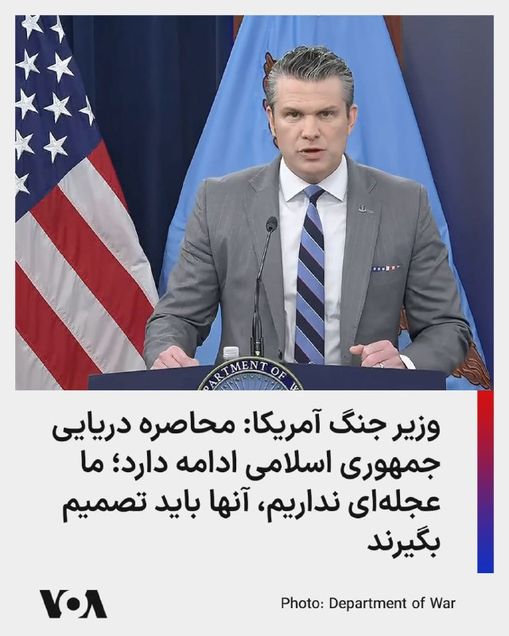
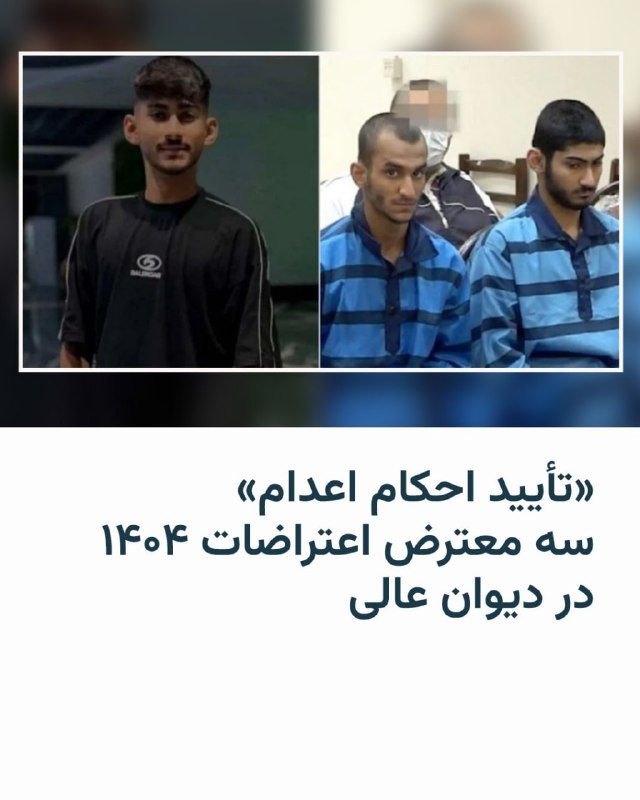
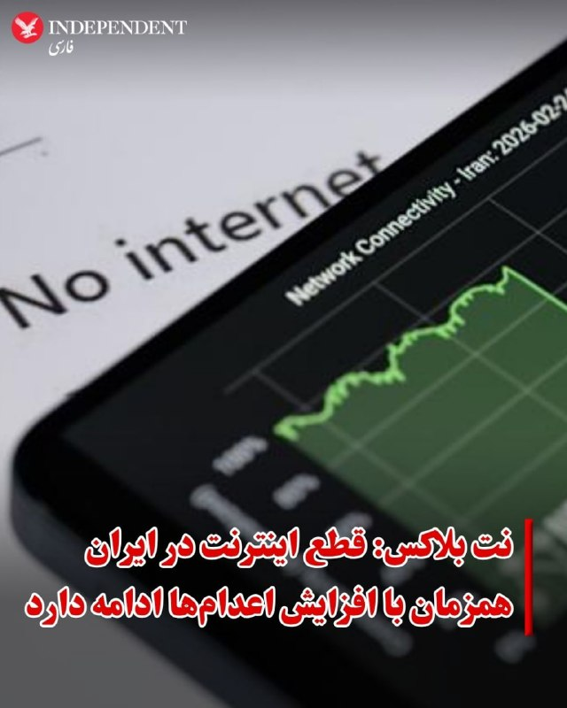
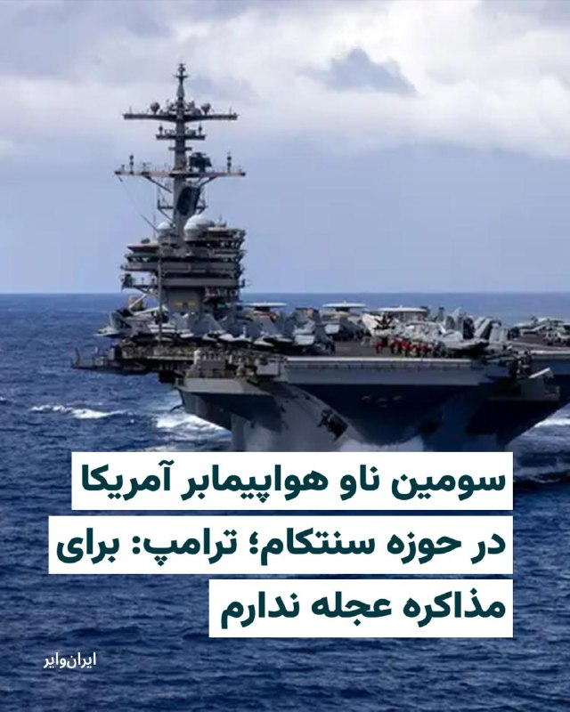
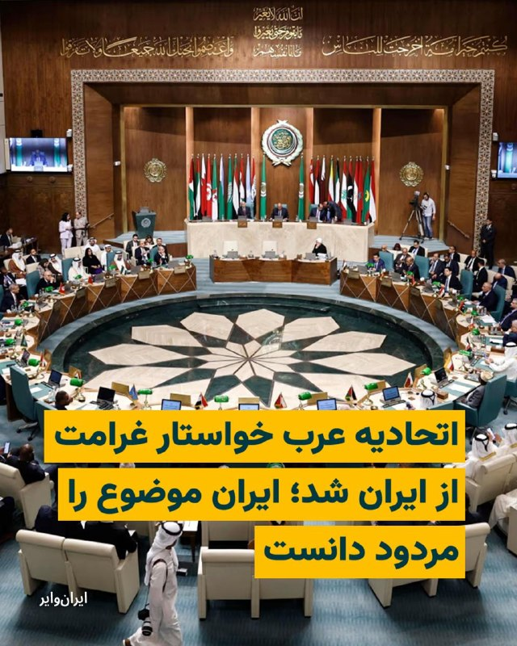
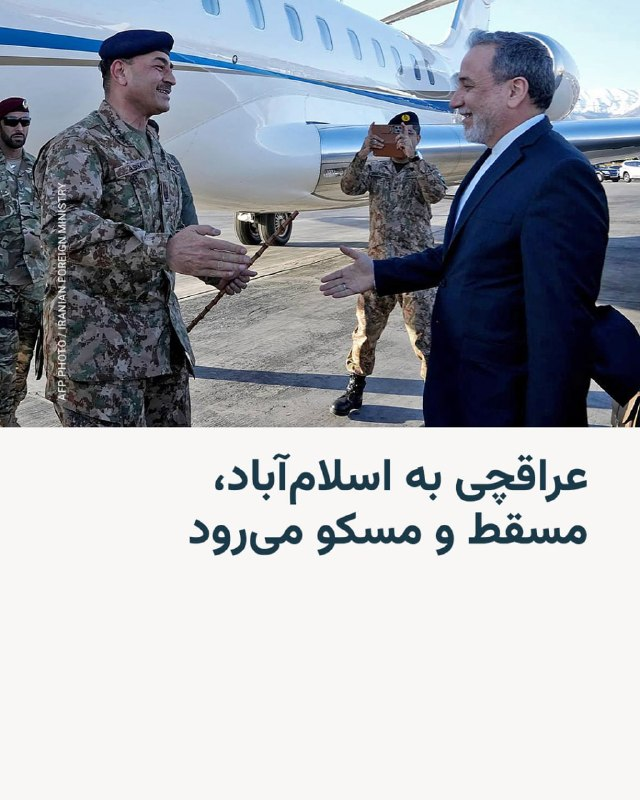
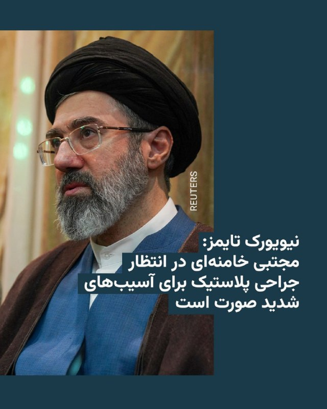
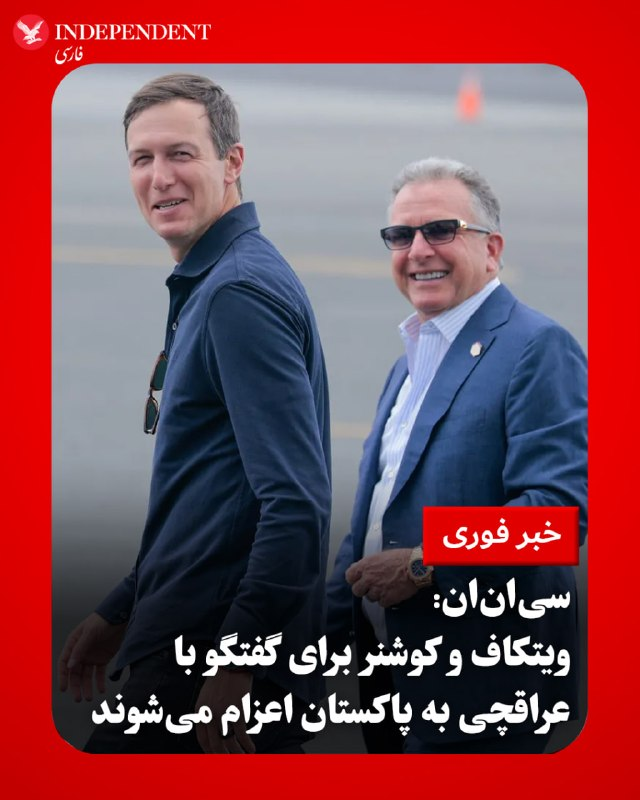

# Channel vahidonline

## Message 74971

[Video](media/74971_1.mp4)

پیت هگست، وزیر جنگ ایالات متحده گفت که محاصره دریایی جمهوری اسلامی ادامه دارد و می‌تواند بی‌پایان باشد، بنابراین ایران باید تصمیم بگیرد و از فرصت توافق استفاده کند.
به گفته آقای هگست پرزیدنت ترامپ در همه جلسات خصوصی تاکید می‌کند که آمریکا هیچ عجله‌ای برای توافق ندارد، تنها محاصره را ادامه می‌دهد و به شناورهای مین‌گذار در تنگه هرمز شلیک خواهد کرد.
وزیر جنگ آمریکا همچنین عنوان کرد که آمریکا نیازی به  تنگه هرمز ندارد، پس توپ در زمین جمهوری اسلامی است.
@
VahidHeadline
پیت هگست، وزیر دفاع ایالات متحده، روز جمعه چهارم اردیبهشت در یک نشست خبری گفت حکومت ایران در موقعیتی قرار دارد که باید به «انتخابی عاقلانه» بر سر میز مذاکره تن بدهد و تأکید کرد زمان به نفع تهران نیست.
وزیر دفاع آمریکا افزود ایران یک «فرصت تاریخی» برای دستیابی به توافقی جدی در اختیار دارد و تصریح کرد اکنون توپ در زمین جمهوری اسلامی است.
او همچنین هشدار داد که محاصره دریایی علیه ایران «تا هر زمان که لازم باشد» ادامه خواهد یافت و افزود: «تاکنون ۳۴ کشتی توسط نیروی دریایی آمریکا از تنگه هرمز بازگردانده شده‌اند.»
هگست در ادامه گفت این نباید تنها نبرد آمریکا باشد و متحدان واشینگتن نیز باید نقش بیشتری ایفا کنند. او با انتقاد از متحدان غربی افزود اروپا و آسیا دهه‌ها از حفاظت آمریکا بهره‌مند شده‌اند و «دوران سواری مجانی» به پایان رسیده است.
وزیر دفاع آمریکا همچنین تأکید کرد که اروپا بیش از ایالات متحده به تنگه هرمز نیاز دارد و گفت رابطه با آمریکا به عنوان متحد «یک مسیر دوسویه» است.
@
VahidHeadline
پیت هگست، وزیر جنگ آمریکا گفت: «نیروهای نظامی جمهوری اسلامی به دزدان دریایی تبدیل شده‌اند و کنترلی بر اوضاع ندارند.»
او افزود: «نیروهای جمهوری اسلامی هزاران نفر از مردم خود را کشته‌اند.»
پیت هگست اضافه کرد: «این جنگی است که جمهوری اسلامی ۴۷ سال علیه ما انجام داده و دونالد ترامپ تنها رییس‌جمهوری بوده که قاطعیت اقدام در برابر آن را داشته است.»
@
VahidOOnLine
هگست گفته: در میز مذاکره عاقلانه انتخاب کنید. تنها کاری که باید انجام دهند این است که به‌صورت معنادار و قابل راستی‌آزمایی از ساخت سلاح هسته‌ای دست بکشند، در غیر این صورت می‌توانند شاهد فروپاشی وضعیت اقتصادی شکننده رژیم خود تحت فشار بی‌وقفه قدرت آمریکا باشند.
@
VahidOOnLine
پیت هگست، وزیر جنگ آمریکا در جریان سخنان امروز خود در پنتاگون به جای خلیج فارس از عبارت جعلی استفاده کرد. این نخستین‌بار نیست که پیت هگست از عبارت جعلی به جای خلیج فارس استفاده می‌کند.
@
VahidOOnLine
📡
@VahidOnline

---

## Message 74982

[Video](media/74982_0.mp4)

ویدیویی از گردهمایی‌های شبانه حامیان حکومت منتشر شده که یکی از مداحان حاضر در آن ترانه «ای ایران ایران» را به انگلیسی می‌خواند.
@
VahidHeadline
📡
@VahidOnline

---

## Message 74984

[Video](media/74984_0.mp4)

کارولین لویت، سخنگوی کاخ سفید روز جمعه تأیید کرد که استیو ویتکاف، فرستاده ویژه دونالد ترامپ، رئیس‌جمهور آمریکا، و جرد کوشنر، داماد و مشاور او، برای گفت‌وگو با ایران به پاکستان سفر می‌کنند.
او در جمع خبرنگاران اعلام کرد که نمایندگان آمریکا صبح شنبه عازم این سفر می‌شوند.
❗️
به گفته لویت، «ایرانی‌ها همان‌‌طور که رئیس‌جمهور از آن‌ها خواسته بود، تماس گرفتند و درخواست این گفت‌وگوی حضوری را مطرح کرد.»
او اضافه کرد: «بنابراین رئیس‌جمهور، ویتکاف و کوشنر را اعزام می‌کند تا دیدگاه‌های آن‌ها را بشنوند. ما امیدواریم این گفت‌وگو سازنده باشد و به پیشبرد روند دستیابی به یک توافق کمک کند.»
سخنگوی کاخ سفید افزود: «دونالد ترامپ خطوط قرمز خود را در طول این روند به‌روشنی مشخص کرده است. او در تمدید آتش‌بس انعطاف نشان داد. بنابراین استیو و جرد راهی می‌شوند تا ببینند طرف ایرانی چه می‌گوید.»
ساعتی پیش‌تر شبکه خبری سی‌ان‌ان و خبرگزاری رویترز اعلام کرده بودند که این دو مشاور آقای ترامپ برای مذاکره با عباس عراقچی وزیر خارجه ایران به پاکستان می‌روند.
@
VahidHeadline
📡
@VahidOnline

---

## Message 74965

**Date:** 2026-04-24T13:58:19+00:00

کمیته پیگیری وضعیت بازداشت‌شدگان اعلام کرد که باخبر شده احکام اعدام احسان حسینی‌پور حصارلو، متین محمدی و عرفان امیری، سه شهروند ۱۷ و ۱۸ ساله که در جریان اعتراضات دی ماه ۱۴۰۴ بازداشت شده بودند، در دیوان عالی کشور «تأیید و به اجرای احکام ارسال شده است».
احسان حسینی‌پور حصارلو، متین محمدی و عرفان امیری در پرونده مرتبط به آتش‌سوزی مسجد پاکدشت بازداشت شدند.
آنها در این پرونده در دادگاه انقلاب تهران با اتهاماتی از جمله «اقدام علیه امنیت داخلی»، «اجتماع و تبانی علیه امنیت کشور»، «مشارکت در قتل دو نفر»، «تحریق عمدی مسجد سیدالشهدا در پاکدشت» و «تخریب اموال عمومی» مواجه شده بودند.
@
VahidHeadline
📡
@VahidOnline

---

## Message 74966

**Date:** 2026-04-24T13:59:09+00:00

نت‌بلاکس، نهاد بین‌المللی ناظر بر وضعیت اینترنت در جهان روز جمعه چهارم اردیبهشت در آخرین به روز رسانی خود اعلام کرد که اینترنت در ایران بیش از ۱۳۲۰ ساعت قطع شده است و در پنجاه‌وششمین روز همچنان امکان اتصال به اینترنت بین‌المللی وجود ندارد.
این نهاد بین‌الملی با اشاره به قطع اینترنت در ایران نوشت: «در حالی که‌ گزارش‌ها از اعدام‌ها نگران کننده است، طولانی‌ترین قطعی ثبت‌شده اینترنت در جهان همچنان ادامه دارد،.»
نت بلاکس پیشتر اعلام کرده بود که این شدیدترین و طولانی‌ترین قطع دسترسی کاربران به اینترنت بین‌المللی از سوی یک حکومت است که تاکنون صورت گرفته است.
همزمان با چهل‌و‌نهمین روز قطع اینترنت در ایران، فضل‌الله رنجبر، عضو کمیسیون اجتماعی مجلس شورای اسلامی، روز جمعه وصل شدن آن برای عموم را «مصلحت» ندانست و گفت: «شاید به مصلحت نباشد که در چنین شرایطی اینترنت در دسترس باشد و شاید به‌نوعی باعث فراهم شدن زمینه‌ای برای موضوعات دیگر شود.»
@
VahidOOnLine
📡
@VahidOnline

---

## Message 74967

**Date:** 2026-04-24T14:02:58+00:00

فرماندهی مرکزی ایالات متحده اعلام کرد ناو هواپیمابر «جرج اچ. دابلیو. بوش» وارد حوزه عملیاتی این فرماندهی در اقیانوس هند شده است.
حضور ناوگان ایالات متحده در حوزۀ فرماندهی سنتکام در حمایت از عملیات «خشم حماسی» و محاصره دریایی بنادر ایران است.
در حال حاضر ناوهای هواپیمابر «آبراهام لینکلن» در شمال دریای عرب و «جرالد آر. فورد» در دریای سرخ مستقرند.
در همین حال، گروه آبی‌خاکی «تریپولی» نیز در دریای عرب حضور دارد و شماری از ناوشکن‌ها و شناورهای رزمی دیگر در دریای سرخ و دریای عمان مستقر شده‌اند. ناوگروه «جرج بوش» نیز به‌عنوان بخشی از این آرایش نظامی در حال تقویت حضور آمریکا در منطقه است.
@
VahidHeadline
ساعاتی پس از اعلام خبر استقرار ناو هواپیمابر «جرج اچ. دابلیو. بوش» در اقیانوس هند، ستاد فرماندهی مرکزی آمریکا روز جمعه چهارم اردیبهشت ماه اعلام کرد که برای اولین بار در چند دهه اخیر، سه ناو هواپیمابر به‌طور هم‌زمان در خاورمیانه فعالیت می‌کنند.
بنا بر اعلام سنتکام ناوهای هواپیمابر یواس‌اس آبراهام لینکلن (سی‌وی‌ان ۷۲)، یواس‌اس جرالد آر. فورد (سی‌وی‌ان ۷۸) و یواس‌اس جورج اچ. دبلیو. بوش (سی‌وی‌ان ۷۷) که توسط بال‌های هوایی ناوهایشان همراهی می‌شوند در حال حاضر در حوزه عملیاتی این مرکز در خاورمیانه حضور دارند.
بر اساس این گزارش این سه ناو حامل بیش از ۲۰۰ هواپیما و ۱۵ هزار ملوان و تفنگدار دریایی هستند.
@
VahidHeadline
📡
@VahidOnline

---

## Message 74970

**Date:** 2026-04-24T14:06:20+00:00

وزیران خارجه کشورهای عربی روز سه‌شنبه ۲ اردیبهشت ۱۴۰۵، در یک نشست فوق‌العاده مجازی به درخواست بحرین، تهدیدهای جمهوری اسلامی برای بستن تنگه هرمز و اخلال در کشتیرانی بین‌المللی را بررسی کردند و در پایان این جلسه با صدور بیانیه‌ای مشترک، ایران را مسئول خسارت‌های ناشی از بحران اخیر دانستند.
این نشست در چارچوب شورای اتحادیه عرب و در سطح وزیران خارجه برگزار و به گفته مقام‌های عرب، با هدف بررسی «حملات ایران علیه کشورهای عربی، تعهدات تهران ذیل حقوق بین‌الملل و راه‌های پایان دادن به بحران منطقه» تشکیل شده بود.
در بیانیه پایانی که بامداد چهارشنبه منتشر شد، وزیران خارجه عرب تأکید کردند هرگونه اقدام ایران برای جلوگیری از عبور آزاد کشتی‌ها از تنگه هرمز یا باب‌المندب، نقض آشکار حقوق بین‌الملل و تهدیدی مستقیم علیه امنیت انرژی و تجارت جهانی است. در این بیانیه آمده است که جمهوری اسلامی «مسئولیت کامل بین‌المللی» در قبال خسارت‌های مالی، زیان‌های اقتصادی و آسیب‌های ناشی از اقدامات خود را بر عهده دارد و باید مطابق حقوق بین‌الملل، غرامت کامل این خسارت‌ها را پرداخت کند.
سخنگوی وزیر امور خارجه ایران در رابطه با این بیانیه تاکید کرد که دولت‌های منطقه که به هر نحو، اعم از تسهیل دسترسی، ارائه پایگاه، حمایت لجستیکی یا اطلاعاتی، قلمرو و امکانات خود را در اختیار اقدامات نظامی آمریکا و اسرائیل علیه ایران قرار داده‌اند، «در قبال تبعات این اقدامات، مسئولیت بین‌المللی داشته و باید پاسخگو باشند.»
اسماعیل بقایی بیانیه اخیر کشورهای عربی را «کاملا مردود» دانست.
احمد ابوالغیط، دبیرکل اتحادیه عرب، اما در حاشیه این نشست گفته بود کشورهای عربی «هرگز گروگان ایران برای تسویه‌حساب‌های منطقه‌ای نخواهند شد» و تأکید کرد که آزادی کشتیرانی در آبراه‌های بین‌المللی، از جمله تنگه هرمز، حقی تضمین‌شده در قوانین بین‌المللی است و تهران نمی‌تواند کنترل آن را در اختیار بگیرد.
وزیران خارجه عرب همچنین از شورای امنیت سازمان ملل خواستند برای حفظ امنیت منطقه و تضمین آزادی ناوبری وارد عمل شود و از نهادهای عربی و منطقه‌ای خواستند سازوکاری برای ثبت خسارت‌ها، ارزیابی زیان‌ها و پیگیری حقوقی دریافت غرامت از ایران ایجاد کنند.
این سومین نشست فوق‌العاده وزیران خارجه عرب از زمان آغاز بحران اخیر با ایران به شمار می‌رود؛ نشستی که نشان‌دهنده افزایش فشار سیاسی کشورهای عربی بر تهران در کنار فشارهای اقتصادی غرب است.
@
VahidHeadline
📡
@VahidOnline

---

## Message 74979

**Date:** 2026-04-24T14:22:48+00:00

خبرگزاری دولت جمهوری اسلامی، ایرنا، نوشته که عباس عراقچی از شامگاه جمعه چهارم اردیبهشت، سفر دوره‌ای را به اسلام‌آباد، مسقط و مسکو آغاز خواهد کرد.
هدف از سفر وزیر خارجه جمهوری اسلامی «رایزنی‌های دوجانبه، بحث و گفت‌وگو درباره تحولات جاری در منطقه عنوان شده است.
هم‌زمان خبرگزاری رویترز به نقل از سه منبع پاکستانی گزارش کرد که گفت‌وگوهای صلح میان ایران و ایالات متحده ممکن است به‌زودی در پاکستان از سر گرفته شود.
یک منبع دولتی پاکستان به رویترز گفته انتظار می‌رود عباس عراقچی «شامگاه جمعه وارد اسلام‌آباد شود».
بر اساس این گزارش، دو نفر از این منابع که عضو دولت پاکستان هستند، گفته‌اند که «یک تیم لجستیکی و امنیتی آمریکا از قبل برای مذاکرات احتمالی [در این کشور] مستقر شده است».
@
VahidHeadline
📡
@VahidOnline

---

## Message 74980

**Date:** 2026-04-24T14:23:24+00:00

نیوریوک تایمز می‌گوید چهار مقام ایرانی به این نشریه گفته‌اند مجتبی خامنه‌ای همچنان تحت درمان قرار دارد و در انتظار دریافت پروتز برای یکی از پاها و جراحی پلاستیک برای ترمیم آسیب‌های شدید صورت است.
در این گزارش که روز پنجشنبه سوم اردیبهشت منتشر شد، آمده است یکی از پاهای مجتبی خامنه‌ای «سه بار عمل شده و در انتظار دریافت عضو مصنوعی است. او همچنین روی یکی از دستانش جراحی داشته و به‌تدریج در حال بازیابی توانایی آن است. صورت و لب‌های او به‌شدت دچار سوختگی شده و همین امر صحبت کردن را برایش دشوار کرده و در نهایت به جراحی پلاستیک نیاز خواهد داشت».
@
VahidHeadline
📡
@VahidOnline

---

## Message 74981

**Date:** 2026-04-24T16:30:06+00:00

دو مقام دولتی آمریکا به
شبکه سی‌ان‌ان
اعلام کردند که دونالد ترامپ، فرستاده ویژه خود، استیو ویتکاف، را به همراه جرد کوشنر برای شرکت در مذاکرات با عباس عراقچی، وزیر امور خارجه جمهوری اسلامی، به پاکستان اعزام می‌کند.
این گزارش در حالی منتشر شد که وزارت خارجه جمهوری اسلامی نیز از سفر عراقچی به اسلام‌آباد خبر داد؛ با این‌حال اسماعیل بقایی، سخنگوی وزارت خارجه هدف از این سفر را «دیدارهای دوجانبه با مقام‌های ارشد پاکستان، عمان و روسیه» اعلام کرد.
به گفته منابع سی‌ان‌ان، جی‌دی ونس، معاون رئیس‌جمهوری آمریکا، در حال حاضر برنامه‌ای برای حضور در این نشست ندارد؛ چرا که محمدباقر قالیباف، رئیس مجلس شورای اسلامی، در این مذاکرات شرکت نمی‌کند. مقامات کاخ سفید در ارزیابی‌های داخلی خود، قالیباف را رئیس هیئت اعزامی ایران و همتای اصلی جی‌دی ونس می‌دانند.
با این حال، این منابع افزودند که در صورت پیشرفت مذاکرات، معاون رئیس‌جمهوری آماده سفر به اسلام‌آباد خواهد بود. همچنین تیمی از کارکنان و مشاوران جی‌دی ونس در پاکستان حضور یافته و در روند گفتگوها شرکت خواهند کرد.
@
VahidOOnLine
📡
@VahidOnline

---

## Message 74983

**Date:** 2026-04-24T17:01:38+00:00

کی‌یر استارمر، نخست‌وزیر بریتانیا، اعلام کرد دولت او در نشست آینده پارلمان که چند هفته دیگر آغاز می‌شود، لایحه‌ای را برای قرار دادن سپاه پاسداران در فهرست سازمان‌های ممنوعه ارائه خواهد کرد.
استارمر جمعه چهارم اردیبهشت در جریان بازدید از یک کنیسه که هدف حمله قرار گرفته بود به نشریه جوییش کرونیکل گفت «بسیار نگران» افزایش استفاده از نیروهای نیابتی از سوی حکومت ایران است.
@
VahidOOnLine
دولت بریتانیا قصد دارد با تصویب قانون جدید، امکان قرار دادن سپاه در فهرست گروه‌های تروریستی را فراهم کند.
این تصمیم پس از افزایش فشارها بر دولت بریتانیا برای برخورد سخت‌گیرانه‌تر با تهدیدهای وابسته به جمهوری اسلامی مطرح شده است.
@
VahidOOnLine
📡
@VahidOnline

---
