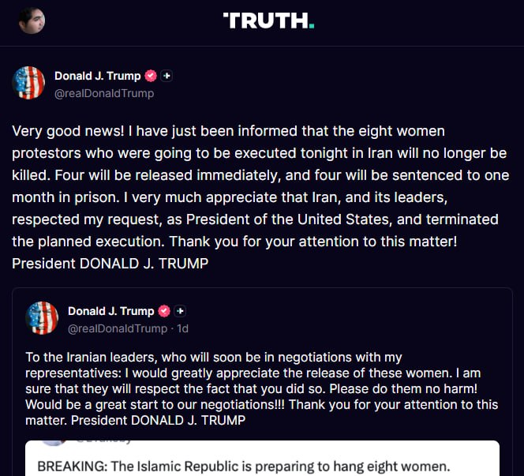
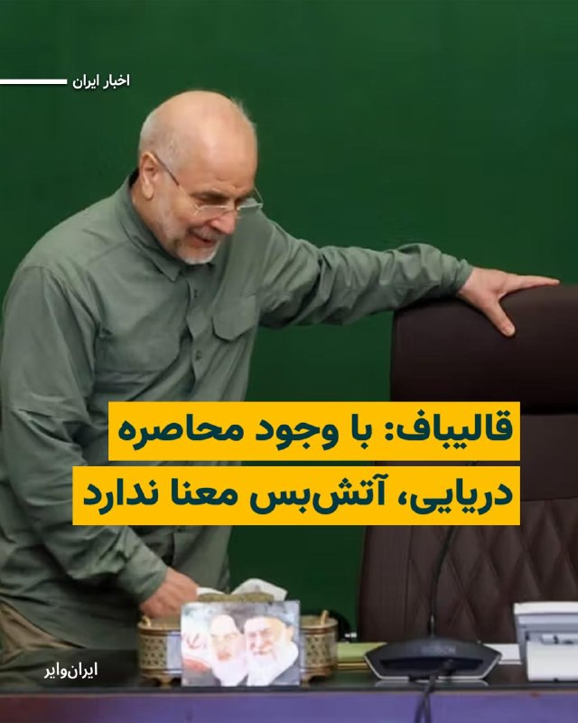
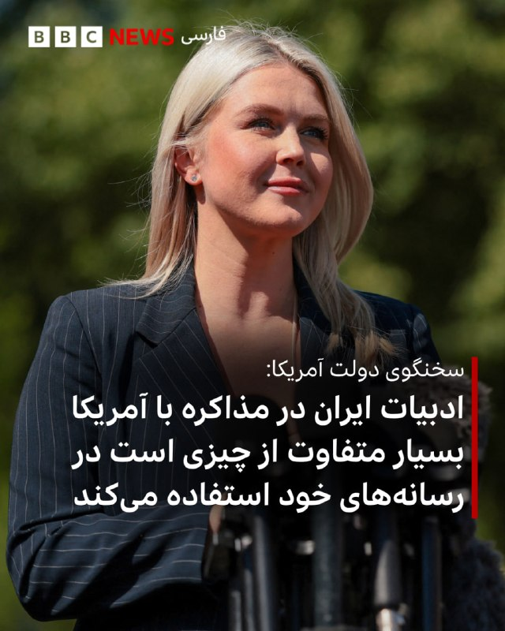
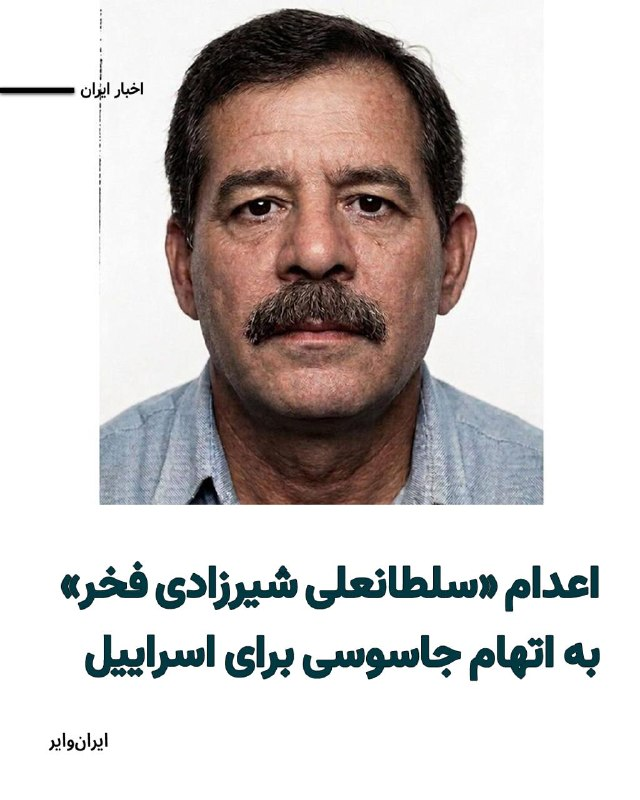
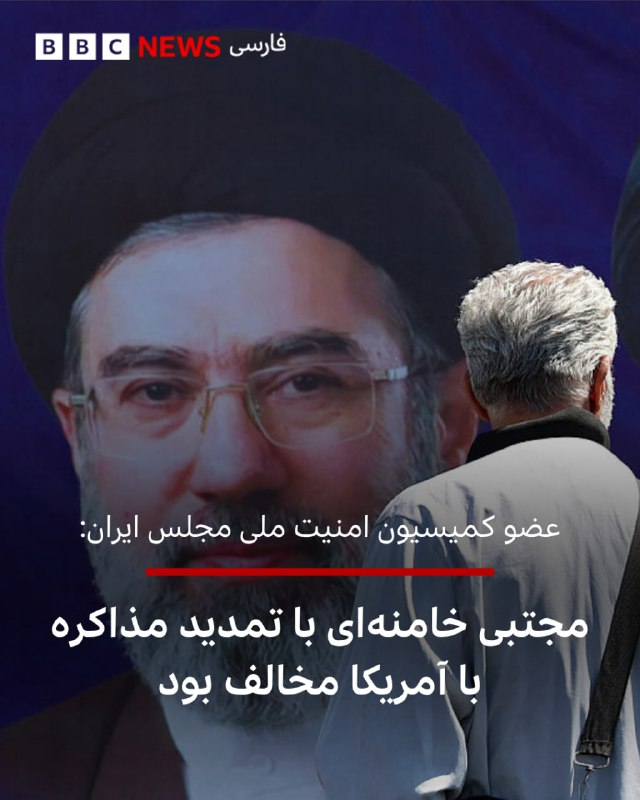
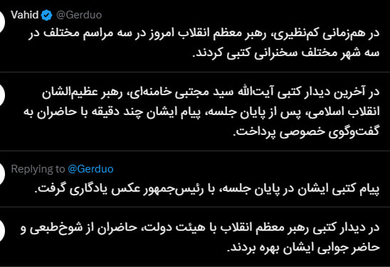
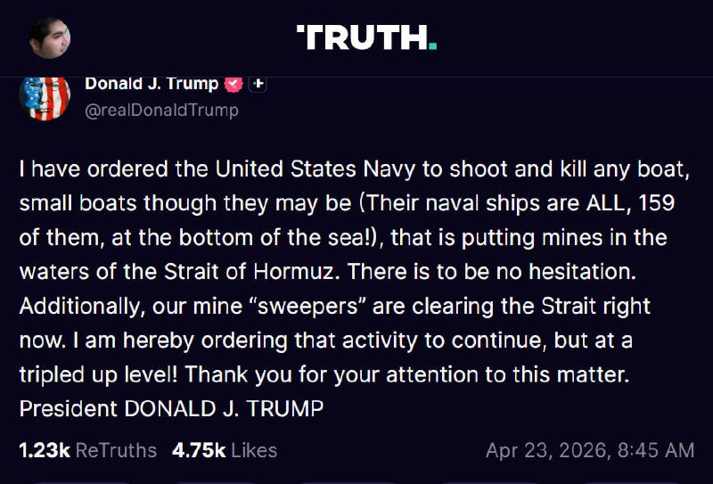

# Channel vahidonline

## Message 74928

**Date:** 2026-04-21T23:45:07+00:00

ترامپ: تنگه هرمز در کنترل آمریکا است و کشتی‌ها اجازه رفتن به بنادر ایران را ندارند
پست ترامپ، ترجمه ماشین:
روزنامه وال‌استریت ژورنال راه خود را گم کرده است!
فردی احمق در هیئت تحریریه وال‌استریت ژورنال به نام الیوت کافمن به‌تازگی یادداشتی با این عنوان نوشته است: «ایرانی‌ها، ترامپ را آدم ساده‌لوحی فرض کرده‌اند.» واقعاً؟ طی ۴۷ سال، آن‌ها مردم ما و بسیاری دیگر را کشته‌اند و از تک‌تک رؤسای‌جمهور آمریکا سوءاستفاده کرده‌اند، به‌جز من — و من چه چیزی به آن‌ها تحویل دادم؟ کشوری ویران و ازهم‌پاشیده!
تمام نیروی دریایی آن‌ها به قعر دریا رفته، نیروی هوایی‌شان از بین رفته، پدافند ضدهوایی و رادارهایشان نابود شده، آزمایشگاه‌ها و انبارهای هسته‌ای‌شان در شبی تاریک از ماه ژوئن، به‌دست بمب‌افکن‌های بزرگ بی-۲ ما به‌طور کامل منهدم شد، رهبرانشان کشته شده‌اند، از جمله ژنرال سلیمانی؛ همان نابغه شرور آن‌ها که با بمب‌های کنار جاده‌ای محبوبش زندگی بسیاری را نابود کرد. تنگه هرمز در محاصره است و به‌طور کامل در کنترل آمریکاست، و هیچ کشتی‌ای اجازه رفتن به بنادر ایران را ندارد — گفته می‌شود آن‌ها روزانه ۵۰۰ میلیون دلار از این بابت ضرر می‌کنند. کشورشان به یک فاجعه اقتصادی تبدیل شده که به مویی بند است.
باراک حسین اوباما ۱.۷ میلیارد دلار پول نقد «سبزرنگ» را با یک فروند بوئینگ ۷۵۷ برای رهبران آن‌ها فرستاد و صدها میلیارد دلار دیگر نیز در اختیارشان گذاشت تا در مسیر دستیابی به بمب هسته‌ای کمکشان کند. رؤسای‌جمهور دیگر هیچ کاری برای متوقف کردن آن‌ها انجام ندادند؛ لکه ننگی بر جایگاه ریاست‌جمهوری!
اما با وجود همه این‌ها، حالا یک ابله در هیئت تحریریه وال‌استریت ژورنال درباره من می‌نویسد که گویا سرم کلاه رفته و «آدم هالو» بوده‌ام. ایران قطعاً چنین تصوری ندارد! هیچ‌کس دیگری هم این‌طور فکر نمی‌کند. گمان می‌کنم روپرت مرداک به او گفته این مطلب را این‌گونه بنویسد، چون وال‌استریت ژورنال راه خود را گم کرده است؛ دیگر خواندنش ضروری نیست، فقط به یک نشریه سیاسی شکست‌خورده دیگر تبدیل شده است!
رئیس‌جمهور دونالد جی. ترامپ
realDonaldTrump
📡
@VahidOnline

---

## Message 74929

**Date:** 2026-04-22T01:18:26+00:00

پست ترامپ ترجمه ماشین:
ایران نمی‌خواهد تنگه هرمز بسته باشد؛ آن‌ها می‌خواهند این تنگه باز باشد تا بتوانند روزانه ۵۰۰ میلیون دلار درآمد داشته باشند (بنابراین اگر این مسیر بسته باشد، همین مقدار را از دست می‌دهند!). آن‌ها فقط می‌گویند خواهان بسته شدن تنگه هستند، چون من آن را به‌طور کامل در محاصره قرار داده‌ام (بسته‌ام!) و بنابراین صرفاً می‌خواهند «آبرویشان را حفظ کنند».
چهار روز پیش افرادی نزد من آمدند و گفتند: «قربان، ایران می‌خواهد فوراً تنگه را باز کند.» اما اگر ما چنین کاری انجام دهیم، دیگر هرگز توافقی با ایران ممکن نخواهد بود، مگر اینکه باقی کشورشان را هم منفجر کنیم، از جمله رهبرانشان!
رئیس‌جمهور دونالد جی. ترامپ
realDonaldTrump
📡
@VahidOnline

---

## Message 74930

**Date:** 2026-04-22T04:05:40+00:00

پست ترامپ، ترجمه ماشین:
ایران از نظر مالی در حال فروپاشی است! آن‌ها می‌خواهند تنگه هرمز فوراً باز شود — به‌شدت به پول نقد نیاز دارند! روزانه ۵۰۰ میلیون دلار ضرر می‌کنند. نیروهای نظامی و پلیس گلایه دارند که حقوقشان پرداخت نمی‌شود. کمک!
realDonaldTrump
📡
@VahidOnline

---

## Message 74931

**Date:** 2026-04-22T05:50:54+00:00

قوه قضائیه جمهوری اسلامی اعلام کرد که بامداد چهارشنبه دوم اردیبهشت، کارمند یکی از «سازمان‌های حساس کشور» به نام مهدی فرید را که در حوزه «پدافند غیرعامل فعالیت داشت»، به اتهام «جاسوسی» برای اسرائیل اعدام کرد.
پیش از این سازمان‌های حقوق بشری او را کارمند پیشین سازمان انرژی اتمی معرفی کرده بودند که در زمستان ۱۴۰۱ بازداشت و ابتدا به زندان تهران بزرگ و بعدتر به زندان اوین منتقل شده بود.
گزارش شده که مهدی فرید در همان مکانی (سایت امیرآباد تهران) کار می‌کرد، که روزبه وادی، دانشمند هسته‌ای که چندی پیش اعدام شد نیز در آنجا مشغول به کار بود.
@
VahidHeadline
او زمستان ۱۴۰۱ بازداشت و ابتدا به ۱۰ سال حبس محکوم شد، اما در دادگاهی دیگر حکم اعدام گرفت؛ حکمی که پس از تأیید دیوان عالی کشور اجرا شد.
@
VahidOOnLine
📡
@VahidOnline

---

## Message 74932

**Date:** 2026-04-22T05:55:38+00:00

اسکات بسنت، وزیر خزانه‌داری آمریکا،با اشاره به تصمیم ایالات متحده برای ادامه محاصره دریایی جمهوری اسلامی گفت طی چند روز آینده تأسیسات ذخیره‌سازی جزیره خارک پر خواهد شد و چاه‌های نفتی شکننده ایران بسته خواهند شد.
بسنت افزود محدود کردن تجارت دریایی جمهوری اسلامی به‌طور مستقیم شریان‌های اصلی درآمد حکومت را هدف قرار می‌دهد و وزارت خزانه‌داری آمریکا به اعمال حداکثر فشار از طریق کارزار «خشم اقتصادی» ادامه خواهد داد تا به‌صورت نظام‌مند توانایی تهران برای تولید، جابه‌جایی و بازگرداندن منابع مالی را تضعیف کند.
او همچنین تاکید کرد هر فرد یا شناوری که این جریان‌ها را از طریق تجارت و تامین مالی پنهانی تسهیل کند، در معرض تحریم‌های آمریکا قرار خواهد گرفت و واشینگتن همچنان اموالی را که به گفته او «رهبری فاسد به نام مردم ایران به سرقت برده است» مسدود می‌کند.
@
VahidOOnLine
📡
@VahidOnline

---

## Message 74933

**Date:** 2026-04-22T14:34:44+00:00

نیروی دریایی سپاه پاسداران انقلاب اسلامی روز چهارشنبه دوم اردیبهشت اعلام کرد «دو فروند کشتی متخلف»، که به ادعای آن قصد «خروج مخفیانه» از تنگهٔ هرمز را داشتند، توقیف کرده است.
بر اساس اطلاعیه این نیرو، کشتی «ام‌اس‌سی- فرانچسکا» متعلق به «اسرائیل» و «اپامینودس» با این اتهام که قصد داشتند «بدون مجوز» و «با انجام تخلف‌های مکرر و دستکاری در سامانه‌های کمک ناوبری و به مخاطره انداختن امنیت دریانوردی» به صورت «مخفیانه» از تنگه هرمز خارج شوند، متوقف شدند.
نیروی دریایی سپاه می‌گوید که این شناورها به منظور بررسی محموله و اسناد و مدارک به آب‌های سرزمینی ایران منتقل شده‌اند.
اعلام این خبر در روزی صورت می‌گیرد که به گفته منابع دریانوردی، سه کشتی کانتینربر هدف تیراندازی قرار گرفتند.
سپاه پاسداران که از ۹ اسفند تنگهٔ هرمز را به روی کشتی‌ها و نفتکش‌ها بسته است، در پی برقراری آتش‌بس در جنگ با آمریکا و اسرائیل به مدت یک روز این تنگه را باز کرد، اما پس از شکست مذاکرات میان طرفین و آغاز محاصرهٔ دریایی بنادر ایران، بار دیگر آن را مسدود کرد.
@
VahidHeadline
📡
@VahidOnline

---

## Message 74934

**Date:** 2026-04-22T14:35:18+00:00

شرکت هواپیمایی لوفت‌هانزا با هدف صرفه‌جویی در سوخت جت، برخی از مسیرهای اروپایی و ۲۰ هزار پرواز کوتاه‌برد برنامه‌ریزی شده تا ماه اکتبر را لغو می‌کند.
به گزارش وال استریت ژورنال این گروه آلمانی روز سه‌شنبه اعلام کرد که پروازهای لغو شده توسط چندین شرکت هواپیمایی آن، عمدتاً منطقه‌ای انجام می‌شود و معادل ۱٪ کاهش در ظرفیت مسافران آن خواهد بود.
این اقدام در پی تنش‌ها در خاورمیانه و بسته شدن تنگه هرمز که خطوط هوایی را با کمبود سوخت جت مواجه خواهد کرد گرفته شده است.
آپوستولوس تزیزیکوستاس، کمیسر حمل‌ونقل اتحادیه اروپا روز سه‌شنبه اول اردیبهشت‌ماه هشدار داد  که بسته‌ماندن تنگه هرمز پیامدهای فاجعه‌باری برای جهان و اروپا خواهد داشت.
این مقام ارشد اتحادیه اروپا که برای شرکت در اجلاس ویژه شورای اروپا در بروکسل صحبت می‌کرد با هشدار درباره کمبود سوخت جت برای هواپیماهای مسافربری، خواستار پیدا کردن راه‌های جایگزین برای استقلال و تکثر منابع انرژی ۲۷ کشور اروپایی شد.
@
VahidOOnLine
📡
@VahidOnline

---

## Message 74935

**Date:** 2026-04-22T14:36:04+00:00

به گفته سه مقام آمریکایی در گفتگو با اکسیوس، دونالد ترامپ فرصت کوتاهی را به جناح‌های درگیر در ایران داده است تا بر سر یک پیشنهاد متقابل منسجم به اتحاد برسند؛ در غیر این صورت، آتش‌بسی که او روز سه‌شنبه تمدید کرد، پایان خواهد یافت.
یک منبع آمریکایی آگاه در این باره گفت: «ترامپ تمایل دارد ۳ تا ۵ روز دیگر به آتش‌بس زمان بدهد تا ایرانی‌ها بتوانند اوضاع داخلی خود را سروسامان دهند؛ اما این مهلت قرار نیست نامحدود باشد.»
مذاکره‌کنندگان ترامپ بر این باورند که دستیابی به توافقی برای پایان دادن به جنگ و حل‌وفصل آنچه از برنامه هسته‌ای ایران باقی مانده، هنوز امکان‌پذیر است. با این حال، آن‌ها نگرانند که در تهران کسی دارای «اختیار تام» برای پاسخ مثبت به توافق نباشد.
گزارش‌ها حاکی از آن است که مجتبی خامنه‌ای، رهبر جدید جمهوری اسلامی، ارتباطات بسیار محدودی دارد و فرماندهان سپاه پاسداران که اکنون کنترل کشور را در دست دارند، با مذاکره‌کنندگان غیرنظامی بر سر استراتژی پیش‌رو به‌شدت دچار اختلاف شده‌اند.
@
VahidOOnLine
📡
@VahidOnline

---

## Message 74936

**Date:** 2026-04-22T14:37:38+00:00

دونالد ترامپ، رئیس جمهور آمریکا چهارشنبه دوم اردیبهشت به روزنامه نیویورک پست گفت که ممکن است دور دوم مذاکرات با ایران روز جمعه در پاکستان انجام شود.
این روزنامه نوشته است که منابع پاکستانی از «تلاش‌های مثبت» برای میانجیگری میان ایران و آمریکا خبر داده و گفته‌اند احتمال می‌رود مذاکرات در «۳۶ تا ۷۲ ساعت آینده» برگزار شود.
این روزنامه نوشته است که درستی این موضوع را از رئیس جمهور آمریکا پرسیده‌اند و او در قالب یک پیامک پاسخ داده است: «ممکن است! رئیس جمهور دی‌جی‌تی.»
در همین حال خبرگزاری تسنیم، نزدیک به سپاه پاسداران نوشته است که «تا این لحظه هیچ تغییری در برنامه ایران برای عدم شرکت در مذاکره ایجاد نشده است.»
@
VahidHeadline
📡
@VahidOnline

---

## Message 74937

**Date:** 2026-04-22T16:01:48+00:00

کاخ سفید در بیانیه‌ای خطاب به شبکه فاکس اعلام کرد که تمدید آتش‌بس از سوی دونالد ترامپ بسیار محدود خواهد بود و تنها برای یک بازه زمانی ۳ تا ۵ روزه در نظر گرفته شده است.
خبرنگار شبکه خبری فاکس روز چهارشنبه ۲ اردیبهشت همچنین گزارش داد که دونالد ترامپ، رئیس‌ جمهوری آمریکا، نسبت به هرگونه وقت‌کشی در روند مذاکرات اسلام‌آباد هشیار است و هشدار داده است.
@
VahidHeadline
دو منبع آگاه به شبکه سی‌ان‌ان گفتند که رئیس‌جمهور آمریکا قصد دارد به ایران یک بازه زمانی محدود بدهد تا پیشنهادی یکپارچه ارائه کند.
این منابع افزودند که دولت آمریکا نمی‌خواهد آتش‌بس را به‌طور نامحدود تمدید کند و همچنین تمایل ندارد به ایران فرصت دهد مذاکرات را طولانی‌تر کند.
به گفته این منابع، ترامپ نسبت به تمدید آتش‌بس اولیه فراتر از مهلت روز چهارشنبه محتاط بوده است. او می‌خواهد هرچه سریع‌تر یک توافق نهایی شود.
@
VahidHeadline
📡
@VahidOnline

---

## Message 74938

**Date:** 2026-04-22T16:03:36+00:00

اسکات بسنت، وزیر خزانه‌داری آمریکا، چهارشنبه اعلام کرد معافیت تحریمی نفت روی دریا متعلق به روسیه و ایران را به مدت ۳۰ روز تمدید کرده است. او گفت این تصمیم پس از درخواست حدود ۱۰ کشور آسیب‌پذیر در برابر کمبود نفت به‌دلیل بسته بودن تنگه هرمز اتخاذ شد.
بسنت اضافه کرد وزارت خزانه‌داری با اعطای معافیت‌های تحریمی توانست بیش از ۲۵۰ میلیون بشکه نفت در دریا را آزاد کند و افزود در صورت انجام نشدن این اقدام، قیمت‌ها بالاتر می‌رفت.
همزمان ‌محمود نبویان، نماینده مجلس و از اعضای هیات اعزامی جمهوری اسلامی به پاکستان، گفت: «در طول جنگ فروش نفت ما بسیار بیشتر شد؛ ما حالا همه نفت‌های روی آب را به ۲ برابر قیمت فروختیم و الان یک قطره هم نفت روی آب نداریم.»
@
VahidOOnLine
📡
@VahidOnline

---

## Message 74939

**Date:** 2026-04-22T17:19:31+00:00

رئیس‌جمهور آمریکا روز سه‌شنبه اول اردیبهشت از ایران خواست با آزاد کردن هشت زنی که به گفتهٔ او در خطر اعدام هستند، شانس موفقیت در مذاکرات صلح با ایالات متحده را افزایش دهد.  دونالد ترامپ در پستی در شبکهٔ اجتماعی خود، تروث سوشال، نوشت: «به رهبران ایران که به‌زودی…

---

## Message 74940

**Date:** 2026-04-22T17:53:03+00:00

محمدباقر قالیباف، رییس مجلس شورای اسلامی و مسوول تیم مذاکره کننده جمهوری اسلامی روز دوم اردیبهشت در پیام خود در شبکه اجتماعی ایکس نوشت:
«آتش بس کامل وقتی معنا دارد که با محاصره دریایی و گروگان گیری اقتصاد دنیا نقض نشود و جنگ افروزی صهیونیست ها در همه جبهه ها متوقف باشد؛ بازگشایی تنگه هرمز با نقض فاحش آتش بس ممکن نیست.» او افزود: «با تجاوز نظامی به اهداف خود نرسیدند، با قلدری هم نخواهند رسید. تنها راه، پذیرش حقوق ملت ایران است.»
دونالد ترامپ، رییس‌جمهور آمریکا اعلام کرد که آتش بس موقت با ایران را تمدید کرده، اما محاصره دریایی همچنان ادامه خواهد داشت. او در بیانیه‌ای گفت که این تصمیم در پی درخواست مقام های پاکستانی، از جمله عاصم منیر و شهباز شریف، اتخاذ شده تا تهران فرصت ارائه یک پیشنهاد یکپارچه را داشته باشد.
@
VahidHeadline
📡
@VahidOnline

---

## Message 74941

**Date:** 2026-04-22T20:55:40+00:00

کارولین لویت سخنگوی کاخ سفید گفت که در ایران نبردی بین افراط‌گرایان و میانه‌روها در جریان است و رئیس‌جمهور آمریکا «تا زمان یکی شدن پاسخ این افراد» آتش‌بس را ادامه خواهد داد.
او یادآور شد که عملیات اقتصادی و محاصره دریایی تنگه هرمز ادامه دارد و منع تردد کشتی‌ها به بنادر ایران، اقتصاد این کشور را «خفه» کرده تا جایی که ایران حتی در پرداخت حقوق کارکنان خود ناتوان است.
او در پاسخ به اینکه آیا آمریکا می‌داند با چه کسی مذاکره می‌کند گفت: «البته که ما می‌دانیم با چه کسی مذاکره می‌کنیم چرا که تیم مذاکره‌کننده ما با این اشخاص رودررو نشسته و صحبت کرده است اما همانطور که گفتم اختلافات زیادی داخل حکومت ایران وجود دارد.»
خانم لویت تاکید کرد که آمریکا خطوط قرمز خود را تعریف کرده و کنترل نهایی شرایط با دونالد ترامپ است.
سخنگوی کاخ سفید گفت نه تنها توان نظامی ایران به شدت تضعیف شده و از بین رفته بلکه با محاصره دریایی تنگه هرمز آنها به لحاظ مالی و اقتصادی درحال شکست هستند.
او همچنین در پاسخ به پرسشی درباره «کارزار تمسخر رئیس‌جمهور آمریکا» در رسانه‌های ایران گفت به رسانه‌ها هشدار می‌دهم که آنچه از ایران می‌شنوند را جدی نگیرند چرا که ادبیات ایران در مذاکره با آمریکا بسیار متفاوت از چیزی است در رسانه‌های خود استفاده می‌کنند.
@
VahidHeadline
📡
@VahidOnline

---

## Message 74942

**Date:** 2026-04-22T23:48:08+00:00

#پردیس
در شرق استان تهران، ساعت ۲:۵۰
پیام‌های دریافتی:
سلام صدای انفجار اومد ۵ بار پردیس. کسی چیزی نگفته؟
الان ساعت 2:50 بامداد دقیقه فاز 3 پردیس داره هی صدا میاد پشت هم
وحید جان سلام ۲:۴۸
سمت پردیس صدای توافق و آتش‌بس اومد ۲ بار پشت هم
شد ۳ بار
خیلی شدید بود
شد ۴ بار
خیلی نزدیکه
وحید صدای چندتا انفجار ازسمت پردیس نمیدونم چیه شبیه پرتاب موشک‌ یا صدای پدافند با برخورد!
ساعت ۲:۵۰ فعالیت پدافند پردیس شرق تهران،تا الان ۴تا شلیک سنگین سمت یه چیزی تو آسمون ۳اردیبهشت
الان ساعت 2.53 دقیقه صدای پنج انفجار پردیس استان تهران اومد
توی پردیس چند تا صدای انفجار وحشتناک اومد الان
پردیس فاز دو ساعت ۲:۴۶ بامداد پنجشنبه سوم اردیبهشت توی دو سه دقیقه حدود ۷،۸ تا صدای شدید اومد نمیدونیم چی بود
پردیس صدای چند انفجار پشت سر هم اومد، بدون صدای جنگنده.
شاید دارن در زاغه باز می‌کنن اطراف
سلام پردیس حدود ساعت ۲،۴۵ صبح پنج شش تا صدای انفجار اومد نمیدونم پدافنده چیه
دوباره ۳،۱۰ همون صدا اومد ۳،۴ بار
ما صدای انفجار میشنویم از سمت بومهن،خودمون دماوند هستیم
ساعت ۳:۰۶ دقیقه
یه جوری که همه از خواب پریدیم
سه انفجار ساعت ۳:۰۶ بومهن یا پردیس بود که اینجا شنیدیم
ساعت ۳و ۹ دقیقه  دوتا صدای انفجار دیگه در پردیس شنیده شد
پردیس نزدیک پنج تا صدای انفجار اومده
ساعت ۲:۳۰ چندین صدای انفجار دور و نزدیک تو پردیس اومد دوباره پنج دقیقه پیش باز همینطور... تمام کانالای تلگرام و ماهواره رو سریع زدیم هیچ کس هیچی نگفته
صداها خیلی شدید بود
🔄
آپدیت:
پردیس ساعت ۳،۴۳ دوباره همون صدا اومد خیلی نزدیک و شدیده
پردیس همین الان باز صدای انفجار
ساعت ۳.۴۳ صبح بازم ۲ بار صدای پدافند یا انفجار اومد فاز ۳ پردیس
ساعت ۳،۴۲ پردیس دوباره همون صدا ۴ بار اومد، این نوع صدا رو تا حالا نشنیده بودیم شاید پدافند به هدف میخوره
ساعت ۳و ۴۲ دقیقه شب
دوباره صدای انفجار در پردیس
🔄
بار سوم:
پردیس فاز سه ساعت ۴،۱۶ صبح پنجشنبه یک صدای انفجار، این یکی مطمئنم صدای انفجار بود، مثل قبلی ها نبود که مشخص نبود چیه
همین الان ساعت ۴:۱۷ دوبار صدای پدافند اومد پردیس.
۴:۱۹ باز دوبار صدا اومد
پردیس ساعت ۴،۱۶ صبح پنجشنبه مجدد صدای یک انفجار
فاز یک پردیس ساعت ۴:۱۶ دوباره صدا انفجار که بیشتر شبیه پرتاب توپ جنگی هست صداش
📡
@VahidOnline

---

## Message 74943

**Date:** 2026-04-22T23:50:20+00:00

غرب استان تهران
پیام‌‌های دریافتی تایید نشده:
سلام وحید جان صدای  فعالیت شدید پدافند چیتگر
سلام ساعت ۳:۵ دقیقه شب چندتا صدای انفجار میاد غرب تهران
همین الانم اومد
سلام آقا وحید
ما سمت قلعه حسن خانیم صدای پدافند میاد
درود وحید جان من غرب تهرانم نزدیک چیتگرم از ساعت ۳:۰۵ تا ۳:۱۲ داره صدا میاد نمیدونم پدافنده یا انفجار یا هردوش ولی ظاهرا پدافنده چون پشت سر هم میاد
یه صداییم میاد بعد یا قبلش مثلا مثل رد شدن موشک یا جت ولی خیلی دوره
نیم ساعته که پدافند سمت گرمدره فعال شده
وحید شهرقدس از ساعت ۲:۵۰ تا ۳:۱۵ صداهای انفجار خیلیییی بود نمی‌دونم چیه ولی خیلی نزدیکه
سلام شهر قدس و غرب تهران انفجار شدید
شهر قدسم ده دیقس مدام صدا انفجار میاد
سمت چیتگر هم کلی صدا اومد ۳:۰۴ دقیقه
سلام شبتون بخیر، ۸ دقیقه پیش، ۳:۱۰، از خیلییی دور صدای چندتا انفجار غرب تهران هم اومد. من فکر کردم خیالاتی شدم ولی بقیه هم نوشته بودن. صدای پدافند نبود به نظرم. اولا دورتر از صدای پدافند بود، دوما بم‌تر بود و شبیه صدای انفجار بود.
از ساعت ۲:۳۸-۳:۱۰ صدا انفجار های متوالی به طوری که از شمارش خارج شده [پدافنده]
حوالی شهر قدس یا گرمدره
سلام شهرقدس صدای شدیدی اومد و پدافندها فعال شدن
سلام غرب سمت چیتگر صدای های مهیب از دور نمیاد معلوم نیست تیر اندازی یا انفجار
📡
@VahidOnline

---

## Message 74944

**Date:** 2026-04-23T11:45:23+00:00

خبرگزاری «میزان»، رسانه وابسته به قوه قضاییه جمهوری اسلامی، روز پنج‌شنبه ۳اردیبهشت۱۴۰۵ از اجرای حکم اعدام فردی با اتهامات امنیتی خبر داد.
بر اساس گزارش میزان، «سلطانعلی شیرزادی فخر»، فرزند شیرعلی، به اتهام «عضویت در گروهک تروریستی منافقین» و «همکاری با سرویس جاسوسی اسراییل» اعدام شده است.
در این گزارش آمده است که او از اعضای باسابقه سازمان مجاهدین خلق بوده و طی سال‌های گذشته در زمینه‌های مختلف با این گروه همکاری داشته است.
خبرگزاری میزان جزییات بیشتری درباره زمان و محل اجرای حکم منتشر نکرده و به نحوه دسترسی متهم به وکیل یا روند دادرسی نیز اشاره‌ای نشده است.
@
VahidHeadline
📡
@VahidOnline

---

## Message 74945

**Date:** 2026-04-23T12:44:09+00:00

عضو کمیسیون امنیت ملی مجلس ایران می‌گوید، مجتبی خامنه‌ای، رهبر جمهوری اسلامی «مخالف» تمدید مذاکره با آمریکا بود.
علی خضریان در یک مصاحبه تلویزیونی گفته است: «اخبار ما مبنی بر این است که ایشان به‌شدت با هرگونه تمدید مذاکره در چنین شرایطی مخالف هستند.»
او گفته است که آمریکا در جنگ «دچار شکست شده و همه سناریوهایی که در طول دوران جنگ می‌توانست را به میدان آورد؛ همه ابزارهای جنگ رسانه‌ای و روانی را به میدان آورد و تلاش کرد در ساعات و روزهای پایانی آتش‌بس با سناریوی تهدید و تسلیم ایران را پای میز مذاکره بکشاند.»
این اظهارات در حالیست که پس از کشته شدن علی خامنه‌ای، رهبر پیشین جمهوری اسلامی ایران، ویدیو یا صوتی از مجتبی خامنه‌ای در دست نیست و فقط پیام‌های مکتوب منتسب به او در رسانه‌های ایران منتشر شده‌اند.
@
VahidHeadline
📡
@VahidOnline

---

## Message 74946

**Date:** 2026-04-23T12:53:48+00:00

Gerduo
📡
@VahidOnline

---

## Message 74947

**Date:** 2026-04-23T13:14:22+00:00

پست ترامپ ترجمه ماشین:
من به نیروی دریایی ایالات متحده دستور داده‌ام هر شناوری را ــ هرچند قایق‌های کوچک باشند (زیرا همه ناوهای آن‌ها، یعنی تمام ۱۵۹ فروند، در کف دریا قرار دارند!) ــ که در آب‌های تنگه هرمز مین‌گذاری می‌کند، هدف قرار داده و نابود کند.
در این‌باره نباید هیچ‌گونه تردیدی وجود داشته باشد. علاوه بر این، مین‌روب‌های ما هم‌اکنون در حال پاکسازی تنگه هستند.
بدین‌وسیله دستور می‌دهم این عملیات ادامه یابد، اما با شدتی سه‌برابر.
از توجه شما به این موضوع سپاسگزارم.
رئیس‌جمهور دونالد جی. ترامپ
realDonaldTrump
📡
@VahidOnline

---
