# Channel vahidonline

## Message 74919

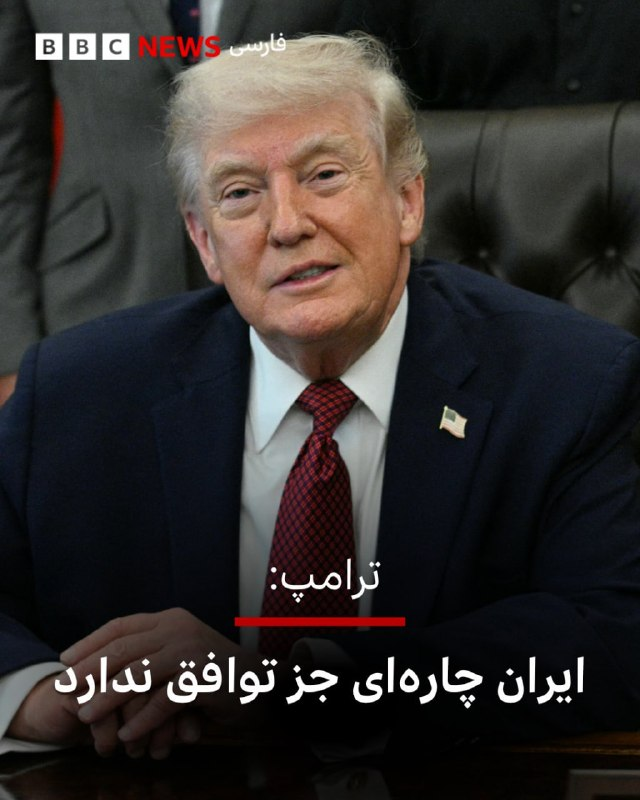

[Video](media/74919_1.mp4)

دونالد ترامپ، رئیس‌جمهوری ایالات متحده، روز سه‌شنبه ۱ اردیبهشت در گفتگو با شبکه سی‌ان‌بی‌سی اعلام کرد که واشنگتن در «موقعیت بسیار قدرتمندی» برای دستیابی به توافق با ایران قرار دارد.
او با اشاره به روند مذاکرات گفت که ایران «چاره‌ای جز حضور در گفتگوها ندارد» وافزود که توان نظامی این کشور به‌شدت تضعیف شده است. ترامپ همچنین وضعیت کنونی را به‌نوعی «تغییر رژیم غیرمستقیم» توصیف کرد.
رئیس‌جمهوری آمریکا در ادامه به موضوع تنگه هرمز اشاره کرد و گفت ایالات متحده کنترل شرایط را در اختیار دارد و تا زمان دستیابی به توافق نهایی، وضعیت این گذرگاه تغییر نخواهد کرد.
ترامپ همچنین محاصره دریایی علیه ایران را «موفقیتی بزرگ» خواند و تاکید کرد که این اقدامات به تقویت موقعیت آمریکا در مذاکرات کمک کرده است.
@
VahidOOnLine
دونالد ترامپ، رئیس‌جمهوری ایالات متحده در بخشی از مصاحبه با سی‌ان‌بی‌سی تاکید کرد که با کشته شدن رهبران رده اول جمهوری اسلامی، رژیم تغییر کرده است. او گفت: رهبرانشان را از میان برداشته‌ایم. این رهبران جدید بسیار منطقی‌تر هستند. این در واقع یک تغییر رژیم است، هر اسمی می‌خواهید روی آن بگذارید. این چیزی نبود که گفته باشم قصد انجامش را دارم اما به‌طور غیرمستقیم آن را انجام دادم».
ترامپ هم‌چنین تاکید کرد که اگرچه نبود رهبران پیشین و نامتمرکز شدن مرکز تصمیم‌گیری در جمهوری اسلامی، کار مذاکره را کمی پیچیده‌تر کرده است، آن‌ها «چاره‌ای جز فرستادن نمایندگانشان ندارند».
@
VahidOOnLine
ترامپ: ایران در صورت توافق می‌تواند به کشوری قدرتمند و «مشروع» تبدیل شود
دونالد ترامپ، رئیس‌جمهوری ایالات متحده، روز سه‌شنبه ۱ اردیبهشت در گفت‌وگو با شبکه سی‌ان‌بی‌سی گفت ایران در صورت دستیابی به توافق می‌تواند به «کشوری قدرتمند و حتی عالی» تبدیل شود.
او با اشاره به مردم ایران، آن‌ها را «فوق‌العاده» توصیف کرد، اما گفت که این کشور تحت رهبری افرادی قرار داشته که رویکردی «سخت‌گیرانه و منفی» داشته‌اند.
ترامپ تاکید کرد که در صورت تغییر مسیر و اتخاذ «عقلانیت و منطق»، ایران می‌تواند جایگاه خود را در سطح جهانی بهبود دهد.
رئیس‌جمهوری آمریکا همچنین گفت هدف از این روند، تبدیل ایران به کشوری «مشروع» است، نه کشوری که به گفته او بر پایه «ترس و خشونت» عمل می‌کند.
@
VahidOOnLine
دونالد ترامپ، رئیس‌جمهوری آمریکا در گفتگو با شبکه سی‌ان‌بی‌سی، با اشاره به توقیف یک کشتی حامل محموله‌های مشکوک به مقصد ایران، آن را «هدیه‌ای از طرف چین» توصیف کرد.
ترامپ با ابراز تعجب از این محموله گفت: «فکر می‌کردم با رئیس‌جمهور شی تفاهم دارم، اما جنگ همین است.»
روز سه‌شنبه، اول اردیبهشت وزارت جنگ آمریکا اعلام کرد نیروهای این کشور نفتکش «ام‌تی تیفانی» را که در فهرست تحریم‌های این کشور قرار دارد، توقیف کرده‌اند.
به گفته مقام‌های آمریکایی، این عملیات در محدوده مسئولیت فرماندهی آمریکا در اقیانوس هند و آرام انجام شده و بخشی از کارزار واشنگتن برای رهگیری کشتی‌های متهم به حمایت مادی از ایران بوده است.
@
VahidOOnLine
📡
@VahidOnline

---

## Message 74926

**Date:** 2026-04-21T19:49:30+00:00

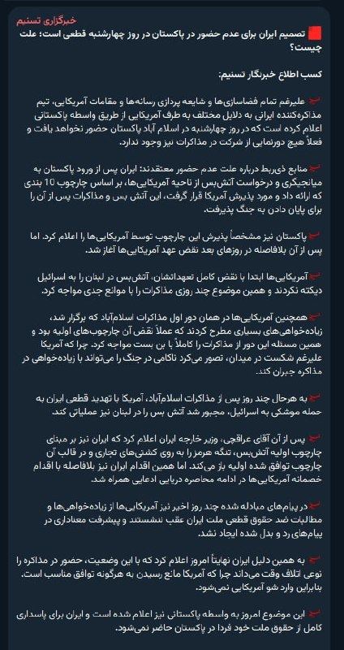

خبرگزاری تسنیم، وابسته به سپاه پاسداران، شامگاه سه‌شنبه خبر داد تیم مذاکره‌کننده جمهوری اسلامی از طریق واسطه پاکستانی به طرف آمریکایی اعلام کرده است که در روز چهارشنبه در اسلام آباد پاکستان حضور نخواهد یافت و فعلا هیچ دورنمایی از شرکت در مذاکرات نیز وجود ندارد.
@
VahidOOnLine
📡
@VahidOnline

---

## Message 74927

**Date:** 2026-04-21T20:14:44+00:00

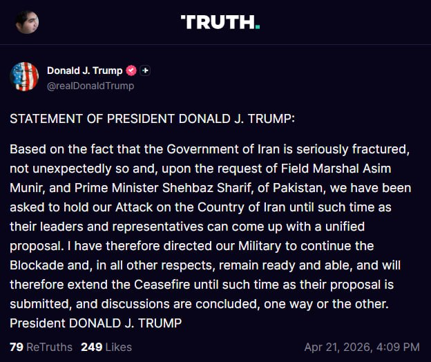

☄️
ترامپ: فعلا آتش‌بس رو تمدید می‌کنم، محاصره هم ادامه داره.
پست ترامپ ترجمه ماشین:
بیانیه پرزیدنت دونالد جی. ترامپ:
با توجه به این واقعیت که حکومت ایران به شکلی جدی دچار فروپاشی و تزلزل شده است — که البته دور از انتظار هم نبود — و بنا بر درخواست ارتشبد عاصم منیر و نخست‌وزیر شهباز شریف از پاکستان، از ما خواسته شده است که حمله به کشور ایران را تا زمانی که رهبران و نمایندگان آن‌ها بتوانند به یک پیشنهاد واحد و منسجم دست یابند، متوقف کنیم.
بنابراین، من به ارتش دستور داده‌ام که به محاصره ادامه داده و در تمامی جنبه‌های دیگر در حالت آماده‌باش کامل باقی بمانند؛ لذا برقراری آتش‌بس را تا زمان ارائه پیشنهاد آن‌ها و به نتیجه رسیدن گفتگوها — به هر شکلی که باشد — تمدید می‌کنم.
پرزیدنت دونالد جی. ترامپ
realDonaldTrump
📡
@VahidOnline

---

## Message 74928

**Date:** 2026-04-21T23:45:07+00:00

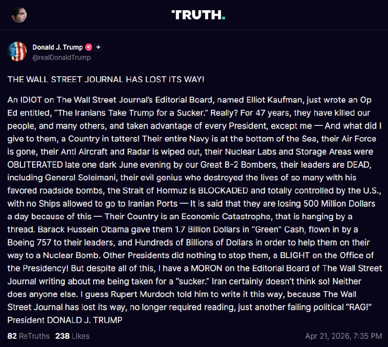

ترامپ: تنگه هرمز در کنترل آمریکا است و کشتی‌ها اجازه رفتن به بنادر ایران را ندارند
پست ترامپ، ترجمه ماشین:
روزنامه وال‌استریت ژورنال راه خود را گم کرده است!
فردی احمق در هیئت تحریریه وال‌استریت ژورنال به نام الیوت کافمن به‌تازگی یادداشتی با این عنوان نوشته است: «ایرانی‌ها، ترامپ را آدم ساده‌لوحی فرض کرده‌اند.» واقعاً؟ طی ۴۷ سال، آن‌ها مردم ما و بسیاری دیگر را کشته‌اند و از تک‌تک رؤسای‌جمهور آمریکا سوءاستفاده کرده‌اند، به‌جز من — و من چه چیزی به آن‌ها تحویل دادم؟ کشوری ویران و ازهم‌پاشیده!
تمام نیروی دریایی آن‌ها به قعر دریا رفته، نیروی هوایی‌شان از بین رفته، پدافند ضدهوایی و رادارهایشان نابود شده، آزمایشگاه‌ها و انبارهای هسته‌ای‌شان در شبی تاریک از ماه ژوئن، به‌دست بمب‌افکن‌های بزرگ بی-۲ ما به‌طور کامل منهدم شد، رهبرانشان کشته شده‌اند، از جمله ژنرال سلیمانی؛ همان نابغه شرور آن‌ها که با بمب‌های کنار جاده‌ای محبوبش زندگی بسیاری را نابود کرد. تنگه هرمز در محاصره است و به‌طور کامل در کنترل آمریکاست، و هیچ کشتی‌ای اجازه رفتن به بنادر ایران را ندارد — گفته می‌شود آن‌ها روزانه ۵۰۰ میلیون دلار از این بابت ضرر می‌کنند. کشورشان به یک فاجعه اقتصادی تبدیل شده که به مویی بند است.
باراک حسین اوباما ۱.۷ میلیارد دلار پول نقد «سبزرنگ» را با یک فروند بوئینگ ۷۵۷ برای رهبران آن‌ها فرستاد و صدها میلیارد دلار دیگر نیز در اختیارشان گذاشت تا در مسیر دستیابی به بمب هسته‌ای کمکشان کند. رؤسای‌جمهور دیگر هیچ کاری برای متوقف کردن آن‌ها انجام ندادند؛ لکه ننگی بر جایگاه ریاست‌جمهوری!
اما با وجود همه این‌ها، حالا یک ابله در هیئت تحریریه وال‌استریت ژورنال درباره من می‌نویسد که گویا سرم کلاه رفته و «آدم هالو» بوده‌ام. ایران قطعاً چنین تصوری ندارد! هیچ‌کس دیگری هم این‌طور فکر نمی‌کند. گمان می‌کنم روپرت مرداک به او گفته این مطلب را این‌گونه بنویسد، چون وال‌استریت ژورنال راه خود را گم کرده است؛ دیگر خواندنش ضروری نیست، فقط به یک نشریه سیاسی شکست‌خورده دیگر تبدیل شده است!
رئیس‌جمهور دونالد جی. ترامپ
realDonaldTrump
📡
@VahidOnline

---

## Message 74929

**Date:** 2026-04-22T01:18:26+00:00

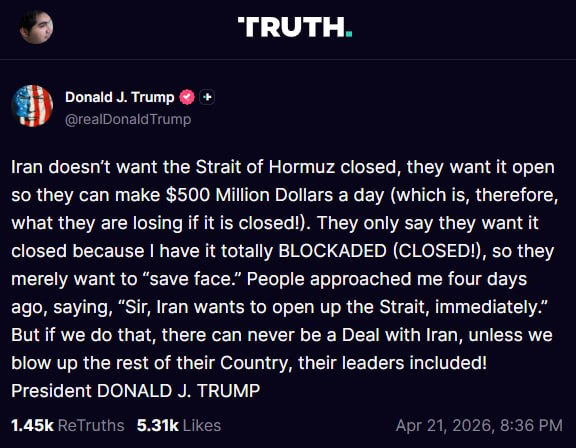

پست ترامپ ترجمه ماشین:
ایران نمی‌خواهد تنگه هرمز بسته باشد؛ آن‌ها می‌خواهند این تنگه باز باشد تا بتوانند روزانه ۵۰۰ میلیون دلار درآمد داشته باشند (بنابراین اگر این مسیر بسته باشد، همین مقدار را از دست می‌دهند!). آن‌ها فقط می‌گویند خواهان بسته شدن تنگه هستند، چون من آن را به‌طور کامل در محاصره قرار داده‌ام (بسته‌ام!) و بنابراین صرفاً می‌خواهند «آبرویشان را حفظ کنند».
چهار روز پیش افرادی نزد من آمدند و گفتند: «قربان، ایران می‌خواهد فوراً تنگه را باز کند.» اما اگر ما چنین کاری انجام دهیم، دیگر هرگز توافقی با ایران ممکن نخواهد بود، مگر اینکه باقی کشورشان را هم منفجر کنیم، از جمله رهبرانشان!
رئیس‌جمهور دونالد جی. ترامپ
realDonaldTrump
📡
@VahidOnline

---

## Message 74930

**Date:** 2026-04-22T04:05:40+00:00

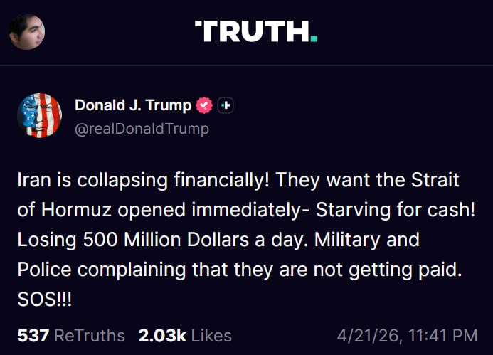

پست ترامپ، ترجمه ماشین:
ایران از نظر مالی در حال فروپاشی است! آن‌ها می‌خواهند تنگه هرمز فوراً باز شود — به‌شدت به پول نقد نیاز دارند! روزانه ۵۰۰ میلیون دلار ضرر می‌کنند. نیروهای نظامی و پلیس گلایه دارند که حقوقشان پرداخت نمی‌شود. کمک!
realDonaldTrump
📡
@VahidOnline

---

## Message 74931

**Date:** 2026-04-22T05:50:54+00:00

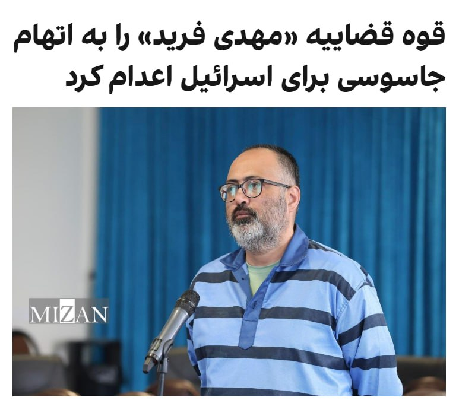

قوه قضائیه جمهوری اسلامی اعلام کرد که بامداد چهارشنبه دوم اردیبهشت، کارمند یکی از «سازمان‌های حساس کشور» به نام مهدی فرید را که در حوزه «پدافند غیرعامل فعالیت داشت»، به اتهام «جاسوسی» برای اسرائیل اعدام کرد.
پیش از این سازمان‌های حقوق بشری او را کارمند پیشین سازمان انرژی اتمی معرفی کرده بودند که در زمستان ۱۴۰۱ بازداشت و ابتدا به زندان تهران بزرگ و بعدتر به زندان اوین منتقل شده بود.
گزارش شده که مهدی فرید در همان مکانی (سایت امیرآباد تهران) کار می‌کرد، که روزبه وادی، دانشمند هسته‌ای که چندی پیش اعدام شد نیز در آنجا مشغول به کار بود.
@
VahidHeadline
او زمستان ۱۴۰۱ بازداشت و ابتدا به ۱۰ سال حبس محکوم شد، اما در دادگاهی دیگر حکم اعدام گرفت؛ حکمی که پس از تأیید دیوان عالی کشور اجرا شد.
@
VahidOOnLine
📡
@VahidOnline

---

## Message 74932

**Date:** 2026-04-22T05:55:38+00:00

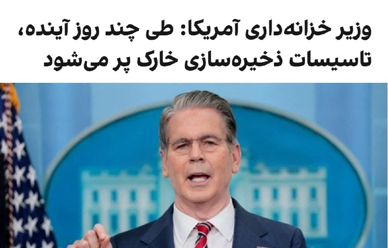

اسکات بسنت، وزیر خزانه‌داری آمریکا،با اشاره به تصمیم ایالات متحده برای ادامه محاصره دریایی جمهوری اسلامی گفت طی چند روز آینده تأسیسات ذخیره‌سازی جزیره خارک پر خواهد شد و چاه‌های نفتی شکننده ایران بسته خواهند شد.
بسنت افزود محدود کردن تجارت دریایی جمهوری اسلامی به‌طور مستقیم شریان‌های اصلی درآمد حکومت را هدف قرار می‌دهد و وزارت خزانه‌داری آمریکا به اعمال حداکثر فشار از طریق کارزار «خشم اقتصادی» ادامه خواهد داد تا به‌صورت نظام‌مند توانایی تهران برای تولید، جابه‌جایی و بازگرداندن منابع مالی را تضعیف کند.
او همچنین تاکید کرد هر فرد یا شناوری که این جریان‌ها را از طریق تجارت و تامین مالی پنهانی تسهیل کند، در معرض تحریم‌های آمریکا قرار خواهد گرفت و واشینگتن همچنان اموالی را که به گفته او «رهبری فاسد به نام مردم ایران به سرقت برده است» مسدود می‌کند.
@
VahidOOnLine
📡
@VahidOnline

---

## Message 74933

**Date:** 2026-04-22T14:34:44+00:00

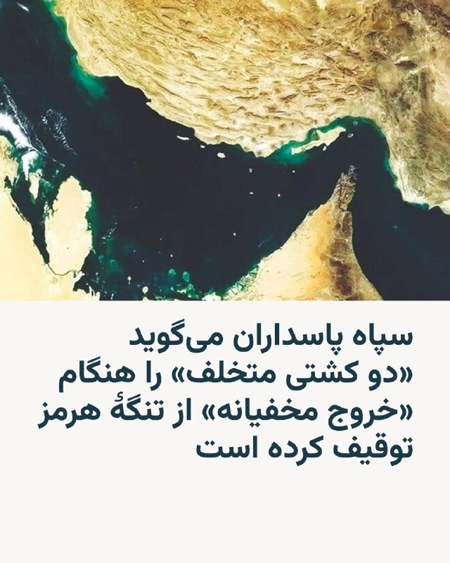

نیروی دریایی سپاه پاسداران انقلاب اسلامی روز چهارشنبه دوم اردیبهشت اعلام کرد «دو فروند کشتی متخلف»، که به ادعای آن قصد «خروج مخفیانه» از تنگهٔ هرمز را داشتند، توقیف کرده است.
بر اساس اطلاعیه این نیرو، کشتی «ام‌اس‌سی- فرانچسکا» متعلق به «اسرائیل» و «اپامینودس» با این اتهام که قصد داشتند «بدون مجوز» و «با انجام تخلف‌های مکرر و دستکاری در سامانه‌های کمک ناوبری و به مخاطره انداختن امنیت دریانوردی» به صورت «مخفیانه» از تنگه هرمز خارج شوند، متوقف شدند.
نیروی دریایی سپاه می‌گوید که این شناورها به منظور بررسی محموله و اسناد و مدارک به آب‌های سرزمینی ایران منتقل شده‌اند.
اعلام این خبر در روزی صورت می‌گیرد که به گفته منابع دریانوردی، سه کشتی کانتینربر هدف تیراندازی قرار گرفتند.
سپاه پاسداران که از ۹ اسفند تنگهٔ هرمز را به روی کشتی‌ها و نفتکش‌ها بسته است، در پی برقراری آتش‌بس در جنگ با آمریکا و اسرائیل به مدت یک روز این تنگه را باز کرد، اما پس از شکست مذاکرات میان طرفین و آغاز محاصرهٔ دریایی بنادر ایران، بار دیگر آن را مسدود کرد.
@
VahidHeadline
📡
@VahidOnline

---

## Message 74934

**Date:** 2026-04-22T14:35:18+00:00

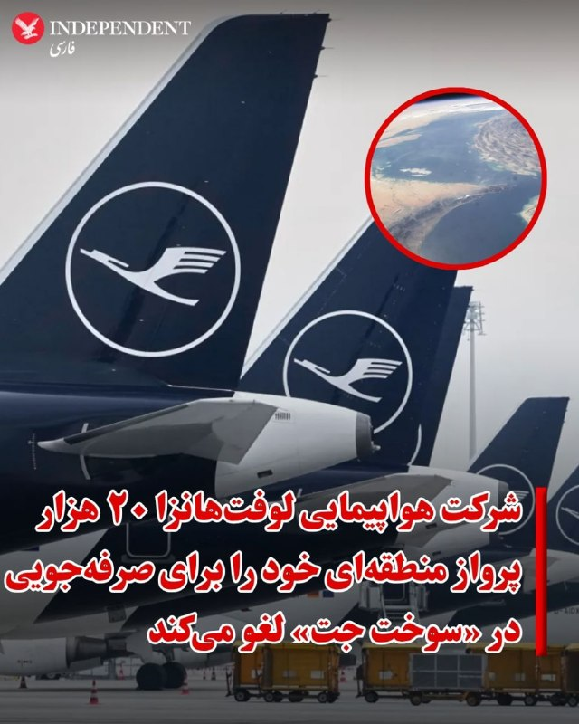

شرکت هواپیمایی لوفت‌هانزا با هدف صرفه‌جویی در سوخت جت، برخی از مسیرهای اروپایی و ۲۰ هزار پرواز کوتاه‌برد برنامه‌ریزی شده تا ماه اکتبر را لغو می‌کند.
به گزارش وال استریت ژورنال این گروه آلمانی روز سه‌شنبه اعلام کرد که پروازهای لغو شده توسط چندین شرکت هواپیمایی آن، عمدتاً منطقه‌ای انجام می‌شود و معادل ۱٪ کاهش در ظرفیت مسافران آن خواهد بود.
این اقدام در پی تنش‌ها در خاورمیانه و بسته شدن تنگه هرمز که خطوط هوایی را با کمبود سوخت جت مواجه خواهد کرد گرفته شده است.
آپوستولوس تزیزیکوستاس، کمیسر حمل‌ونقل اتحادیه اروپا روز سه‌شنبه اول اردیبهشت‌ماه هشدار داد  که بسته‌ماندن تنگه هرمز پیامدهای فاجعه‌باری برای جهان و اروپا خواهد داشت.
این مقام ارشد اتحادیه اروپا که برای شرکت در اجلاس ویژه شورای اروپا در بروکسل صحبت می‌کرد با هشدار درباره کمبود سوخت جت برای هواپیماهای مسافربری، خواستار پیدا کردن راه‌های جایگزین برای استقلال و تکثر منابع انرژی ۲۷ کشور اروپایی شد.
@
VahidOOnLine
📡
@VahidOnline

---

## Message 74935

**Date:** 2026-04-22T14:36:04+00:00

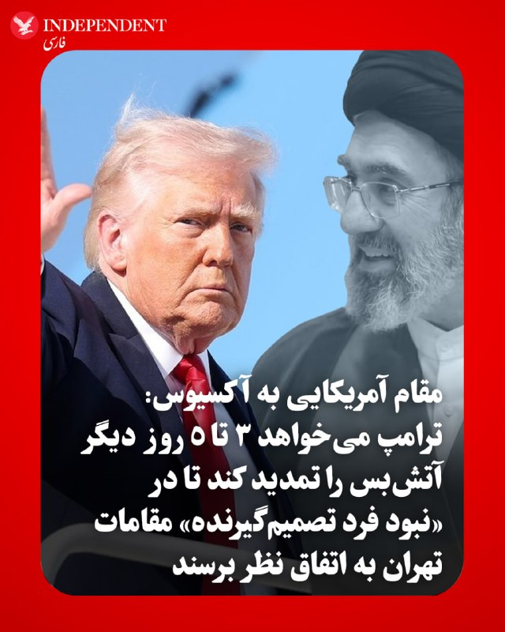

به گفته سه مقام آمریکایی در گفتگو با اکسیوس، دونالد ترامپ فرصت کوتاهی را به جناح‌های درگیر در ایران داده است تا بر سر یک پیشنهاد متقابل منسجم به اتحاد برسند؛ در غیر این صورت، آتش‌بسی که او روز سه‌شنبه تمدید کرد، پایان خواهد یافت.
یک منبع آمریکایی آگاه در این باره گفت: «ترامپ تمایل دارد ۳ تا ۵ روز دیگر به آتش‌بس زمان بدهد تا ایرانی‌ها بتوانند اوضاع داخلی خود را سروسامان دهند؛ اما این مهلت قرار نیست نامحدود باشد.»
مذاکره‌کنندگان ترامپ بر این باورند که دستیابی به توافقی برای پایان دادن به جنگ و حل‌وفصل آنچه از برنامه هسته‌ای ایران باقی مانده، هنوز امکان‌پذیر است. با این حال، آن‌ها نگرانند که در تهران کسی دارای «اختیار تام» برای پاسخ مثبت به توافق نباشد.
گزارش‌ها حاکی از آن است که مجتبی خامنه‌ای، رهبر جدید جمهوری اسلامی، ارتباطات بسیار محدودی دارد و فرماندهان سپاه پاسداران که اکنون کنترل کشور را در دست دارند، با مذاکره‌کنندگان غیرنظامی بر سر استراتژی پیش‌رو به‌شدت دچار اختلاف شده‌اند.
@
VahidOOnLine
📡
@VahidOnline

---

## Message 74936

**Date:** 2026-04-22T14:37:38+00:00

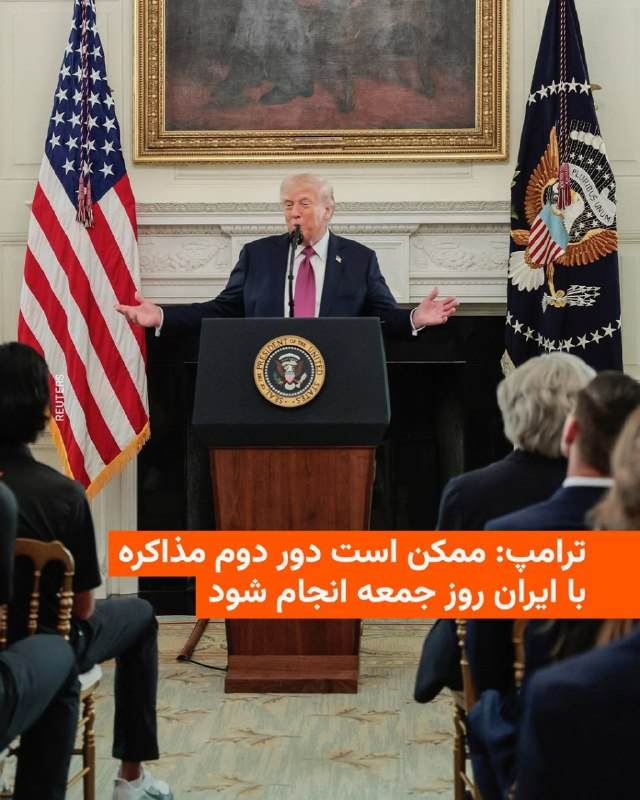

دونالد ترامپ، رئیس جمهور آمریکا چهارشنبه دوم اردیبهشت به روزنامه نیویورک پست گفت که ممکن است دور دوم مذاکرات با ایران روز جمعه در پاکستان انجام شود.
این روزنامه نوشته است که منابع پاکستانی از «تلاش‌های مثبت» برای میانجیگری میان ایران و آمریکا خبر داده و گفته‌اند احتمال می‌رود مذاکرات در «۳۶ تا ۷۲ ساعت آینده» برگزار شود.
این روزنامه نوشته است که درستی این موضوع را از رئیس جمهور آمریکا پرسیده‌اند و او در قالب یک پیامک پاسخ داده است: «ممکن است! رئیس جمهور دی‌جی‌تی.»
در همین حال خبرگزاری تسنیم، نزدیک به سپاه پاسداران نوشته است که «تا این لحظه هیچ تغییری در برنامه ایران برای عدم شرکت در مذاکره ایجاد نشده است.»
@
VahidHeadline
📡
@VahidOnline

---

## Message 74937

**Date:** 2026-04-22T16:01:48+00:00

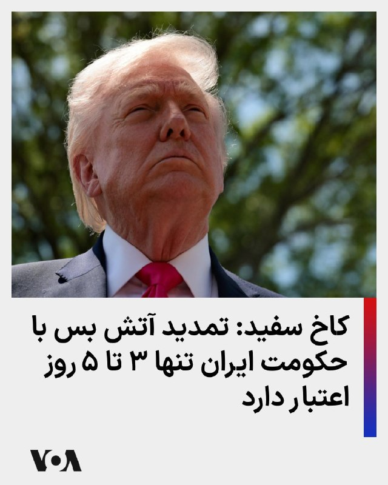

کاخ سفید در بیانیه‌ای خطاب به شبکه فاکس اعلام کرد که تمدید آتش‌بس از سوی دونالد ترامپ بسیار محدود خواهد بود و تنها برای یک بازه زمانی ۳ تا ۵ روزه در نظر گرفته شده است.
خبرنگار شبکه خبری فاکس روز چهارشنبه ۲ اردیبهشت همچنین گزارش داد که دونالد ترامپ، رئیس‌ جمهوری آمریکا، نسبت به هرگونه وقت‌کشی در روند مذاکرات اسلام‌آباد هشیار است و هشدار داده است.
@
VahidHeadline
دو منبع آگاه به شبکه سی‌ان‌ان گفتند که رئیس‌جمهور آمریکا قصد دارد به ایران یک بازه زمانی محدود بدهد تا پیشنهادی یکپارچه ارائه کند.
این منابع افزودند که دولت آمریکا نمی‌خواهد آتش‌بس را به‌طور نامحدود تمدید کند و همچنین تمایل ندارد به ایران فرصت دهد مذاکرات را طولانی‌تر کند.
به گفته این منابع، ترامپ نسبت به تمدید آتش‌بس اولیه فراتر از مهلت روز چهارشنبه محتاط بوده است. او می‌خواهد هرچه سریع‌تر یک توافق نهایی شود.
@
VahidHeadline
📡
@VahidOnline

---

## Message 74938

**Date:** 2026-04-22T16:03:36+00:00

اسکات بسنت، وزیر خزانه‌داری آمریکا، چهارشنبه اعلام کرد معافیت تحریمی نفت روی دریا متعلق به روسیه و ایران را به مدت ۳۰ روز تمدید کرده است. او گفت این تصمیم پس از درخواست حدود ۱۰ کشور آسیب‌پذیر در برابر کمبود نفت به‌دلیل بسته بودن تنگه هرمز اتخاذ شد.
بسنت اضافه کرد وزارت خزانه‌داری با اعطای معافیت‌های تحریمی توانست بیش از ۲۵۰ میلیون بشکه نفت در دریا را آزاد کند و افزود در صورت انجام نشدن این اقدام، قیمت‌ها بالاتر می‌رفت.
همزمان ‌محمود نبویان، نماینده مجلس و از اعضای هیات اعزامی جمهوری اسلامی به پاکستان، گفت: «در طول جنگ فروش نفت ما بسیار بیشتر شد؛ ما حالا همه نفت‌های روی آب را به ۲ برابر قیمت فروختیم و الان یک قطره هم نفت روی آب نداریم.»
@
VahidOOnLine
📡
@VahidOnline

---
